```dataview
TABLE dateformat(file.ctime,"yyyy-MM-dd HH:mm:ss") as "created", file.size as "size" WHERE this.file.name = dateformat(file.ctime,"yyyy-MM-dd")
SORT file.ctime ASC
```

# AI+HairStyle 理发/发型

- [wty-ustc/hairclip – Run with an API on Replicate](https://replicate.com/wty-ustc/hairclip)
- [GitHub - ZPdesu/Barbershop: Barbershop: GAN-based Image Compositing using Segmentation Masks (SIGGRAPH Asia 2021)](https://github.com/ZPdesu/Barbershop)
- 灵感来源于国外网站 Hairstyle AI：
	- [Try Out New Hairstyles With AI - Hairstyle AI](https://www.hairstyleai.com/)

# ChatGPT+Murf+Youtube 变现思路

#创业  
原理见 [ChatGPT 的训练原理科普](../../Inputs/Article/ChatGPT%20的训练原理科普.md)

反射性能优化

**主题研究、写脚本和视频发布**

我们将使用：

**YouTube** —用于研究主题，关键字和主题标签 \- 免费!!!!

**ChatGPT** — 用于脚本制作 — 免费!!!!

**Murf.AI** — 用于视频制作 \- 免费!!!!

我做了一些研究，这是我在 Youtube 上收入最高的利基市场及其 CPMs 列表：

**利基 — 每千次展示费用**

| 利基 | CPM（每千次展示费用） |
| --- |:----|
| 在线赚钱 | $13.52 |
| 数字营销 |$ 12.52|
| 个人理财和投资 | $12 |
| 教育内容 | $9.89 |
| 汽车频道 | $4.32 |
| 技术和小工具 | $2.39 |
| 生活方式 | $3.47 |
| 时尚和试穿 | $3.13 |
| 烹饪 | $2.50 |
| 健身和健美 | $1.60 |
| 视频游戏 | $1.40 |

现在我们已经有了最高付费 CPM 的列表，我们可以选择自己感兴趣的领域。这样更容易坚持。

在 YouTube 首页上方的仪表板顶部，您将看到一个领域列表；这些是基于您过去搜索内容而推荐给您的 YouTube 类别。


例如，这是我的 YouTube 推荐分类的样子。它包括新闻、音乐、股票、游戏、财富、混合内容、园艺、人工智能、销售、烹饪节目和思考等类别。（看起来像是各种各样的混合！）

研究不同的利基/话题，并选择一个。例如——假设我选择了赚钱在线这个话题，这也是我的最爱。

步骤 1- 转到 Youtube
------------------

我们必须进行研究，以找到与这个专业领域相关的最新信息和新闻。

例如——在“网上赚钱（Making Money Online）”领域中最近的发展可能涉及推出新工具、新联盟计划、免费工具和各种其他策略。

这只是让你思考：如何进入这个主题。

步骤 2 - 搜索栏输入关键词
------------------

在搜索栏输入利基市场“ 在线赚钱（MAKE MONEY ONLINE）”

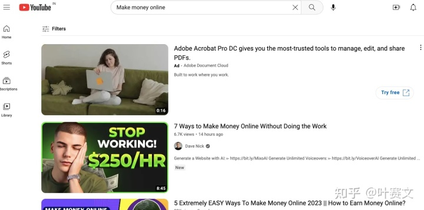

你会看到很多推荐的视频，但我们不会浏览第一页上的所有视频，而是用另一种不同的搜索方式。

步骤 3 - 下拉菜单找关键词
------------------

您将看到这样的下拉菜单，列出了很多关键字

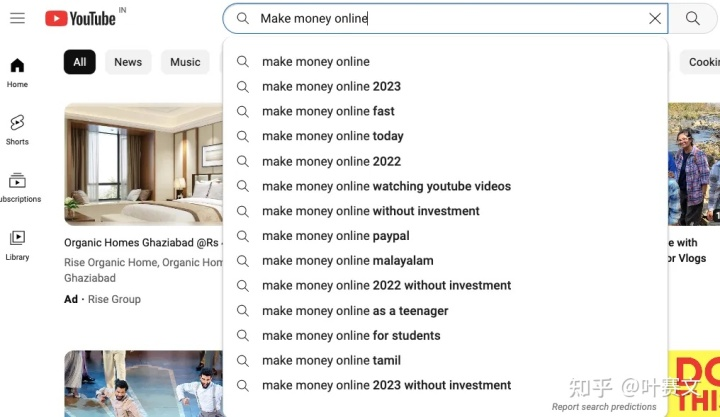

步骤 4 - 找到过滤器
---------------

您将看到推荐视频列表

**这是一个被很多人忽略的基础用法，也是我的秘密武器**

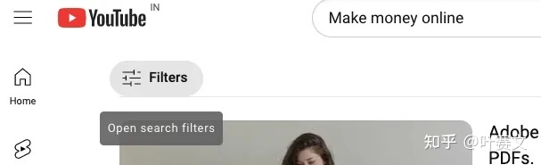

回车后，转到左上角，打开过滤器。 搜索过滤器是收集关键字、信息和新闻的强大工具。

步骤 5 — 打开过滤器
---------------

* 简单选择本月或本周
* 在“持续时间”选项卡上，选择 4–20 分钟

为什么？因为超过 95% 的、超过 20 分钟长视频度通常是描述性质的，通常详细说明某些工具如何使用。 信息类视频的理想长度在 8 到 14 分钟之间。

**类型 — 视频**

应用这个过滤器，你将会看到高质量且相关的视频。每一个视频都包含相关且最新的素材。


应用过滤器的唯一目的是：收集有关新工具的信息。

例如，如果您打算制作一个关于：如何通过联盟营销赚钱的视频，那么获得观看的机会可能非常低。

但是，如果您选择制作有关如何使用 X 工具，通过联盟营销赚钱的视频，其中 X 工具是新的，没有多少人知道它，但正在搜索它。这样获得观看的机会会更高。

步骤 6 — 获取灵感
--------------

假设我们打开列表中的第一个视频，在我的页面显示的是：来自 Youtube 频道 - Mr. Reis。视频标题是“2023 年最佳每日被动收入副业 | 在线赚钱”，并且每天可以赚取 900 美元。

观看视频，获得灵感，或者我通常会检查视频的描述部分，在那里 YouTuber 已经提到了联盟链接。

步骤 7 - 收集标签
--------------

在描述框中，您将看到包含的标签。创建标签列表。


步骤 8 — 确定您的主题
----------------

观看 4 -5 个视频并列出要制作视频的标题。

假设我们选择的主题是 “如何使用 Printful 通过 Etsy 赚钱“

现在研究部分已经完成。

用 ChatGPT 写脚本
---------------

ChatGPT 是一个很棒的工具，完全免费

注册后，就可以开始写提示词。

这是我提示的结果 \- 你可以看到 ChatGPT 可以为你做所有的脚本工作。就我而言，它向我展示了镜头 + 画外音。

我的提示词是：

为我的 Youtube 视频 " 如何使用 Printful 通过 Etsy 赚钱 " 写一个脚本。使其具有卖点，朗朗上口且有趣。同时使用相关的关键词。字数限制 - 5000-7000（ Write a Script for my Youtube Video " How to make money via Etsy using Printful". Makeit selling, catchy and interesting.Also use relevant keywords. Word limit - 5000-7000 ）

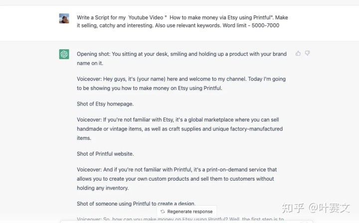

此脚本在 2 分钟内准备就写完了!!!!!

视频制作—Murf.AI
----------------


今天我要告诉你们，2022 年我发现的最强大的工具之一。

Murf.ai 是一款 AI 启用的文本转语音工具，可以让用户为视频和演示生成“和真人一样”的配音。

你所需要做的就是为你的 Youtube 视频准备文本脚本，Murf AI 会将其转换成语音。

它生成逼真的声音，并且这个工具声称：“Murf 提供了 100% 自然发音的 AI 语音选择，涵盖 20 种语言，可用于制作专业视频和演示文稿配音。“

没有必要为配音演员或麦克风单独花钱。不仅如此，您还可以节省大量时间和精力。

我看到很多人在他们的视频中强调特定关键词。好吧，Murf.AI 带来了所有的好处，你可以按照自己想要的方式进行配音。你也可以…

* 强调这些词
* 用音调掌控你的叙述
* 用停顿提升你的故事。

它能做到和 Youtube 上的其他视频一样声音自然。Murf 目前提供 20 种语言的多个声音选择。


正如我之前所说，Murf AI 是我最近发现的最强大、节省时间的工具之一。一个典型的 YouTube 视频需要 20-30 小时的工作。这是一个漫长的过程，从研究到视频编辑。而且，就像我看到的那样，并不是每个人都喜欢上传面部视频，在这种情况下 Murf 可以让你的工作变得更加轻松和快速。

我的个人最喜欢的功能是语音克隆。通过语音克隆功能，可以生成一个模仿真实人类情感（如愤怒、快乐、悲伤等）的 AI 语音克隆。您可以在脚本期间随时进行修改。

小结
------

因此，如果您上传高质量内容视频以获取高收益的利基市场，并且假设从一个视频中，您可以获得 400 美元（这是一个非常小的数字），并且每周制作 5 个视频和每月 20 个视频。数学很简单 -

400x20 = $8000

当然，这可能需要长达 2，3 个月的时间。

但如果您的频道或任何视频病毒式传播，收入会高得多。此外，Youtube 视频具有经常性收入概念，这意味着一旦视频发布，它将一直（或直到您删除它）为您提供一定数量的收入。

行动>一切。我希望您可以充分利用这三个工具。

# 使用 Cloudflare Workers 解决 OpenAI 和 ChatGPT 的 API 无法访问的问题

> 通过 Cloudflare 解决科学上网的转发问题

事实证明 ChatGPT 是足够火爆的，火爆到什么程度呢，其 API 一经推出便获得了 GFW 的认证。在 Twitter 上看到很多人都在为解决无法正常访问 OpenAI 的 API 而苦恼，最常见解决方案是使用一台服务器来进行反向代理，但这样又徒增了一些成本。因为之前在公司的业务上遇到过类似问题，当时老板找到了一个还不错的几乎零成本解决方案，试了一下现在仍然可以用来解决 OpenAI 的 API 无法访问的问题，所以在这里推荐给大家。

该方案的主要思路是使用 Cloudflare 的 Workers 来代理 OpenAI 的 API 地址，配合自己的域名即可在境内实现访问。因为 Cloudflare Workers 有每天免费 10 万次的请求额度，也有可以免费注册的域名，所以几乎可以说是零成本。而且该方法理论上支持所有被认证的网站，而不只是 OpenAI。

使用这个方案需要你有以下东西：

* 一个没有被 GFW 认证的域名（~没有的话也可以到 [https://www.freenom.com](https://www.freenom.com) 免费注册一个，~ ⚠️ 据推友提醒，freenom 已暂停新用户注册，但相信对于大家来说注册域名不是啥大问题）
* 一个 Cloudflare 账号（当然也可以现注册）

⚠️ 请不要直接使用本教程示例中的地址，因为随时会被关闭。也不要使用任何其他人搭建的不受信任的地址，因为有 api key 被盗取的可能。

太长不看
----

1. 新建一个 Cloudflare Worker
2. 将 [https://gist.github.com/noobnooc/d0407b5fb81cff9d36f981170b99d4e6](https://gist.github.com/noobnooc/d0407b5fb81cff9d36f981170b99d4e6) 里的代码粘贴到 Worker 中并部署
3. 给 Worker 绑定一个没有被 GFW 认证的域名
4. 使用自己的域名代替 `api.openai.com`

如果具体步骤有问题，可以参考下面的详细版教程。

将域名 NS 转到 Cloudflare
-----------------------

如果域名已经托管在 Cloudflare 的忽略这一步即可。

⚠️ 经评论区指出，Cloudflare Workers 的域名绑定仅支持托管在 Cloudflare 上的域名。由于本人常年是把域名托管在 Cloudflare 的没有注意到这一点，所以得先将域名的 NS 转到 Cloudflare，如果介意将域名转到 Cloudflare 的话，可以考虑使用 nginx 反代、Docker 容器等其他方法 🥲。

没有 Cloudflare 账号的话可以注册一个，具体注册细节就不多说了。注册或登录到 Cloudflare 的管理界面后，点击侧边栏的 “Websites” ，然后点击 “Add a Site” 按钮准备将域名转到 Cloudflare：

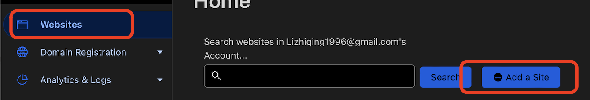

在 “Enter your site (example.com)” 处输入要转入的域名后，点击 “Add Site”：

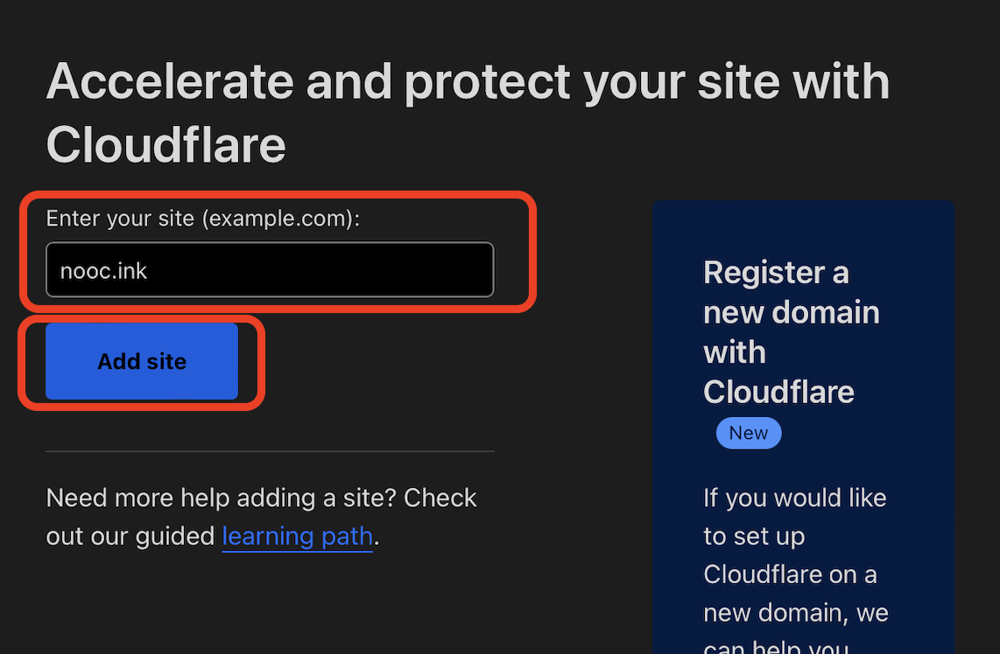  

根据 Cloudflare 的提示，在域名注册商处将 NS 修改到 Cloudflare 指定的地址，等待域名解析成功后，即可进行后续操作。

创建一个 Cloudflare Worker
----------------------

登录到 Cloudflare 的管理界面后，点击侧边栏的 “Workers” 选项，然后点击 “Create a Service” 创建一个 Worker。

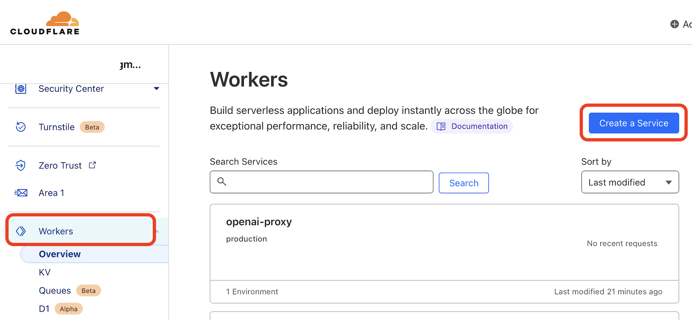  

然后在创建界面中输入 “Service name” 后点击 “Create Service” 按钮新建 Worker。“Select a starter” 项先不用管。

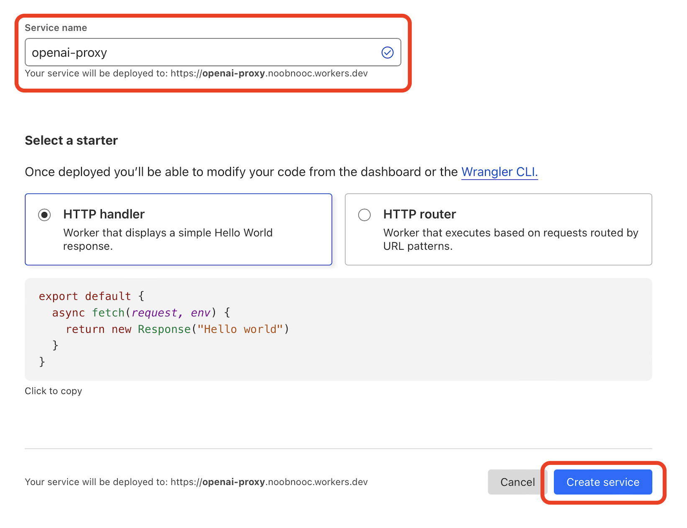

至此 Cloudflare 的 Worker 便创建好了，下面开始修改 Worker 的代码，使其能代理 OpenAI 的 API。

修改 Cloudflare Worker 的代码
------------------------

在 Worker 的管理界面，点击右上角的 “Quick Edit” 按钮编辑代码 Worker 的代码。

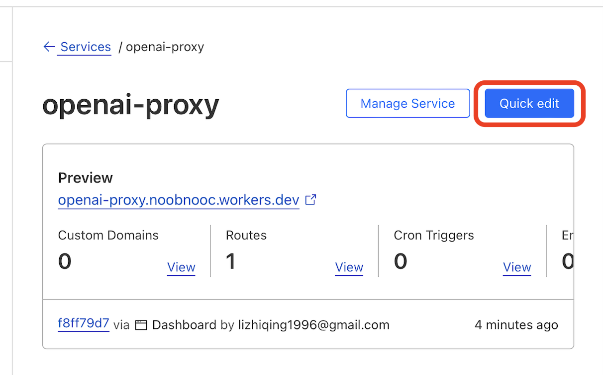  

在左侧的代码编辑器中，删除现有的所有代码，然后复制粘贴以下内容到代码编辑器：

> 简化后的代码来自 [https://github.com/x-dr/chatgptProxyAPI](https://github.com/x-dr/chatgptProxyAPI)

```js
const TELEGRAPH_URL = 'https://api.openai.com';

addEventListener('fetch', event => {
  event.respondWith(handleRequest(event.request))
})

async function handleRequest(request) {
  const url = new URL(request.url);
  url.host = TELEGRAPH_URL.replace(/^https?:\/\//, '');

  const modifiedRequest = new Request(url.toString(), {
    headers: request.headers,
    method: request.method,
    body: request.body,
    redirect: 'follow'
  });

  const response = await fetch(modifiedRequest);
  const modifiedResponse = new Response(response.body, response);

  // 添加允许跨域访问的响应头
  modifiedResponse.headers.set('Access-Control-Allow-Origin', '*');

  return modifiedResponse;
}
```

最后点击编辑器右下角的 “Save and deploy” 按钮部署该代码，在弹出的对话框中继续选择 “Save and deploy” 确认部署。

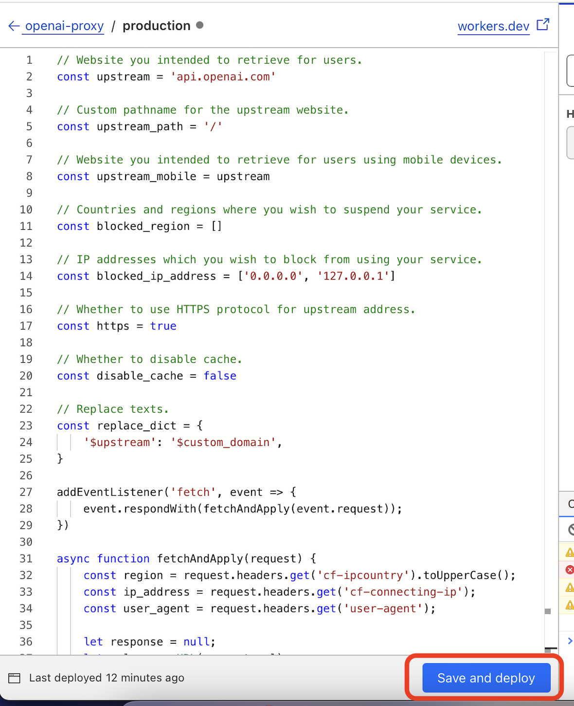  

至此，便可以使用该 worker 的地址来代替 OpenAI 的 API 地址了。比如想要请求 ChatGPT 的 API 时，把官方文档中的 `https://api.openai.com/v1/chat/completions` 替换成 `https://openai.workers.dev` 即可（注意这个地址并不存在，是需要换成自己刚刚创建的 Worker 的地址）。

但是你可能会发现，这样做了依然还是没有解决问题，因为 Cloudflare Workers 的 `workers.dev` 域名也是被 GFW 认证过的🥲。但是好在只是认证了 `workers.dev` 域名，而 ip 还是幸存的状态，所以我们可以给 Worker 绑定一个自己的域名。

绑定域名
----

在 Cloudflare Workers 的管理界面中，点击 “Triggers” 选项卡，然后点击 “Custom Domians” 中的 “Add Custom Domain” 按钮以绑定域名。

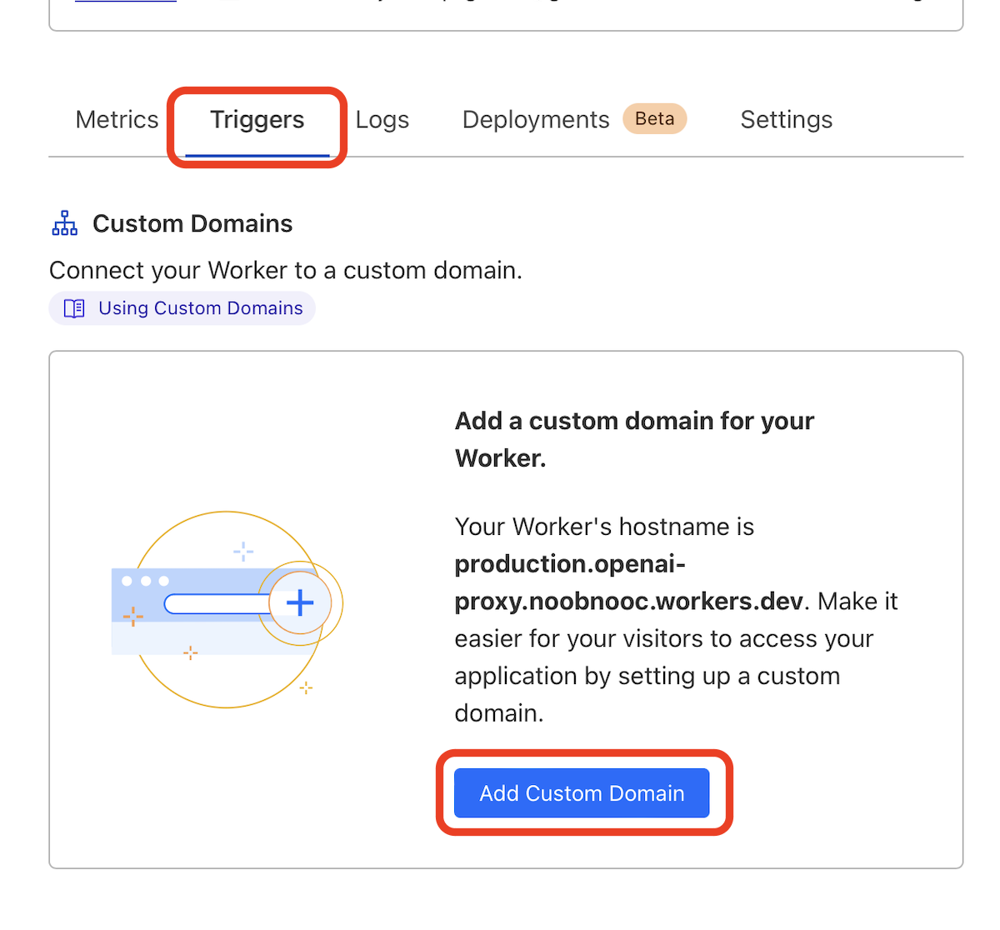  

输入域名后点击 “Add Custom Domain”，~根据提示修改域名的 DNS 记录。因为我的域名是托管在 Cloudflare 上的，所以无需手动更改 DNS 记录，如果域名没有托管在 Cloudfalre 上，可以根据相关提示自行配置。~ ⚠️ 据评论区提示，目前只支持 NS 托管在 Cloudflare 上的域名，如果不介意，可以点击 Cloudflare 侧边栏的 “Websites”，然后点击 “Add a Site” 按钮，根据提示将域名的 NS 记录指定到 Cloudflare。

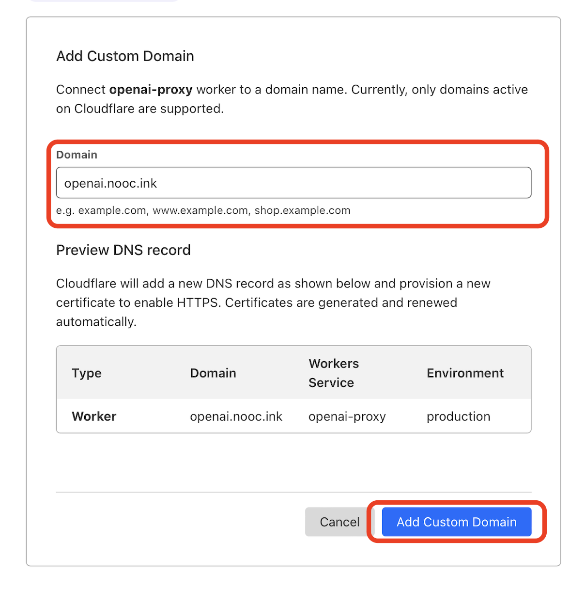

至此便大功告成。等待片刻，应该就可以通过你自己的域名来代替 OpenAI 的 API 地址了，比如在本文的例子中，想要请求 ChatGPT 的 API ，即是把官方 API 地址 `https://api.openai.com/v1/chat/completions` 换为我自己的域名 `https://openai.nooc.ink/v1/chat/completions` ，其他参数均参照官方示例即可。由于 Cloudflare 有每天免费 10 万次的请求额度，所以轻度使用基本是零成本的。⚠️ 注意请不要使用我这里的 `openai.nooc.ink`，因为随时可能会被我关闭🤪

# How to remove the Bing Chat button in Microsoft Edge on Windows 10, Windows 11, Mac, and Linux

> 如何移除 Edge 新版上面的 Bing 按钮

**Windows 10 and Windows 11**:

1. [Open the Windows Registry](https://www.onmsft.com/how-to/what-is-windows-registry) by using the Windows key + R keyboard shortcut to open Run, type `regedit` and press OK.
2. Navigate to the following location in the Registry: **Computer\\HKEY_LOCAL_MACHINE\\SOFTWARE\\Policies\\Microsoft**. Doing this will change the settings for everyone that uses this PC. If you want to change the settings for your current user settings only go to: **Computer\\HKEY_CURRENT_USER\\SOFTWARE\\Policies\\Microsoft\\Edge.**
3. Right-click the **Microsoft** key and choose **New > Key** and rename the new key to **Edge**.
4. In the **Edge** key, Select **New**, then create a new DWORD (32-bit value) and rename the new DWORD to **HubsSidebarEnabled**. The default value data will be set to **0**, but double-click the **HubsSidebarEnabled** value to check its value
5. Now, launch Microsoft Edge and go to **edge://policy**.
6. Click **Reload Policies** and the Bing Chat button will disappear from Microsoft Edge.

Edge users on Mac and Linux need to enter the following commands in their terminal applications:

**Mac**: `open -n -a "Microsoft Edge" --args --disable-features=msEdgeSidebarV2`

**Linux**: `microsoft-edge-stable --disable-features=msEdgeSidebarV2`

# GPT + 个人知识库

- [GitHub - gannonh/gpt3.5-turbo-pgvector: ChatGTP (gpt3.5-turbo) starter app](https://github.com/gannonh/gpt3.5-turbo-pgvector)
	- 主要是靠 **gpt-index** 好像是开源的， 可以确认下
- [ChatGPT上下文对话有限制怎么解除？利用词嵌入实现超长内容的上下文记忆。_哔哩哔哩_bilibili](https://www.bilibili.com/video/BV1a84y137Ce/?buvid=Y24FE92D262CA7F342828C9933F22A456E1F&is_story_h5=false&mid=xKM73NKmcc0L4bbxqCdKNA%3D%3D&p=1&plat_id=116&share_from=ugc&share_medium=iphone&share_plat=ios&share_session_id=2A209CF6-FBDA-4282-AEBF-4223B5D1265E&share_source=WEIXIN&share_tag=s_i&timestamp=1679584457&unique_k=TqXFVDo&up_id=510031966)
	- 词嵌入 embedding