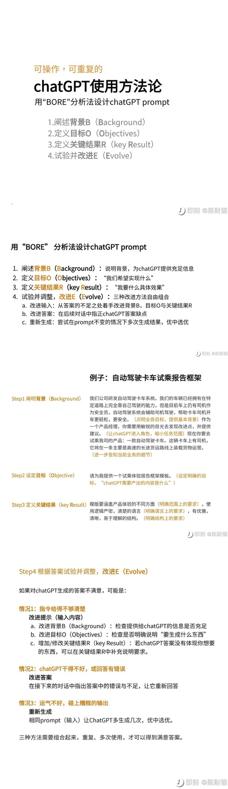
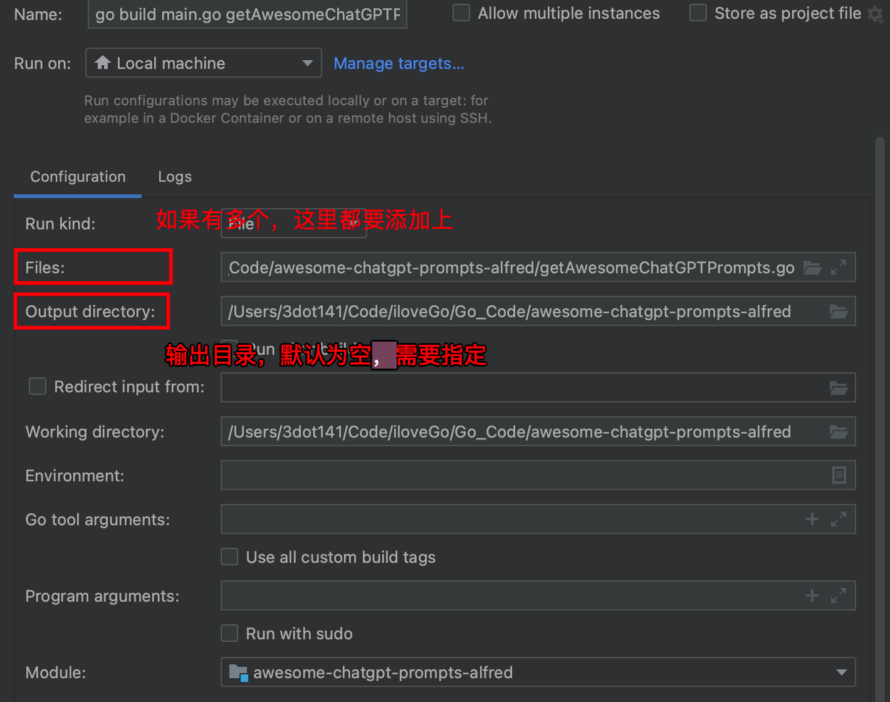

```dataview
TABLE dateformat(file.ctime,"yyyy-MM-dd HH:mm:ss") as "created", file.size as "size" WHERE this.file.name = dateformat(file.ctime,"yyyy-MM-dd")
SORT file.ctime ASC
```

# ChatGPT Prompt 使用方法论



# AI 工具 -MindShow 试用

在网上之前通过各种信息了解到的一款软件。

> [MindShow](https://www.mindshow.fun/#/folder/slides)  
> 通过 文本转化为 PPT。  
> 可以尝试用用 [Gamma App](https://gamma.app/)

实际使用下来， 发现文本确实转化了，但是整个 PPT 的风格基本是固定的。


# 录屏工具 -Screen Studio

> Beautiful screen recordings in minutes  
> Promo videos of your digital product as easy as taking a screenshot.  
> [Screen Studio — Beautiful screen recordings in minutes](https://www.screen.studio/)

理论讲，价格有点离谱。 89$  
但是试用下来，比较好用。

# 全局文字扩展工具 -Espanso

> [Espanso - A Privacy-first, Cross-platform Text Expander](https://espanso.org/)

What is a Text Expander?

A _text expander_ is a program that detects when you type a specific **keyword** and replaces it with **something else**. This is useful in many ways:

- **Save a lot of typing**, expanding common sentences.
- Create **system-wide** code snippets.
- Execute **custom scripts**
- Use **emojis** like a pro.

# Go 语言初探

- `go env` 可以获取当前的环境变量
	- 其中 `GOPATH` 代表着安装 **package** 的路径
- go build 表示可以编译 **executable file**
	- 但如果是多个文件的话， 就要将相关的文件都加上

```go
go build main.go assist.go
```

