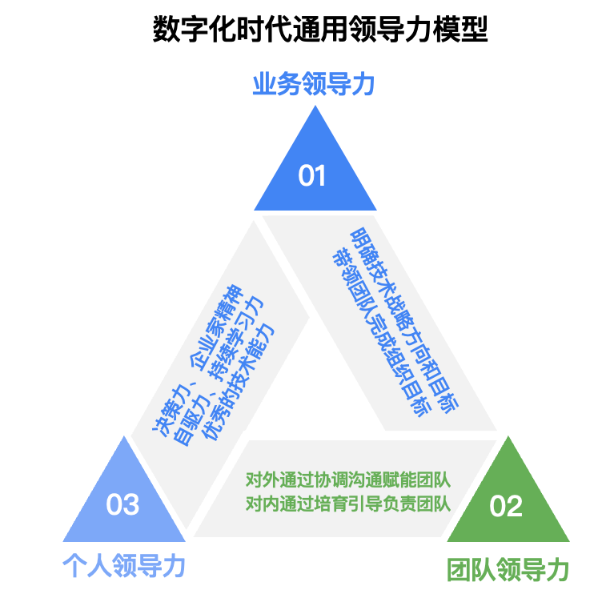

```dataviewjs

const currentPage = dv.current().file;
const dailyPages = dv.pages('"Daily"').sort(k=>k.file.name, "asc");
const currentPageName = currentPage.name;
const index = dailyPages.findIndex((e) => {return e.file.name === currentPageName});
if (index < 1) {
	dv.table(["File", "Created", "Size"],[]);
} else {
	const lastIndex = index - 1;
	const lastPage = dailyPages[lastIndex].file;
	const allPages = dv.pages().values;
	const searchPages = [];
	
	const lastTime = dv.parse(lastPage.name);
	const currentTime = dv.parse(currentPage.name);

	debugger;
	
	for (let page of allPages) {
		const pageFile = page.file;
		if (pageFile.cday > lastTime && pageFile.cday <= currentTime) {
		  searchPages.push(pageFile);
		}
	}
	dv.table(["File", "Created", "Size"], searchPages.sort((a, b) => a.ctime > b.ctime ? 1 : -1).map(b => [b.link, b.ctime, b.size]));
}

```

# 领导力说明

[科技领导者自我成长路径](https://mp.weixin.qq.com/s?__biz=MzA4NTU2MTg3MQ==&mid=2655223640&idx=2&sn=a20f360bf9e6fd9ba3fa22a4d68f8f53&chksm=8461d838b316512e65f0d81ec041729b94f690bc8fddf4862e394aa006b5b384b69787f91c0d&mpshare=1&scene=1&srcid=0323GHB3TqX0IC4c69o8m4Fu&sharer_sharetime=1679586677756&sharer_shareid=5e15907b71d950595664f00fbb2d84df#rd)

- 个人领导力（Leading Self）、业务领导力（Leading Business）和团队领导力（Leading Teams）。
	- 