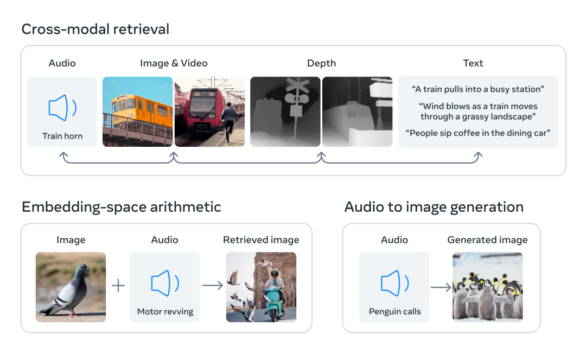
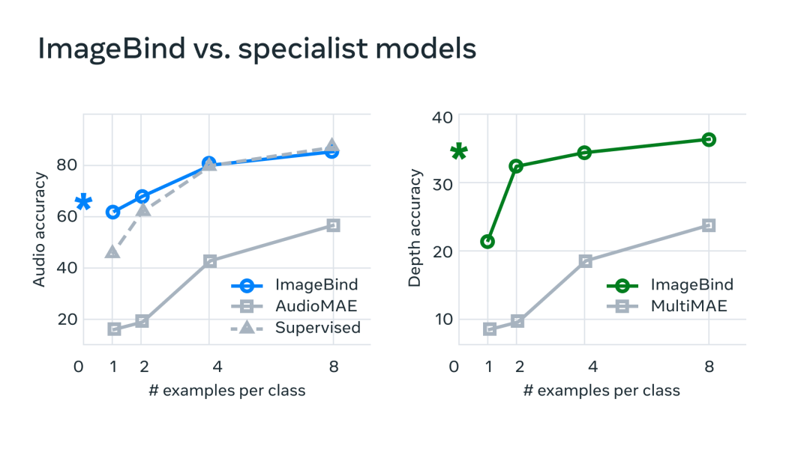

```dataviewjs

const currentPage = dv.current().file;
const dailyPages = dv.pages('"Daily"').sort(k=>k.file.name, "asc");
const currentPageName = currentPage.name;
const index = dailyPages.findIndex((e) => {return e.file.name === currentPageName});
if (index < 1) {
	dv.table(["File", "Created", "Size"],[]);
} else {
	const lastIndex = index - 1;
	const lastPage = dailyPages[lastIndex].file;
	const allPages = dv.pages().values;
	const searchPages = [];
	
	const lastTime = dv.parse(lastPage.name);
	const currentTime = dv.parse(currentPage.name);

	debugger;
	
	for (let page of allPages) {
		const pageFile = page.file;
		if (pageFile.cday > lastTime && pageFile.cday <= currentTime) {
		  searchPages.push(pageFile);
		}
	}
	dv.table(["File", "Created", "Size"], searchPages.sort((a, b) => a.ctime > b.ctime ? 1 : -1).map(b => [b.link, b.ctime, b.size]));
}

```

# ImageBind

> 跟大家重磅推荐由 Facebook 开源的 ImageBind ，字面意思，想象力绑定。  
> ImageBind 把声音、图像、文字、深度、温度、IMU 等六维数据绑定到一起了。  
> 做个类比，OpenAI 的 Clip 模型只把图片和文字绑定到了一起，就可以实现图片的识别理解，也就是图生文。  
> 那么 ImageBind 把那么多维度绑定到一起后，就可以实现很多能力了，如：  
> 图片检索声音，给定一张狗的图片，能够从给定的几种动物叫声中找出狗的叫声；  
> 声音检索图片，如给定火车的声音，能够从给定的几张图片中找出火车的图片；  
> 文字检索图片和声音，给定文字如“meowing”，能够从给定几种图片里找出猫的图片，从几种声音里找出猫叫的声音；  
> 声音加图片检索图片，如给定狗叫声和海滩照片，能够从给定几张图片里找出狗站在海滩的图片；  
> 声音生成图片，如给定下雨声音，生成下雨图片。  
> 以上所有功能都可以在这个 [imagebind.metademolab.com](https://imagebind.metademolab.com/demo) demo 页面在线体验。  
> 还可以看 [@GitHubDaily](https://m.okjike.com/users/CD000A7F-222C-429E-A53F-192F2C123EEB) 发的公众号文章 [mp.weixin.qq.com](https://mp.weixin.qq.com/s/XSgSMomSas70DUmXVQhsmA) ，里边有扎克伯格放出来的一个介绍视频，有中文字幕。

仅在过去几个月，MetaAI 便在 GitHub 开源了诸多实用项目：

\- Segment Anything (SAM)，可自动分割图片或视频中的所有物品，一键完成自动分割，让图像编辑变得更加简单。

\- DINOv2，无需微调，通过自监督获取视觉特征，直接推动计算机视觉技术进展。

\- Animated Drawings，利用 AI 能力，快速给绘画作品添加动画效果。

诸如此类，多不胜数。

今天，Meta 又放大招，正式宣布开源 **ImageBind**，让模型可以横跨 6 种不同的模态（图像、文本、音频、深度、温度和 IMU 数据）进行联动交流！

这里放下扎克伯格前几天在 Facebook 上对外公布的一段视频，让你们直观感受下 ImageBind 的能力到底有多强：


GitHub：https://github.com/facebookresearch/ImageBind

我之前说过，AI 模型每增加一种模态能力支持，其能力都将会更接近于人类。

我们能看到繁华的街道、听到马路上的鸣笛声、感受炎炎夏日，无一例外都来自于人类与生俱来的感官能力。

听觉、嗅觉、味觉、视觉等能力，让我们可以更好的与这个世界进行交互。

如果要让 AI 的能力更逼近于人类，则需要我们给 AI 赋予更多的能力，让它可以更好的感知这个世界。

在以前，要在各个模态之间实现搜索关联，需要同时维护与训练多份数据。

现在有了 ImageBind，便可以直接从音频中生成图像，比如，给 AI 听一段海浪的声音，它便能直接生成大海的图像，这将节省极大的训练成本。

从界面看，AI 就像人类一样，能够开始根据声音，脑补出画面了。

更厉害的是，ImageBind 还内置了 3D 感知和 IMU 传感器，可用于测量加速度与旋转运动，让 AI 能够身临其境感受我们的物理世界变化。

另外，ImageBind 还提供了一种新型的记忆检索丰富方式，让 AI 可以直接使用文本、音频和图像的组合数据，直接搜索图片、视频、音频文件或文本消息。

通过这种方式，我们可以让以往的 AIGC 应用生成质量更高的内容。

比如将其应用与视频剪辑领域，AI 便能够根据我们给出的声音、图像、文本，直接搜索匹配度更高的视频片段，实现真正意义上的视频一键剪辑功能！

在传统 AI 系统中，每个模态都拥有特定的嵌入（数据及其在机器学习中的关系数字向量）。

这使得不同模态之间难以进行互动和检索，我们无法直接根据音频来准确检索出相关图像和视频。

但是，ImageBind 却能做到。它通过将六种模态的嵌入对齐到一个公共空间，实现跨模态检索。



作为一个多模态模型，ImageBind 集成了我在上面提到的 SAM 和 DINOv2，让其自身能力进一步得到了充分提升。

将各个模态绑定到一起，构建出可无缝交流的桥梁，这就是 ImageBind 所实现的核心功能。

MetaAI 之前开发的 Make-A-Scene 工具，可以通过文本生成图像。

现在借助 ImageBind，则可以做到直接通过声音来直接生成图像。这使得 AI 能够更加深入了解人类情感，理解他们的喜怒哀乐，进而为人类提供更好的服务。

同时，基于 ImageBind 的跨模态交流能力，其每一个模态能力的上升，也将带动另一个模态的进步，进而达到一种类似滚雪球的效果。

为了验证这一点，MetaAI 技术团队也做了基准测试，发现 ImageBind 在音频和深度方面要明显优于其它的专业模型，这源自于 AI 从其它模态吸收与总结的经验。



目前可预测的是，未来视频剪辑将会变得越来越简单。

当你举起手机，录制一个海边日落的视频时，AI 便能自动根据视频内容来生成文案和字幕，并匹配上合适的背景音乐。

甚至 AI 还有可能通过一首歌，直接为歌手生成一段视频 MV。

在 VR 和 AR 游戏中，用户也可以通过多种语音、手势和头部动作等方式与游戏角色进行交互，增强游戏的互动性和沉浸感。

在医疗领域，医生可以通过语音、图像等多种方式收集患者的病情信息，再通过机器学习等技术进行处理和分析，更加准确的得出诊断结果和治疗方案。

虽然目前 ImageBind 只有 6 种模态，但随着更多感官功能的集成，比如嗅觉、触觉，AI 模型的能力将会愈加强大，AIGC 行业也将迎来翻天覆地的变化。