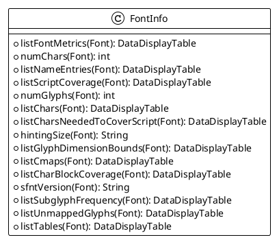

```dataviewjs

const currentPage = dv.current().file;
const dailyPages = dv.pages('"Daily"').sort(k=>k.file.name, "asc");
const currentPageName = currentPage.name;
const index = dailyPages.findIndex((e) => {return e.file.name === currentPageName});
if (index < 1) {
	dv.table(["File", "Created", "Size"],[]);
} else {
	const lastIndex = index - 1;
	const lastPage = dailyPages[lastIndex].file;
	const allPages = dv.pages().values;
	const searchPages = [];
	
	const lastTime = dv.parse(lastPage.name);
	const currentTime = dv.parse(currentPage.name);

	for (let page of allPages) {
		const pageFile = page.file;
		if (pageFile.cday > lastTime && pageFile.cday <= currentTime) {
		  searchPages.push(pageFile);
		}
	}
	dv.table(["File", "Created", "Size"], searchPages.sort((a, b) => a.ctime > b.ctime ? 1 : -1).map(b => [b.link, b.ctime, b.size]));
}

```

# 2023-07-05

> [GitHub - googlefonts/sfntly: A Library for Using, Editing, and Creating SFNT-based Fonts](https://github.com/googlefonts/sfntly)

> 本来想看看 google 是否有正确阅读 fontmetric 的接口。找到了这个，但是这个只是阅读/编辑字体。不能用于使用中。



sfntly is pronounced “esfontlee”.  
sfntly 发音为“esfontlee”。

sfntly is a Java and C++ library for using, editing, and creating sfnt container based fonts (e.g. OpenType, TrueType). This library was initially created by Google's Font Team and the C++ port was done by the Chrome team. It has been made open source.  
sfntly 是一个 Java 和 C++ 库，用于使用、编辑和创建基于 sfnt 容器的字体（例如 OpenType、TrueType）。这个库最初是由 Google 的 Font 团队创建的，C++ 移植是由 Chrome 团队完成的。它已开源。

The basic features of sfntly are the reading, editing, and writing of an sfnt container font. Fonts that use an sfnt container include OpenType, TrueType, AAT/GX, and Graphite. sfntly isn‘t itself a tool that is usable by an end user - it is a library that allows software developers to build tools that manipulate fonts in ways that haven’t been easily accessible to most developers. The sfntly library is available in Java with a partial C++ port. However, we have included some font tools that are built on top of sfntly: a font subsetter, font dumper, a font linter, some compression utilities.  
sfntly 的基本功能是读取、编辑和写入 sfnt 容器字体。使用 sfnt 容器的字体包括 OpenType、TrueType、AAT/GX 和 Graphite。 sfntly 本身并不是最终用户可以使用的工具 - 它是一个库，允许软件开发人员构建以大多数开发人员无法轻松访问的方式操作字体的工具。 sfntly 库可在 Java 中使用，并带有部分 C++ 端口。然而，我们已经包含了一些构建在 sfntly 之上的字体工具：字体子集器、字体转储器、字体 linter、一些压缩实用程序。

The uses of sfntly are really anything that you can think of that involves reading and/or editing fonts. Right now, the Java version is the core library used to power Google's Web Fonts project. There it is used for all font manipulation - to read font data, to pull apart fonts, and to then reassemble them before they are streamed out to a user. Portions of the font that are not needed - specific glyph ranges or features - are stripped using sfntly to minimize the size of the streamed font. The C++ port is used somewhat similarly within Chrome to subset fonts for insertion into a PDF for viewing or printing. Though the features stripped in the font are different in Chrome than in Web Fonts because the end use is different.  
sfntly 的用途实际上是您能想到的任何涉及阅读和/或编辑字体的用途。目前，Java 版本是用于支持 Google Web Fonts 项目的核心库。它用于所有字体操作 - 读取字体数据，分离字体，然后在将它们流式传输给用户之前重新组合它们。使用 sfntly 删除不需要的字体部分（特定字形范围或功能），以最小化流式字体的大小。 C++ 端口在 Chrome 中的使用有点类似，用于将字体子集化以插入 PDF 中以供查看或打印。尽管 Chrome 中字体中剥离的功能与 Web 字体中有所不同，因为最终用途不同。

Using sfntly you can read and extract any of the tables in a font. The tables are the individual data structures within the font for each of the features and functionality: glyph outlines, character maps, kerning, meta data, etc. If you look over the OpenType and TrueType specs, you will see a number of categories of tables. sfntly currently supports all of the required tables, the TrueType outline tables, bitmap glyph tables, and a couple of the other miscellaneous tables. This level of support provides for many of the needs developers have related to the informational reading of font data. It also covers a lot of the editing needs.  
使用 sfntly，您可以读取和提取字体中的任何表格。这些表格是字体中每个特性和功能的单独数据结构：字形轮廓、字符映射、字距调整、元数据等。如果您查看 OpenType 和 TrueType 规范，您将看到许多类别的表格。 sfntly 目前支持所有必需的表格、TrueType 大纲表格、位图字形表格和其他一些杂项表格。这种级别的支持满足了开发人员与字体数据的信息读取相关的许多需求。它还涵盖了很多编辑需求。

To get started with sfntly: clone the repository and follow the quickstart.txt guide in the Java directory  
要开始使用 sfntly：克隆存储库并按照 Java 目录中的 Quickstart.txt 指南进行操作

have fun 玩得开心

Stuart Gill - sfntly Architect and Lead Developer  
Stuart Gill - sfntly 架构师和首席开发人员