ChatGPT 实际上是一个大型语言预训练模型（即 Large Language Model，后面统一简称 LLM）。什么叫 LLM？LLM 指的是利用大量文本数据来训练的语言模型，这种模型可以产生出强大的语言关联能力，能够从上下文中抽取出更多的信息。

为什么语言模型的参数量和数据量会朝着越来越大的方向发展呢？在早些时间的一些研究已经证明，随着参数量和训练数据量的增大，语言模型的能力会随着参数量的指数增长而线性增长，这种现象被称为 Scaling Law（下图左例）。但是在 2022 年之后，随着进来对大模型的深入研究，人们发现当模型的参数量大于一定程度的时候，模型能力会突然暴涨，模型会突然拥有一些突变能力（Emergent Ability，下图右例），如推理能力、零样本学习能力等（后面均会介绍）。

## GPT

GPT 全称 **Generative Pre-training Transformer**，由 Google 在 2018 年提出的一种预训练语言模型。他的核心是一个 T**ransformer** 结构，主要基于 **注意力机制** 来建模序列中不同位置之间的关联关系，最后可用于处理序列生成的任务。

给定已知的 token 序列 Nt（对中文来说是字符，对英文来说可能是单词或者词根），通过语言模型来预测 t+1 位置上的 token 是什么。实际上模型输出的是所有 token 在 t+1 位置上的概率向量，然后根据概率最大的准则选择 token。  
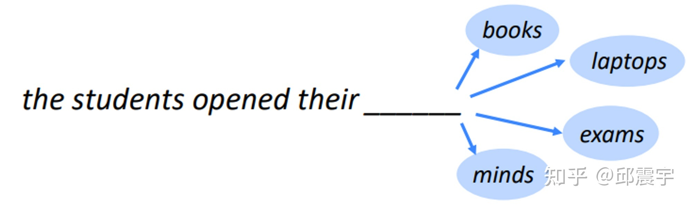  

## GPT 与 BERT

BERT 是 Google 在 2018 年发布的一种双向语言模型，发布后，其在不同语言理解类任务（如文本分类，信息抽取，文本相似度建模）中都达到了当期时间节点的最好效果。  
BERT 与上述语言模型的机理有所不同，其训练任务相当于让模型去做完形填空任务（官方称为 Masked Language Model 任务，下文简称 MLM)，并不是遵循文本一个接一个预测的顺序， **其模型机制与人类沟通表达的习惯不太符合** 。 

图中左半部分是 BERT 的示意图，右半部是 GPT 的示意图，Trm 为一个 Transformer 模型组件，E 为输入的 token 序列，T 为模型生成的 token 序列。  
其中，实线部分为该位置的 Trm 能够看到哪些其他位置 token 的上下文知识。  
可以看到，对于 BERT 来说，每个位置上的 Trm 都能看到任意位置的上下文知识，因此其在具体的自然语言理解任务上会有不错的效果。  

而 GPT 则是遵循传统语言模型的模式，例如 index=1 位置的 Trm 是无法看到 index>1 的知识的，因此它在自然语言理解任务上的效果不如 BERT，但是在生成任务上会更符合人类的直觉。  
业界把 BERT 中的 MLM 模式称为自编码形式 (auto-encoding)，把 GPT 的模式称为自回归形式（auto-regressive）。  

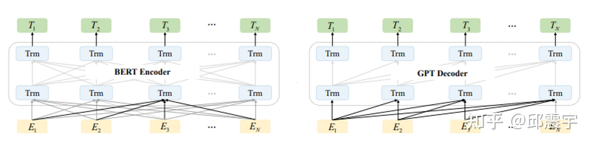

问题：大家从 BERT 和 GPT 的对比中可以看到，BERT 在语言理解上似乎更具优势，那为何现在 ChatGPT 的模型基座是 GPT 呢？这就涉及到最近两年逐渐清晰的 NLP 进化路线了。

## NLP 进化路线

NLP 任务解决方案（又称 NLP 范式）进化路线：

（1）传统监督学习：常规机器学习方法（SVM/贝叶斯等）来实现监督任务（文本分类、文本摘要、词性标注等）  
（2）神经网络 - 监督学习：升级为拟合能力更强的神经网络方法，针对不同 NLP 任务，单独准备数据、训练，任务之间互不相通。  
（3）pre-train + fine-tune：目前流行的两阶段范式，共用 pre-train 部分的模型，根据下游任务自行 fine-tune，适应不同的场景任务，更加“节能”省心。  
（4）pre-train + [Prompt 工程](Prompt%20工程.md) + predict：模板 prompt 范式，fine-tune 消失了，直接在 prompt 工程里提前实现，下游只需要给出 prompt 指令。不同大模型之间建起了桥梁，不再隔离。使用方无需准备监督语料，无需单独训练，很省心。

### pre-train + fine-tune 两阶段范式

基于 MLM 训练范式得到的 BERT 模型虽然在很多语言理解类任务上有不错的效果下游任务，之后整个业界在处理 NLP 任务的时候通常会遵循预训练模型→下游任务 finetune 的流程：

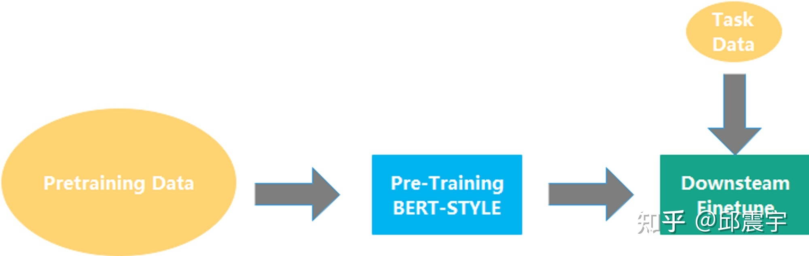

这种方式与传统的 training from scratch 相比，对下游任务数据的需求量更少，得到的效果也更优。不过，上述方式还是存在一些问题：

1. 处理一个新的任务就需要标注新的语料，对语料的需求比较大，之前已经做过的任务语料无法高效利用。即使是信息抽取下面的不同任务（如实体识别和关系抽取两个任务）也无法通用化。
2. 处理一个新的任务需要针对任务特性设计整体模型方案，虽然 BERT 模型的底座已经确定，但还是需要一定的设计工作量。例如文本分类的任务和信息抽取的任务的模型方案就完全不同。

对于要走向通用人工智能方向的人类来说，这种范式很难达到通用，对每个不同任务都用单独的模型方案和数据来训练显然也是低效的。因此，为了让一个模型能够尽量涵盖更多的任务，业界尝试了几种不同的路径来实现这个目标。

- 对 BERT 中的 MLM 进行改造，如引入一些特殊的 Mask 机制，使其能够同时支持多种不同任务，典型的模型如 UniLM（[https://arxiv.org/abs/1905.03197）](https://arxiv.org/abs/1905.03197%EF%BC%89)
- 引入额外的 Decoder，将 BERT 优化改造成能做生成式的模型，典型的工作有 BART（[https://arxiv.org/abs/1910.13461](https://arxiv.org/abs/1910.13461)），T5（[https://arxiv.org/pdf/1910.10683.pdf](https://arxiv.org/pdf/1910.10683.pdf)），百度的 UIE（将任务设计生成 text-to-structure 的形式实现信息抽取的大一统 ）。我对 T5 比较熟悉，之前也写过相关的分析，这个工作算是比较早地尝试将不同任务通过文本生成的方式进行大一统。如图所示，T5 训练时直接输入了不同下游 NLP 任务的标注数据，通过在原始文本的前端添加任务的提示文本，来让模型学习不同任务的特性。如翻译任务可以是”translate English to German”,分类任务可以是跟具体分类目标有关如”cola sentence”,也可以是一种摘要任务”summarize”。

> 怎么样，是不是觉得跟 ChatGPT 的模式有相似的地方？

这种方式可以同时利用多种 NLP 任务相关的公开数据集，一下子就把预训练任务从语言模型扩展到了更多任务类型中，增强了模型的通用性以及对下游任务的理解能力。

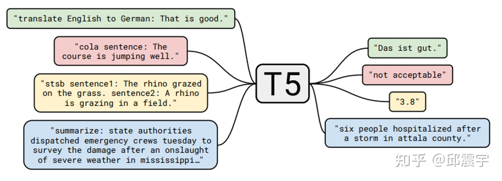

- 除了上面两种方式外，还有其他改造 BERT 的方法就不穷举了，如苏神通过 Gibbs 采样来实现 BERT 模型的文本生成等。（[https://kexue.fm/archives/8119](https://kexue.fm/archives/8119)）

### Pre-train + Prompt + Predic 新范式

什么是 Prompt？Prompt 就是提示：

- 比如有人忘记某个事情，你只需给予特定提示，他就可以想起来  

示例：

- 背诗：提示白日依山尽, 大家自然而然地会想起来下一句诗：黄河入海流。  
- 搜索引擎：可以根据输入，进行输出提示：  


提示学习将这种模式植入到大语言模型训练中，像人一样激发了大语言模型的学习能力。

- prompt 就是给预训练语言模型的一个线索/提示，更好的理解人类的问题。  
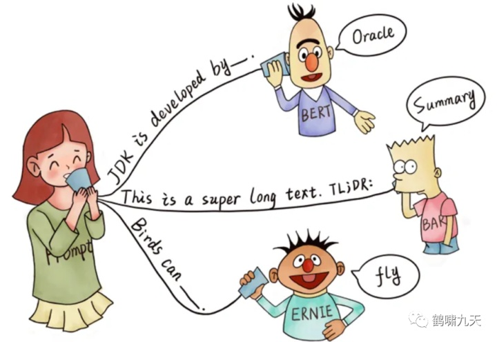  
- 根据提示，BERT 能回答，JDK 是 Oracle 研发的  
- 根据 TL;DR: 的提示，BART 知道人类想要问的是文章的摘要  
- 根据提示，ERNIE 知道人类想要问鸟类的能力–飞行

### 总结

虽然有很多大一统的路径，但是 OpenAI 一直坚持着 GPT 的方向不断演化着，2019 年他们发布了 GPT2，这个模型相对于 GPT 来说，主要是扩大了参数量，扩大了训练语料，在构建语料的时候隐式地包含了 multitask 或者 multidomain 的特质，最后在二阶段验证模型的时候并不是直接做有监督的 finetune，而是继续用下游数据做无监督的训练，最后的效果居然还不错，证明了只要模型够大，就能学到足够的知识用于处理一些下游任务。从它的论文名字就可以看出来与其核心思想：[Language models are unsupervised multitask learners](https://cdn.openai.com/better-language-models/language_models_are_unsupervised_multitask_learners.pdf) 。不过彼时，BERT 及其各种变种在领域中的应用还是更广的，真正让 GPT 系列模型惊艳众人的工作还是要数 2020 年发布的 GPT-3 模型。（[https://arxiv.org/abs/2005.14165](https://arxiv.org/abs/2005.14165)）

## GPT-3

首先，说几个跟 GPT-3 相关的数字：  
  
OpenAI 训练初版的 GPT-3，比 GPT-2 整整用了 15 倍的语料，同时模型参数量扩展了 100 多倍。这么多资源的投入，使得 GPT-3 成为了一个“庞然巨物”。除了在很多 NLP 的任务上有着很不错的指标外，其本身也产生了一种前所未有的能力——【 **In-context learning** 】。

## In-Conetxt-Learning

模型在不更新自身参数的情况下，通过在模型输入中带入新任务的描述与少量的样本，就能让模型”学习”到新任务的特征，并且对新任务中的样本产生不错的预测效果。  

In Context Learning（ICL）的核心思想：从类比中学习。既然人可以从题目示例中学习解题方法，那大模型为啥不行？

看看语言模型如何使用 ICL 进行决策

首先，给 ICL 一些示例, 形成演示上下文。示例用自然语言模板编写的。  
然后，ICL 将查询问题（即 input）和一个上下文演示（一些相关 cases）连接在一起，形成带有提示的输入，并将其输入到语言模型中进行预测。  
隶属于小样本学习的情境学习有三种分类：

### few-shot learning 多样本学习 

输入：“这个任务要求将中文翻译为英文。你好 ->hello，再见 ->goodbye，购买 ->purchase，销售 ->”  
要求模型预测下一个输出应该是什么，正确答案应为“sell”。

参考下图的例子来理解：其中，task description 和 examples 用来帮助模型学习新任务，最后的 Prompt 用来测试模型是否学会了。

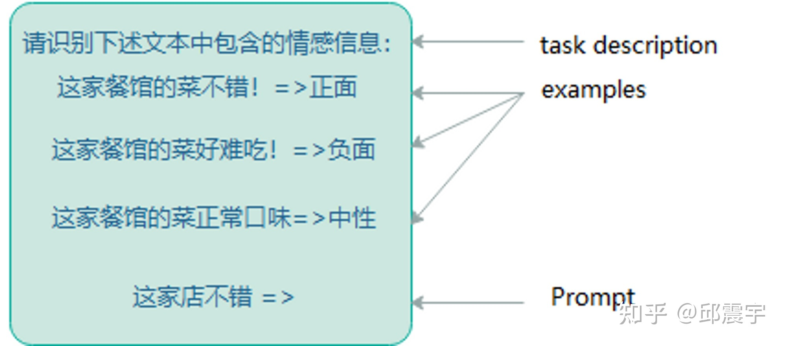

### one-shot learning 一样本学习

输入：“这个任务要求将中文翻译为英文。你好 ->hello，销售 ->”  
要求模型预测下一个输出应该是什么，正确答案应为“sell”。  

### zero-shot learning 零样本学习

输入：“这个任务要求将中文翻译为英文。销售 ->”  
要求模型预测下一个输出应该是什么，正确答案应为“sell”。

---

与传统的小样本学习范式还是有所不同，之前主流的小样本学习范式以 Meta-learning 为主，通过将训练数据拆成不同的小任务进行元学习。在学习的过程中，模型的参数是一直在变化的，这是最大的一个不同点。  
对于大模型来说，这可是极佳的特性。因为大模型的微调成本通常都极为庞大，很少有公司能够具备微调训练的资源。因此，如果能够通过 In-context-learning 的特性，让大模型快速学习下游任务，在相对较小的成本下（对大模型进行前向计算）快速完成算法需求，可以大大提升技术部门的生产力。

参考 [in-context learning 到底在学啥？](in-context%20learning%20到底在学啥？.md#当前大模型具有的零监督学习能力远超预期), [ChatGPT 的训练原理科普](ChatGPT%20的训练原理科普.md#理解例子要求)  
结论是 **上下文学习能力并不是学习，而只是在原有的能力下帮助构建范式。**  
note: [模型参数与超参数](模型参数与超参数.md) 的概念

> 这个还是蛮有意思的，fine-tune 其实也是调参数。但是 In-Context-Learning 只是构建思考范式而已

那不更新参数的小样本学习有什么好处呢？

对于大模型来说，这可是极佳的特性。因为大模型的微调成本通常都极为庞大，很少有公司能够具备微调训练的资源。因此，如果能够通过 In-context learning 的特性，让大模型快速学习下游任务，在相对较小的成本下（对大模型进行前向计算）快速完成算法需求，可以大大提升技术部门的生产力。

In-context learning 的效果固然惊艳，但是对于一些包含复杂上下文或者需要多步推理的任务仍然有其局限性，这也是业界一直以来致力于让人工智能拥有的能力——推理能力。那么大模型具有推理能力吗？答案就是—— **Chain-of-thought** ，即思维链能力。

## Chain-Of-Thought（CoT）

> 这个和 [ChatGPT 的训练原理科普](ChatGPT%20的训练原理科普.md#分治效应) 里面描述的比较像，可以互相参考借鉴  
> 即分治效应 

思维链的主要思想是通过向大语言模型展示一些少量的 exemplars，在样例中解释推理过程，大语言模型在回答提示时也会显示推理过程。这种推理的解释往往会引导出更准确的结果。

[思维链提示过程](https://learnprompting.org/zh-Hans/docs/intermediate/chain_of_thought) Wei 等人

> - “思维链仅在使用 **∼100B** 参数的模型时才会产生性能提升”。

较小的模型编写了不合逻辑的思维链会导致精度比标准提示更差。

---

传统的 Prompt 中，对于一个复杂或者需要多步计算推导的问题样例，会直接给出答案作为 In-context learning 的学习范例与新任务的测试样例输入到大模型中。这样做往往不能得到正确的结果，如图所示：（ https://arxiv.org/pdf/2205.11916.pdf ）

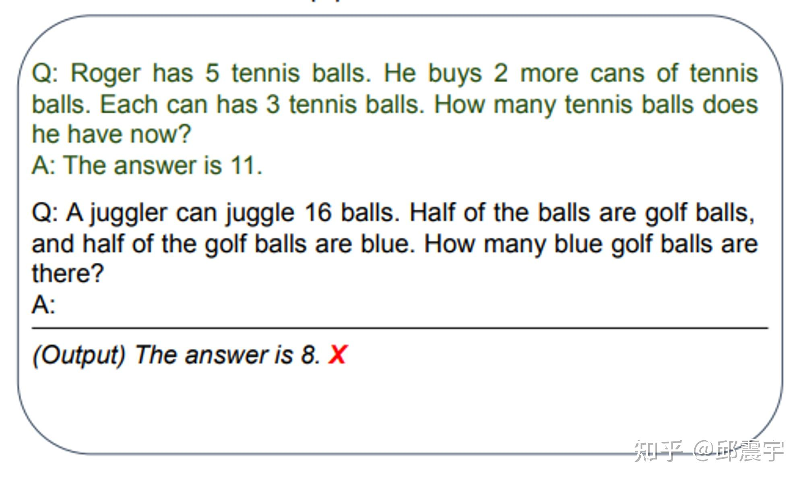

上图例子选择自一个数据集叫 `GSM8K`，每一个样例大概就是一个小学一二年级的看几句话（基本都是三句）写算式然后算答案的难度，但是 `GPT-3` 通过刚刚说的最简单的提示方法曾经只能在这个数据集上做到 6% 左右的准确度。

然而，当我们将上述问题范例中的答案再细化一些，对推到出答案的 **每一个步骤都写出来** ，再将测试样例一起输入到模型中，此时模型居然能够正确回答了，而且也能够参照范例中的样例进行一定的推理，如图所示：  

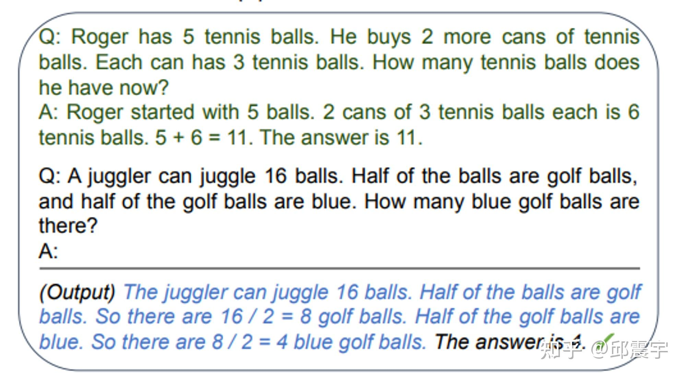

上述的模型输入中，还带有可参考的问题范例，还属于小样本的范畴。

诡异的是，有人使用了一种匪夷所思的方法，让其具备了零样本的推理能力： **在问题样例的答案中增加一句 Let’s think step by step. 然后模型居然能够回答出之前不能回答的问题。**  
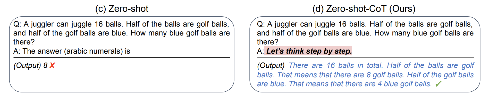

论文中则是将上述 output 与输入模型的 Prompt 拼在一块，再次输入模型，最终得到了简洁的答案输出：  
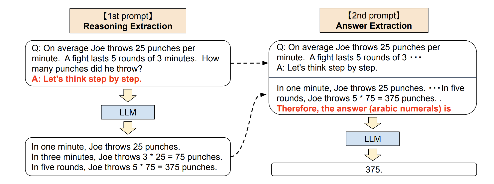  
既然大模型具备了 COT 的特性，那么就能说明它具备了推理能力了吗？答案是不确定的。因为在更多的复杂逻辑推理类任务或者计算任务上，大模型还是无法回答。结论可以见 [[2208.05051] Limitations of Language Models in Arithmetic and Symbolic Induction]( https://arxiv.org/abs/2208.05051 )

### CoT 类型

#### Zero-shot CoT

零样本 CoT

- 显示植入提示语：Let’s think step by step （让我们一步步思考）
- 鼓励模型先生成推理链，再通过前缀 Therefore, the answer is（所以，答案是）来作答
- 或者使用提示语：Let’s work this out it a step by step to be sure we have the right answer （让我们逐步解答这个问题，以确保得到正确答案）

```
Question:  Marty  has  100  centimeters  of  ribbon  that  he  must  cut  into  4  equal  parts.  Each  of  the  cut  parts  must  be  divided  into  5  equal  parts.  How  long  will  each  final  cut  be?  Answer:  Let's  think  step  by  step. 
```

`零样本思维链`（Zero Shot Chain of Thought，Zero-shot-CoT）提示过程是对 CoT prompting 的后续研究，它引入一种非常简单的零样本提示。

- 在问题结尾附加“让我们一步步思考。” 这几个词，大语言模型能够生成一个回答问题的思维链。
- 从这个思维链中，他们能够提取更准确的答案。


从技术上讲，完整的零样本思维链过程涉及两个单独的提示/补全结果。下图中，左侧顶部气泡生成一个思维链，而右侧顶部气泡接收来自第一个提示（包括第一个提示本身）的输出，并从思维链中提取答案。这个第二个提示是一个自我增强的提示。


结论

- 零样本思维链也有效地改善了算术、常识和符号推理任务的结果。然而，通常不如思维链提示过程有效。在获取思维链提示的少量示例有困难的时候，零样本思维链可以派上用场。
- 有趣的是，我发现 Zero-shot-CoT 风格的提示有时可以有效地缩短生成任务的完成时间。例如，考虑标准提示 `Write a story about a frog and a mushroom who become friends.` 将单词 `Let's think step by step.` 附加到此提示的末尾会导致更长的完成时间。

#### Few-shot CoT

少样本 CoT

- 补充少量高质量推理链示例

```
Question:  Tom  and  Elizabeth  have  a  competition  to  climb  a  hill.  Elizabeth  takes  30  minutes  to  climb  the  hill.  Tom  takes  four  times  as  long  as  Elizabeth  does  to  climb  the  hill.  How  many  hours  does  it  take  Tom  to  climb  up  the  hill?  Answer:  It  takes  Tom  30*4  =  <<30*4=120>>120  minutes  to  climb  the  hill.  It  takes  Tom  120/60  =  <<120/60=2>>2  hours  to  climb  the  hill.  So  the  answer  is  2.  ===  

Question:  Jack  is  a  soccer  player.  He  needs  to  buy  two  pairs  of  socks  and  a  pair  of  soccer  shoes.  Each  pair  of  socks  cost  $9.50,  and  the  shoes  cost  $92.  Jack  has  $40.  How  much  more  money  does  Jack  need?  Answer:  The  total  cost  of  two  pairs  of  socks  is  $9.50  x  2  =  $<<9.5*2=19>>19.  The  total  cost  of  the  socks  and  the  shoes  is  $19  +  $92  =  $<<19+92=111>>111.  Jack  need  $111  -  $40  =  $<<111-40=71>>71  more.  So  the  answer  is  71.  ===  

Question:  Marty  has  100  centimeters  of  ribbon  that  he  must  cut  into  4  equal  parts.  Each  of  the  cut  parts  must  be  divided  into  5  equal  parts.  How  long  will  each  final  cut  be?  Answer: 
```

CoT 使用 few shot 让 llm 说出来 CoT ，然后得到答案，分成两部分：

- 首先, 加一个“Lets think step by step”，得到一个 CoT 的 murmur
- 然后, 后面接上一句“ **so the anwser is** ”，然后得到答案。

性能远超原来的 zero shot 逼近 few shot 和 CoT 的 few shot 性能。

#### Manual-CoT 人工设计

Manual-CoT: 人工设计演示, 通过 few-shot prompt 的形式提示 LLM.

Manual-CoT 的方法往往比 Zero-Shot-CoT 更有效，但 Manual-CoT 的方法需要手动设计大量的演示。

#### Auto CoT

为了缓解手动设计的困难，Auto-CoT 方法自动构建具有 questions 和 reasons chains 的演示。

- [自动化构建大模型的演示(Auto-CoT)](https://zhuanlan.zhihu.com/p/618904090)
- 论文 [AUTOMATIC CHAIN OF THOUGHT PROMPTING IN LARGE LANGUAGE MODELS](https://arxiv.org/pdf/2210.03493.pdf)
- 代码 [auto-cot](https://github.com/amazon-science/auto-cot)

Auto-CoT 能够达到甚至超过手工设计的演示效果

- Auto-CoT 将使用“Let’s think step by step”的提示来生成演示的 reasoning chains.。但直接使用 Zero-Shot-CoT 的方式生成的答案会存在错误。
- 为了缓解 reasoning chain mistakes 带来的影响，演示的 questions 的丰富程度是核心。

基于上述发现，Auto-CoT 包括两个步骤：

1. 将给定数据集中的问题聚为不同的簇；
2. 从每个簇中选择代表性的问题，通过 Zero-Shot-CoT 的方式生成 reasoning chain。

Auto-CoT 的关键挑战在于自动化地构建具有 good questions 和对应 reasoning chains 的演示.

作者设计了 Retrieval-Q-CoT 和 Random-Q-CoT 两种方法来验证结论。

- 背后使用 GPT-3 模型

Auto-CoT: Automatic Chain-of-Thought Prompting

Auto-CoT 主要包括两个步骤：

1. question clustering(问题聚类) : k-means 算法将 questions 聚成 k 个簇，对于每个簇，将其中的 question 按照与簇中心的距离排序。
2. demonstration sampling(演示采样) : 对于每一个簇，构建对应的演示.

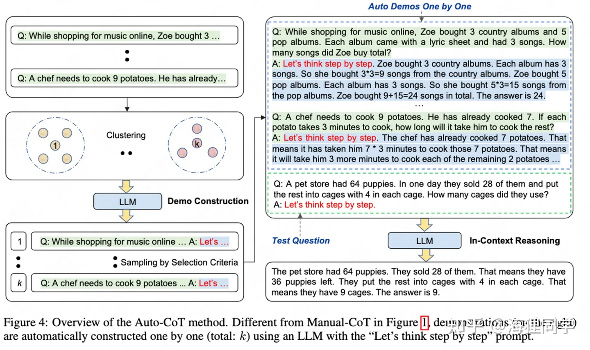  

代码

- 返回结果见 [try_cot.ipynb](https://github.com/amazon-science/auto-cot/blob/main/try_cot.ipynb)

```
import sys
sys.argv=['']
del sys
from api import cot

question = "There were 10 friends playing a video game online when 7 players quit. If each player left had 8 lives, how many lives did they have total?"
print("Example: Zero-Shot")
# To use GPT-3, please add your openai-api key in utils.py (#Line 59)
# method = ["zero_shot", "zero_shot_cot", "manual_cot", "auto_cot"] cot(method="zero_shot", question=question)
# 零样本 cot print("Example: Zero-Shot-CoT")
cot(method="zero_shot_cot", question=question)
# 手工 cot question = "In a video game, each enemy defeated gives you 7 points. If a level has 11 enemies total and you destroy all but 8 of them, how many points would you earn?"
print("Example: Manual-CoT")
cot(method="manual_cot", question=question)

question = "In a video game, each enemy defeated gives you 7 points. If a level has 11 enemies total and you destroy all but 8 of them, how many points would you earn?"
print("Example: Auto-CoT")
cot(method="auto_cot", question=question) 
```

### 构建更好的思维链

> 如何构建好的语境示例，效果最大化？研究人员发现 prompt 形式、训练样本集、样本顺序会导致效果不同。

导致不同提示下模型性能高方差的三个原因：

- 如果选用的示例的标签分布不平衡，则存在多数 **标签偏差** (Majority bias)
- 模型更倾向于最后一个所见到的标签， **近频偏差** （Recency bias）
- 相比罕见词，大语言模型倾向于使用常见词， **常见词偏差** (Common token bias)

如何选择样本示例？[tips-for-example-selectio](https://lilianweng.github.io/posts/2023-03-15-prompt-engineering/#tips-for-example-selection)

- 选择跟测试样本相近的示例，如在嵌入空间中用 k-NN 聚类算法挑选
- 选择多样性、代表性好的示例
- 使用对比学习训练嵌入矩阵
- 使用 Q-Learning 选择样本
- 借鉴主动学习思路

如何设置示例样本顺序？[Tips for Example Ordering](https://lilianweng.github.io/posts/2023-03-15-prompt-engineering/#tips-for-example-ordering)

- 随机：防止大类偏差、近因效应
    - 保持多样性、(与测试样本的) 相关性和随机性，以避免多数标签偏差和近频偏差。
- 使用大模型、更多训练样本并不会降低顺序带来的方差

# 参考链接

- [真·万字长文:可能是全网最晚的chatgpt技术总结 - 知乎](https://zhuanlan.zhihu.com/p/613698929?utm_medium=social&utm_oi=548239143726141440&utm_psn=1620217211586592768&utm_source=wechat_session)
