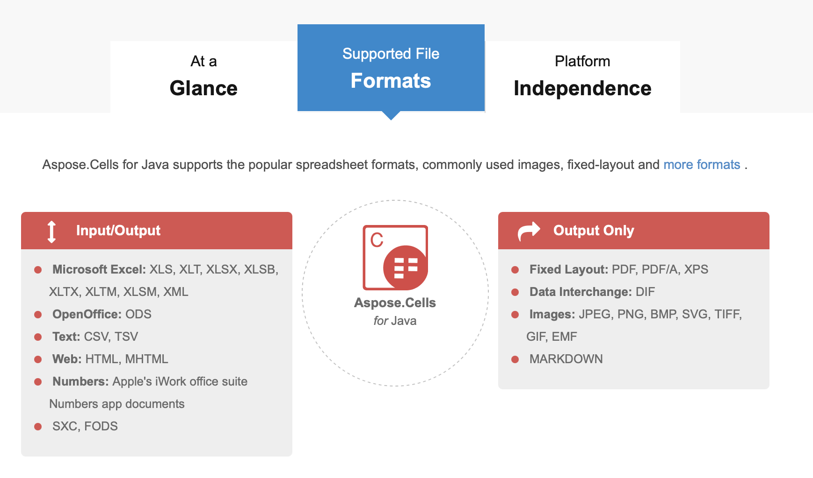

> Java 的 Excel 库

### Aspose.Cells 的介绍

> Aspose.Cells for Java 是一个屡获殊荣的 Excel 电子表格处理 API，允许开发人员将读取、写入、操作、转换和打印电子表格的功能嵌入到自己的应用程序中，而无需 Microsoft Excel 应用程序。
> 
> Aspose.Cells for Java 是一个成熟且功能丰富的库，提供的许多功能远远超出市场上其他组件的简单数据导出功能。API 提供了导出数据、将电子表格格式化到最细粒度级别、导入和导出图像、创建图表和数据透视表、使用公式计算引擎应用和计算复杂公式、流式 Excel 数据并以各种格式保存结果的功能。

支持以下格式的输入输出，运行于 JRE，Jar 包大小 8M，依赖两个库:bcprov-jdk15on / bcpkix-jdk15on

主要功能特色：

- 将 Excel 文件保存到不同格式
    - Excel API 提供将电子表格转换为 PDF、XPS、HTML 等格式，同时保持最高的视觉保真度。可靠灵活的转换过程使 Aspose.Cells 成为大多数以行业标准格式交换文件的组织的完美选择。
- 将工作表格式化到表、行、列、格等各种粒度
    - 库提供电子表格样式，包括但不限于行、列和单元格级别的工作表格式，添加条件格式规则，定义数字格式和设置带有属性的字体。同样，API 支持操作和创建所有类型的自定义和标准图表，以及各种绘图对象，如 OLE 对象、图片、注释、形状和单元格控件。
- 将图表和工作表转换为图像和 PDF 格式
    - Aspose.Cells for Java 提供特殊的转换功能，如图表转换为图像和 PDF，工作表转换为图像，打印工作表和将电子表格转换为 PDF 文件格式。转换过程非常灵活和简单，允许选择多种转换方式，例如在电子表格转换为 PDF 期间重新采样图像，或在将工作表和图表渲染到图像时调整生成的图像尺寸。
- 操作 Excel 行和列
    - Aspose.Cells for Java 允许您以各种方式修改行和列。您可以轻松调整列宽和行高，自动调整单元格的宽度/高度，如内容，插入和删除，隐藏和取消隐藏，以及分组和取消分组行和列。
- 用图表和数据透视表汇总数据
    - 使用非常大的电子表格可能很难获得汇总信息。有一个数据透视表，可以快速描述平面数据，并根据需要获取相关信息。API 动态创建数据透视表和图表。动态更改数据透视表源数据是可能的。此外，智能标记，该库的另一个顶级功能，通过数据源填充工作表并生成可视化有效的报告。
- 基于网络的电子表格可视化控制
    - Aspose.Cells for Java 还提供了一个用户界面控件，可以嵌入到 JSP Web 应用程序中，并与 Chrome、Firefox、Internet Explorer 和 Opera 等所有现代 Web 浏览器兼容。最终用户可以使用它从 Web 应用程序的前端加载、编辑和保存 Excel 文件。