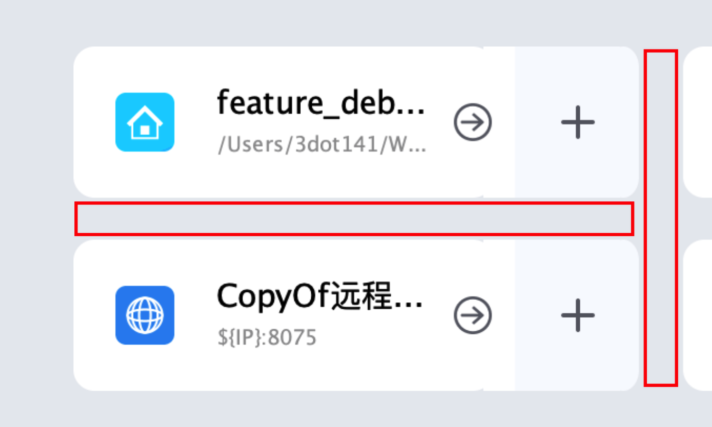
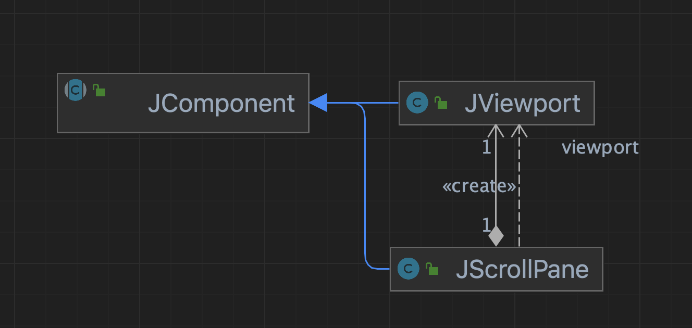
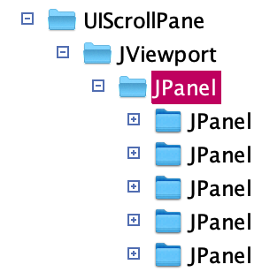
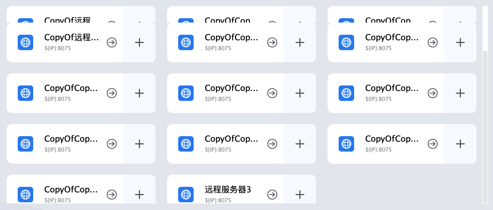
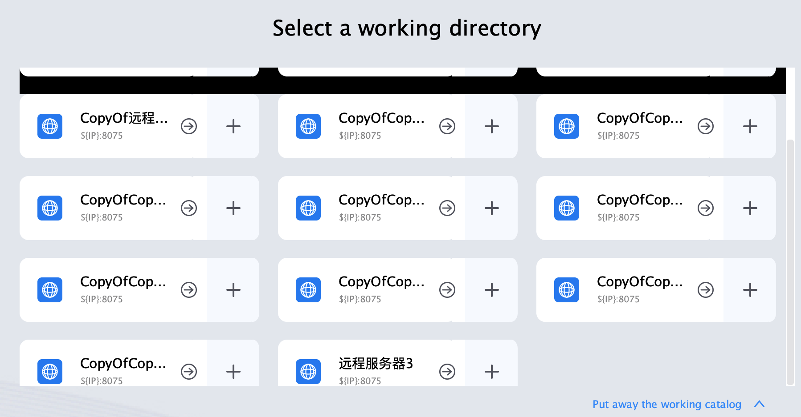

# Java Swing 中背景图片的实现

效果见  
  
可以看到面板中间是空的。

想要实现这样一个透明的背景，首先要明白 Java Swing 的画图逻辑  
但是，如果是面板嵌套。比如  
  
这个时候， 如果想让 A1 的背景也透明。  
按照 Java Swing 的逻辑，需要让 AA 透明、 A1 也透明  
因为绘图时，是有图层的概念的。  
需要写在下面绘图，然后再在上面绘图。  
在 `panel` 的层级结构中，即需要让  
从 AA 开始到 **想要透明背景的组件** 都要是透明的才可以。

其基本的使用方式有两种

## setOpaque

```java
JComponent.setOpaque(false)
```

## 将背景设置为 Color(0,0,0,0)

```java
Component.setColor()
```

## 特殊情况之重绘

当按照上面的方案重绘时，比如直接使用 `repaint` 对当前的组件进行绘制。  
这个时候，会 clean 当前的画布。  
即会将当前组件的背景置为一个 `getBackground` 的值。  
这个时候如果使用的 `opaque` 或者 `transparent`.  
都会导致背景变成黑色。

见效果  


所以，如果想要对透明背景进行重绘，那么必须从  
【背景】->【…】->【组件】  
这样一条链路都进行刷新。

## 特殊情况之 ScrollPanel

这里是遇到了一个特殊的需求。需要在 `ScrollPanel` 上进行透明背景。  
经过阅读 ScrollPanel 的源码，发现。  
  
  
他的结构如上。  
当超过 `viewport` 的大小的时候。就会出现滚动条。  
但是当滚动时，他为了保证性能是增量绘制的逻辑。  
因此导致出现了 [重绘](Java%20Swing%20中背景图片的实现.md#特殊情况之重绘) 的同样的问题。  
但是由于增量绘制的逻辑，我本身不能控制。因此考虑只有两条路。  
1- 修改增量绘制中的部分逻辑  
2- 将增量绘制改为全量绘制

### 增量绘制

阅读源码，发现逻辑集中在 `javax.swing.JViewport#setViewPosition` 中

```java
if ((oldX != newX) || (oldY != newY)) {  
    if (!waitingForRepaint && isBlitting() && canUseWindowBlitter()) {  
        RepaintManager rm = RepaintManager.currentManager(this);  
        // The cast to JComponent will work, if view is not  
        // a JComponent, isBlitting will return false.        JComponent jview = (JComponent)view;  
        Rectangle dirty = rm.getDirtyRegion(jview);  
        if (dirty == null || !dirty.contains(jview.getVisibleRect())) {  
            rm.beginPaint();  
            try {  
                Graphics g = JComponent.safelyGetGraphics(this);  
                flushViewDirtyRegion(g, dirty);  
                // 标记当前的位置
                view.setLocation(newX, newY);  
                Rectangle r = new Rectangle(  
                    0, 0, getWidth(), Math.min(getHeight(), jview.getHeight()));  
                g.setClip(r);  
                // Repaint the complete component if the blit succeeded  
                // and needsRepaintAfterBlit returns true. 
                // mark-增量绘制
                repaintAll = (windowBlitPaint(g) &&  
                              needsRepaintAfterBlit());  
                g.dispose();  
                rm.notifyRepaintPerformed(this, r.x, r.y, r.width, r.height);  
                rm.markCompletelyClean((JComponent)getParent());  
                rm.markCompletelyClean(this);  
                rm.markCompletelyClean(jview);  
            } finally {  
                rm.endPaint();  
            }  
        }  
        else {  
            // The visible region is dirty, no point in doing copyArea  
            view.setLocation(newX, newY);  
            repaintAll = false;  
        }  
    }  
    else {  
        scrollUnderway = true;  
        // This calls setBounds(), and then repaint().  
        view.setLocation(newX, newY);  
        repaintAll = false;  
    }  
    // we must validate the hierarchy to not break the hw/lw mixing  
    revalidate();  
    fireStateChanged();  
}
```

```java
void paintForceDoubleBuffered(Graphics g) {  
    RepaintManager rm = RepaintManager.currentManager(this);  
    Rectangle clip = g.getClipBounds();  
    rm.beginPaint();  
    setFlag(IS_REPAINTING, true);  
    try {  
        rm.paint(this, this, g, clip.x, clip.y, clip.width, clip.height);  
    } finally {  
        rm.endPaint();  
        setFlag(IS_REPAINTING, false);  
    }  
}
```

```java
protected void paintDoubleBuffered(JComponent c, Image image,  
                    Graphics g, int clipX, int clipY,  
                    int clipW, int clipH) {  
    Graphics osg = image.getGraphics();  
    int bw = Math.min(clipW, image.getWidth(null));  
    int bh = Math.min(clipH, image.getHeight(null));  
    int x,y,maxx,maxy;  
  
    try {  
        for(x = clipX, maxx = clipX+clipW; x < maxx ;  x += bw ) {  
            for(y=clipY, maxy = clipY + clipH; y < maxy ; y += bh) {  
                osg.translate(-x, -y);  
                osg.setClip(x,y,bw,bh);  
                if (volatileBufferType != Transparency.OPAQUE  
                        && osg instanceof Graphics2D) {  
                    final Graphics2D g2d = (Graphics2D) osg;  
                    final Color oldBg = g2d.getBackground();  
                    g2d.setBackground(c.getBackground());  
                    // 清理之前的区域
                    g2d.clearRect(x, y, bw, bh);  
                    g2d.setBackground(oldBg);  
                } 
                // 遍历所有的子组件，并绘制
                c.paintToOffscreen(osg, x, y, bw, bh, maxx, maxy);  
                g.setClip(x, y, bw, bh);  
                if (volatileBufferType != Transparency.OPAQUE  
                        && g instanceof Graphics2D) {  
                    final Graphics2D g2d = (Graphics2D) g;  
                    final Composite oldComposite = g2d.getComposite();  
                    g2d.setComposite(AlphaComposite.Src);  
                    // 将图片写入
                    g2d.drawImage(image, x, y, c);  
                    g2d.setComposite(oldComposite);  
                } else {  
                    g.drawImage(image, x, y, c);  
                }  
                osg.translate(x, y);  
            }  
        }  
    } finally {  
        osg.dispose();  
    }  
}
```

这里【遍历所有的子组件，并绘制】也有一些特殊点，

1. 他的绘制是先把面板中已经有的，进行偏移
	1. 
2. 然后将新组件渲染，并写入
	1.   
综上，完全找不到对增量的处理点。所以这个思路放弃。

### 全量绘制

#### 1- 全量绘制一

首先是绘制后，感知到变动，再次绘制

```
            // 动态画图
            scrollViewport.addChangeListener(e -> repaintAll());

```

然而这样有一个问题，那就是不实时。会变成先渲染出来黑色的, 再恢复正常  
见录屏  
  
这个方案被放弃

#### 2- 全量绘制二

将增量录制屏蔽掉，然后直接执行全量绘制。  
即将上文中 `javax.swing.JViewport#setViewPosition` 复写  
直接执行

```java
@Override
public void setViewPosition(Point p) {
	
	setLocation(-p.x, -p.y);
	repaintAll();
}

```

发现隐藏掉的组件并不会渲染。  
**猜测：[全量绘制一](Java%20Swing%20中背景图片的实现.md#1-%20全量绘制一) 为什么能执行成功？也许增量绘制一次后，再次执行全量就不会出现问题 **

#### 3- 全量绘制三

基于上面的猜测，作出下面的调整

```java
JViewport scrollViewport = new JViewport() {  
  
    /**  
     * 从而屏蔽掉 {@link RepaintManager.PaintManager#paintDoubleBuffered(JComponent, Image, Graphics, int, int, int, int)}  
     *     * @return 创建一个不会实际画图的 Graphics  
     */    @Override  
    public Graphics getGraphics() {  
        Graphics graphics = super.getGraphics();  
        return new FRGraphics2D((Graphics2D) graphics) {  
            @Override  
            public boolean drawImage(Image img, int x, int y, ImageObserver observer) {  
                return true;  
            }  
        };  
    }  
};  
// 动态画图  
scrollViewport.addChangeListener(e -> repaintAll());
```

- 执行增量绘制的逻辑，但屏蔽掉写入图片的逻辑
- 执行全量绘制的逻辑  
从而让结果变得合适。

# 结论

很多时候，是需要理解原理才能理顺如何修改逻辑的。  
就像这次这个问题，如果不知道如何绘制的原理，包括基础原理和针对 **ScrollPanel** 的绘制原理。  
那么根本不可能解决这个问题。  
所以，简单问题简单看，复杂问题从根源看。