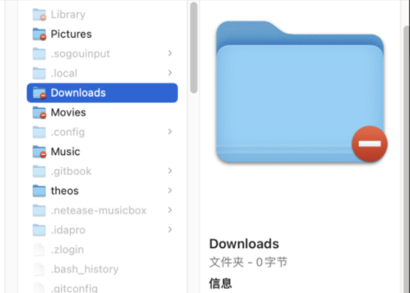

### 正常情况下，直接打开备份文件 Backups.backupdb 中的文件时，会有下面这种提示，显示权限有问题

解决方案： 第一种：

1. 打开 `终端` 应用
2. 输入 `sudo /System/Library/CoreServices/Finder.app/Contents/MacOS/Finder`，输入电脑密码并敲回车
3. 选中 `访达`，右击选中 `新建访达窗口` 新的窗口即可访问其他电脑备份中的全部文件

> 原理是：使用 root 权限运行 Finder，获得操作文件的权限

第二种：

1. 打开 `终端` 应用
2. 执行 `sudo vsdbutil -d /Volumes/TimeMachineVolume`， TimeMachineVolume 指的是备份硬盘的名字
3. 输入密码并回车后，Finder 可以正常浏览所有备份文件

> 原理是：通过命令设置 TimeMachineVolume“忽略所有权”