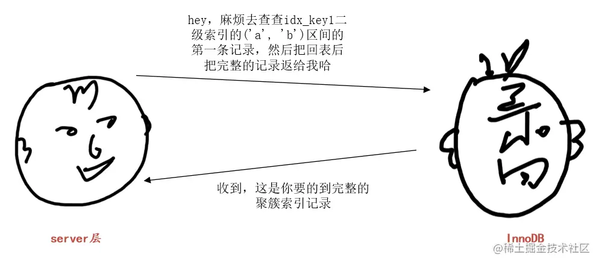
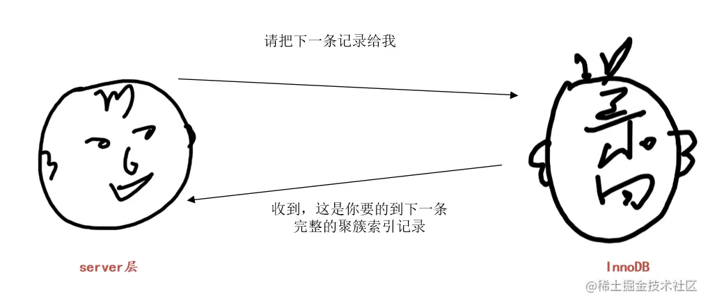

#dev/mysql

[MySQL 的架构](MySQL%20的架构.md)

- server 层负责处理一些通用的事情，诸如连接管理、SQL 语法解析、分析执行计划之类的东西
- 存储引擎层负责具体的数据存储，诸如数据是存储到文件上还是内存里，具体的存储格式是什么样的之类的。我们现在基本都使用 InnoDB 存储引擎，其他存储引擎使用的非常少了，所以我们也就不涉及其他存储引擎了。

---

MySQL 中一条 SQL 语句的执行是通过 server 层和存储引擎层的多次交互才能得到最终结果的。比方说下边这个查询：

```Java
CREATE TABLE t (
    id INT UNSIGNED NOT NULL AUTO_INCREMENT,
    key1 VARCHAR(100),
    common_field VARCHAR(100),
    PRIMARY KEY (id),
    KEY idx_key1 (key1)
) Engine=InnoDB CHARSET=utf8;

SELECT * FROM t WHERE key1 > 'a' AND key1 < 'b' AND common_field != 'a';
```

server 层会分析到上述语句可以使用下边两种方案执行：

- 方案一：使用全表扫描
- 方案二：使用二级索引 `idx_key1`，此时需要扫描 `key1` 列值在 ('a', 'b') 之间的全部二级索引记录，并且每条二级索引记录都需要进行回表操作。

---

> **小贴士：**

[[MySQL Server 层成本判断]]

---

server 层会分析上述两个方案哪个成本更低，然后选取成本更低的那个方案作为执行计划。然后就调用存储引擎提供的接口来真正的执行查询了。

这里假设采用方案二，也就是使用二级索引 `idx_key1` 执行上述查询。那么 server 层和存储引擎层的对话可以如下所示：



server 层：“hey，麻烦去查查 `idx_key1` 二级索引的 ('a', 'b') 区间的第一条记录，然后把回表后把完整的记录返给我哈”

InnoDB：“收到，这就去查”，然后 InnoDB 就通过 `idx_key1` 二级索引对应的 B+ 树，快速定位到扫描区间 ('a', 'b') 的第一条二级索引记录，然后进行回表，得到完整的聚簇索引记录返回给 server 层。

[MySQL 的聚镞索引](MySQL%20的聚镞索引.md)

> **小贴士：**

此处将记录发送给客户端其实是发送到本地的网络缓冲区，缓冲区大小由 net_buffer_length 控制，默认是 16KB 大小。等缓冲区满了才真正发送网络包到客户端。



InnoDB：“收到，这就去查”。InnoDB 根据记录的 `next_record` 属性找到 `idx_key1` 的 ('a', 'b') 区间的下一条二级索引记录，然后进行回表操作，将得到的完整的聚簇索引记录返回给 server 层。

> **小贴士：**  
不论是聚簇索引记录还是二级索引记录，都包含一个称作 `next_record` 的属性，各个记录根据 `next_record` 连成了一个链表，并且链表中的记录是按照键值排序的（对于聚簇索引来说，键值指的是主键的值，对于二级索引记录来说，键值指的是二级索引列的值）。

… 然后就不停的重复上述过程。

直到：

也就是直到 InnoDB 发现根据二级索引记录的 `next_record` 获取到的下一条二级索引记录不在 ('a', 'b') 区间中，就跟 server 层说：“好了，('a', 'b') 区间没有下一条记录了”  
server 层收到 InnoDB 说的没有下一条记录的消息，就结束查询。

## Limit 逻辑

[[MySQL 语句的执行顺序]]

```Java
SELECT * FROM t ORDER BY key1 LIMIT 5000, 1;
```

如果使用 idx_key1 执行上述查询，那么 MySQL 会这样处理：

- server 层向 InnoDB 要第 1 条记录，InnoDB 从 `idx_key1` 中获取到第一条二级索引记录，然后进行回表操作得到完整的聚簇索引记录，然后返回给 server 层。server 层准备将其发送给客户端，此时发现还有个 `LIMIT 5000, 1` 的要求，意味着符合条件的记录中的第 5001 条才可以真正发送给客户端，所以在这里先做个统计，我们假设 server 层维护了一个称作 `limit_count` 的变量用于统计已经跳过了多少条记录，此时就应该将 `limit_count` 设置为 `1`。
- server 层再向 InnoDB 要下一条记录，InnoDB 再根据二级索引记录的 `next_record` 属性找到下一条二级索引记录，再次进行回表得到完整的聚簇索引记录返回给 server 层。server 层在将其发送给客户端的时候发现 `limit_count` 才是 `1`，所以就放弃发送到客户端的操作，将 `limit_count` 加 `1`，此时 `limit_count` 变为了 `2`
- … 重复上述操作
- 直到 `limit_count` 等于 5000 的时候，server 层才会真正的将 InnoDB 返回的完整聚簇索引记录发送给客户端。

从上述过程中我们可以看到，由于 MySQL 中是在实际向客户端发送记录前才会去判断 LIMIT 子句是否符合要求，所以如果使用二级索引执行上述查询的话，意味着要进行 5001 次**[回表](https://zhuanlan.zhihu.com/p/401198674)**操作。

什么叫回表呢？

[在Mysql中，什么是回表，什么是覆盖索引，索引下推？](https://zhuanlan.zhihu.com/p/401198674)