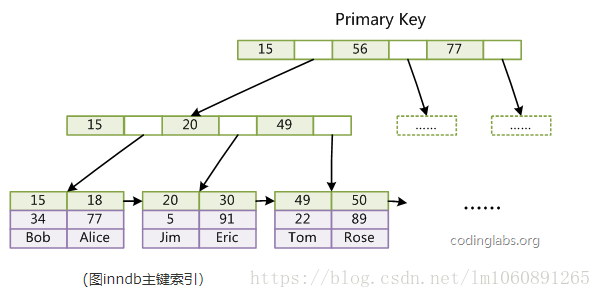
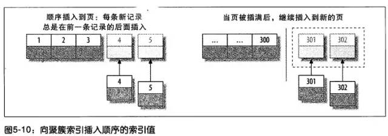
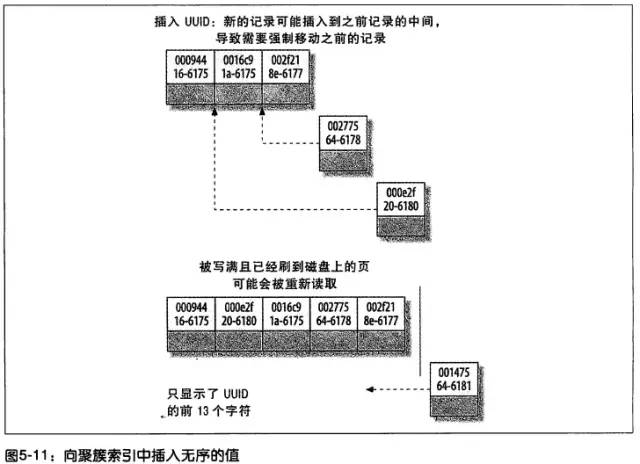
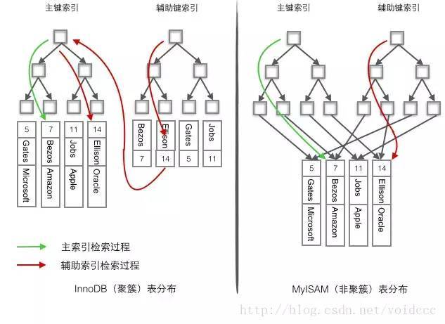

#dev/mysql

# MySQL 的聚镞索引

### **聚簇索引 (聚集索引)**

聚簇索引就是 **按照每张表的主键构造一颗 B+ 树，同时叶子节点中存放的就是整张表的行记录数据，也将聚集索引的叶子节点称为数据页。**

这个特性决定了索引组织表中数据也是索引的一部分，每张表只能拥有一个聚簇索引。

Innodb 通过主键聚集数据，如果没有定义主键，innodb 会选择非空的唯一索引代替。如果没有这样的索引，innodb 会隐式的定义一个主键来作为聚簇索引。

**聚簇索引的优缺点**

优点：

1. 数据访问更快，因为聚簇索引将索引和数据保存在同一个 B+ 树中，因此从聚簇索引中获取数据比非聚簇索引更快。即支持覆盖索引

  [尤其是当回表的数据量比较大的时候，经常会出现 MySQL 优化器认为回表查询代价过高而不选择索引的情况。](https://flowus.cn/dfb37f03-f04d-4e28-90b9-e9c7203fa526)

1. 聚簇索引对于主键的排序查找和范围查找速度非常快　　

缺点：

1. 插入速度严重依赖于插入顺序，按照主键的 **顺序插入** 是最快的方式，否则将会出现页分裂 `(Page Split)`，严重影响性能。

  - 建议在大量插入新行后，选在负载较低的时间段，通过 `OPTIMIZE TABLE` 优化表，因为必须被移动的行数据可能造成碎片。使用独享表空间可以弱化碎片
  - 表因为使用 UUID（随机 ID）作为主键，使数据存储稀疏  

  - 推荐 **自增的 ID 列为主键**

1. **更新主键的代价很高**，因为将会导致被更新的行移动，如上图。因此，对于 InnoDB 表，我们一般定义主键为不可更新。　　　　
2. 二级索引访问需要两次索引查找，第一次找到主键值，第二次根据主键值找到行数据。

---

> Tips:

1. 如果表定义了主键，则 PK 就是聚集索引；
2. 如果表没有定义主键，则第一个非空唯一索引（not NULL unique）列是聚集索引；
3. 否则，InnoDB 会创建一个隐藏的 row-id 作为聚集索引；

---

### **辅助索引（非聚簇索引）**

在 **聚簇索引之上创建的索引称之为辅助索引**，辅助索引访问数据总是需要二次查找。非聚簇索引都是辅助索引，像复合索引、前缀索引、唯一索引。辅助索引叶子节点存储的不再是行的物理位置，而是主键值。通过辅助索引首先找到的是主键值，再通过主键值找到数据行的数据页，再通过数据页中的 Page Directory 找到数据行。

Innodb 辅助索引的叶子节点并 **不包含行记录的全部数据**，叶子节点除了包含键值外，还包含了相应行数据的聚簇索引键。

辅助索引的存在不影响数据在聚簇索引中的组织，所以一张表可以有多个辅助索引。在 Innodb 中有时也称辅助索引为二级索引。

**辅助索引使用主键作为 " 指针 " 而不是使用地址值作为指针**

即 **使用主键值当作指针会让辅助索引占用更多的空间，换来的好处是 InnoDB 在移动行时无须更新辅助索引中的这个 " 指针 " 也就是说行的位置**

### 索引查询过程

聚簇索引的叶子节点存放的是主键值和数据行，**支持覆盖索引**；二级索引的叶子节点存放的是主键值或指向数据行的指针。

由于节子节点 (数据页) 只能按照一颗 B+ 树排序，故 **一张表只能有一个聚簇索引**。辅助索引的存在不影响聚簇索引中数据的组织，所以一张表可以有多个辅助索引

[聚簇索引与非聚簇索引（也叫二级索引）--最清楚的一篇讲解](https://cloud.tencent.com/developer/article/1541265)

[聚簇索引和非聚簇索引(通俗易懂 言简意赅)](https://www.cnblogs.com/jiawen010/p/11805241.html)