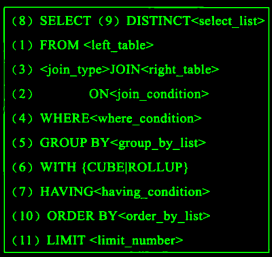

#dev/mysql  

## 总结

MySQL 的语句执行顺序 MySQL 的语句一共分为 11 步，如下图所标注的那样，最先执行的总是 FROM 操作，最后执行的是 LIMIT 操作。其中每一个操作都会产生一张虚拟的表，这个虚拟的表作为一个处理的输入，只是这些虚拟的表对用户来说是透明的，但是只有最后一个虚拟的表才会被作为结果返回。如果没有在语句中指定某一个子句，那么将会跳过相应的步骤。



```Plain Text
下面我们来具体分析一下查询处理的每一个阶段

FORM: 对FROM的左边的表和右边的表计算笛卡尔积。产生虚表VT1
ON: 对虚表VT1进行ON筛选，只有那些符合<join-condition>的行才会被记录在虚表VT2中。
JOIN： 如果指定了OUTER JOIN（比如left join、 right join），那么保留表中未匹配的行就会作为外部行添加到虚拟表VT2中，产生虚拟表VT3, rug from子句中包含两个以上的表的话，那么就会对上一个join连接产生的结果VT3和下一个表重复执行步骤1~3这三个步骤，一直到处理完所有的表为止。
WHERE： 对虚拟表VT3进行WHERE条件过滤。只有符合<where-condition>的记录才会被插入到虚拟表VT4中。
GROUP BY: 根据group by子句中的列，对VT4中的记录进行分组操作，产生VT5.
CUBE | ROLLUP: 对表VT5进行cube或者rollup操作，产生表VT6.
HAVING： 对虚拟表VT6应用having过滤，只有符合<having-condition>的记录才会被 插入到虚拟表VT7中。
SELECT： 执行select操作，选择指定的列，插入到虚拟表VT8中。
DISTINCT： 对VT8中的记录进行去重。产生虚拟表VT9.
ORDER BY: 将虚拟表VT9中的记录按照<order_by_list>进行排序操作，产生虚拟表VT10.
LIMIT：取出指定行的记录，产生虚拟表VT11, 并将结果返回。
```

## 图解

这是一条标准的查询语句:  


这是我们实际上SQL执行顺序：

- 我们先执行from,join来确定表之间的连接关系，得到初步的数据
- where对数据进行普通的初步的筛选
- group by 分组
- 各组分别执行having中的普通筛选或者聚合函数筛选。
- 然后把再根据我们要的数据进行select，可以是普通字段查询也可以是获取聚合函数的查询结果，如果是集合函数，select的查询结果会新增一条字段
- 将查询结果去重distinct
- 最后合并各组的查询结果，按照order by的条件进行排序


### **数据的关联过程**

数据库中的两张表


### **from&join&where**

用于确定我们要查询的表的范围，涉及哪些表。

选择一张表，然后用join连接

```
from table1 join table2 on table1.id=table2.id
```

选择多张表，用where做关联条件

```
from table1,table2 where table1.id=table2.id
```

我们会得到满足关联条件的两张表的数据，不加关联条件会出现笛卡尔积。


### **group by**

按照我们的分组条件，将数据进行分组，但是不会筛选数据。

比如我们按照即id的奇偶分组


### **having&where**

having中可以是普通条件的筛选，也能是聚合函数。而where只能是普通函数，一般情况下，有having可以不写where，把where的筛选放在having里，SQL语句看上去更丝滑。

##### 使用where再group by

先把不满足where条件的数据删除，再去分组

##### 使用group by再having

先分组再删除不满足having条件的数据，这两种方法有区别吗，几乎没有！

举个例子：

`100/2=50`，此时我们把100拆分`(10+10+10+10+10…)/2=5+5+5+…+5=50`,只要筛选条件没变，即便是分组了也得满足筛选条件，所以where后group by 和group by再having是不影响结果的！

不同的是，having语法支持聚合函数,其实having的意思就是针对每组的条件进行筛选。我们之前看到了普通的筛选条件是不影响的，但是having还支持聚合函数，这是where无法实现的。

当前数据分组情况

  
执行having的筛选条件，可以使用聚合函数。筛选掉工资小于各组平均工资的`having salary<avg(salary)`


### **select**

分组结束之后，我们再执行select语句，因为聚合函数是依赖于分组的，聚合函数会单独新增一个查询出来的字段，这里用紫色表示，这里我们两个id重复了，我们就保留一个id，重复字段名需要指向来自哪张表，否则会出现唯一性问题。最后按照用户名去重。

```
select employee.id,distinct name,salary, avg(salary)
```


将各组having之后的数据再合并数据。


### **order by**

最后我们执行order by 将数据按照一定顺序排序，比如这里按照id排序。如果此时有limit那么查询到相应的我们需要的记录数时，就不继续往下查了。


### **limit**

记住limit是最后查询的，为什么呢？假如我们要查询年级最小的三个数据，如果在排序之前就截取到3个数据。实际上查询出来的不是最小的三个数据而是前三个数据了，记住这一点。

我们如果limit 0,3窃取前三个数据再排序，实际上最少工资的是2000,3000,4000。你这里只能是4000,5000,8000了。


> 转自：blog.csdn.net/weixin_44141495/article/details/108744720