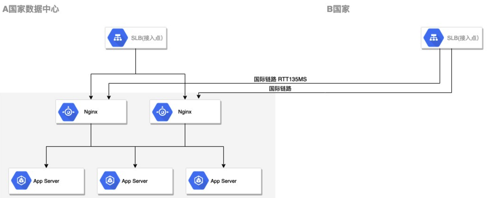

> SLB(Serverless Load Balancing) ： GCP(Google Cloud Platform)中的 SLB(Serverless Load Balancing)是一种无服务器的负载均衡服务。

线上希望通过接入提高 B 国家用户的访问体验，所以在 B 国家新增了一个谷歌云服务的接入点



在测试中发现，转发的延迟达到了 680ms,远远的超过了 134ms（假如连接不复用情况下，那么 2rtt 也只是 268ms）,经过排查，发现响应体约 90K,tcp 响应得分开 90 多个包传输，由于 tcp 各种问题，所以总时间拖长了（后续再总结）
 **但是** 
- A 国家数据中心请求是能够正常压缩，相同的数据压缩后只有 8KB
- B 国家数据中心请求压缩异常

# 问题排查

--------------------

排查 Nginx

```plain
gzip             on;
gzip_comp_level  6;
gzip_min_length  1k;
gzip_buffers     4 8k;
gzip_disable     "MSIE [1-6]\.(?!.*SV1)";
gzip_types       text/plain application/x-javascript text/css application/xml text/javascript application/javascript application/json;
```

> [!note]  
> 这个配置 `gzip_min_length` 的参数值为正整数，单位为字节，也可用 k 表示千字节，比如写成 1024 与 1k 都可以，效果是一样的，表示当资源大于1k时才进行压缩，资源大小取响应头中的 `Content-Length` 进行比较，经测试如果响应头不存在 `Content_length` 信息，该限制参数对于这个响应包是不起作用的；另外此处参数值不建议设的太小，因为设的太小，一些本来很小的文件经过压缩后反而变大了，官网没有给出建议值，在此建议1k起，因为小于1k的也没必要压缩，并根据实际情况来调整设定。
> 
> 而它的默认值是 20 字节。 如果为 0，那就全部都压缩。
> 
> 而我们设置的是 1000 字节，也就是如果请求返回的 `Content-Length` 大于 1000， 那么就会启用 gzip 压缩并返回。 如果小于 1000， 那么就会正常返回。
> 
> 事实上上面第二张图之所以没有返回的时候用 gzip 压缩，就是因为 response 返回的 `Content-Length` 小于 1000， 所以不会启用 gzip 压缩返回。

通过抓包对比两个数据中心的请求

发现谷歌 SLB 会在代理的请求增加以下 Header 标明是 http 的

> Via: 1.1 google

通过查阅 nginx 配置,发现有个可疑的配置

[gzip_proxied](http://nginx.org/en/docs/http/ngx_http_gzip_module.htmgzip_proxied): nginx 默认是不会对于来自代理服务器的请求就行压缩的，原因可参考 [what are the options for the gzip proxied for](https://stackoverflow.com/questions/33375304/what-are-the-options-for-the-gzip-proxied-directive-for),简而言之

1. 客户端支持的压缩协议不同，假如把响应 gzip 放在代理服务器上，代理服务器还是得解压了再按客户端支持的协议重新下发，或者客户端不支持或者不期望压缩。
2. 对于某些内容，得基于未压缩的文件进行处理，例如视频的播放或者断点下载，客户端发起 [range](https://developer.mozilla.org/zh-CN/docs/Web/HTTP/Range_requests#%E5%8D%95%E4%B8%80%E8%8C%83%E5%9B%B4) 请求，服务端依然得基于未压缩的内容进行处理。

所以 Nginx 对于有 via 头的，默认则不压缩是合理的

对于该情况，由于对外的都是 api 接口，不存在 cache 的情况，所以添加以下配置就解决了

```plain
gzip_proxied: any
```

web 到处充斥着压缩，那么 nginx 是怎么判断什么时候需要处理的？tomcat 呢？ 各个工具间是怎么保证不产生冲突的。

# 先总结

-----------------

1. nginx 提供了一系列的 gzip\_ 前缀的配置控制是否压缩，tomcat 由于角色是 web 容器，所以提供的选项只有 3 个，连 compress level 都不提供。
2. 在配置启用压缩的前提下，还会检查 [Content-Encoding](https://developer.mozilla.org/zh-CN/docs/Web/HTTP/Headers/Content-Encoding) 是否存在 gzip 值，对于 nginx 会更加的详细，会判断多额外的边界条件，例如 gzip, q=0 也禁用。从这点上看，nginx+tomcat 的这种主流架构，尽管同时启用了 gzip,都不会产生冲突。
3. http 针对压缩有 accept-encoding（针对请求）以及 Content-Encoding(针对响应)，所以服务器间压缩前判断是否 Content-Encoding 已经标明该内容以及压缩了，则不进行重复压缩。

# 源码解析

--------------------

### nginx 源码

#### ngx\_http\_gzip\_filter\_module.c

```c
static ngx_int_t
ngx_http_gzip_header_filter(ngx_http_request_t *r)
{
    ngx_table_elt_t       *h;
    ngx_http_gzip_ctx_t   *ctx;
    ngx_http_gzip_conf_t  *conf;

    conf = ngx_http_get_module_loc_conf(r, ngx_http_gzip_filter_module);

	 // 以下是不进行zip的条件
	 // 没配置gzip: one
    if (!conf->enable
        //gzip 状态错误
        || (r->headers_out.status != NGX_HTTP_OK
            && r->headers_out.status != NGX_HTTP_FORBIDDEN
            && r->headers_out.status != NGX_HTTP_NOT_FOUND)
        // Content-Encoding header不为空，
        || (r->headers_out.content_encoding
            && r->headers_out.content_encoding->value.len)
        //响应体的大小小于设置的的最小长度 gzip_min_length
        || (r->headers_out.content_length_n != -1
            && r->headers_out.content_length_n < conf->min_length)
        //Content-Type不在配置gzip_types范围内
        || ngx_http_test_content_type(r, &conf->types) == NULL
        //没响应体
        || r->header_only)
    {
        return ngx_http_next_header_filter(r);
    }
    
    r->gzip_vary = 1;

    if (!r->gzip_tested) {
    	  //下面说明
        if (ngx_http_gzip_ok(r) != NGX_OK) {
            return ngx_http_next_header_filter(r);
        }
    //当gzip_tested为true时表示已经判断过是否支持gzip, gzip_ok则为判断的结果
    } else if (!r->gzip_ok) {
        return ngx_http_next_header_filter(r);
    }
}
```

#### ngx\_http\_core\_module

```c

ngx_int_t
ngx_http_gzip_ok(ngx_http_request_t *r)
{
    time_t                     date, expires;
    ngx_uint_t                 p;
    ngx_array_t               *cc;
    ngx_table_elt_t           *e, *d, *ae;
    ngx_http_core_loc_conf_t  *clcf;

    r->gzip_tested = 1;

	 //是否是nginx子请求，可参考nginx batch api
    if (r != r->main) {
        return NGX_DECLINED;
    }

    //客户端没传 Accept-Encoding
    ae = r->headers_in.accept_encoding;
    if (ae == NULL) {
        return NGX_DECLINED;
    }

    if (ae->value.len < sizeof("gzip") - 1) {
        return NGX_DECLINED;
    }

    /*
     * test first for the most common case "gzip,...":
     *   MSIE:    "gzip, deflate"
     *   Firefox: "gzip,deflate"
     *   Chrome:  "gzip,deflate,sdch"
     *   Safari:  "gzip, deflate"
     *   Opera:   "gzip, deflate"
     */

	 //Accept-Encoding 不包含合法 gzip
    if (ngx_memcmp(ae->value.data, "gzip,", 5) != 0
        && ngx_http_gzip_accept_encoding(&ae->value) != NGX_OK)
    {
        return NGX_DECLINED;
    }

    clcf = ngx_http_get_module_loc_conf(r, ngx_http_core_module);

	 //是否旧的不兼容的 UA
    if (r->headers_in.msie6 && clcf->gzip_disable_msie6) {
        return NGX_DECLINED;
    }

    if (r->http_version < clcf->gzip_http_version) {
        return NGX_DECLINED;
    }

    if (r->headers_in.via == NULL) {
        goto ok;
    }

    p = clcf->gzip_proxied;

	 //gzip_proxied: off //默认情况
    if (p & NGX_HTTP_GZIP_PROXIED_OFF) {
        return NGX_DECLINED;
    }

	 //gzip_proxied: any
    if (p & NGX_HTTP_GZIP_PROXIED_ANY) {
        goto ok;
    }

	 //gzip_proxied: auth
    if (r->headers_in.authorization && (p & NGX_HTTP_GZIP_PROXIED_AUTH)) {
        goto ok;
    }

    e = r->headers_out.expires;

    if (e) {

		 //对应 enables compression if a response header includes the “Expires” field with a value that disables caching;
        if (!(p & NGX_HTTP_GZIP_PROXIED_EXPIRED)) {
            return NGX_DECLINED;
        }

        expires = ngx_parse_http_time(e->value.data, e->value.len);
        if (expires == NGX_ERROR) {
            return NGX_DECLINED;
        }

        d = r->headers_out.date;

        if (d) {
            date = ngx_parse_http_time(d->value.data, d->value.len);
            if (date == NGX_ERROR) {
                return NGX_DECLINED;
            }

        } else {
            date = ngx_time();
        }

        if (expires < date) {
            goto ok;
        }

        return NGX_DECLINED;
    }

    cc = &r->headers_out.cache_control;

	 //gzip_proxied: no-cache/no-store/private等各种情况
    if (cc->elts) {

        if ((p & NGX_HTTP_GZIP_PROXIED_NO_CACHE)
            && ngx_http_parse_multi_header_lines(cc, &ngx_http_gzip_no_cache,
                                                 NULL)
               >= 0)
        {
            goto ok;
        }

        if ((p & NGX_HTTP_GZIP_PROXIED_NO_STORE)
            && ngx_http_parse_multi_header_lines(cc, &ngx_http_gzip_no_store,
                                                 NULL)
               >= 0)
        {
            goto ok;
        }

        if ((p & NGX_HTTP_GZIP_PROXIED_PRIVATE)
            && ngx_http_parse_multi_header_lines(cc, &ngx_http_gzip_private,
                                                 NULL)
               >= 0)
        {
            goto ok;
        }

        return NGX_DECLINED;
    }

	 //no_last_modified
    if ((p & NGX_HTTP_GZIP_PROXIED_NO_LM) && r->headers_out.last_modified) {
        return NGX_DECLINED;
    }

 	 //no_etag
    if ((p & NGX_HTTP_GZIP_PROXIED_NO_ETAG) && r->headers_out.etag) {
        return NGX_DECLINED;
    }

ok:

    r->gzip_ok = 1;

    return NGX_OK;
}
```

### Tomcat 源码

##### tomcat 针对压缩，[可配置的选项](https://tomcat.apache.org/tomcat-8.5-doc/config/http.html) 相对较少

- compressibleMimeType
- compression
- compressionMinSize  
    基本就是允许什么 content-type 的进行压缩，启用压缩的大小是多少

#### org.apache.coyote.http11.Http11Processor

以 http1.1 协议为例，主要逻辑为,以下只说明压缩后会改变了什么 http 的头部

```java
if (useCompression) {
    outputBuffer.addActiveFilter(outputFilters[Constants.GZIP_FILTER]);
    
    //设置了 Content-Encoding
    headers.setValue("Content-Encoding").setString("gzip");
}
// If it might be compressed, set the Vary header
if (isCompressible) {
    // Make Proxies happy via Vary (from mod_deflate)
    MessageBytes vary = headers.getValue("Vary");
    if (vary == null) {
        // Add a new Vary header
        headers.setValue("Vary").setString("Accept-Encoding");
    } else if (vary.equals("*")) {
        // No action required
    } else {
        // Merge into current header
        headers.setValue("Vary").setString(
                vary.getString() + ",Accept-Encoding");
    }
}
```
