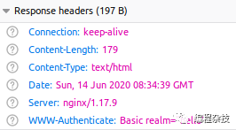
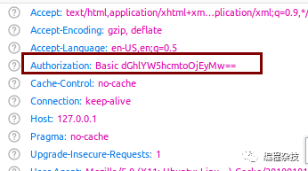

> 更多认证方式见 [Http 认证方式](Http%20认证方式.md) 

当使用 nginx 搭建 web 服务，需要限制访问，又没有构建用户系统的必要，可使用 nginx 进行简单配置

> [ngx\_http\_auth\_basic\_module - Nginx中文文档](https://docshome.gitbook.io/nginx-docs/he-xin-gong-neng/http/ngx_http_auth_basic_module)

auth_basic 模块是 nginx 中比较简单的模块。地址在 http://nginx.org/en/docs/http/ngx_http_auth_basic_module.html 。我们通过分析这个模块的代码，不仅知道如何使用，还可以了解到 http 认证的实现。该模块支持 http 认证和验证的功能。支持两个配置。

```
location / {
    // 在浏览器弹框里的提示语
    auth_basic           "hello";
    // 用户输入密码后，以password文件来判断是否正确
    auth_basic_user_file /usr/local/nginx/conf/password;
}
```

密码文件格式如下

```
name:password
```

**1 模块使用**
----------

我们先看一下使用。该模块对密码格式有一定的要求，具体可参考文档。我们可以在 https://tool.lu/htpasswd/网站生成密码 ，然后粘贴到我们的密码文件。比如我的机器下，密码文件路径是/usr/local/nginx/conf/password。内容是

```
theanarkh:MTTuFPm3y4m2o
```

打开浏览器输入[服务器](https://cloud.tencent.com/product/cvm?from_column=20420&from=20420)地址。查看回包。



这时候浏览器会弹出一个输入用户名密码的弹框。用户输入后，浏览器再次请求服务器。我们看一下请求头



这时候 nginx 会到 password 文件去匹配用户输入的用户名和密码。完成验证。

**2 模块原理**
----------

auth_basic 模块是 http 模块，首先看一下配置

```
static ngx_command_t  ngx_http_auth_basic_commands[] = {

    { ngx_string("auth_basic"),
      NGX_HTTP_MAIN_CONF|NGX_HTTP_SRV_CONF|NGX_HTTP_LOC_CONF|NGX_HTTP_LMT_CONF
                        |NGX_CONF_TAKE1,
      ngx_http_set_complex_value_slot,
      NGX_HTTP_LOC_CONF_OFFSET,
      offsetof(ngx_http_auth_basic_loc_conf_t, realm),
      NULL },

    { ngx_string("auth_basic_user_file"),
      NGX_HTTP_MAIN_CONF|NGX_HTTP_SRV_CONF|NGX_HTTP_LOC_CONF|NGX_HTTP_LMT_CONF
                        |NGX_CONF_TAKE1,
      ngx_http_auth_basic_user_file,
      NGX_HTTP_LOC_CONF_OFFSET,
      offsetof(ngx_http_auth_basic_loc_conf_t, user_file),
      NULL },

      ngx_null_command
};

static ngx_http_module_t  ngx_http_auth_basic_module_ctx = {
    NULL,                                  /* preconfiguration */
    ngx_http_auth_basic_init,              /* postconfiguration */

    NULL,                                  /* create main configuration */
    NULL,                                  /* init main configuration */

    NULL,                                  /* create server configuration */
    NULL,                                  /* merge server configuration */

    ngx_http_auth_basic_create_loc_conf,   /* create location configuration */
    ngx_http_auth_basic_merge_loc_conf     /* merge location configuration */
};

ngx_module_t  ngx_http_auth_basic_module = {
    NGX_MODULE_V1,
    &ngx_http_auth_basic_module_ctx,       /* module context */
    ngx_http_auth_basic_commands,          /* module directives */
    NGX_HTTP_MODULE,                       /* module type */
    NULL,                                  /* init master */
    NULL,                                  /* init module */
    NULL,                                  /* init process */
    NULL,                                  /* init thread */
    NULL,                                  /* exit thread */
    NULL,                                  /* exit process */
    NULL,                                  /* exit master */
    NGX_MODULE_V1_PADDING
};
```

了解 nginx 模块基本原理的同学对上面的代码应该会比较熟悉。这里就不具体分析。我们从 nginx 初始化流程到用户请求的顺序分析上面的函数。 1 ngx\_http\_auth\_basic\_create\_loc\_conf

```
static void *
ngx_http_auth_basic_create_loc_conf(ngx_conf_t *cf)
{
    ngx_http_auth_basic_loc_conf_t  *conf;

    conf = ngx_pcalloc(cf->pool, sizeof(ngx_http_auth_basic_loc_conf_t));
    if (conf == NULL) {
        return NULL;
    }

    return conf;
}
```

该函数代码比较简单，就是创建一个和该模块相关的结构体。

```
struct {
    ngx_http_complex_value_t  *realm;
    ngx_http_complex_value_t   user_file;
} ngx_http_auth_basic_loc_conf_t
```

这个结构体就是保存 nginx 支持的两个配置。该函数在 nginx 初始化的时候调用，目的是创建保存配置的结构体。 2 注册 nginx access 阶段的钩子

```
static ngx_int_t
ngx_http_auth_basic_init(ngx_conf_t *cf)
{
    ngx_http_handler_pt        *h;
    ngx_http_core_main_conf_t  *cmcf;

    cmcf = ngx_http_conf_get_module_main_conf(cf, ngx_http_core_module);

    h = ngx_array_push(&cmcf->phases[NGX_HTTP_ACCESS_PHASE].handlers);
    if (h == NULL) {
        return NGX_ERROR;
    }

    *h = ngx_http_auth_basic_handler;

    return NGX_OK;
}
```

从代码中我们可以看到该模块是属于 nginx 11 个阶段的 access 阶段。即在 nginx 处理用户请求时，会调用 ngx\_http\_auth\_basic\_handler 函数。

3 解析 nginx，保存用户的配置在 nginx 启动后，解析到 auth\_basic，auth\_basic\_user\_file 这两个配置时，就保存到 ngx\_http\_auth\_basic\_loc\_conf\_t 结构体。比如解析和保存 auth\_basic\_user_file 配置。

```
static char *
ngx_http_auth_basic_user_file(ngx_conf_t *cf, ngx_command_t *cmd, void *conf)
{
    ngx_http_auth_basic_loc_conf_t *alcf = conf;

    ngx_str_t                         *value;
    ngx_http_compile_complex_value_t   ccv;

    if (alcf->user_file.value.data) {
        return "is duplicate";
    }

    value = cf->args->elts;

    ngx_memzero(&ccv, sizeof(ngx_http_compile_complex_value_t));
    // 保存用户配置的文件路径
    ccv.cf = cf;
    ccv.value = &value[1];
    ccv.complex_value = &alcf->user_file;
    ccv.zero = 1;
    ccv.conf_prefix = 1;

    if (ngx_http_compile_complex_value(&ccv) != NGX_OK) {
        return NGX_CONF_ERROR;
    }

    return NGX_CONF_OK;
}
```

4 处理用户请求该模块的 ngx\_http\_auth\_basic\_handler 是处理用户请求的，我们看一下核心逻辑。

```
// 解析http请求头中的验证字段
rc = ngx_http_auth_basic_user(r);
// http请求头没有验证头Basic
if (rc == NGX_DECLINED) {
    return ngx_http_auth_basic_set_realm(r, &realm);
 }
 // 有验证字段则，打开nginx.conf里配置的文件，然后读取内容
 fd = ngx_open_file(user_file.data, NGX_FILE_RDONLY, NGX_FILE_OPEN, 0);
 ngx_read_file(&file, buf + left, NGX_HTTP_AUTH_BUF_SIZE - left,offset);
 // 验证用户输入
 ngx_http_auth_basic_crypt_handler(r, &pwd, &realm);
```

我们首先看 ngx\_http\_auth\_basic\_user(解析 http 验证头)，然后看 ngx\_http\_auth\_basic\_crypt\_handler(验证 http 验证头)。最后 ngx\_http\_auth\_basic\_set\_realm(没有 http 验证头或者校验失败则返回浏览器401和验证头)，

```
ngx_int_t
ngx_http_auth_basic_user(ngx_http_request_t *r)
{
    ngx_str_t   auth, encoded;
    ngx_uint_t  len;
    // 请求头的authorization字段的值，格式Authorization: Basic xxx
    encoded = r->headers_in.authorization->value;
    // 绕过Basic ，指向密码第一个字符和最后一个字符
    encoded.len -= sizeof("Basic ") - 1;
    encoded.data += sizeof("Basic ") - 1;
    // 忽略密码前置空格，后置空格由http解析器处理了
    while (encoded.len && encoded.data[0] == ' ') {
        encoded.len--;
        encoded.data++;
    }
    // auth保存解码后的内容
    auth.len = ngx_base64_decoded_length(encoded.len);
    auth.data = ngx_pnalloc(r->pool, auth.len + 1);
      // Authorization头的内容是经过了base64编码的，这里decode一下
    if (ngx_decode_base64(&auth, &encoded) != NGX_OK) {
        r->headers_in.user.data = (u_char *) "";
        return NGX_DECLINED;
    }

    auth.data[auth.len] = '\0';
    // 找到第一个冒号，Authorization头的内容格式是user:password
    for (len = 0; len < auth.len; len++) {
        if (auth.data[len] == ':') {
            break;
        }
    }
    // 没有冒号说明是不合法格式
    if (len == 0 || len == auth.len) {
        r->headers_in.user.data = (u_char *) "";
        return NGX_DECLINED;
    }
    // 保存http解析结果，用于后面验证
    r->headers_in.user.len = len;
    r->headers_in.user.data = auth.data;
    r->headers_in.passwd.len = auth.len - len - 1;
    r->headers_in.passwd.data = &auth.data[len + 1];

    return NGX_OK;
}
```

上面函数就是 http Authorization 头的解析逻辑，我们从中可以看到 http 验证的一些实现原理。解析完后就开始验证。

```
static ngx_int_t
ngx_http_auth_basic_crypt_handler(ngx_http_request_t *r, ngx_str_t *passwd,
    ngx_str_t *realm)
{
    ngx_int_t   rc;
    u_char     *encrypted;

    rc = ngx_crypt(r->pool, r->headers_in.passwd.data, passwd->data,
                   &encrypted);
    // 验证成功，则返回ok
    if (ngx_strcmp(encrypted, passwd->data) == 0) {
        return NGX_OK;
    }
    // 否则设置验证头，返回给浏览器
    return ngx_http_auth_basic_set_realm(r, realm);
}
```

该函数就是从用户配置的文件中，解析出一系列的用户名和密码，然后和浏览器传过来的值对比。如何校验失败或者浏览器没有设置验证头，则 nginx 返回验证头和 401 错误码。

```
static ngx_int_t
ngx_http_auth_basic_set_realm(ngx_http_request_t *r, ngx_str_t *realm)
{
    size_t   len;
    u_char  *basic, *p;
    // 设置http协议回头中的头
    r->headers_out.www_authenticate = ngx_list_push(&r->headers_out.headers);

    len = sizeof("Basic realm=\"\"") - 1 + realm->len;

    basic = ngx_pnalloc(r->pool, len);
    p = ngx_cpymem(basic, "Basic realm=\"", sizeof("Basic realm=\"") - 1);
    p = ngx_cpymem(p, realm->data, realm->len);
    *p = '"';

    r->headers_out.www_authenticate->hash = 1;
    ngx_str_set(&r->headers_out.www_authenticate->key, "WWW-Authenticate");
    r->headers_out.www_authenticate->value.data = basic;
    r->headers_out.www_authenticate->value.len = len;

    return NGX_HTTP_UNAUTHORIZED;
}
```

该函数设置 http 回包里的验证头。告诉浏览器，需要输入用户名和密码。

总结：ngx\_http\_auth\_basic\_module 模块实现了 http 认证和验证的功能，我们通过分析该模块的代码，不仅了解了如何使用 nginx，还可以了解到 http 认证和校验的实现原理。