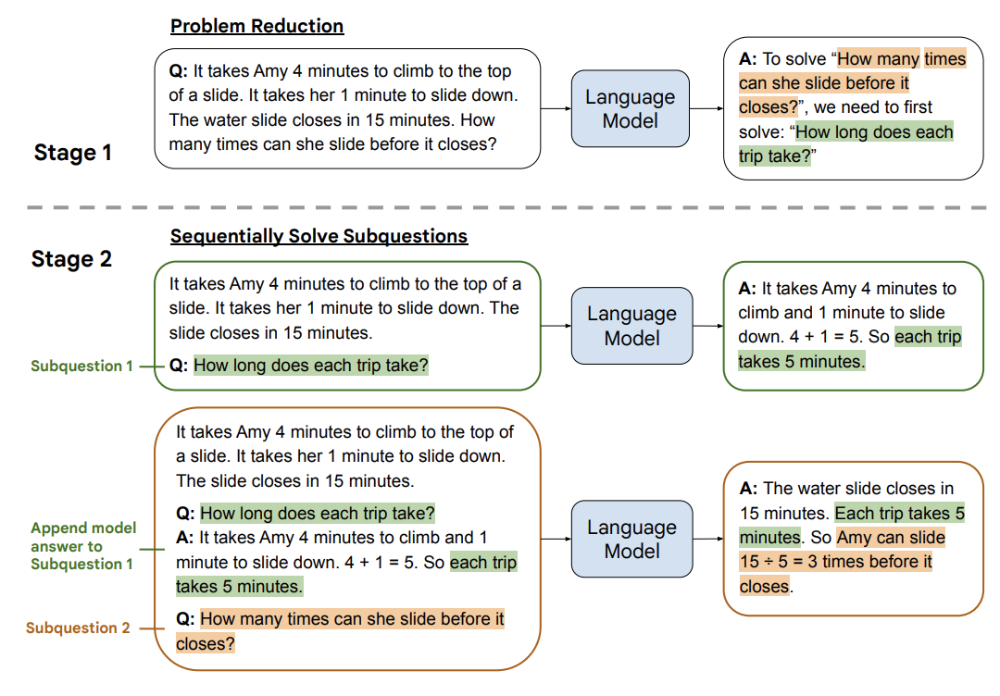
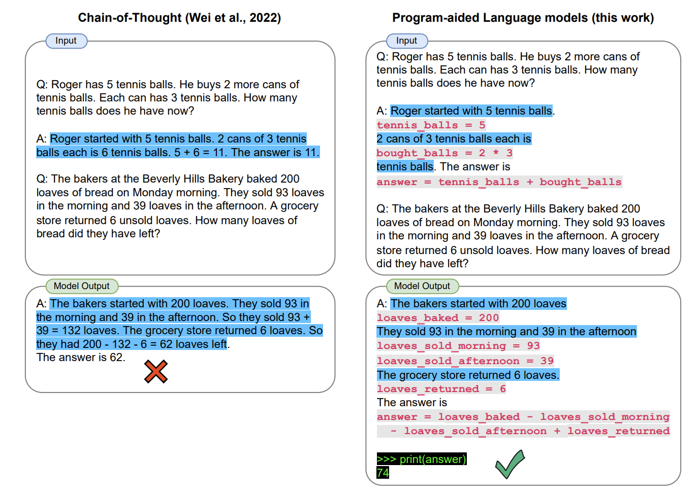

> [Best practices for prompt engineering with OpenAI API | OpenAI Help Center](https://help.openai.com/en/articles/6654000-best-practices-for-prompt-engineering-with-openai-api)

### Prompt 里最好包含完整的信息 

这个是对结果影响最大的因素。比如如果你想让 AI 写一首关于 OpenAI 的诗。

Less effective prompt：

```
Write a poem about OpenAI.
```

它生成的答案可能就会很宽泛，而更好的方式是增加更多的信息。

Better prompt：

```
Write a short inspiring poem about OpenAI, focusing on the recent DALL-E product launch (DALL-E is a text to image ML model) in the style of a {famous poet}
```

### Prompt 最好简洁易懂，并减少歧义 

这个比较好理解，即使你跟人说话，说一些简单的短句，对方也会更容易听懂，AI 也是这样。另外，在 prompt 里也需要减少一些歧义，少用模棱两可的词语。

比如像这个就很不明确，什么叫 not too much more？

```
The description for this product should be fairly short, a few sentences only, and not too much more.
```

更好的 prompt 是这样的，明确告知要写多少句话，就比较明确：

```
Use a 3 to 5 sentence paragraph to describe this product.
```

# 基本技巧

## 1. To do and Not To do

OpenAI 的 API [最佳实践文档](https://help.openai.com/en/articles/6654000-best-practices-for-prompt-engineering-with-openai-api) 里，提到了一个这样的最佳实践：

> **Instead of just saying what not to do, say what to do instead. 与其告知模型不能干什么，不妨告诉模型能干什么。**  
我自己的实践是，虽然现在最新的模型已经理解什么是 Not Todo ，但如果你想要的是明确的答案，加入更多限定词，告知模型能干什么，回答的效率会更高，且预期会更明确。还是电影推荐这个案例，你可以加入一个限定词：

```
Recommend a movie from the top global trending movies to me.
```

当然并不是 Not Todo 就不能用，如果：

- 你已经告知模型很明确的点，然后你想缩小范围，那增加一些 Not Todo 会提高不少效率。
- 你是在做一些探索，比如你不知道如何做精准限定，你只知道不要什么。那可以先加入 Not Todo ，让 AI 先发散给你答案，当探索完成后，再去优化 prompt。

以下是一些场景案例，我整理了两个 Less Effective（不太有效的） 和 Better（更好的） prompt，你可以自己尝试下这些案例：

| 场景 | Less Effective | Better | 原因 |
| --- | --- | --- | --- |
| 推荐雅思必背英文单词 | Please suggest me some essential words for IELTS | Please suggest me 10 essential words for IELTS | 后者 prompt 会更加明确，前者会给大概 20 个单词。这个仍然有提升的空间，比如增加更多的限定词语，像字母 A 开头的词语。 |
| 推荐香港值得游玩的地方 | Please recommend me some places to visit in Hong Kong. Do not recommend museums. | Please recommend me some places to visit in Hong Kong including amusement parks. | 后者的推荐会更准确高效一些，但如果你想进行一些探索，那前者也能用。 |

## 2. 增加示例

如果你无法用文字准确解释问题或指示，你可以在 prompt 里增加一些案例：

```
Suggest three names for an animal that is a superhero.  
  
Animal: Cat  
Names: Captain Sharpclaw, Agent Fluffball, The Incredible Feline  
Animal: Dog  
Names: Ruff the Protector, Wonder Canine, Sir Barks-a-Lot  
Animal: Horse  
Names:  

```

增加例子后，Output 的结果就更酷一些，或者说是接近我想要的那种风格的名字。

```
Gallop Guardian, Equine Avenger, The Mighty Stallion  
```

## 3. 引导词，引导模型输出特定语言代码

在代码生成场景里，有一个小技巧，上面提到的案例，其 prompt 还可以继续优化，在 prompt 最后，增加一个代码的引导，告知 AI 我已经将条件描述完了，你可以写代码了。

Better：

```
Create a MySQL query for all students in the Computer Science Department:Table departments, columns = [DepartmentId, DepartmentName]Table students, columns = [DepartmentId, StudentId, StudentName]SELECT
```

在 prompt 的最后增加 SELECT 可以很好地提示 AI 可以写 SQL 代码了。

同样的道理，如果你想让 AI 写 Python 代码，那 import 会是比较好的提示。但需要注意，这个只是告知 AI 可以写代码了，并不能告知 AI 写何种代码，你仍然需要在 prompt 里增加提示，告知 AI 要生成何种语言的代码。

## 4. 增加 Role（角色）或人物

前面提到的改写例子，我在 prompt 里加了 Role 让其更易于阅读，这个优化方法是 OK 的。也很常用，比如你想将你写的 Email 改得更商务，则只需要加 business 相关的词即可。

我再介绍一个更有效的技巧，就是在 prompt 里增加一些 role（角色）相关的内容，让 AI 生成的内容更符合你的需求。

比如还是上面那个 rewrite 的例子，我在例子前加入这样的一段话，我让 AI 假设自己是一个小学老师，并且很擅长将复杂的内容转变成 7、8 岁小朋友也能听懂的话，然后再改写这段话：

```
You are a primary school teacher who can explain complex content to a level that a 7 or 8 year old child can understand. Please rewrite the following sentences to make them easier to understand:
```

Output 就变成了下面这样。不管是用词，还是语法，看起来都更容易懂了。

```
OpenAI is a place where people work on making computers really smart. It's like a lab where they do research to make computers do amazing things! They want the computers to be really friendly and helpful to people. They use one of the most powerful computers in the world to do this research. A bunch of really rich and smart people gave money to start this lab. One of them is Elon Musk, but he left in 2018. Another really big company, Microsoft, gave them a lot of money too.
```

另外除了增加角色外，还能让 AI 模拟某个人，比如让 AI 以 David Foster Wallace 的风格改写上述那段话：

```
Imagine you are the famous writer David Foster Wallace, please rewrite this sentences.
```

Output 是这样的：

```
As David Foster Wallace, I might rewrite these sentences to sound more like this:

OpenAI is a lab that studies something called artificial intelligence, which is like when computers can do things that normally only humans can do. They have a big computer that's one of the most powerful in the world, and they're trying to make sure the AI they create is friendly and helpful. The lab was started in 2015 in a city called San Francisco, and a bunch of important people gave them a lot of money to do their research. One of those people was Elon Musk, who stopped working there but still gives them money, and Microsoft also gave them a lot of money recently.
```

关于这个技巧的应用，以及如何更好地使用 AI 提升写作能力，建议各位阅读 Nat Eliason 的 [Using ChatGPT as a Writing Coach](https://blog.nateliason.com/p/chatgpt-writing-coach)，他使用 ChatGPT 辅助其写作，就用到了上述的技巧。

## 5. 使用特殊符号指令和需要处理的文本分开

可以用 **“”“** 将指令和文本分开。根据我的测试，如果你的文本有多段，增加 **”“”** 会提升 AI 反馈的准确性（这个技巧来自于 OpenAI 的 API [最佳实践文档](https://help.openai.com/en/articles/6654000-best-practices-for-prompt-engineering-with-openai-api)）

> [!NOTE]+  
> 感谢 CraneHuang6 的提醒，这里还能用 ### 符号区隔，不过我一般会用 “”“ ，因为我有的时候会用 # 作为格式示例，太多 # 的话 prompt 会看起来比较晕 😂

像我们之前写的 prompt 就属于 Less effective prompt。为什么呢？据我的测试，主要还是 AI 不知道什么是指令，什么是待处理的内容，用符号分隔开来会更利于 AI 区分。

```
Please summarize the following sentences to make them easier to understand.OpenAI is an American artificial intelligence (AI) research laboratory consisting of the non-profit OpenAI Incorporated (OpenAI Inc.) and its for-profit subsidiary corporation OpenAI Limited Partnership (OpenAI LP). OpenAI conducts AI research with the declared intention of promoting and developing a friendly AI. OpenAI systems run on the fifth most powerful supercomputer in the world.[5][6][7] The organization was founded in San Francisco in 2015 by Sam Altman, Reid Hoffman, Jessica Livingston, Elon Musk, Ilya Sutskever, Peter Thiel and others,[8][1][9] who collectively pledged US$1 billion. Musk resigned from the board in 2018 but remained a donor. Microsoft provided OpenAI LP with a $1 billion investment in 2019 and a second multi-year investment in January 2023, reported to be $10 billion.[10]
```

Better prompt:

```
Please summarize the following sentences to make them easier to understand.
Text: """
OpenAI is an American artificial intelligence (AI) research laboratory consisting of the non-profit OpenAI Incorporated (OpenAI Inc.) and its for-profit subsidiary corporation OpenAI Limited Partnership (OpenAI LP). OpenAI conducts AI research with the declared intention of promoting and developing a friendly AI. OpenAI systems run on the fifth most powerful supercomputer in the world.[5][6][7] The organization was founded in San Francisco in 2015 by Sam Altman, Reid Hoffman, Jessica Livingston, Elon Musk, Ilya Sutskever, Peter Thiel and others,[8][1][9] who collectively pledged US$1 billion. Musk resigned from the board in 2018 but remained a donor. Microsoft provided OpenAI LP with a $1 billion investment in 2019 and a second multi-year investment in January 2023, reported to be $10 billion.[10]
"""
```

## 6. 明确格式

### 案例一

假设你想让 AI 总结一篇非常非常长的文章，并且按照特定格式给你总结，那你可以在文章前面明确输出的格式（为了不占用太多显示空间，我省略了正文内容，你可以在 OpenAI 的 Playground 看到 [完整案例](https://platform.openai.com/playground/p/3U5Wx7RTIdNNC9Fg8fc44omi)）。它的意思其实是让 ChatGPT 按 Topic 总结，每个 Topic 里按照无序列表（就是里面那个 -）将每个 Topic 的主要观点罗列出来。

```
Summarize the main points of the following speech
Use the following format:
Topic 1: <topic_name_1>
- <point_1>
..
Topic 2: <topic_name_2>
- <point_1>
..
Topic 10: ..

Text: """
Thank you so much, Fred, for that lovely introduction. And thanks to the Atlantic Council for hosting me today.

The course of the global economy over the past two years has been shaped by COVID-19 and our efforts to fight the pandemic. It’s now evident, though, that the war between Russia and Ukraine has redrawn the contours of the world economic outlook. Vladimir Putin’s unprovoked attack on Ukraine and its people is taking a devastating human toll, with lives tragically lost, families internally displaced or becoming refugees, and communities and cities destroyed.
…

"""
```

Output 是这样的：

```
Topic 1: The war in Ukraine
- The war is taking a human toll with lives lost, families displaced, and communities destroyed
- The Biden administration is committed to holding Russia accountable
- The war has violated international law and is a challenge to the international order

Topic 2: The global economy
- The war is having negative impacts on the global economy, including higher commodity prices and inflation
- The IMF and World Bank will be focused on helping developing countries weather the impacts of the war
- The ultimate outcome for the global economy depends on the path of the war
```

### 案例二

比如问 " 这里的债券 duration 是多少?". 正常 GPT 模型的答案可能是 " 债券 duration 是 4 年 " 或 "duration 4 年 "。 ChatGPT 的回答不稳定, 且不方便继续处理。

解法: 

- 我们可以通过这个技巧，让模型理解我们预期的格式。并在此基础上, 为了方便自动化, 让模型输出特定的结构化答案 (比如 JSON/Markdown 等)。 
- 也可以方便集成更多的额外要求, 比如增加一个 "confidence level", 并通过 prompt 的形式指定这些数值的格式。

```
{context}  
Question: What is bond duration mentioned here.  
Answer template (Valid JSON format):  
{{  
"duration": $duration_numeric_value_in_year,  
"confidence_level": $answer_confidence_level_high_modrate_or_low,  
}}  
Answer:
```

## 7. 在示例里加入特定符号，处理特殊情况

```
Q: Who is Batman?
A: Batman is a fictional comic book character.

Q: What is torsalplexity?
A: ?

Q: What is Devz9?
A: ?

Q: Who is George Lucas?
A: George Lucas is American film director and producer famous for creating Star Wars.

Q: What is the capital of California?
A: Sacramento.

Q: What is Kozar-09?
A:
```

# 进阶说明

## Prompt 框架

### Basic Prompt Framework

查阅了非常多关于 ChatGPT prompt 的框架资料，我目前觉得写得最清晰的是 Elavis Saravia [总结](https://github.com/dair-ai/Prompt-Engineering-Guide/blob/main/guides/prompts-intro.md) 的框架，他认为一个 prompt 里需包含以下几个元素：

- **Instruction（必须）：** 指令，即你希望模型执行的具体任务。
- **Context（选填）：** 背景信息，或者说是上下文信息，这可以引导模型做出更好的反应。
- **Input Data（选填）：** 输入数据，告知模型需要处理的数据。
- **Output Indicator（选填）：** 输出指示器，告知模型我们要输出的类型或格式。

只要你按照这个框架写 prompt ，模型返回的结果都不会差。

当然，你在写 prompt 的时候，并不一定要包含所有 4 个元素，而是可以根据自己的需求排列组合。比如拿前面的几个场景作为例子：

- 推理：Instruction + Context + Input Data
- 信息提取：Instruction + Context + Input Data + Output Indicator

### CRISPE Prompt Framework

另一个我觉得很不错的 Framework 是 [Matt Nigh](https://github.com/mattnigh/ChatGPT3-Free-Prompt-List) 的 CRISPE Framework，这个 framework 更加复杂，但完备性会比较高，比较适合用于编写 prompt 模板。CRISPE 分别代表以下含义：

- **CR：** Capacity and Role（能力与角色）。你希望 ChatGPT 扮演怎样的角色。
- **I：** Insight（洞察力），背景信息和上下文（坦率说来我觉得用 Context 更好）。
- **S：** Statement（指令），你希望 ChatGPT 做什么。
- **P：** Personality（个性），你希望 ChatGPT 以什么风格或方式回答你。
- **E：** Experiment（尝试），要求 ChatGPT 为你提供多个答案。

以下是这几个参数的例子：  

| Step | Example                                                                                                                                                                                                                                                       |
| ---- | ------------------------------------------------------------------------------------------------------------------------------------------------------------------------------------------------------------------------------------------------------------- |
| CR   | Act as an expert on software development on the topic of machine learning frameworks, and an expert blog writer.                                                                                                                                              |
|I|The audience for this blog is technical professionals who are interested in learning about the latest advancements in machine learning.|
|S|Provide a comprehensive overview of the most popular machine learning frameworks, including their strengths and weaknesses. Include real-life examples and case studies to illustrate how these frameworks have been successfully used in various industries.|
|P|When responding, use a mix of the writing styles of Andrej Karpathy, Francois Chollet, Jeremy Howard, and Yann LeCun.|
|E|Give me multiple different examples.|

## 自洽性

自洽性（Self-consistency）是对 CoT 的一个补充，它不仅仅生成一个思路链，而是生成多个思路链，然后取多数答案作为最终答案。

在下面的图中，左侧的提示是使用少样本思路链范例编写的。使用这个提示，独立生成多个思路链，从每个思路链中提取答案，通过“边缘化推理路径”来计算最终答案。实际上，这意味着取多数答案。


## 知识生成

For example, say you want to write a small blog post about some animal, like [Spirit bears](https://en.wikipedia.org/wiki/Kermode_bear). Before asking the LLM to write the blog post, you can ask it to generate some facts about Spirit bears. This will help the LLM write a more informative blog post. There are two simple ways of going about this.  
例如，假设你想写一篇关于一些动物的小博文，比如灵熊。在要求 LLM 撰写博文之前，您可以要求它生成一些关于灵熊的事实。这将有助于 LLM 撰写内容更丰富的博文。有两种简单的方法可以解决这个问题。

#### Single prompt approach[​](#single -prompt-approach "Direct link to Single prompt approach") 单一提示方法

------------------------------------------------------------------------------------------------

The first approach asks the LLM to generate knowledge then write the post, all with a single prompt.  
第一种方法要求 LLM 生成知识然后撰写帖子，所有这些都需要一个提示。

```
Generate 4 facts about the Kermode bear, then use these facts to write a short blog post using the information:  
The Kermode bear, also known as the spirit bear, is a rare subspecies of the American black bear that is found in the coastal regions of British Columbia, Canada.   
1. The Kermode bear is a unique subspecies of the American black bear, with approximately 10% of the population having white fur.   
2. The Kermode bear is a symbol of the First Nations people of British Columbia, and is seen as a spirit animal.   
3. The Kermode bear is an important part of the ecosystem, helping to disperse seeds and maintain the balance of the forest.   
4. The Kermode bear is a protected species, and its population is monitored closely by the provincial government.  
  
The Kermode bear is a unique and special animal that is found in the coastal regions of British Columbia, Canada. Approximately 10% of the population of this subspecies of the American black bear have white fur, making them a rare sight. The Kermode bear is a symbol of the First Nations people of British Columbia, and is seen as a spirit animal. It is an important part of the ecosystem, helping to disperse seeds and maintain the balance of the forest. The Kermode bear is a protected species, and its population is monitored closely by the provincial government. It is a beautiful and majestic animal, and it is important that we do our part to protect and conserve this species.  

```

#### Dual prompt approach[​](#dual -prompt-approach "Direct link to Dual prompt approach") 双提示方法

-----------------------------------------------------------------------------------------

In this approach, we first prompt the LLM to generate facts about the bear:  
在这种方法中，我们首先提示 LLM 生成关于熊的事实：

```
Generate 10 facts about the Kermode bear:  
1. The Kermode bear, also known as the Spirit Bear, is a rare subspecies of the American black bear found in British Columbia, Canada.  
  
2. The Kermode bear has a unique white or cream-colored coat, which is caused by a recessive gene.  
  
3. The Kermode bear is a symbol of hope and renewal for the First Nations people of British Columbia.  
  
4. The Kermode bear is a protected species and is listed as a species of special concern by the Committee on the Status of Endangered Wildlife in Canada.  

```

Then, we feed that information into another prompt to write the blog post:  
然后，我们将该信息输入到另一个提示中以撰写博文：

```
1. The Kermode bear, also known as the Spirit Bear, is a rare subspecies of the American black bear found in British Columbia, Canada.  
  
2. The Kermode bear has a unique white or cream-colored coat, which is caused by a recessive gene.  
  
3. The Kermode bear is a symbol of hope and renewal for the First Nations people of British Columbia.  
  
4. The Kermode bear is a protected species and is listed as a species of special concern by the Committee on the Status of Endangered Wildlife in Canada.  
  
Use the above facts to write a one paragraph blog post about the Kermode bear:  
  
  
The Kermode bear, also known as the Spirit Bear, is a rare subspecies of the American black bear found in British Columbia, Canada. This unique bear has a white or cream-colored coat, caused by a recessive gene, and is a symbol of hope and renewal for the First Nations people of British Columbia. The Kermode bear is a protected species and is listed as a species of special concern by the Committee on the Status of Endangered Wildlife in Canada, making it an important part of the region's biodiversity.  
```

I recommend this second approach since it can produce longer content more reliably.  
我推荐第二种方法，因为它可以更可靠地生成更长的内容。

#### 原理解析

虽然上述用例与最初介绍生成知识的方式类似，但并不完全相同。以下内容涵盖了引入该方法的更多技术背景。它遵循我们上面看到的两个中间步骤（知识生成和知识集成）模式。


##### Knowledge Generation[​](#knowledge -generation "Direct link to Knowledge Generation") 知识生成

In the knowledge generation step, the LLM is asked to generate a set of facts about the **question** . The LLM is prompted in few-shot fashion as seen below. M different completions are generated using this same prompt (similar to the self-consistency approach).  
在知识生成步骤中，LLM 被要求生成一组关于问题的事实。如下所示，LLM 以少量方式提示。使用相同的提示生成 M 个不同的补全（类似于自洽方法）。


Generated Knowledge Example (Liu et al.)  
生成的知识示例（Liu 等人）

##### Knowledge Integration[​](#knowledge -integration "Direct link to Knowledge Integration") 知识整合

接下来，我们生成“知识增强”问题并提示 LLM 与他们一起获得最终答案。理解这一点的最简单方法是看一个例子。

假设我们试图回答“大多数袋鼠都有 <mask\> 肢体”这个问题。假设在知识生成步骤我们生成了 2 个知识（M=2）：

- Knowledge 1: `Kangaroos are marsupials that live in Australia.` 知识一： `Kangaroos are marsupials that live in Australia.`
- Knowledge 2: `Kangaroos are marsupials that have 5 limbs.` 知识二： `Kangaroos are marsupials that have 5 limbs.`

Now, we concatenate each knowledge with the question to generate knowledge augmented questions:  
现在，我们将每个知识与问题连接起来以生成知识增强问题：

- Knowledge Augmented Question 1: `Most Kangaroos have <mask> limbs. Kangaroos are marsupials that live in Australia.`  
    知识增广题一： `Most Kangaroos have <mask> limbs. Kangaroos are marsupials that live in Australia.`

- Knowledge Augmented Question 2: `Most Kangaroos have <mask> limbs. Kangaroos are marsupials that have 5 limbs.`  
    知识增广题 2： `Most Kangaroos have <mask> limbs. Kangaroos are marsupials that have 5 limbs.`

We then prompt the LLM with these knowledge augmented questions and get the final answer proposals:  
然后我们用这些知识扩充问题提示 LLM 并获得最终答案建议：

- Answer 1: `4` 回答一： `4`
- Answer 2: `5` 回答 2： `5`

We select the answer with the highest probability as the final answer. The highest probability could be the softmax probability of the answer token, or the log probability of the answer token(s).  
我们选择概率最高的答案作为最终答案。最高概率可能是答案标记的 softmax 概率，或答案标记的对数概率。

## 最少到最多 - Least to Most Prompting - LtM

> Least to Most 提示 (LtM) [1](https://learnprompting.org/docs/intermediate/least_to_most#fn-1) 通过首先将问题分解为子问题然后解决每个子问题，使 CoT 提示更进一步。这是一种受现实世界儿童教育策略启发的技术。

正如在 CoT 提示中一样，要解决的问题被分解为一组相互构建的子问题。在第二步中，这些子问题被一个一个地解决。与思维链相反，先前子问题的解决方案被输入到尝试解决下一个问题的提示中。



## PAL Models

PAL Models，全称为 Program-Aided Language Models。需要各位注意，这个方法，真的非常高级，甚至我觉得有点 Hack，而且经过我的多次测试，我觉得以 ChatGPT 目前的能力，已经不再需要使用这个方法。

但我在很多 PE 的教程里都有看到这个方法，所以我这里就简单介绍一下，这个方法来自于 2022 年，Luyu Gao [等人的研究](https://arxiv.org/pdf/2211.10435.pdf)，根据他们的研究，在 LLM 模型中，即使使用了前面提到的 Chain of Thought 的方法，也未必能拿到答案，论文中使用的 prompt 是这样的：

```
Q: Roger has 5 tennis balls. He buys 2 more cans oftennis balls. Each can has 3 tennis balls. How manytennis balls does he have now?A: Roger started with 5 tennis balls. 2 cans of 3 tennisballs each is 6 tennis balls. 5 + 6 = 11. The answer is 11.Q: The bakers at the Beverly Hills Bakery baked 200loaves of bread on Monday morning. They sold 93 loavesin the morning and 39 loaves in the afternoon. A grocerystore returned 6 unsold loaves. How many loaves ofbread did they have left?
```

论文里提到，当年他们的模型的 Output 是这样的：

```
A: The bakers started with 200 loaves. They sold 93 inthe morning and 39 in the afternoon. So they sold 93 +39 = 132 loaves. The grocery store returned 6 loaves. Sothey had 200 - 132 - 6 = 62 loaves left. The answer is 62.
```

如果你现在将这个 prompt 输入到最新的 ChatGPT 答案已经是正确的：

```
A: The bakers baked 200 loaves of bread. They sold 93 + 39 = 132 loaves. After the grocery store returned 6 unsold loaves, the bakery had 200 - 132 + 6 = 74 loaves of bread left. The answer is 74.
```

当年 Luyu Gao 的解决方法是在 prompt 里引入代码，并引导模型使用代码来运算和思考，最后答案就是正确的：



# 参考资料

- [Best practices for prompt engineering with OpenAI API | OpenAI Help Center](https://help.openai.com/en/articles/6654000-best-practices-for-prompt-engineering-with-openai-api)
- [🧭 ChatGPT 学习导航 | Learning Prompt](https://learningprompt.wiki/docs/chatgpt-learning-path)
