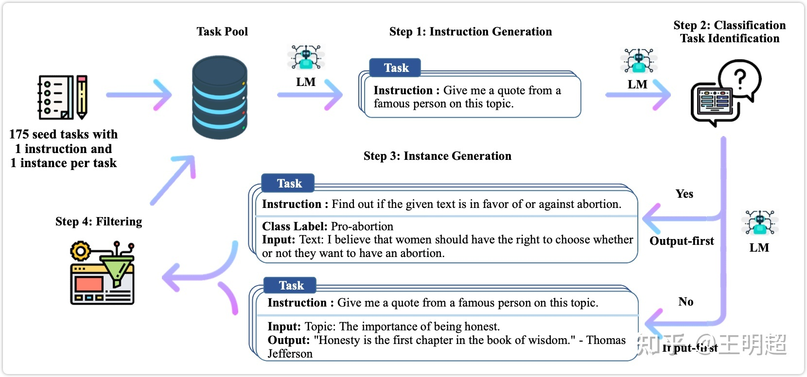
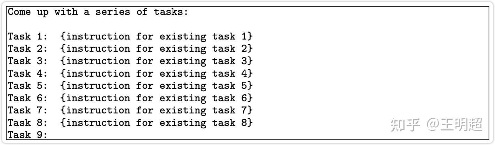
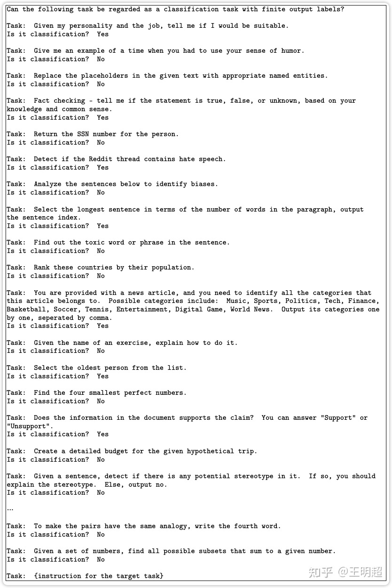
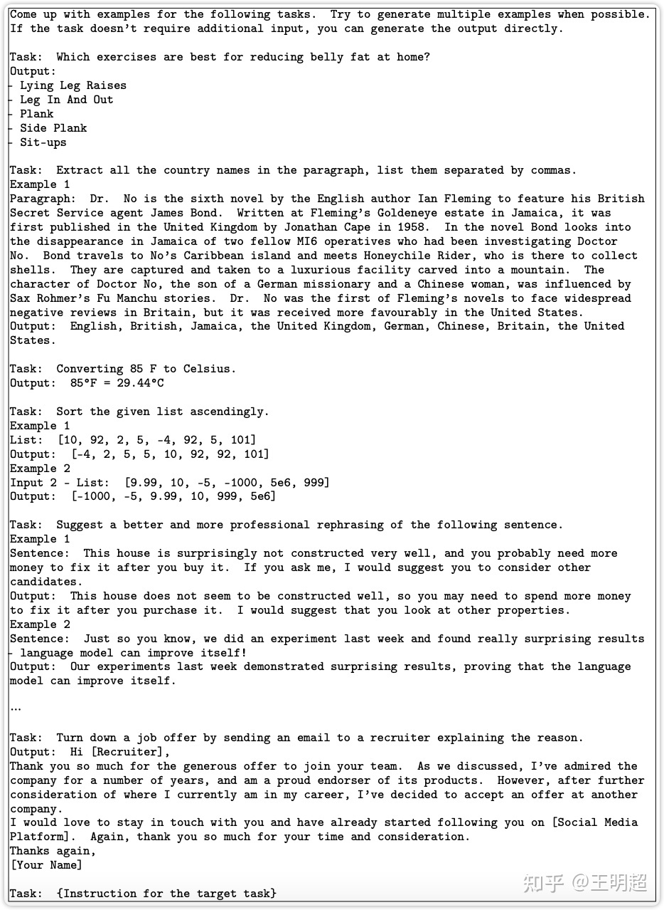
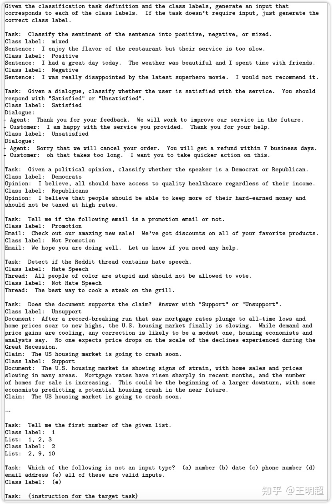
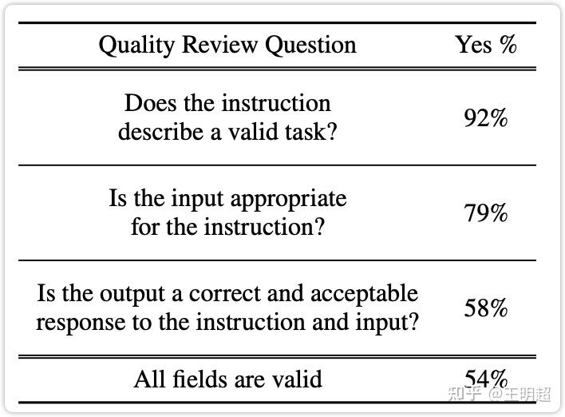
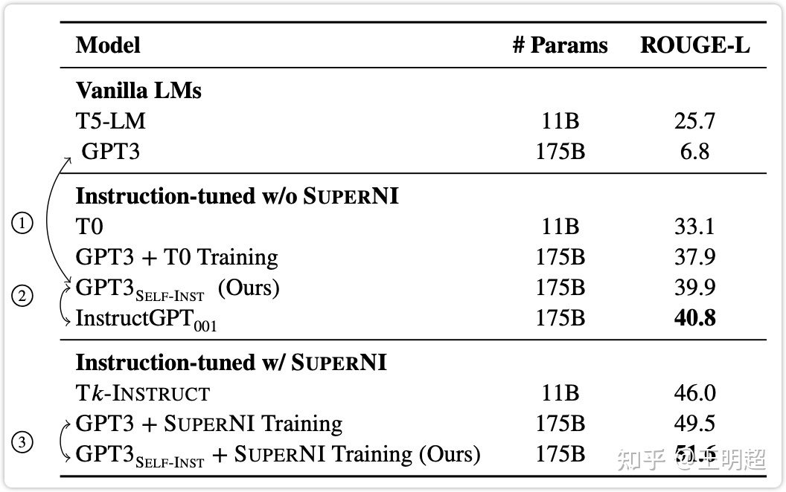
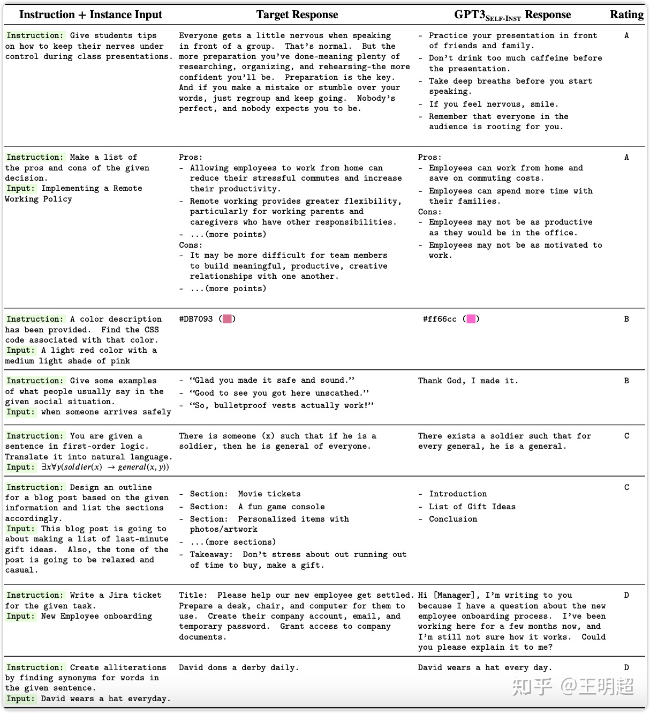
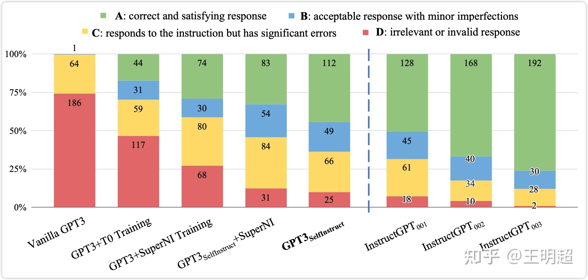

> 自行构建数据集

看到有新闻说 stanford 使用 LLaMA 的 7B 模型做了指令微调之后发布了一个 Stanford Alpaca，据说效果还不错，想去测试一下效果，不过官网已经不能访问了，链接为：[https://crfm.stanford.edu/alpaca/](https://crfm.stanford.edu/alpaca/)，写该文章时这个链接还无法访问。

看其介绍说是参考的 Self-Instruct 这篇论文的思路，所以就找来了这篇论文看了一下，在这里做一下记录。

> 论文链接: [https://arxiv.org/abs/2212.10560](https://arxiv.org/abs/2212.10560)  
> github 链接: [https://github.com/yizhongw/self-instruct](https://github.com/yizhongw/self-instruct)

1、本文的主要贡献
---------

* 提出了一种框架：Self-Instruct，该框架可以使用最少的人工标注，生成大量的用于 instruct-tuning 的数据；
* 本文中通过多个实验验证了上述方法的有效性；
* 本文发布了 52K 的使用上述方法获取的用于 instruct-tuning 的数据集，以及一份人工手动编写的新任务的数据集；

2、相关工作
------

原论文中介绍了相当多的相关工作，这里只捡感兴趣的一项记录在这里：

* **指令生成（Instruction generation）** 相关的研究：
* [Large Language Models Are Human-Level Prompt Engineers](https://arxiv.org/abs/2211.01910)
* [Guess the Instruction! Flipped Learning Makes Language Models Stronger Zero-Shot Learners](https://arxiv.org/abs/2210.02969)
* [Explaining Patterns in Data with Language Models via Interpretable Autoprompting](https://arxiv.org/abs/2210.01848)
* [Instruction Induction: From Few Examples to Natural Language Task Descriptions](https://arxiv.org/abs/2205.10782)

3、Approach
----------

人工标注指令数据集一般有两个步骤：

* 创造各种新颖的任务，即 instruct；
* 对上述每个任务编写正确的答案，即 complement；

这种人工标注数据的方式成本很高，下图 1 为本文提出的 self-instruct 框架，下面详细对该框架进行介绍。



### 3.1 指令数据集的定义

一般的，指令数据集中的一条数据包含（指令, 输入, 输出）这三部分，举个例子如下所示：

```text
指令：写一篇关于以下主题的文章
输入：校园安全
输出：校园安全是学校必须高度重视的问题，涉及到师生的生命财产安全。建立安全意识，制定严格的规章制度，加强安全巡查和应急预案，是确保校园安全的关键。
```

不过很多时候对于上述三部分中的 " 指令 " 和 " 输入 " 划分的不是那么清晰，比如下面这条数据基本可以认为和上述例子是相同的：

```text
指令：写一篇以校园安全为主题的文章
输出：校园安全是学校必须高度重视的问题，涉及到师生的生命财产安全。建立安全意识，制定严格的规章制度，加强安全巡查和应急预案，是确保校园安全的关键。
```

所以在本文的后续部分，指令数据集中的一条数据可能包含三部分（指令, 输入, 输出），也可能只有两部分（指令, 输出）。

再举个例子感受一下：

```text
指令：将下述中文翻译为英文
输入：中国的首都是北京。
输出：China's capital city is Beijing.
```

### 3.2 Self-Instruct

首先整体说明一下该方法的流程，大致有如下几个步骤：

1. 人工设计了 175 个表示不同任务的指令，并且给每条数据都编写了（指令, 输入, 输出）/（指令, 输出），将这 175 条数据作为种子池。
2. 使用模型生成新的指令；
3. 对该模型生成的指令判断是否分类任务；
4. 使用模型生成实例；
5. 对上述模型生成的数据进行过滤和后处理；
6. 将经过过滤和后处理的数据添加到种子池中；
7. 一直重复上述 2 到 6 步直到种子池有足够多的数据；

在上述步骤中有的比较简单，不再详述，下面对第 2 步到第 5 步分别详细描述。

### 3.2.1 生成指令

生成指令时，先从种子池中随机抽取 6 个人工编写的指令，再随机抽取 2 个之前步骤中模型生成的指令，总共 8 个指令。以如下表 6 的模版格式组织之后，输入给模型，让模型输出一个新的指令。



### 3.2.2 判断指令是否属于分类任务

这里之所以需要判断指令是否属于分类任务，主要是因为在给该指令生成实例时，分类任务与非分类任务使用的 prompt 模版是不同的，这个在下一部分 **3.2.3 生成实例** 里面会详细说明。

判断指令是否属于分类任务的操作如下：在种子池中随机挑选 12 条分类指令和 19 条非分类指令，然后加上新生成的指令，以下表 7 的模版格式组织之后，输入给模型，让模型输出新生成的指令是否分类任务。



### 3.2.3 生成实例

在给定了指令之后，生成实例的过程对 LLM 模型的效果要求是比较高的，所以最好选取效果比较好的 LLM。

然后在给定指令之后，生成（输入, 输出）这个实例对时还有两种策略。一种是先生成输入，后生成输出，即输入优先策略；另一种是先生成输出，后生成输入，即输出优先策略。

之所以会有输出优先的方式，是因为输入优先的方式在生成输入时，偏向于只生成一个标签，尤其是指令对应着分类任务时，其输入里面偏向于只生成一个类别。输出优先就是为了一定程度上缓解该问题。

**输入优先**

前面已经说过一条数据的样式可能是（指令, 输入, 输出），也可能是（指令, 输出）。另外，指令数据集的丰富度我们是希望越丰富越好，所以还允许出现一个指令，多个输入的数据，举例如下。在这个例子中，Task 对应的就是指令，然后这个指令有 2 对（输入, 输出）:

```text
Task: Sort the given list ascendingly.
Example 1
Input 1 - List: [10, 92, 2, 5, -4, 92, 5, 101]
Output: [-4, 2, 5, 5, 10, 92, 92, 101]
Example 2
Input 2 - List: [9.99, 10, -5, -1000, 5e6, 999]
Output: [-1000, -5, 9.99, 10, 999, 5e6]
```

然后具体生成实例的操作步骤为：在种子池中随机抽取 k 条数据，以如下的 prompt 模版的形式组合之后，输入给模型，让模型为最后的指令生成相应的实例。如下表 8 所示。



**输出优先**

对于分类任务，如果先生成文本，后生成标签，模型会偏向于生成比较单一的结果。所以对于分类任务，是先生成随机的标签，然后再生成该标签对应的文本。

具体的步骤和输入优先基本相同：在种子池中随机抽取 k 条在之前的步骤中已经标记为分类的数据，以如下的 prompt 模版的形式组合之后，输入给模型，让模型为最后的指令生成相应的实例。如下表 9 所示。可以看出都是先生成分类标签，再生成待分类的文本。



### 3.2.4 过滤以及后处理

* 为了数据的多样性，新生成的指令只有与种子池中的指令的 ROUGE-L 小于 0.7 时才会添加进入种子池；
* 排除一些无法被语言模型处理的指令，比如涉及图像、图片、图形的指令；
* 在给指令生成实例时，会过滤掉输入相同但是输出不同的实例；

4、生成的数据集质量分析
------------

使用指令数据集对模型做微调之后模型效果的好坏，很大程度上取决于这份指令数据集的质量如何，所以对于使用 Self-Instruct 方法生成的数据集作一下分析是很有必要的。在这部分从三个方面对生成的数据进行分析，这三个方面分别是：数据量、丰富程度、数据质量。

### 4.1 数据量

总共是 52K 的指令，和 82K 的实例；

待补充…

### 4.2 丰富程度

待补充…

### 4.3 数据质量

数据质量的评估方式：随机抽取 200 条指令，并给每个指令随机抽取一个实例，然后人工对该指令和实例进行标注评估，评估结果如下表 2 所示。

可以看出：

* 生成的指令有含义，能表示一个任务的占比为 92%；
* 给每个指令生成合适的输入的占比为 79%；
* 生成的输出是指令和输入的正确结果的占比为 58%；
* 指令、输入、输出，这三个字段全对的占比为 54%；

可以看出使用 Self-Instruct 生成的数据集还是有一些噪音的。



5、实验结果
------

本文是使用 openai 提供的接口对 GPT3 模型做的微调。关于使用 openai 做微调的教程和价格链接：

* 微调教程: [https://platform.openai.com/docs/guides/fine-tuning](https://platform.openai.com/docs/guides/fine-tuning)
* 定价: [https://openai.com/pricing](https://openai.com/pricing)

### 5.1 第一组实验：在测评数据 SUPERNI 上的效果

### 5.1.1 对比对象

* T5\\text{T5}\\text{T5} : 原始的 T5 模型，参数量为 11B；
* T0\\text{T0}\\text{T0} : 基于 11B 参数量的 T5 模型，在指令数据集 PROMPTSOURCE 上做了微调之后得到的模型；
* Tk-INSTRUCT\\text{Tk-INSTRUCT}\\text{Tk-INSTRUCT} : 基于 11B 参数量的 T5 模型，在指令数据集 SUPERNI 上做了微调之后得到的模型；
* GPT3\\text{GPT3}\\text{GPT3} : 原始的 GPT3 模型，参数量为 175B；
* GPT3SELF−INST\\text{GPT3}_{SELF-INST}\\text{GPT3}_{SELF-INST} : 基于 175B 的 GPT3 模型，采用本文的 Self-Instruct 方法进行了指令微调得到的模型；
* GPT3 + T0 training\\text{GPT3 + T0 training}\\text{GPT3 + T0 training} : 基于 175B 的 GPT3 模型，在指令数据集 PROMPTSOURCE 上做了微调之后得到的模型；
* GPT3 + SUPERNI training\\text{GPT3 + SUPERNI training}\\text{GPT3 + SUPERNI training} : 基于 175B 的 GPT3 模型，在指令数据集 SUPERNI 上做了微调之后得到的模型；
* InstructGPT001\\text{InstructGPT}_{001}\\text{InstructGPT}_{001} : openai 发布的模型 text-davinci-001；
* GPT3SELF−INST+SUPERNI Training\\text{GPT3}_{SELF-INST} + \\text{SUPERNI Training}\\text{GPT3}_{SELF-INST} + \\text{SUPERNI Training} : 基于 175B 的 GPT3 模型，采用本文的 Self-Instruct 方法获取指令数据集，在加上 SUPERNI 这个指令数据集，在合并这两份数据集之后的总的数据集上微调之后的模型。

### 5.1.2 效果分析

对比结果如下表 3 所示，总的来说：

* Self-Instruct 能够给 GPT3 模型带来巨大的提升，大概 33.1%；
* 经过 Self-Instruct 之后的 GPT3 的效果接近 InstructGPT001\\text{InstructGPT}_{001}\\text{InstructGPT}_{001} ；
* 从下表 3 的最后两行的对比来看，即使已经在同源的测评数据集 SUPERNI 上经过了微调之后，再使用 Self-Instruct 依然能够有提升；



### 5.2 第二组实验：在面向用户的新任务上的效果

### 5.2.1 新测评数据集

测评数据 SUPERNI 还是有点偏向于研究性质，为了更好的测试本文中提出的方法训练出的模型在给用户使用时的效果。本文设计了一份新的更贴近普通用户的数据集，在该数据集上测试 Self-Instruct 的效果。

在设计这个数据集时考虑到的有：

* 不同的领域：邮件写作、社交媒体、生产力工具、娱乐、编程等；
* 形式上：可以是（指令, 输入, 输出），也可以是（指令, 输出）；
* 指令有的长、有的短，输入/输出中包含项目符号、表格、代码、方程等；

该数据集总共 252 条指令，每个指令一个实例。该数据集中的一些例子如下表 4 所示：



### 5.2.2 对比对象

基本上和第 **5.1.1** 节中提到的是一致的。另外还增加了 InstructGPT002\\text{InstructGPT}_{002}\\text{InstructGPT}_{002}和 InstructGPT003\\text{InstructGPT}_{003}\\text{InstructGPT}_{003}

### 5.2.3 效果分析

对比结果如下图 5 所示。评估方式是人工对模型的输出结果做打分，评分 A 最好，评分 D 最差。在下图 5 中的颜色对应着绿色最好，红色最差。

可以看出：

* 原始的 GPT3 几乎无法响应用户的指令，所有微调过之后的模型都有明显的提升；
* 即使策略 Self-Instruct 生成的数据在第 **4.3** 节中分析是有噪音的，但是模型 GPT3Self-Instruct\\text{GPT3}_{\\text{Self-Instruct}}\\text{GPT3}_{\\text{Self-Instruct}} 的效果明显优于模型 GPT3+T0 Training 和模型 GPT3 + SuperNI Training ；
* 模型 GPT3Self-Instruct\\text{GPT3}_{\\text{Self-Instruct}}\\text{GPT3}_{\\text{Self-Instruct}}的效果与模型 InstructGPT001\\text{InstructGPT}_{001}\\text{InstructGPT}_{001} 的效果已经非常接近了；
* 最后，模型 InstructGPT002\\text{InstructGPT}_{002}\\text{InstructGPT}_{002}和 InstructGPT003\\text{InstructGPT}_{003}\\text{InstructGPT}_{003} 效果确实很牛逼；

