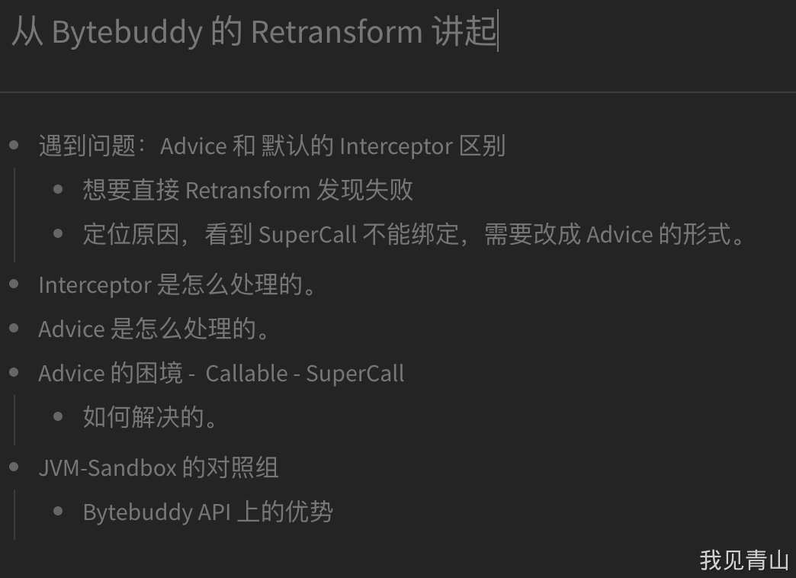
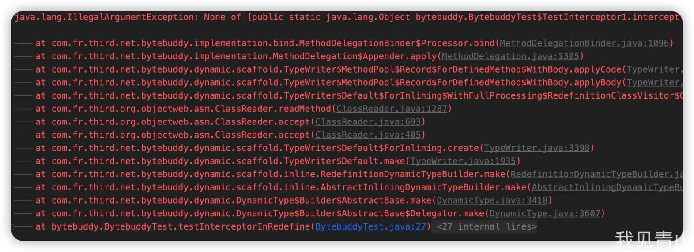
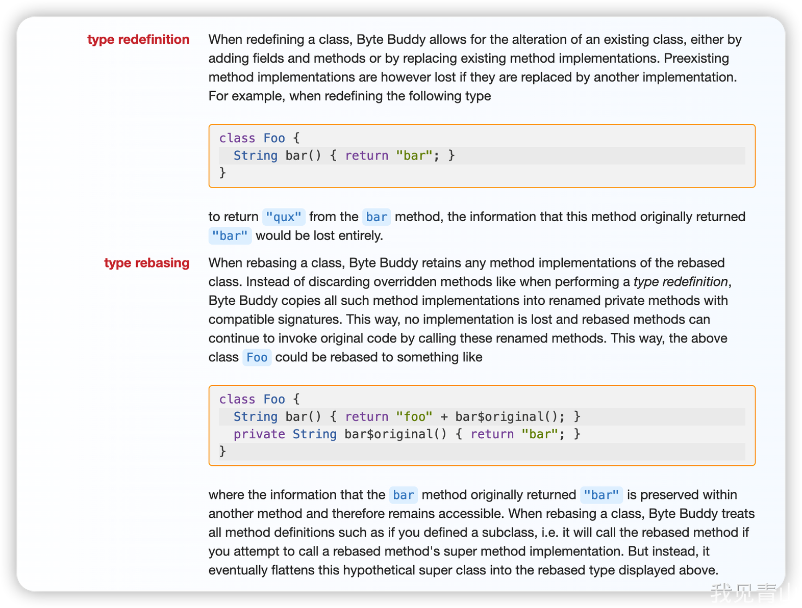
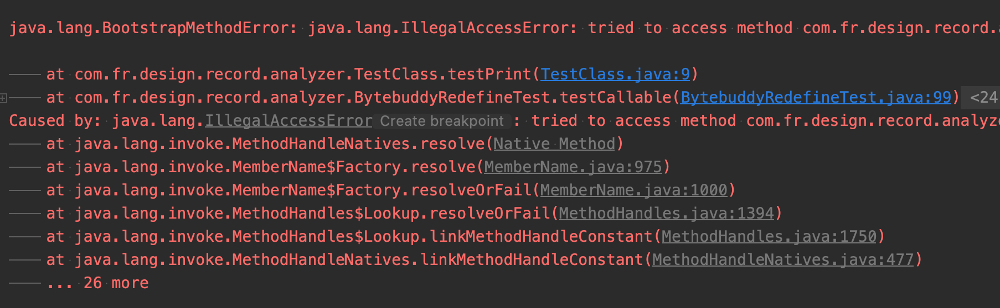
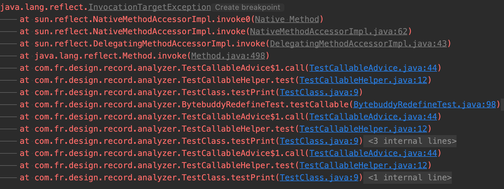

# 从 Bytebuddy 的 Retransform 聊起

### 前言

> 本文需要了解 Javaagent，不清楚的朋友可以借阅 [参考资料-1](https://tech.meituan.com/2019/11/07/java-dynamic-debugging-technology.html) 、[参考资料-2](https://kms.fineres.com/pages/viewpage.action?pageId=109796252)  
> 简单的讲就是使用 JVM 提供的钩子，无感修改字节码

事件的起因是需要对现在的 Bytebuddy 逻辑修改。  
因为 Bytebuddy 好用是好用，但是一旦加载进去，会影响后续所有的 Class 的加载速度。  
如果 Class 很多，那么会导致整个流程里面的速度变慢。  
所以当时设想的解决方案很简单，业务上能不能滞后启动？原理上能不能滞后启动？  
确认业务上没问题后，原理上就是把 premain 改成 agentmain，加载时修改变更为加载后修改。

### 大纲



### 修改过程

#### 现有的逻辑

```java
	addMutable(AnalyzerKey.KEY, AnalyzerConfiguration.create(new Assistant() {

		@Override
		public DynamicType.Builder<?> supply(DynamicType.Builder<?> builder, TypeDescription typeDescription, ClassLoader classLoader, JavaModule module) {

			return builder
					.method(ElementMatchers.isAnnotatedWith(Focus.class))
					.intercept(MethodDelegation.to(FocusInterceptor.class));
		}
	}));

```

将含有 `Focus` 注解的方法委派给 FocusInterceptor

```java
@RuntimeType
public static Object intercept(@Origin Method method, @SuperCall Callable<?> callable)
    throws Exception {
    // 原方法的映射
    Object result = callable.call();
    if (FocusPolicy.IGNORE == result) {
        return result;
    }
    Focus focus = method.getAnnotation(Focus.class);
    String id = FOCUS_POINT_ID_PREFIX + focus.id();
    DefaultLimitedMetric.INSTANCE.submit(FocusPoint.create(id, focus.text(), focus.source()), id);
    return result;
    }
```

然后通过 `java agent` 的方案将对应的字节码转化后，写入 Classloader 内的。

```java
            AgentBuilder.Listener agentListener = getAgentListener();
            AgentBuilder builder = middle.with(agentListener);
            builder = assemblyBuilder(factory, builder);
            builder.installOn(instrumentation);
```

#### 修改逻辑 - 第一版

```java
builder.disableClassFormatChanges()
	// 重定义的类型
	.with(AgentBuilder.RedefinitionStrategy.RETRANSFORMATION)
	// 初始化策略
	.with(AgentBuilder.InitializationStrategy.NoOp.INSTANCE)
	// 修改类的方式
	.with(AgentBuilder.TypeStrategy.Default.REDEFINE)
                .installOn(instrumentation)
```

如果要使用 retransform 的方式在类加载之后，再次处理类，通过网上查询的资料发现需要这么写。  
然后我就兴致冲冲的写好了，感觉没啥问题啊，很简单。  
跑一下试试。一、二、三。  


吖，报错了。  
没关系，报错是正常的，确认下原因。

```java
        /**
         * {@inheritDoc}
         */
        public MethodBinding bind(Implementation.Target implementationTarget,
                                  MethodDescription source,
                                  TerminationHandler terminationHandler,
                                  MethodInvoker methodInvoker,
                                  Assigner assigner) {
            List<MethodBinding> targets = new ArrayList<MethodBinding>();
            for (Record record : records) {
                MethodBinding methodBinding = record.bind(implementationTarget, source, terminationHandler, methodInvoker, assigner);
                if (methodBinding.isValid()) {
                    targets.add(methodBinding);
                }
            }
            if (targets.isEmpty()) {
                throw new IllegalArgumentException("None of " + records + " allows for delegation from " + source);
            }
            return bindingResolver.resolve(ambiguityResolver, source, targets);
        }
```

是这里的参数绑定出问题了。绑定的是哪一个参数呢？  
排除法试试。。。发现是 `@SuperCall` 这个注解的绑定方案。为啥会出问题呢？  
查查资料，StackOverFlow、Bytebuddy 官网、源码 Debug 一下。终于发现了问题

##### 定位原因

这边要从 retransform 的方式说起了。  
见上文 [https://www.yuque.com/3dot141/gpa3qy/yod2il?inner=yb3du](https://www.yuque.com/3dot141/gpa3qy/yod2il?inner=yb3du) 代码块中所讲，支持 Retransform 主要是两部分的设置。

1. 重定义类型
   1. `_REDEFINITION_` _ _
   2. `_RETRANSFORMATION_`
   3. _DISABLED_
2. 修改类的方式
   1. REBASE
   2. REDEFINE

默认直接 `installOn` 能够支持 `SuperCall` 的默认配置是

```java
public Default(ByteBuddy byteBuddy) {
            this(byteBuddy,
                    Listener.NoOp.INSTANCE,
                    DEFAULT_LOCK,
                    PoolStrategy.Default.FAST,
                     // REBASE
                    TypeStrategy.Default.REBASE,
                    LocationStrategy.ForClassLoader.STRONG,
                    NativeMethodStrategy.Disabled.INSTANCE,
                    new InitializationStrategy.SelfInjection.Split(),
                     // DISABLED
                    RedefinitionStrategy.DISABLED,
                    RedefinitionStrategy.DiscoveryStrategy.SinglePass.INSTANCE,
                    RedefinitionStrategy.BatchAllocator.ForTotal.INSTANCE,
                    RedefinitionStrategy.Listener.NoOp.INSTANCE,
                    RedefinitionStrategy.ResubmissionStrategy.Disabled.INSTANCE,
                    BootstrapInjectionStrategy.Disabled.INSTANCE,
                    LambdaInstrumentationStrategy.DISABLED,
                    DescriptionStrategy.Default.HYBRID,
                    FallbackStrategy.ByThrowableType.ofOptionalTypes(),
                    ClassFileBufferStrategy.Default.RETAINING,
                    InstallationListener.NoOp.INSTANCE,
                    new RawMatcher.Disjunction(
                            new RawMatcher.ForElementMatchers(ElementMatchers.any(), ElementMatchers.isBootstrapClassLoader().or(ElementMatchers.isExtensionClassLoader())),
                            new RawMatcher.ForElementMatchers(ElementMatchers.nameStartsWith("com.fr.third.net.bytebuddy.").or(ElementMatchers.nameStartsWith("sun.reflect.")).<TypeDescription>or(ElementMatchers.isSynthetic()))),
                    Transformation.Ignored.INSTANCE);
        }
```

总结一下

| 支持 SuperCall | 不支持 SuperCall |
| --- | --- |
| 重定义策略 -DISABLED | RETRANSFORMATION |
| 类转化策略 -REBASE | REDEFINE |

这个原因是啥呢？  
根据官网的文档所说  
  
redefine 会直接改变对应的类的方法字节码  
rebase 会在原来类的基础上，加上辅助类，然后替换原先的字节。  
让我们写个 DEMO 确认一下。

```java
  @Test
    public void testRebase() throws Exception {
    
        DynamicType.Unloaded<TestClass1> unloaded = new ByteBuddy()
                .rebase(TestClass1.class)
                .method(ElementMatchers.named("testPrint"))
                .intercept(MethodDelegation.to(TestInterceptor1.class))
                .make();
    
        unloaded.saveIn(new File("/Users/3dot141/Temp/分享文档"));
    }
    
    private static class TestInterceptor1 {
    
        @RuntimeType
        public static Object intercept(@Origin Method method, @SuperCall Callable<?> callable)
                throws Exception {
            System.out.println("intercept");
            Object result = callable.call();
            return result;
        }
    }
    
    public static class TestClass1 {
        
        public void testPrint() {
        
        }
    }
```

如上代码会生成两个类，如下

```java
public static class TestClass1
{
    public void testPrint() {
        BytebuddyTest$TestInterceptor1.intercept(TestClass1.cachedValue$I5YpbWwx$821p6h2, (Callable)new BytebuddyTest$TestClass1$auxiliary$htJkCEkt(this));
    }
    
    static {
        TestClass1.cachedValue$I5YpbWwx$821p6h2 = TestClass1.class.getMethod("testPrint", (Class<?>[])new Class[0]);
    }
}


class BytebuddyTest$TestClass1$auxiliary$htJkCEkt implements Runnable, Callable
{
    private BytebuddyTest.TestClass1 argument0;
    
    @Override
    public Object call() throws Exception {
        this.argument0.testPrint$original$SYROTrei$accessor$I5YpbWwx();
        return null;
    }
    
    @Override
    public void run() {
        this.argument0.testPrint$original$SYROTrei$accessor$I5YpbWwx();
    }
    
    BytebuddyTest$TestClass1$auxiliary$htJkCEkt(final BytebuddyTest.TestClass1 argument0) {
        this.argument0 = argument0;
    }
}
```

TestClass1 的反编译，没有发现 testPrint $original$ SYROTrei $accessor$ I5YpbWwx 这个方法。  
看一下字节码

```java
 // access flags 0x1002
  private synthetic testPrint$original$SYROTrei()V
   L0
    LINENUMBER 59 L0
    RETURN
   L1
    LOCALVARIABLE this Lbytebuddy/BytebuddyTest$TestClass1; L0 L1 0
    MAXSTACK = 0
    MAXLOCALS = 1
        
  // access flags 0x1010
  final synthetic testPrint$original$SYROTrei$accessor$I5YpbWwx()V
    ALOAD 0
    INVOKESPECIAL bytebuddy/BytebuddyTest$TestClass1.testPrint$original$SYROTrei ()V
    RETURN
    MAXSTACK = 1
    MAXLOCALS = 1
```

发现字节码里面是存在对应的方法的。

##### 结论

所以 `Rebase` 的方案，就是会生成辅助类、辅助方法，从而能够将对应的类转化为 `Callable` 直接进行调用。并且保存着原来的方法。和官网说的是一致的。  
这样的话生成的辅助类 `BytebuddyTest$TestClass1$auxiliary$htJkCEkt` 就可以赋值给 `SuperCall` 绑定的方法，从而让 `TestInterceptor` 进行调用。  
而 `Redefine` 呢，会直接消除掉辅助的方法从而让 `SuperCall` 无法绑定，从而出现问题。

##### 本章说

> 问题一：既然 Rebase 能保留，为啥不能直接用 Rebase，非得用 Redefine  
> 问题二：[重定义的区别](#ogklJ)

#### 修改逻辑 - 第二版

既然 `SuperCall` 这个注解不能用，那么有没有其他的方案呢？答案是肯定的，那就是 Advice 方案。  
相信大家对 Advice 这个概念都不陌生，Spring 生成 Bean 时的 [CGLIB](https://www.cnblogs.com/xrq730/p/6661692.html) 可能是大家第一次接触切面的概念。  
Bytebuddy 中同样也存在 Advice 这个概念。计算好一个方法的入口出口，从而修改对应的方法。  
参考 [Bytebuddy 的源码分析-Advice 篇](https://blog.csdn.net/wanxiaoderen/article/details/107367250) 的使用逻辑，将 Interceptor 转化成 Advice

```java
public class FocusAdvice implements DesignerAnalyzerAdvice {
    
    private static final String FOCUS_POINT_ID_PREFIX = "function_";
    
    @Advice.OnMethodExit(onThrowable = Exception.class)
    public static void onMethodExit(@Advice.Origin Method method,
                                    @Advice.Return(readOnly = false, typing = Assigner.Typing.DYNAMIC) Object result) throws Exception {
    
        if (FocusPolicy.IGNORE == result) {
            return;
        }
        Focus focus = method.getAnnotation(Focus.class);
        String id = FOCUS_POINT_ID_PREFIX + focus.id();
        DefaultLimitedMetric.INSTANCE.submit(FocusPoint.create(id, focus.text(), focus.source()), id);
    }
}

// 使用方式
builder.visit(Advice.to(FocusAdvice.class).on(matcher))
```

改完收工，然后我就一同改啊。将之前的各种 `xxInterceptor` 改成 `xxAdvice`。心里美滋滋。小菜一碟，交代码，过 PR。收工。

> 没有人知道，问题已经悄悄埋下，静静地等着第二天，某一个幸运儿发现它。

问题来自于这样一段转化

```java
public class FaultToleranceInterceptor {

    @RuntimeType
    public static Object interceptor(@This Object self, @Origin Method method, @SuperCall Callable callable, @AllArguments Object[] args) throws Exception {
        FaultTolerance faultTolerance = method.getAnnotation(FaultTolerance.class);
        // 交给 FaultTolerance 去执行调用
        return FaultToleranceFactory.getInstance().getScene(faultTolerance.scene()).getProcessor().execute(self, callable, args);
    }
}

public class FaultToleranceAdvice implements DesignerAnalyzerAdvice {
    
    // 是否忽视当前的方法
    @Advice.OnMethodEnter(skipOn = Advice.OnDefaultValue.class)
    public static boolean onMethodEnter() throws Exception {
    
        return true;
    }
    
    @Advice.OnMethodExit(onThrowable = Exception.class)
    public static void onMethodExit(@Advice.This(optional = true, typing = Assigner.Typing.DYNAMIC) Object self,
                                    @Advice.Origin Method method,
                                    @Advice.AllArguments(typing = Assigner.Typing.DYNAMIC) Object[] args,
                                    @Advice.Return(readOnly = false, typing = Assigner.Typing.DYNAMIC) Object result
                                    ) throws Exception {
        
        FaultTolerance faultTolerance = method.getAnnotation(FaultTolerance.class);
        // 将方法转化成 callable
        Callable<Object> callable = () -> method.invoke(self, args);
        // 将 callable 传递给 FaultTolerance
        // 并修改返回值
        result = FaultToleranceFactory.getInstance().getScene(faultTolerance.scene()).getProcessor().execute(self, callable, args);
    }
}
```

```java
    @Test
    public void testCallable() throws Exception {
    
        ByteBuddyAgent.install();
    
        new ByteBuddy()
                .redefine(TestClass.class)
                .visit(Advice.to(TestCallableAdvice.class).on(ElementMatchers.named("testPrint")))
                .make()
                .load(TestClass.class.getClassLoader(), ClassReloadingStrategy.fromInstalledAgent());
    
        TestClass testClass = new TestClass();
        String print = testClass.testPrint();
    
        Assert.assertEquals("[test]Callable", print);
    }

```

引发报错  


##### 定位原因 - 第一次

其实就是访问 lambda 表达式出错了，为什么会出错呢？  
这里有几个知识点

1. 如果切面不做配置，那么默认是需要内联到原方法体中的。
2. 如果不内联，则不能修改返回值。
3. 跳过默认的方法体 `skipOn`
4. lambda 表达式的访问层级

第四个即是这个问题的重点，让我们看一看这个类的字节码（因为反编译工具是看不出来的==）

```java
public static onMethodExit() {
    // 调用 lambda 的方式
INVOKEDYNAMIC call(Ljava/lang/reflect/Method;Ljava/lang/Object;[Ljava/lang/Object;)Ljava/util/concurrent/Callable; [
      // handle kind 0x6 : INVOKESTATIC
      java/lang/invoke/LambdaMetafactory.metafactory(Ljava/lang/invoke/MethodHandles$Lookup;Ljava/lang/String;Ljava/lang/invoke/MethodType;Ljava/lang/invoke/MethodType;Ljava/lang/invoke/MethodHandle;Ljava/lang/invoke/MethodType;)Ljava/lang/invoke/CallSite;
      // arguments:
      ()Ljava/lang/Object;, 
      // handle kind 0x6 : INVOKESTATIC
      com/fr/design/record/analyzer/TestCallableAdvice.lambda$onMethodExit$0(Ljava/lang/reflect/Method;Ljava/lang/Object;[Ljava/lang/Object;)Ljava/lang/Object;, 
      ()Ljava/lang/Object;
    ]
}                                                          
  // access flags 0x100A
  private static synthetic lambda$onMethodExit$0(Ljava/lang/reflect/Method;Ljava/lang/Object;[Ljava/lang/Object;)Ljava/lang/Object; throws java/lang/Exception 
   L0
    LINENUMBER 41 L0
    ALOAD 0
    ALOAD 1
    ALOAD 2
    INVOKEVIRTUAL java/lang/reflect/Method.invoke (Ljava/lang/Object;[Ljava/lang/Object;)Ljava/lang/Object;
    ARETURN
   L1
    LOCALVARIABLE method Ljava/lang/reflect/Method; L0 L1 0
    LOCALVARIABLE self Ljava/lang/Object; L0 L1 1
    LOCALVARIABLE args [Ljava/lang/Object; L0 L1 2
    MAXSTACK = 3
    MAXLOCALS = 3
```

如上，默认的 lambda 表达式的访问层级是 private 的。  
当内联到目标方法后，逻辑是这样的

```java
    public String testPrint() {
        Exception ex = null;
        // 首先跳出是用了 label ，这个已经被抛弃的方案。
        Label_0035: {
            if (!AdviceContext.builder().onAdviceCall().build().isOnAdviceCall()) {
                break Label_0035;
            }
            final TestClass this2 = this;
            try {
                ex = null;
            }
            catch (Exception ex) {}
        }
        final FaultTolerance faultTolerance = TestClass.class.getMethod("testPrint", (Class<?>[])new Class[0]).getAnnotation(FaultTolerance.class);
        // 获取生成的 lambda 表达式
        Callable var6 = TestCallableAdvice::lambda$onMethodExit$0;
        final String s = TestCallableHelper.test(var6);
        if (ex != null) {
            throw ex;
        }
        return s;
    }
```

所以自然而然就会抛错，修复也很简单，既然 lambda 表达式会抛错，那么直接用非匿名的不就好了。(猜测匿名内部类也是一样。)  
所以直接新建一个 `AdviceCallable`

```java
public class DefaultAdviceCallable<T> implements AdviceCallable<T> {
    
    private final Object self;
    private final Method method;
    private final Object[] args;
    
    public DefaultAdviceCallable(Object self, @NotNull Method method, Object[] args) {
        this.self = self;
        this.method = Reflect.accessible(method);
        this.args = args;
    }
    
    @Override
    public T call() throws Exception {
        return (T) method.invoke(self, args);
    }
}
```

然后再次尝试运行，报错变更  


##### 定位原因 - 再一次

问题是啥？为什么会出现这个问题？  
总结一下，如何判断当前调用是直接被外部调用，还是经过 Bytebuddy 的 Advice 被调用？

> 1、通过线程，来获取一个变量，从而知道当前是被谁在调用  
> 需要考虑堆栈的进入、出去。考虑当前线程，子线程。考虑自己调自己  
> 2、能否用一个特征值来告诉当前是从哪里调用的？类似于改变方法体？

重点是运行到自己的时候需要有一个独一无二的值，在 JVM 里面哪些东西符合要求？

##### 本章说

> 问题一：MethodHandles / invokeDynamic 的引入和原因  
> 问题二：匿名内部类生成后的范围是啥？也是 Private 的吗？

### 后记

**定位问题的时候，源码是要看的，但抛开源码的细节，往上走一层，输入输出往往可以更直观的告诉你问题。**

> todo：JVM-Sandbox 也是同样的 transform 方案。和 Bytebuddy 有什么异同呢？API 上哪种更好用？设计的更直观？

## 参考文档

[Bytebuddy 的基础使用](https://segmentfault.com/a/1190000039808891)  
[Bytebuddy 的源码分析-Advice 篇](https://blog.csdn.net/wanxiaoderen/article/details/107367250)