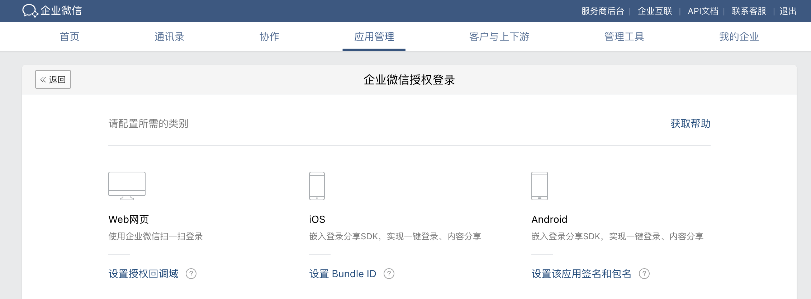
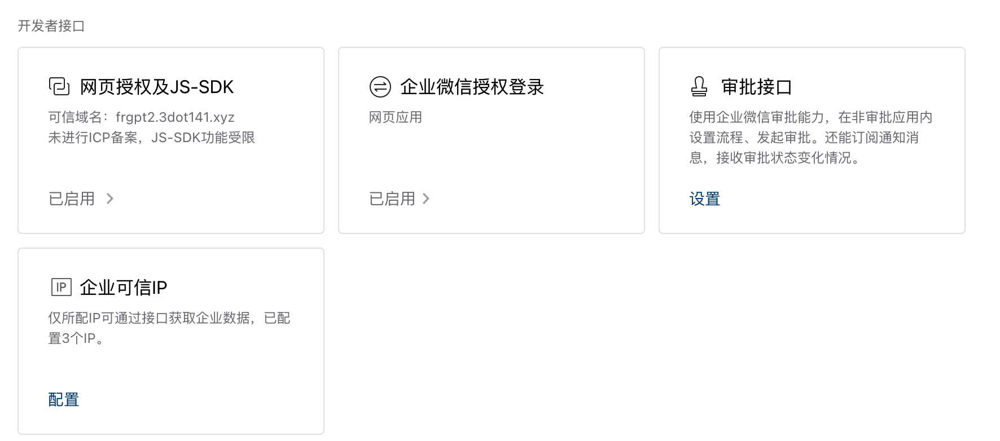
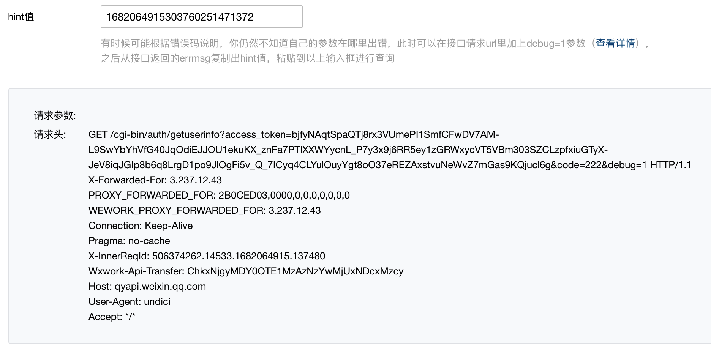

# 企业微信网页应用授权登录

因为我做的一个工具，想要识别是哪些用户再使用，从而限制他们的发散情况。所以考虑怎么通过企业微信进行授权登录。  
说白了，最后获取的是用户的信息。所以只要考虑怎样通过扫码这样获取用户的 id 即可。

# 流程

> 见 [企业微信 web 登录](https://developer.work.weixin.qq.com/document/path/98151)

- 首先创建应用，开启网页授权登录
	- 
	- 配置授权回调域
	- 配置可信域名
		-   
		~~- 这里可以不备案，一样可以用~~
		- 必须备案，对于企业来讲的话
- 参照 [Web登录组件 - 文档 - 企业微信开发者中心](https://developer.work.weixin.qq.com/document/path/98152)
	- 配置 url, 如下
		- `https://login.work.weixin.qq.com/wwlogin/sso/login?login_type=CorpApp&appid=WWCorpId&agentid=1000000&redirect_uri=http%3A%2F%2Fwork.weixin.qq.com&state=WWLogin`
	- 调用后，返回格式为
		- `redirect_uri&code=accessCode&state=WWLogin`
		- 这里有用的主要是 code 和 state
- 获取用户登录身份 [获取用户登录身份 - 文档 - 企业微信开发者中心](https://developer.work.weixin.qq.com/document/path/98176)
	- 传入 `access_token` [获取access\_token - 文档 - 企业微信开发者中心](https://developer.work.weixin.qq.com/document/path/91039)
		- 传入 corpid - 企业 ID，获取方式参考：[术语说明-corpid](https://developer.work.weixin.qq.com/document/path/91039#14953/corpid)
		- 传入 corpsecret - 应用的凭证密钥，**注意应用需要是启用状态**，获取方式参考：[术语说明-secret](https://developer.work.weixin.qq.com/document/path/91039#14953/secret)
	- 传入上文中的 `code`
	- 获取 `userid`
- 读取成员信息 [读取成员 - 文档 - 企业微信开发者中心](https://developer.work.weixin.qq.com/document/path/90196#10019)
	- 传入 `access_token`
	- 传入上问中 `userid`

# 错误定位

```js
"error is Error: not allow to access from your ip, hint: [1682059359480130799301353], from ip: 34.203.14.222, more info at https://open.work.weixin.qq.com/devtool/query?e=60020"
```

- 因为 API 比较难以定位，所以企业微信提供了相关的方案定位问题
	- 错误码，直接看上文中的 url
		- [错误码查询工具 | 企业微信](https://open.work.weixin.qq.com/devtool/query?e=40001)  
	- hint 需要在 url 中配置 `debug=1`
		- [配置 debug 模式](https://developer.work.weixin.qq.com/document/path/90487#debug%E6%A8%A1%E5%BC%8F%E8%B0%83%E7%94%A8%E6%8E%A5%E5%8F%A3)
		- 见截图
			- 