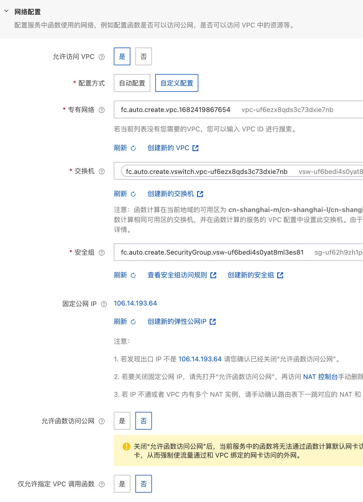
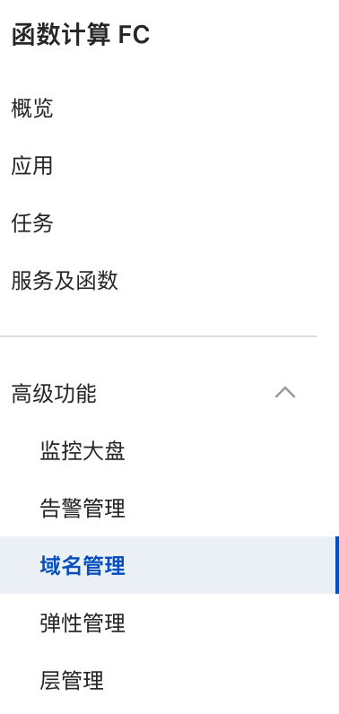
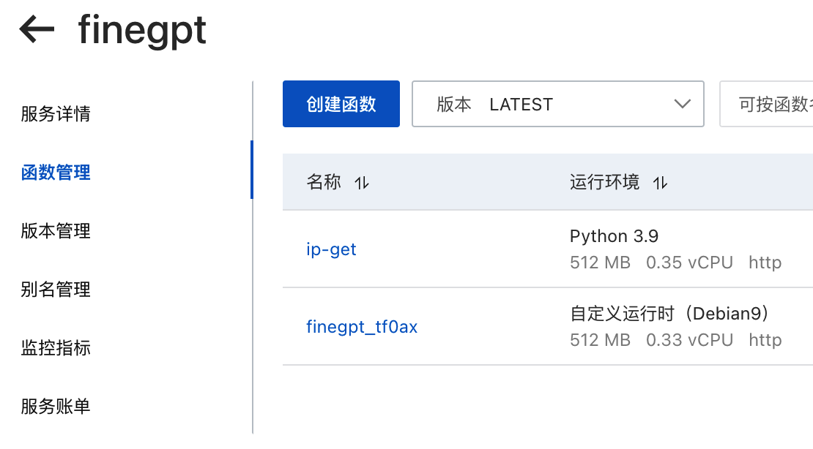
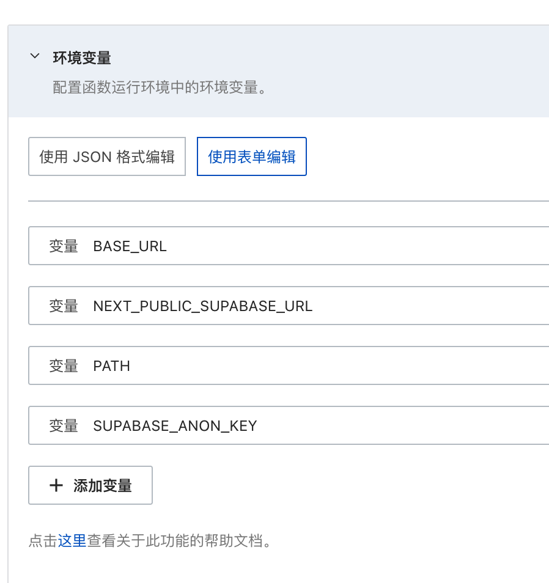

> 使用国内云服务，最重要的一点是国内云服务，可以提供一个固定的 ip 地址。  
> 这个对开发类似 “企业微信“ 这样的应用很重要

# 国内云服务和 Next.js 部署

> 了解到这个工具，是通过这篇文章 [Next.js 在 Serverless 中从踩坑到破茧重生 - 掘金](https://juejin.cn/post/7090811881228599304)  
> [Cloud Studio](https://gh.cloudstudio.net/dashboard)  
> 这个工具的作用，就是帮助你在国内云服务厂商那边，一键部署，节约开发时间  
> 可以直接从 github 拉取工程，非常便捷。

注意：腾讯云可能暂时有问题，所以这里用阿里云作为服务器。

# 阿里云

## 函数计算 FC

- 服务
	- 公网 IP 配置
		- 
		- 判断 IP 是否变更

			```python
			# -*- coding: utf-8 -*-
			import logging
			import requests
			
			def handler(event, context):
			
				logger = logging.getLogger()
			
				try:
			
					r = requests.get('https://myip.ipip.net')
				
					clientIP = r.content.split()[1]
			
					logger.info('Client IP: ' + clientIP)
			
				except:
			
					r = requests.get('http://ipinfo.io')
			
					clientIP = r.json()['ip']
			
					logger.info('Client IP: ' + clientIP)
			
				return clientIP
			```

	- 函数自定义域名配置
		- 
- 函数
	- 一个服务可以有多个函数
		- 
	- 配置环境变量
		- 

### 坑点

- 设置自定义域名后，其实内部访问请求的时候还是 `0.0.0.0:9000` ，导致我想通过 `request.origin` 获取 url 的时候，出错。
	- 所以这里只能采用参数传递的方案，将相关的 url 传递过来。