`本文优先发表于CIO Talk微信公众号（微信号: CIO_China_Lab）`

随着微服务架构的流行，越来越多的应用基于微服务架构设计和实现，同时带来了新的问题，传统单体应用架构下，认证和授权容易完成，但是微服务架构下，如何能更好的完成认证和授权，尤其在传统应用的微服务化转型过程中，如何更好的迁移，在不重新实现原有的权限管理系统的情况下，能够更优雅的实现复杂微服务架构下的认证和授权，本文将对上述问题做一些探讨。

微服务场景会为认证和授权带来哪些问题
==============================================================

在传统的单体架构应用中，当用户登录时，应用程序的安全模块验证用户的身份。在验证用户是合法的之后，为用户创建会话（session），并且将会话 ID（session ID）与之相关联。服务器端会话存储登录用户信息，例如用户名，角色和权限。服务器将会话 ID 返回给客户端（浏览器）。客户端（浏览器）将会话 ID 记录为 cookie，并在后续请求中将其发送到应用程序。然后，应用程序可以使用会话 ID 来验证用户的身份，而无需每次都输入用户名和密码进行身份验证。当客户端（浏览器）访问应用程序时，会话 ID 与 HTTP 请求一起发送到应用程序。程序的安全模块通常会使用授权拦截器，此拦截器首先确定会话 ID 是否存在。如果会话 ID 存在，则它知道用户已登录。然后，通过查询用户权限，确定用户是否可以执行请求。

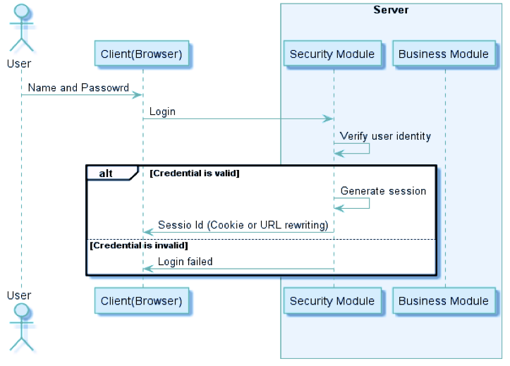

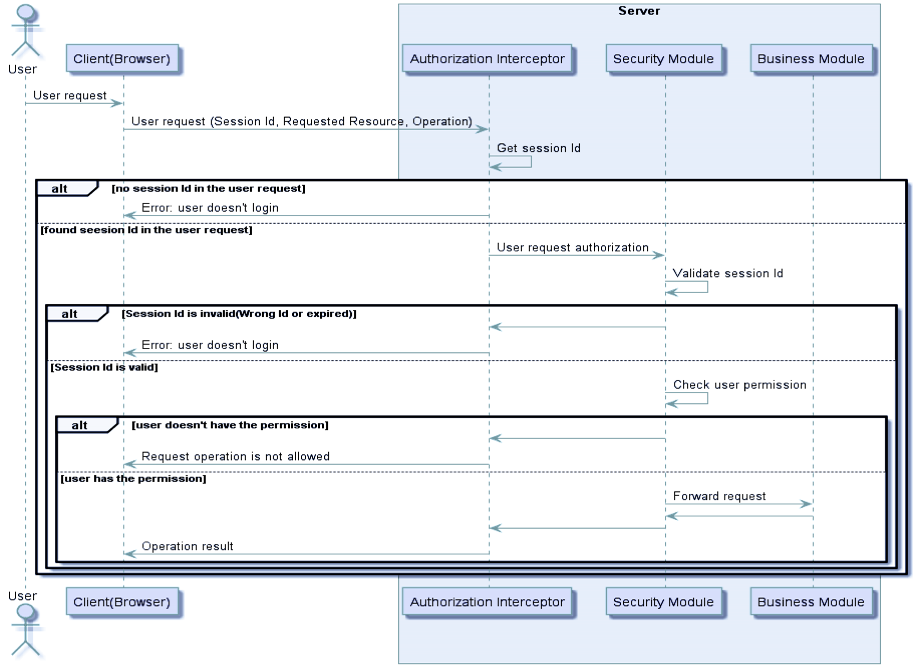

在微服务架构下，应用由多个微服务组成，每个微服务在原始的单体应用程序中实现单一业务逻辑，并且前后端的分离使得客户端变成一个纯前端应用。在这种场景下，对每个微服务（包括纯前端的客户端应用）的访问请求进行身份验证和授权会面临以下问题：

* 客户端拆分成独立的纯前端应用程序（单页应用），前端应用需要以一种安全的方式在浏览器中获取用户的身份信息和权限信息，并与服务端微服务程序共享。如果涉及到微前端的架构，前端由多个可独立部署的子应用组成，如何在多个微前端之间共享相同的登录信息、权限及其有效性？
* 每个微服务需要处理相同的用户认证和授权信息，但是每个微服务又有独立的权限控制逻辑，相同用户在不同的微服务中，权限并不相同。微服务应遵循单一责任原则。微服务只处理单个业务逻辑。身份验证和授权的全局逻辑不应放在单个微服务实现中。
* HTTP 是无状态协议。无状态意味着服务器可以根据需要将客户端请求发送到集群中的任何节点，HTTP 的无状态设计对负载平衡有明显的好处。由于没有状态，用户请求可以分发到任何服务器。对于需要身份验证的服务，需要以基于 HTTP 协议的方式保存用户的登录状态。此时传统使用服务器端的会话来保存用户状态的方式就不适用了。
* 微服务架构中的身份验证和授权涉及更复杂的场景，包括用户访问微服务应用程序，第三方应用程序访问微服务应用程序以及多个微服务应用程序之间的相互调用，在每种情况下，身份验证和授权方案都需要确保每个请求的安全性。
* 尽管单点登录的可以确保用户的登录状态，但如何在微服务内部保持单点登录也会在无状态的微服务框架下带来挑战，微服务系统需要通过某种方式将用户的登录状态和权限在整个系统中共享。

下面我们来介绍一下认证和授权的区别，以及 OAuth 框架和 OIDC 协议的基本概念，以便更好的理解如何通过引入 OAuth2.0 框架和 OIDC 协议来解决上述问题。

认证和授权
=======================

首先，认证和授权是两个不同的概念，为了让我们的 API 更加安全和具有清晰的设计，理解认证和授权的不同就非常有必要了。

* 认证是 authentication，指的是当前用户的身份，解决 “我是谁？”的问题，当用户登陆过后系统便能追踪到他的身份并做出符合相应业务逻辑的操作。
* 授权是 authorization，指的是什么样的身份被允许访问某些资源，解决“我能做什么？”的问题，在获取到用户身份后继续检查用户的权限。
* 凭证（credentials）是实现认证和授权的基础，用来标记访问者的身份或权利，在现实生活中每个人都需要一张身份证才能访问自己的银行账户、结婚和办理养老保险等，这就是认证的凭证。在互联网世界中，服务器为每一个访问者颁发会话 ID 存放到 cookie，这就是一种凭证技术。数字凭证还表现在方方面面，SSH 登录的密匙、JWT 令牌、一次性密码等。

单一的系统授权往往是伴随认证完成的，但是在开放 API 的多系统架构下，授权需要由不同的系统来完成，例如 OAuth2.0。

在流行的技术和框架中，这些概念都无法孤立的被实现，因此在现实中使用这些技术时，大家往往对 OAuth2.0 是认证还是授权这种概念争论不休。下面我们会介绍在 API 开发中常常使用的几种认证和授权技术：OAuth2.0，OpenId Connect 和 JWT。

OAuth2.0、OpenId Connect（OIDC）和 JWT
-----------------------------------------------------------------------------------------------------------

### OAuth2.0

#### 什么是 OAuth2.0

在第三方登录已经如此普遍的今天，相信大家一定都见过下面的这种界面：

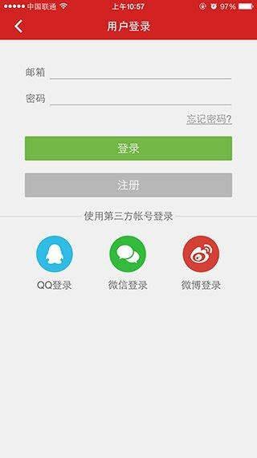

第三方登录让我们可以在一个 app 上无需注册新用户，就能使用我们的微信、qq 等社交账号进行登录，app 可以获取到我们社交账号上的头像、邮箱等信息。

而这种现在看来已经非常普遍的操作，其背后就是 OAuth2.0 协议在支撑。

在详细讲解 OAuth2.0 之前，需要了解几个专用名词。

* Client：第三方应用程序，即客户端应用程序。
* HTTP service：HTTP 服务提供商，即 OAuth 服务提供商。
* Resource Owner：资源所有者，即终端用户。
* User Agent：用户代理，即浏览器。
* Authorization ：认证服务器，即服务提供商专门用来处理认证的服务器。
* Resource ：资源服务器，即服务提供商存放用户生成的资源的服务器。它与认证服务器，可以是同一台服务器，也可以是不同的服务器。
* Token：包含用户身份或权限信息的令牌，通常为一串随机生成的字符，并具有时效性

OAuth2.0 是一个关于授权的开放网络标准 [rfc6749](https://tools.ietf.org/html/rfc6749)，允许用户授权第三方应用访问服务授权者提供的信息，而不需要将用户名和密码提供给第三方应用或分享他们数据的所有内容。

要理解 OAuth2.0，让我们先从一个现实的场景开始：

如果要开发一个能检测代码质量的工具，面向的用户都是 GitHub 的使用者，那么如何才能让用户在不暴露 GitHub 的账号和密码的情况下，也能获得用户存储在 GitHub 的代码库的内容呢？

简单来说，OAuth2.0 就是让”Client”安全可控地获取”用户”的授权，与”Resource “进行互动。

回到我们的场景中，我们要开发的代码检测工具就是 Client，我们的用户就是 Resource Owner，GitHub 的登录系统就是 Authorization ，GitHub 的 repo 就是 Resource 。在 OAuth2.0 框架下，用户在访问代码质量检查工具时，会先通过 GitHub 的 Authorization 进行登录，GitHub 的 Authorization 会返回一个包含用户标识、且有时效性的 token，通过这个 token，代码质量检查工具可以访问 GitHub 的 Resource 来获取用户代码库的内容。

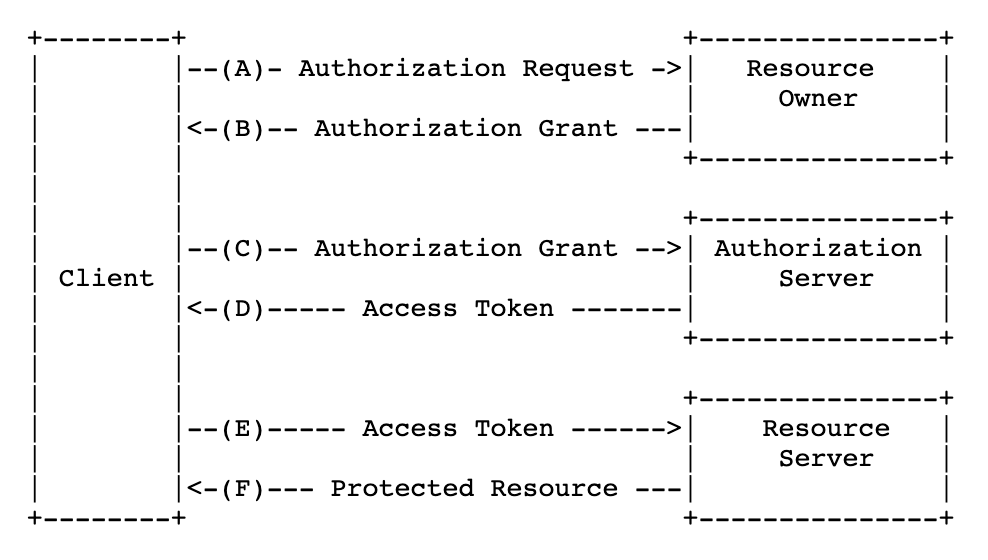

#### OAuth2.0 的核心

从我们的例子种不难发现，OAuth2.0 的关键之处，在于 Client 如何和 Authorization 进行交互，获取 token。

OAuth2.0 协议为我们提供了以下 endpoint：

* authorization endpoint：用于申请授权码的 endpoint
* token endpoint：用于申请 token 的 endpoint
* introspection endpoint：用于验证解析 token 的 endpoint

我们的 client 需要向 OAuth2.0 的提供商去申请一个 client id 和 client secret，用于帮助 OAuth2.0 的提供商来验证 client 的合法性。（client id 和 client secret 既可以在 url param 中验证，也可以携带于 authorization basic token 验证，这取决于你使用的 Authorization 服务商）

OAuth2.0 包含 6 种授权类型（Grant Type），用于 client 和 Authorization 进行交互：

* 授权码模式（Authorization Grant Type)
    * 授权码模式是我们最常见的一种方式，传统的授权码模式通常使用在 client 为前后端一体的应用中。授权码模式与其他授权类型相比具有一些优势。当用户授权应用程序时，会带着 URL 中的授权码返回应用程序。应用程序用授权码来交换 access token。当应用程序发出 token 请求时，该请求将使用 client secret 进行身份验证，从而降低攻击者拦截授权码并自行使用它的风险。这也意味着 token 永远不会被用户看到，因此这是将 token 传递回应用程序的最安全方式，从而降低 token 泄露给其他人的风险。（对于 token endpoint 的 post 请求参数有时也会以 form-data 的形式出现，这取决于你使用的 Authorization 服务商）

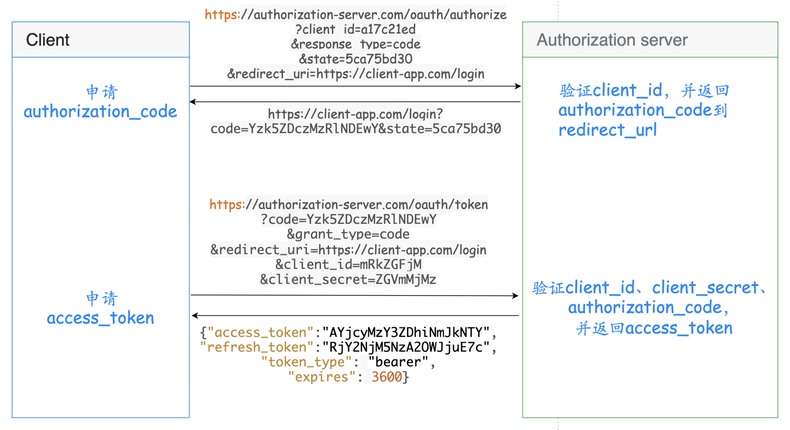

* 刷新模式（Refresh Token Grant Type）
    * 通常在请求到 access token 时，都会携带有一个 refresh token，因为 access token 是有有效时长的，所以我们需要用一个不会过期的 refresh token 来刷新 access token，在用户无需重新登录的情况下，让 client 也能保持使用正确有效的 access token。

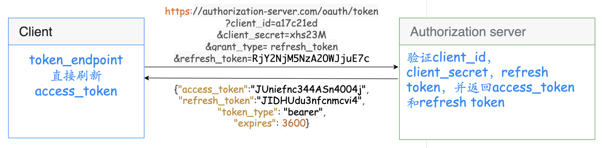

* 隐藏模式（Implict Grant Type）
    * 在前后端分离的架构中，client 只有一个运行在浏览器上的前端的单页应用，不包含后端。因为 JavaScript 应用的特殊性，我们无法安全的将 client secret 存储在纯前端应用里，并且因为请求全部从浏览器发起，我们无法保证传统的授权码模式的两步请求中，是否会有中间人攻击。因此需要一种不通过 client secret 和两步请求就可以获取 access token 的方式，这就是隐藏模式。在此模式中，access token 将作为 redirect url 的 fragment 返回到 client，并且出于安全性考虑，将不会返回 refresh token，因此我们不能用传统的 refresh token 模式来刷新 access token，只能通过 silent refresh 的方式刷新。

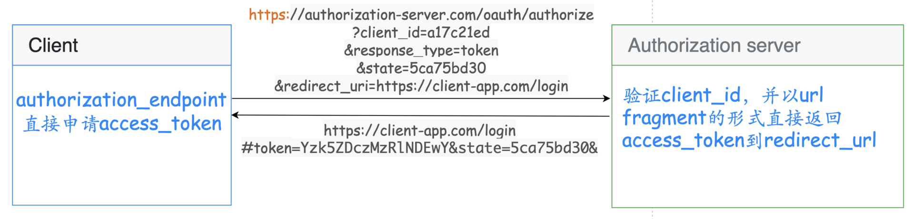

```


1.  `* silent refresh` 
2.  `* slient refresh是隐藏模式的一种特殊的刷新方式，其原理是运用html中iframe的特性，在access token过期之前，使用一个隐藏的iframe来重新用隐藏模式申请一次token，若authorization 的session不过期，便无需用户重新输入其登录信息就能获取一个新的access token。` 


```

* PKCE 模式（Proof Key for Exchange by OAuth Public Clients）
    * 在隐藏模式介绍中我们可以发现，该模式是有明显的缺点的，即其 silent refresh 的刷新方式，authorization 所保存的用户登录 session 不可能永远不失效，一旦失效，我们还是需要用户重新登录才能确保 client 使用正确有效的 token。为了解决这个缺点，PKCE 模式应运而生。 PKCE 模式通过改造传统的授权码模式，在请求 authorization endpoint 的同时，加入 code\_challenge 和 code\_challenge\_method 参数，得到授权码后，在请求 token endpoint 时加入 code\_verifier 参数，authorization 会验证 code\_challenge 和 code\_verifier 是否匹配，以此来防止两步请求中可能产生的中间人攻击。

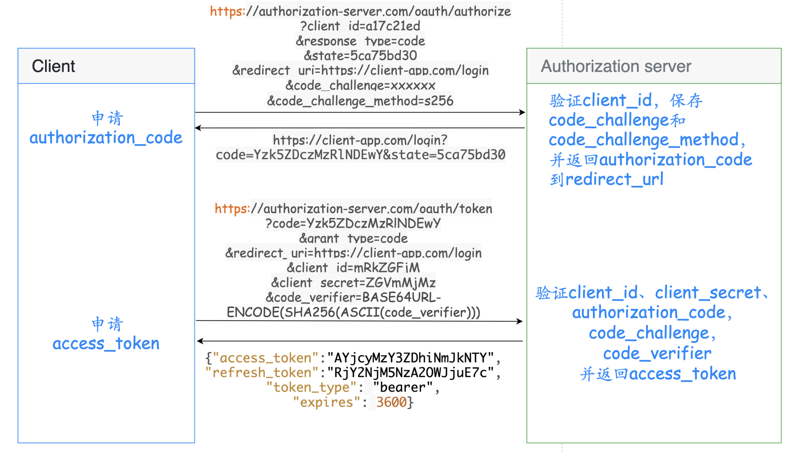

* 密码模式（Password Grant Type）
    * 如果你高度信任某个应用，OAuth2.0 也允许用户直接使用用户名和密码，该应用通过用户提供的密码，申请 token，这种方式称为密码模式。密码模式无需浏览器作为代理，可以直接通过 post 请求获得 token。

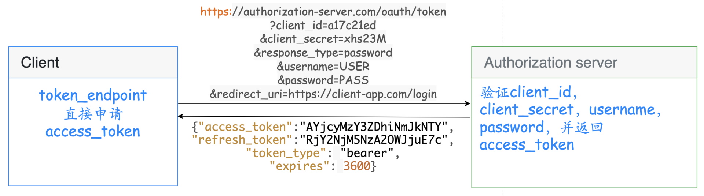

* 凭证模式（Client Credentials Grant Type）
    * 当你的应用只需要代表应用本身，而不是某个用户，来获取 resource 的资源时，就可以使用凭证模式。这种模式不需要任何用户信息，返回的 token 也不携带任何用户信息。凭证模式也无需浏览器作为代理，可以直接通过 post 请求获得 token。

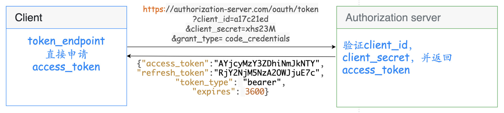

而 client 在获取到 access token 之后，需要将 access token 携带于 authorization bearer token header，再向 resource 发出相应的资源请求。client 也可以使用 introspection endpoint 来验证 token 是否有效。

### OpenId Connect（OIDC）

尽管在今天很多 OAuth2.0 的使用中都包含身份信息，但 OAuth2.0 实际上是一个授权（authorization）的协议，并不包含认证（authentication）的内容。

OAuth2.0 框架明确不提供有关已授权应用程序的用户的任何信息。OAuth2.0 是一个委派框架，允许第三方应用程序代表用户行事，而无需应用程序知道用户的身份。

而 OpenId 的诞生就是为了解决认证问题的：OpenId 基于 OAuth2.0，在兼容 OAuth2.0 协议的基础上，它构建了一个身份层，用于验证并为 client 展示身份信息。

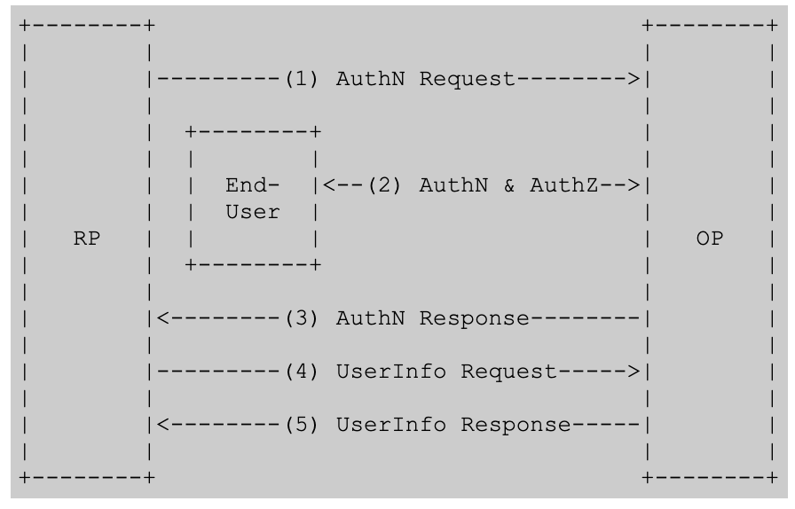

OpenID Connect 的核心基于一个名为“ID token”的概念。authorization 将返回新的 token 类型，它对用户的身份验证信息进行编码。与仅旨在由资源服务器理解的 access token 相反，ID token 旨在被第三方应用程序理解。当 client 发出 OpenID Connect 请求时，它可以请求 ID token 以及 access token。

OpenID Connect 的 ID token 采用 JSON Web Token（JWT）的形式，JWT 是一个 JSON 有效负载，使用发行者的私钥进行签名，并且可以由应用程序进行解析和验证。

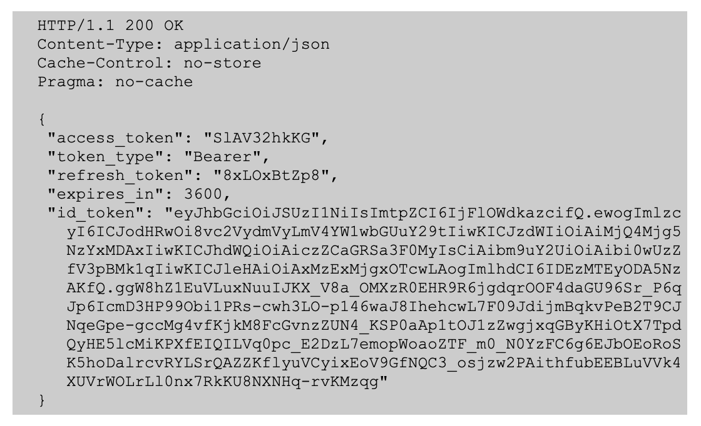

得益于 JWT 的自解析性，client 可以不申请 introspection endpoint 就可以解析出 ID token 所包含的身份信息。JWT 内部是一些定义的属性名称，它们为应用程序提供信息。它们用简写名称表示，以保持 JWT 的整体大小。这包括用户的唯一标识符（sub 即“subject”的缩写），发出 token 的服务器的标识符（iss 即“issuer”的缩写），请求此 token 的 client 的标识符（aud 即“audience”的缩写），以及少数属性，例如 token 的生命周期，以及用户在多长时间之前获得主要身份验证提示。

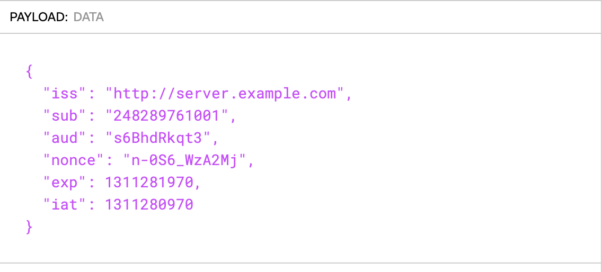

### JWT（Json Web Token）

JWT（Json Web Token）是一个非常轻巧的规范。这个规范允许我们使用 JWT 在两个组织之间传递安全可靠的信息。

首先，我们需要理解的是，JWT 实际上是一个统称，它实际上是包含两部分 JWS（Json Web Signature）和 JWE（Json Web Encryption）。

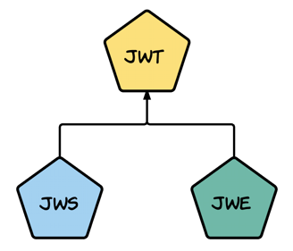

#### JWS（Json Web Signature）

Json Web Signature 是一个有着简单的统一表达形式的字符串：

JWS 包含三部分：

* JOSE 头（header）用于描述关于该 JWT 的最基本的信息，例如其类型以及签名所用的算法等。JSON 内容要经 Base64 编码生成字符串成为 Header。
* JWS 负载（payload）所必须的五个字段都是由 JWT 的标准所定义的。
    * iss(issuer): 该 JWT 的签发者（通常是 authorization 的地址）
    * sub(subject): 该 JWT 所面向的用户（通常是用户名或用户 ID）
    * aud(audience): 接收该 JWT 的一方（通常是 client id）
    * exp(expires): 什么时候过期（Unix 时间戳）
    * iat(issued at): 在什么时候签发的（Unix 时间戳）

其他字段可以按需要补充。JSON 内容要经 Base64 编码生成字符串成为 PayLoad。

* JWS 签名（signature）使用密钥 secret 进行加密，生成签名。

JWS 的主要目的是保证了数据在传输过程中不被修改，验证数据的完整性。但由于仅采用 Base64 对消息内容编码，因此不保证数据的不可泄露性。所以不适合用于传输敏感数据。并且加密数据只用于签名部分，所以 JWS 具有自解析性。

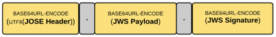

#### JWE（Json Web Encryption）

Json Web Encryption 是一个 JWS 的扩展，它是一串用加密算法加密过的 token，在没有密钥的情况下，它能像 JWS 一样的解析。

JWE 包含五部分：

* JOSE 头（header）：描述用于创建 JWE 加密密钥和 JWE 密文的加密操作，类似于 JWS 中的 header。
* JWE 加密密钥：用来加密文本内容所采用的算法。
* JWE 初始化向量：加密明文时使用的初始化向量值，有些加密方式需要额外的或者随机的数据。这个参数是可选的。
* JWE 密文：明文加密后产生的密文值。
* JWE 认证标签：数字认证标签。
* JWE 规范引入了两个新元素（enc 和 zip），它们包含在 JWE 令牌的 JOSE 头中，enc 元素定义了秘文的加密算法，它应该是一个 AEAD（Authenticated Encryption with Associated Data）模式的对称算法， zip 元素定义了压缩算法，alg 元素定义了用来加密 cek（Content Encryption Key）的加密算法。

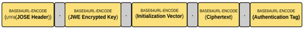

微服务架构下的认证和授权的探讨
=====================================================

通过对以上 OAuth2.0，OIDC 以及 JWT/JWE 的相关介绍，下面来探讨如何实现一个基于上述框架和协议的微服务认证和授权系统。

在大型的系统架构中，往往存在多个产品共存的情况，网站因业务需求拆分成多个自成体系的微服务架构，但为了统一用户体验，这些独立的微服务架构往往共享一个身份认证服务。例如笔者所在的公司，拥有许多独立产品和服务，他们共享同一个认证服务器，支持 OIDC 协议，对用户身份认证，而每个产品和服务内部，在微服务架构下，则有着自己独立的授权逻辑。

从传统单体架构到微服务架构的演变过程中，同一应用间的微服务调用，不同应用间的微服务调用，使得微服务组成了一个矩阵，相互之间存在交叉调用，每个独立的微服务又要对自己提供的服务实现权限控制，不止是系统权限，更多的是业务权限控制。如何能够基于原有的认证和权限管理系统，实现在同一微服务中，同时支持同应用之间的权限管理和不同应用之间的权限管理，是我们要探讨的主要问题。


认证与授权的剥离
--------------------------------

基于这样的架构基础，身份认证统一管理，应用和服务通过统一的身份认证服务完成用户登陆，剥离身份认证和用户授权，是构建微服务认证体系的第一步。

现代应用中，前后端分离已是常态，独立的前端单页应用是用户进入站点的第一步，也扮演着 client 的角色，因此前端单页应用将会在微服务体系中扮演者获得身份信息的重要角色。由独立的前端应用（client）获取代表身份的 token 后，后端就无需再与身份验证服务做复杂的交互。

我们可以使用前文所介绍的 PKCE 模式，安全的为前端应用授权。而后端只需要在网关层面拦截所有的请求验证身份即可，此时，前端应用就是身份验证服务（OIDC ）的 client，后端网关将成为身份验证服务（OIDC ）的 resource 。

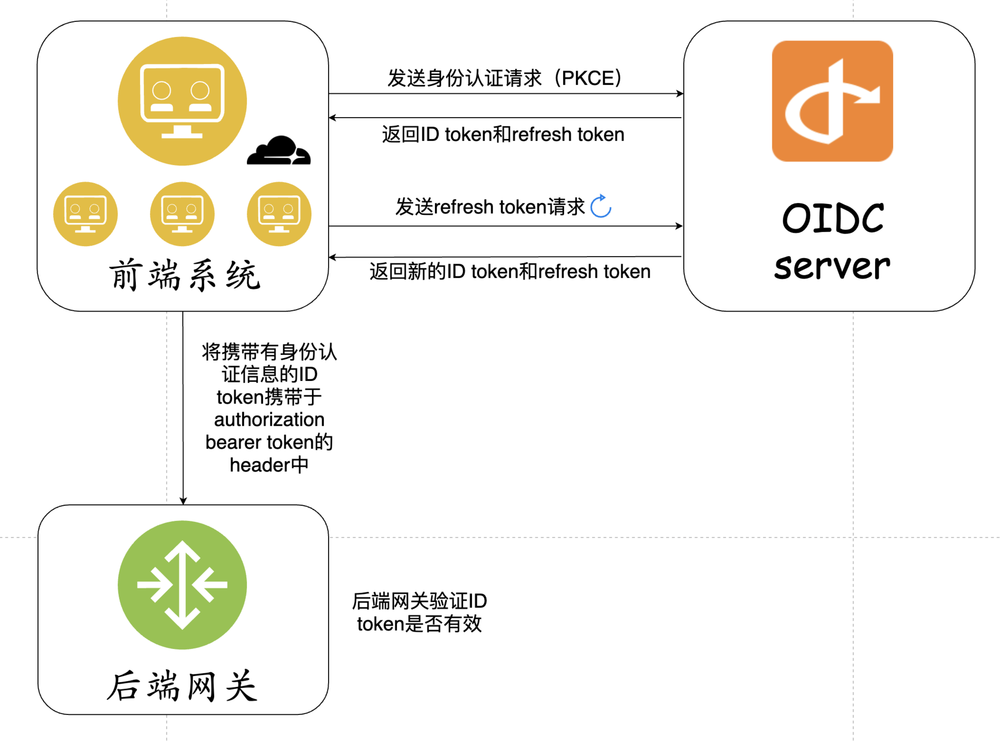

值得一提的是，在微前端概念高速发展的今天，我们同样需要在每个微前端项目中统一用户的身份和权限，借助浏览器 localstorage 对于不同域名的独立封闭性，我们可以使用类似 cloudflare 的工具帮助组装部署在不同服务器之上的前端应用共享同一域名，并以此来共享微前端不同系统之间的用户 token。

服务端用户权限系统的建构
--------------------------------------------

在网关完成身份认证的工作后，整个认证（authentication）的流程就已完成，接下来我们要面临的则是如何在后端微服务之间统一用户权限。

网关进行身份验证后，授权服务不需要让用户重新输入身份信息，因此应该由一个简单的 api 请求来完成。借助于 OAuth2.0 协议，我们可以使用密码流程（password grant type）来为用户进行授权。用户密码即为可自验证的 ID token，而非用户的真正密码，我们借助密码流程的优势，构建一个支持解析用户 ID token，并符合 OAuth2.0 协议标准的授权服务。

前端应用在完成身份验证之后，会立即向服务端授权服务（OAuth ）发送获取权限的请求，授权服务（OAuth ）将权限压缩加密成一个 JWE 返回前端，以保证权限 token 的安全性，前端应用可以通过 introspection endpoint 来解析权限，而无需知道加密 JWE 的 client secret。

在得到 JWE 格式的权限 token 后，前端将携带着代表身份信息的 ID token 和代表权限的 JWE token 一同通过网关发往后端，后端网关在验证完 ID token 后会重新组装请求，只将权限 token 发往后端微服务进行单独验证。

此时，后端网关是授权服务（OAuth ）的 client，而后端其他的微服务将成为授权服务（OAuth ）的 resource 。

微服务在收到具体的业务请求后，会使用 client secret 解析 JWE token，而无需再与授权服务进行交互。

而之后的服务间调用，也将一直携带着此 JWE token，以提供权限凭证。

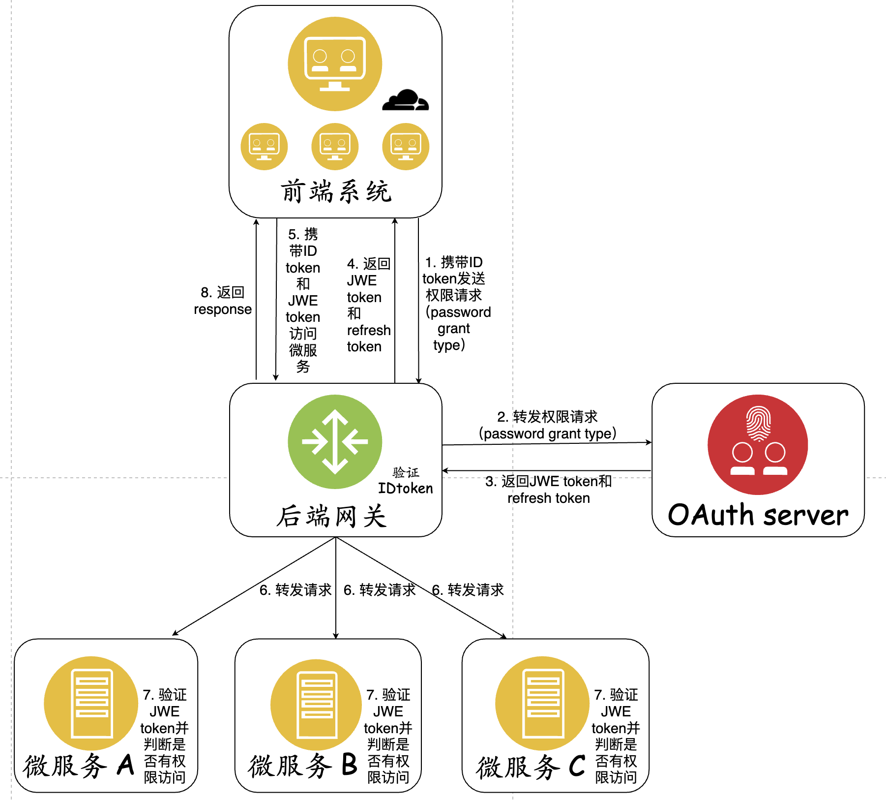

第三方系统间权限系统的建构
-----------------------------------------------

对于一个微服务系统来说，我们不仅仅要处理来自用户的请求，还经常会与其他系统进行交互，因此，我们的权限系统也需要提供一种在不提供用户身份访问系统的方式，这就是 system-partner 模式。

得益于 OAuth2.0 协议中的凭证模式（client credentials grant type），我们可以要求对我们发起请求的第三方系统在身份认证服务（OIDC ）中去申请一个不包含用户信息的 client credentials token，而后端网关会解析 client credentials token，并从 token 解析出的 grant\_type=client\_credentials 字段来识别出 system-partner 的请求，并验证 system-partner client id 的白名单，之后去我们的授权服务（OAuth ）去申请一个 system-partner 的权限。

通过 OAuth token endpoint 中携带的 additional parameter，授权服务（OAuth ）会识别出 system-partner 的请求，赋予其一个 system-partner 的权限，并包装成 JWE token，返回第三方系统。

在第三方系统得到了 client credentials token 和 JWE token 后，可以以与之前相同的方式发往我们的微服务，微服务会在解析 token 时识别出其 system partner 的权限，执行相应的业务逻辑。

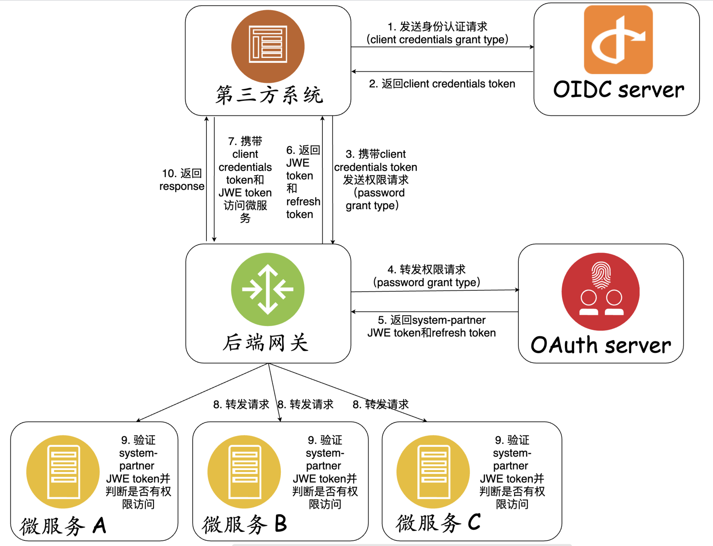

基于 OAuth2.0 的授权中心实现
-----------------------------------------------------------

在实现中，我们使用 spring security 作为技术基础，完全遵循 OAuth2.0 协议，将其进行改造，让 spring security 支持我们的自定义的 token encode 方式，并重新实现了 user details provider 来扩展权限系统。并且得益于 JWE 的使用，我们无需提供具体的 storage 来保存 token，redis 仅仅用于在 token 有效期内避免再次与权限服务交互，加速接口请求速度。

一个好的微服务权限系统应该至少具有三层结构的权限体系：

* 是否有权限访问此微服务
* 是否有权限访问微服务中的某一个特定的 endpoint
* 是否包含一些用户特定的权限数据

其中前两层只包含权限的名字和 id，而第三层因为涉及到具体的权限数据，我们将其设计成为开放接口，由开发者自行封装响应的权限获取实现逻辑。这样做的好处是，我们可以在请求权限 token 时使用一些 additional parameter 来自主的切换我们想要的权限获取逻辑（例如 system-partner 的实现）。

同时，additional parameter 和开放权限接口相互配合，不同的微服务系统就可以使用同一个 authorization 来提供不同的权限，这样可以更容易集中化管理用户权限，并节省开发资源。

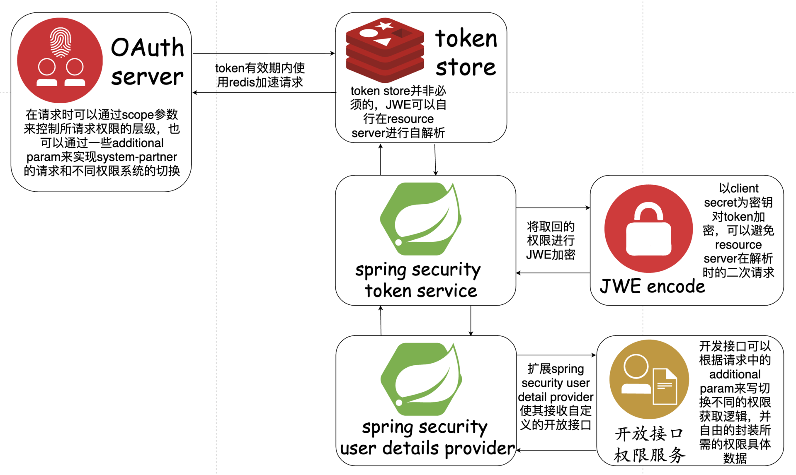

秉承着避免与 authorization 交互的原则，JWE token 使用 client secret 作为密钥进行加密，因此 resource 可以通过 client secret 对获得的 JWE token 进行自解析，并由全局的 http intercepter 来决定用户是否有权限访问服务或着服务的某个 endpoint，以及 endpoint 背后与权限有关的业务逻辑。微服务可以自行用各种开源的 JWE 工具进行解析，也符合微服务跨语言的基本特性。

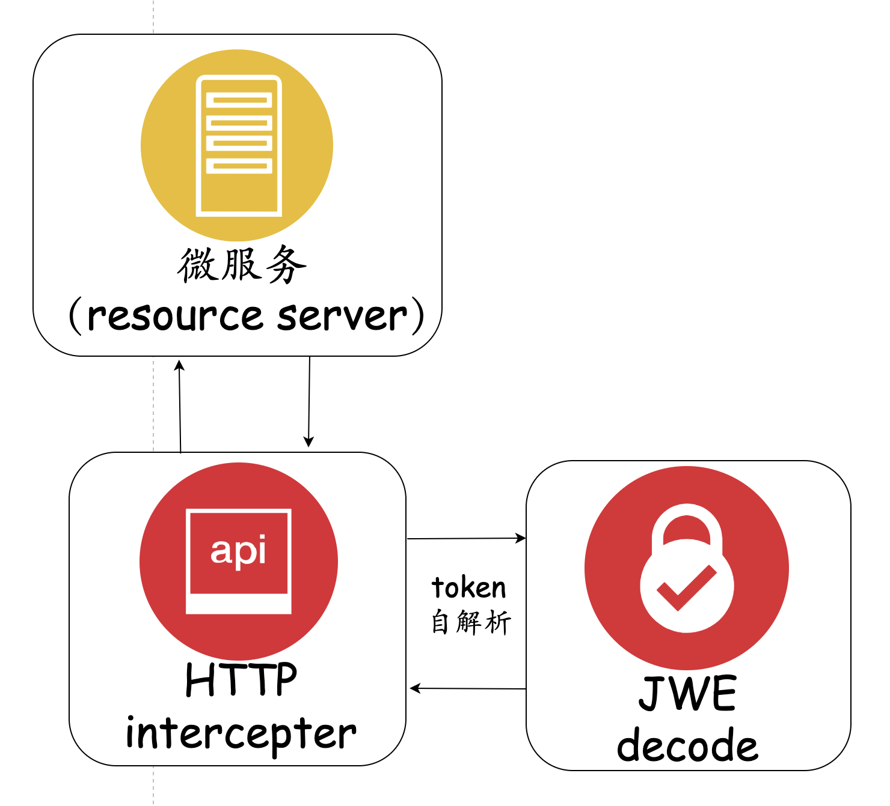

一次性 token
--------------------------------

对于一个庞大的微服务系统来说，可能不仅仅有浏览器、移动端，还包括类似于 CLI（Command-Line Interface）的应用程序。因为此类应用程序的特殊性，他们无法正常的通过页面重定向的方式与认证服务和授权服务交流，因此，我们设计了一种一次性 token 的交互模式。

用户会被要求用浏览器申请一个特殊的 url，得到一个有限时长的一次性 token，CLI 应用可以使用这一个 token 来正常的从网关访问后端微服务。


其背后是一个独立的 OAuth client 在做支撑，这个 OAuth client 会以授权码模式先申请身份认证服务（OIDC ），得到 ID token 后再在后端直接申请授权服务（OAuth ）获取 JWE token，并将两个 token 保存在 redis 中，并生成一个 unique ID 作为一次性 token 返回。同时用一个 job 来进行 token 过期前的刷新，以确保一次性 token 可以在其较长的有效时间内一直保持其有效性。

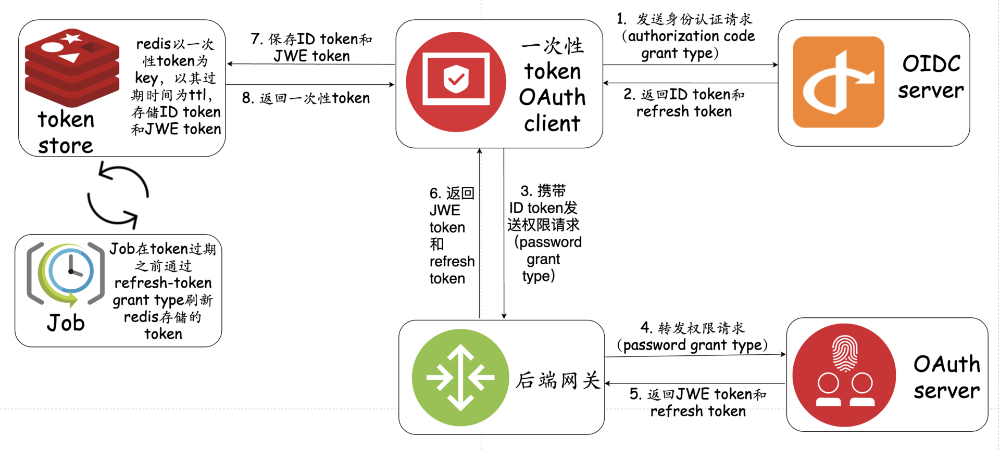

而微服务网关在接收并识别出一次性 token 后，会直接请求这个特殊的 OAuth client 来获取其真正的 ID token 和 JWE token，再进行验证并申请转发微服务。

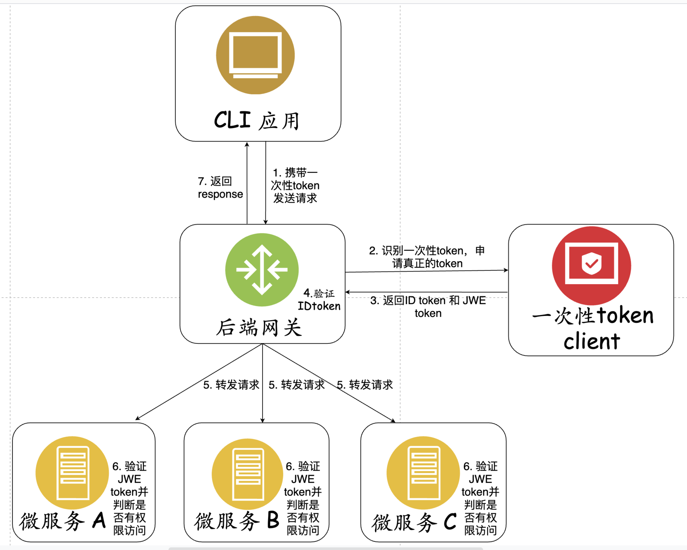

这种方式巧妙的避免了类似 CLI 应用在界面交互上的限制，并能以一个较长的时间使用一个 token 来作为用户凭证访问微服务，拓展了这个微服务系统的涵盖范围。

[](#后记 "后记") 后记
==============

本文详细描写了在微服务架构下，针对不同的应用场景，如何实现基于 OIDC 协议和 OAUTH2.0 框架的认证和授权，通过引入 JWE token，将用户授权信息在微服务架构下以自解析的方式完成权限传递，使得单个微服务能够更加容易的将用户权限用于自身的业务逻辑中。基于标准协议和框架的设计，使得该系统可以很容易的集成到现有的认证和授权系统中，而不需要对原有认证和授权系统做大的修改，这样的设计也减少了复杂微服务系统对于授权系统的依赖，更加简洁和高效。

参考资料：

[https://insights.thoughtworks.cn/api-2/](https://insights.thoughtworks.cn/api-2/)

[https://www.oauth.com/](https://www.oauth.com/)

[https://www.cnblogs.com/linianhui/p/openid-connect-core.html](https://www.cnblogs.com/linianhui/p/openid-connect-core.html)

[https://www.ruanyifeng.com/blog/2014/05/oauth\_2\_0.html](https://www.ruanyifeng.com/blog/2014/05/oauth_2_0.html)

[https://www.jianshu.com/p/50ade6f2e4fd](https://www.jianshu.com/p/50ade6f2e4fd)