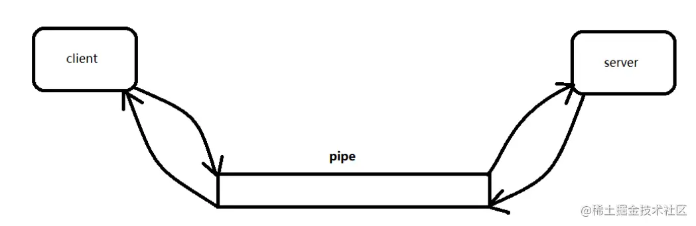
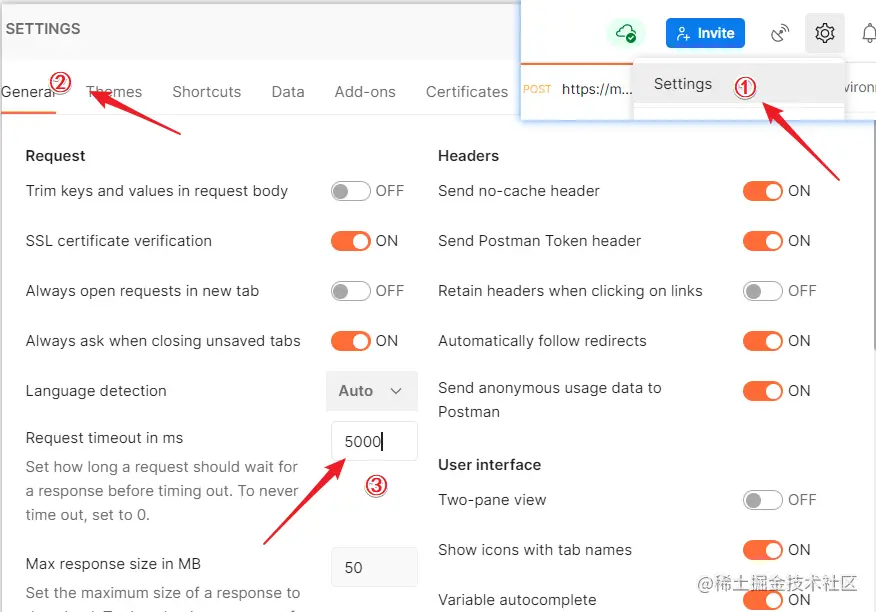
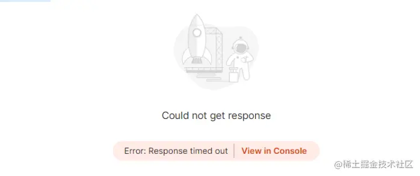

## 问题描述

最近遇到的一个小问题，希望对你有帮助。前几日在排查一个问题的时候，看到有几台服务器上日志偶发会打印这个错误 `Caused by: java.io.IOException: Broken pipe` 。 ​


下面贴了详细堆栈信息，信息内容较多做了一点删减，可以滑动查看：

```
org.apache.catalina.connector.ClientAbortException: java.io.IOException: Broken pipe
        at org.apache.catalina.connector.OutputBuffer.realWriteBytes(OutputBuffer.java:356)
        at org.apache.catalina.connector.OutputBuffer.flushByteBuffer(OutputBuffer.java:825)
        at org.apache.catalina.connector.OutputBuffer.append(OutputBuffer.java:730)
        at org.apache.catalina.connector.OutputBuffer.writeBytes(OutputBuffer.java:391)
        at org.apache.catalina.connector.OutputBuffer.write(OutputBuffer.java:369)
        at 
        at java.lang.Thread.run(Thread.java:748)
Caused by: java.io.IOException: Broken pipe
        at sun.nio.ch.FileDispatcherImpl.write0(Native Method)
        at sun.nio.ch.SocketDispatcher.write(SocketDispatcher.java:47)
        at sun.nio.ch.IOUtil.writeFromNativeBuffer(IOUtil.java:93)
        at sun.nio.ch.IOUtil.write(IOUtil.java:65)
        at sun.nio.ch.SocketChannelImpl.write(SocketChannelImpl.java:471)
        at org.apache.tomcat.util.net.NioChannel.write(NioChannel.java:134)
        at org.apache.tomcat.util.net.NioBlockingSelector.write(NioBlockingSelector.java:101)
        at org.apache.tomcat.util.net.NioSelectorPool.write(NioSelectorPool.java:157)
        at org.apache.tomcat.util.net.NioEndpoint$NioSocketWrapper.doWrite(NioEndpoint.java:1276)
        at org.apache.tomcat.util.net.SocketWrapperBase.doWrite(SocketWrapperBase.java:670)
```

看堆栈信息是在写数据的时候，抛出了 IOException 异常，然后被 tomcat 中捕获抛出 ClientAbortException: java.io.IOException: Broken pipe。 ​

跟踪了整个调用，发现业务处理是正常的，服务端也打印了响应需求返回的数据，但就是报了这个错误。还是怕这个异常对业务产生影响，于是检查了一下抛出这个异常产生的前后日志，发现只有一个接口会有这个问题。但这个也是偶现的，并不是每次请求就会抛这个异常。这更加让人迷惑。 ​

## 原因分析

于是去查了查相关资料，简单说一下Broken pipe。服务端向客户端的socket连接管道写返回数据时，**链接（pipe）却断了！** 出现这个异常的可能原因：

> 1、客户端请求服务器数据，服务器突然挂了；  
> 2、Tomcat的connector在执行写操作的时候发生的，客户端读取超时关闭了连接,这时候服务器端再向客户端已经断开的连接写数据时就发生了broken pipe异常！

服务端肯定是没有挂的，可以排除第一点。  
那就是第二点了，大概率应该客户端自己的问题嘛，你断开了连接导致的我服务端没法写回数据了，然后就异常了，这是不是可以甩锅了~ ​

## 模拟验证

秉着“科学严谨”的甩锅思路，对比了这个接口正常和异常情况下，入参和出参，以及响应时间。发现正常情况下响应时间10s，异常情况下响应时间高达40s，并且响应的数据量巨大。因为这个接口是第三方调用的，简单推测，应该是第三方调用此接口的时候设置了超时时间，超时后关闭了连接，导致服务端没法写出数据，异常了。 ​

既然是这样那我自己验证一把，看是不是这个问题，找出出现异常的调用入参，使用Postman模拟第三方调用，看一看会发现什么。

> 软件环境: Spring Boot 2.0.3 Tomcat8 JDK8 Nginx代理

**场景1：Postman不设置超时时间，发送请求。** 结果: Postman响应正常，服务端也没有打印出异常信息 ​

**场景1：Postman设置超时时间，发送请求。** 

> 设置请求应等待多长时间]超时前的响应。默认0，永不超生，这里我设置了5s

**结果**：postman没有收到响应，5s后直接异常，Response time out。 等了一会服务端处理完后，服务端打印出`broken pipe`异常信息。 ​

**场景3**：**Postman设置超时时间，发送请求后，立马关闭Postman进程。** **结果**：查看日志，发现也报了 Broken pipe 问题。

上面这个场景模拟下来，服务端业务都完成处理成功，就是在响应的时候出现了异常。那直接看一下异常那块的代码吧。`org.apache.catalina.connector.OutputBuffer#realWriteBytes`

```
/**
     * Sends the buffer data to the client output, checking the
     * state of Response and calling the right interceptors.
     * 将缓冲区数据发送到客户机输出，检查Response的状态并调用正确的拦截器。
     * @param buf the ByteBuffer to be written to the response
     * buf -要写入响应的ByteBuffer
     * @throws IOException An underlying IOException occurred 
     * IOException -底层IOException发生
     */
    public void realWriteBytes(ByteBuffer buf) throws IOException {

        if (closed) {
            return;
        }
        if (coyoteResponse == null) {
            return;
        }

        // If we really have something to write
        if (buf.remaining() > 0) {
            // real write to the adapter
            try {
                coyoteResponse.doWrite(buf);
            } catch (IOException e) {
                // An IOException on a write is almost always due to
                // the remote client aborting the request. Wrap this
                // so that it can be handled better by the error dispatcher.
                throw new ClientAbortException(e);
            }
        }

    }

```

当执行到 `coyoteResponse.doWrite(buf);` 这里的时候，调用JDK方法去执行`sun.nio.ch.FileDispatcherImpl#write0`， `write0`是一个**native**的方法了，看看发生异常时候的注释内容：

> // An IOException on a write is almost always due to // the remote client aborting the request. Wrap this // so that it can be handled better by the error dispatcher.

大致的意思是：**写时的IOException几乎总是由于远程客户端中止请求而导致的**。将其包装起来，方便程序可以更好地处理它。 ​

这里就不继续深入卷了，感兴趣的伙伴可以在看看网络Socket，或者经典书籍《UNIX网络编程卷1》。

## 解决方案

这个异常，对于服务端来说，并没有多少影响。到这里大致的处理方案就知道了

- 1、延长客户端超时时间
- 2、合理优化服务端接口代码，提升，降低响应时间和返回数据量