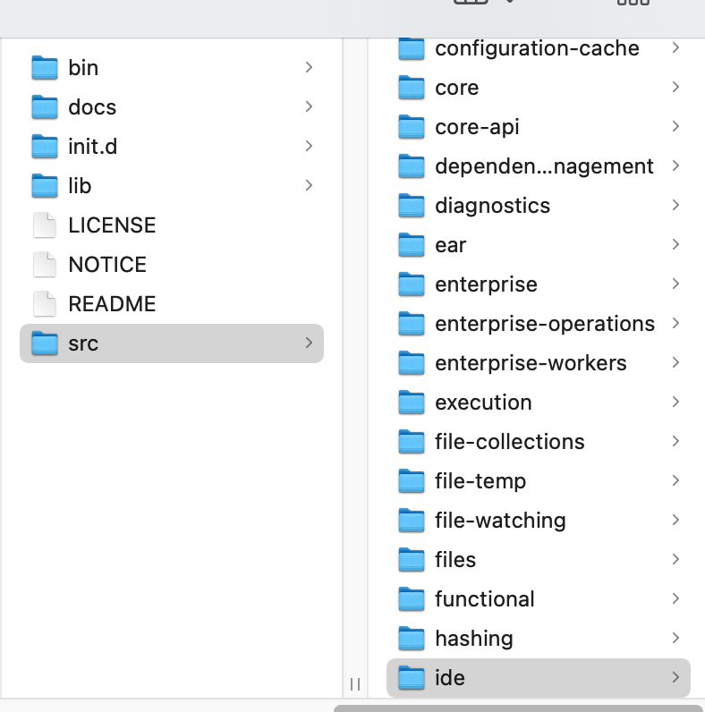
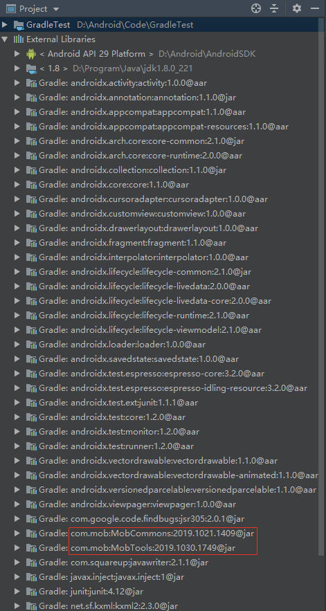
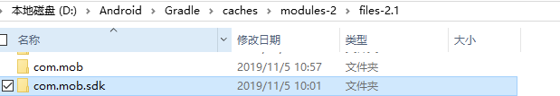
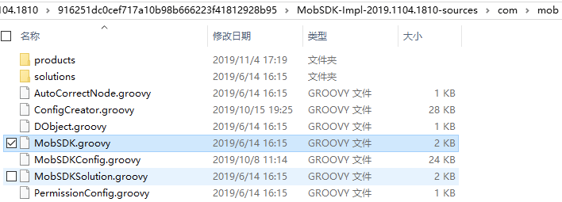

[插件仓库](https://plugins.gradle.org/)

com.katalon - 只有二进制文件

ideaPlugin - 官方插件  


其他的都可以按照这种方式确认源码。

----

在进行自定义 [Gradle](https://so.csdn.net/so/search?q=Gradle&spm=1001.2101.3001.7020) 插件开发的过程中，  
除了查阅官方文档，在网上搜索开源插件源码以外，还有一种方式可以获取到一些公开的插件的源码。

首先我们平时通过 `apply plugin: 'com.android.application'` 引用的 android 这个插件的 [插件仓库](https://plugins.gradle.org/) 我们可以从 aosp 代码仓库里面找到，传送门（这里给的是 `android-10.0.0_r11` 的，历史版本可以自行查找，需要 fan qiang）

比如下面 firebase 用到的 google-service 插件也可以从 aosp 中传送门找到

```groovy
apply plugin: 'com.google.gms.google-services'
```

接着就是一些商用或者非商用 sdk 使用到的 gradle 插件了，往往我们比较好奇这个插件里面到底干了啥，或者刚好它有个好用的功能我也想借鉴一下，那么看其源码肯定是最直接好用的办法。

下面举个例子，比如：**ShareSDK**

按照 [官方文档](https://www.mob.com/wiki/detailed?wiki=ShareSDK_Android_Title_ksjc&id=14) 流程，依次完成以下两步：  
打开项目根目录的 build.gradle，在 buildscrip–>dependencies 模块下面添加

```groovy
classpath 'com.mob.sdk:MobSDK:2018.0319.1724'

buildscript {
    repositories {
        ...
    }
    dependencies {
        ...
        classpath "com.mob.sdk:MobSDK:2018.0319.1724"
    }
}

```

在使用到 Mob 产品的 module 下面的 build.gradle 文件里面添加引用

```groovy
apply plugin: 'com.mob.sdk'

```

添加依赖应用插件完毕后，点 AS 右上角的”sync now”同步一下  
同步完成后首先在 AS 左侧的 Project 视图中 `External Library` 下面找找看是否有 ShareSDK 他家的 sdk 引入，如下表示引入成功。  


既然引入成功了，因为他们的插件名称叫 com.mob.sdk，那么这个插件就一定缓存到我们 PC 本地了，所以用这个名字搜一下即可 (Windows 下有 Everything 这个工具简直完美), 很快就能在 gradle 的缓存目录找到这个插件，如下图 (我这里修改了 gradle 的默认位置，Windows 一般会在 C 盘：`C:\Users\xxx\.gradle\caches\modules-2\files-2.1` 下面，Mac 一般在 `/Users/xxx/.gradle/caches/modules-2/files-2.1`)，  


找到插件位置后，在目录下继续找，会找到一个 xxx-source.jar 的文件，这个就是插件源码打成的 jar 包，实际就是个压缩文件，包含了插件 groovy 源码，解压即可，源码带注释真香 ing。  


既有攻，自由破，如何规避源码泄露呢（jar 混淆防护请另行考虑）？  
常规的上传插件到 Jcenter 仓库过程中，大家习惯性的套用网上公开的方法，其中肯定有这么一段代码：

```groovy

task sourcesJar(type: Jar) {
    from project.file('src/main/groovy')
    classifier = 'sources'
}
artifacts {
    archives sourcesJar
}
```

现在一看不用想这就是我们的源码泄露的罪魁祸首了。常规的打包 jar 包大概是这样的：

```groovy
jar {
    sourceSets {
        main {
            java.srcDirs = ['src/main/java','src/main/groovy']
        }
    }
    manifest { attributes 'Main-Class': 'xxx.xxx.xxx' }
}
```

一个插件、一个 library 发布后真正有用的也是这个 jar 包了，上面的 sourcesJar 完全没必要发布，所以根本就没必要加那段打包 sourcesJar 的代码了。如果担心检测不通过啥的，也很简单，只要把 sourcesJar 这个方法稍微改一下，把里面的文件指向一个空的 groovy 文件也可以，如:

```groovy
task sourcesJar(type: Jar) {
    from project.file('src/main/groovy/xxx/xxx/xxx.groovy')	//这里用个空壳子就行了
    classifier = 'sources'
}
//或者
task sourcesJar(type: Jar) {
    classifier = 'sources'
}
```

这样就可以生成一个只包含 xxx.groovy 与 META-INF 的 jar 包或者只有 META-INF 的 jar 包。