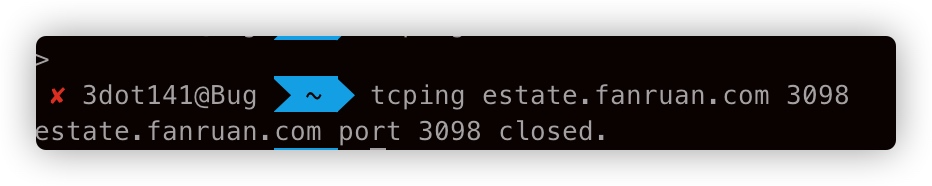
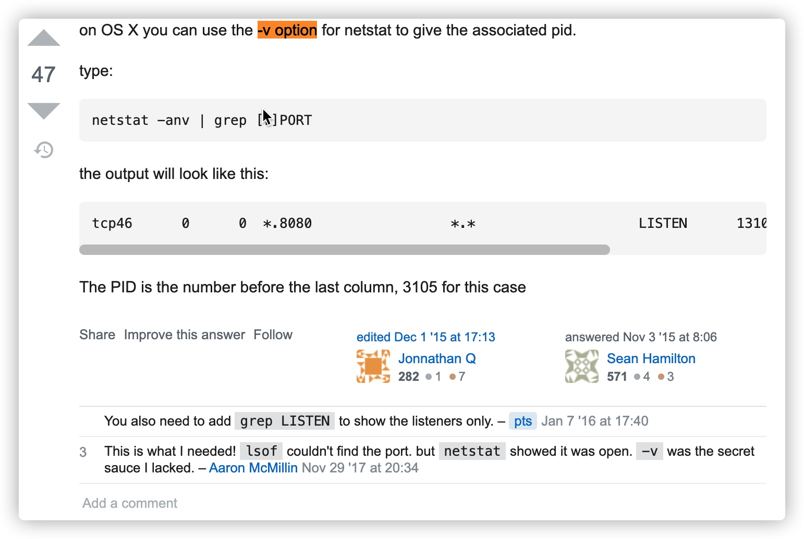

1.你可以使用 lsof 命令来查看某一端口是否开放。查看端口可以这样来使用，我就以 80 端口为例：  
lsof -i:80  
如果有显示说明已经开放了，如果没有显示说明没有开放

2.netstat -aptn 执行看看，是否监听在 0.0.0.0:3306  
netstat -nupl (UDP 类型的端口)  
netstat -ntpl (TCP 类型的端口)  
例如

4.telnet ip port 方式测试远程主机端口是否打开  
5.tcping ip port  

## macos netstat 发现端口的占用 pid

