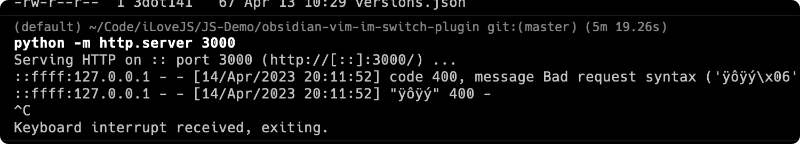
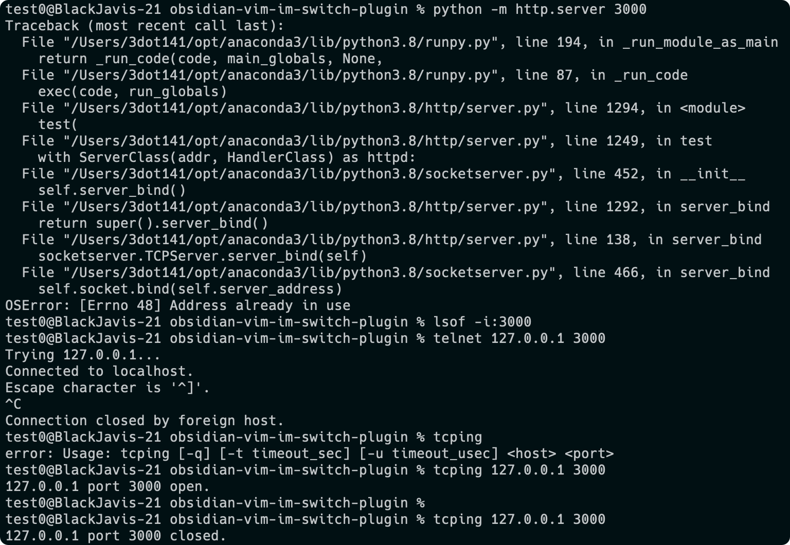

流程为

- user1 开启 python 服务，占用 3000 端口
- user2 尝试通过 lsof -i:3000 获取该进程
	- 失败，无法跨用户权限进行获取
- user2 尝试通过 python 服务，再次占用 3000 端口
	- 失败，端口为系统级别，不收用户权限影响
- user2 尝试通过 telnet tcpping 进行信息传递
	- 成功，端口可以作为不同用户的传递通道