> 理解新范式 拥抱新时代 把握新机会 （2023.4.20 浙大分享——独家内部分享） 主讲人：陆奇，奇绩创坛创始人兼 CEO https://miracleplus.feishu.cn/docx/CS8ydhVISokvnaxUAQ5c2OvynbP 密码：HRtD 

# 路奇AI分享稿

## 新拐点新范式

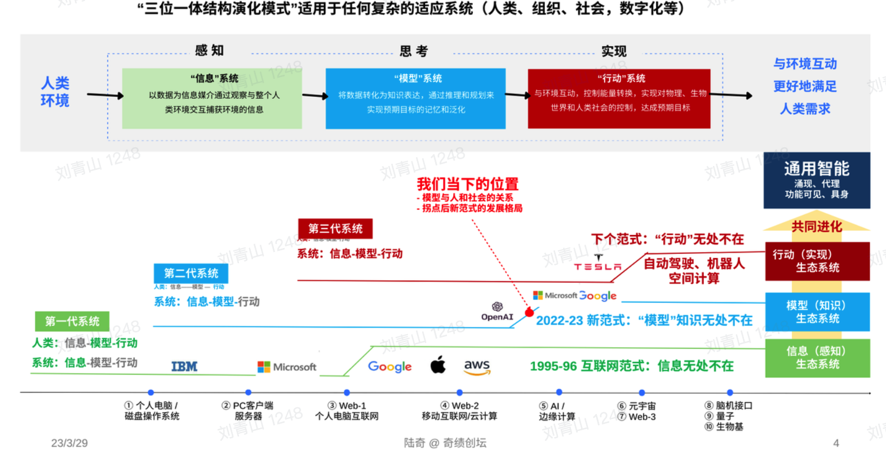

### 搬运信息

首先我先讲一下上面这张图，“三位一体”，本质上是讲任何复杂体系。人、组织、公司、社会、甚至数字化本身的数字化体系，都是复杂体系。​

- 那么“三位一体”是什么？​
	- 第一，“信息”子系统（subsystem of information），从环境当中获得信息。​
	- 第二，“模型”子系统（subsystem of model），对信息做一种表达，来做推理和规划。​
	- 第三，“行动”子系统（subsystem of action） ，我们最终是要跟环境做交互，达到人类想要达到目的。

这张图上，底层是不同时代的数字化平台，绿色的是信息系统，蓝色的是模型系统，红色的是行动系统。数字化和人分不开——人要获得信息，人要表达信息，人要做行动，解决问题和满足需求。基于此，我们可以得出一个简单结论——今天的大部分数字化的产品和公司，包括谷歌、微软、阿里、字节，本质上都是信息搬运公司。大家一定要记住我们所做的一切，包括在座的大部分企业都是在搬运信息。 **Nothing more than that, You just move bytes.**  
 **第一点是——我们所做的一切基本上都在搬运信息，但已经做的足够好，以至于改变了世界** 

### 拐点出现

第二点，我们看到 1995 年 -1996 年，那时候我刚刚从 CMU（卡内基梅隆大学，位于美国比兹堡）毕业。通过 PC（personal computer 个人电脑），互联网迎来了一个拐点。为什么会有这个拐点？为什么会有大量的爆发式增长？把这个拐点搞清楚了，你也能理解今天 OpenAI 所代表的新范式。​

当时，大量公司层出不穷，其中诞生了一家伟大的公司叫谷歌。 **获取信息的边际成本开始变成固定成本** ，一定要记住这点， **任何改变社会和产业，永远是结构性改变** 。这个结构性改变的往往是一类大成本。​

我举个例子，就很能说明问题。我在 CMU 念书的时候，要离开比兹堡，就得买一张 3 美元的地图。但是在今天，我如果要一张地图指导我去想去的地方，成本几乎为 0。虽然还是有价格，但是都变成了微不足道的固定价格。​

谷歌平均一年付 10 亿美元做一张地图，但是每个人、每个用户，要获得地图的信息，基本上代价都是 0。也就是说当获取信息成本变 0 的时候，它一定改变了所有的产业。这就是过去 20 多年发生的。在今天，什么信息基本上都是免费的，且无处不在 。​

谷歌为什么伟大？因为它把边际成本变成固定成本了，这是这个拐点的关键。信息获取的边际成本不是没有了，而是从 **margin cost become fixed cost（边际成本变成固定成本）** ，这是一定要关注的。 ^n4p091

那现在这个时代不可阻挡的拐点是什么？ **是大模型，它也从边际成本走向固定成本** ，和互联网改变世界的结构是一模一样的。

为什么模型这么重要？ 因为模型和人是有内在关系的。因为我们每一个人都是三种模型的组合——​

- 第一，认知模型，我们能看、能听、能思考、能规划。​
- 第二，任务模型，我们能爬楼梯、搬椅子、剥鸡蛋，我们有一大堆的任务模型。​
- 第三，领域模型，我们可以是医生、律师、码农等。

我们对社会的所有的贡献都是这三种模型的组合，我们所有的价值也都是这三种模型的组合。因为我们今天每个人不是靠我们手和腿的力量来赚钱的，而是靠脑袋。​

> note: 这里也比较有趣，我们可以依靠手和腿的力量赚钱的，这叫脱下孔乙己的长衫。

简单想一想，我们每个人，如果你没有自己的思考和见解， **你的一些通用能力都能在大模型里逐步找到，未来唯一有价值的是独到的见解** 。所以这一次的变革影响每一个人，同时影响整个社会，因为人类每一个需求都是有模型的，所以这对任何产业都有深远的影响。

那下一个拐点是什么？下个拐点将是 **自动驾驶 + 机器人 + 空间计算** 的组合，也就是说 **人在物理空间当中行动的代价也从边际成本走向固定成本** 。

最后讲一下，我们所看到的 **三个拐点** 。​

一、今天信息已经无处不在了，接下来 15 年到 20 年，模型将会让知识无处不在，手机上一联网，模型就过来了，教你怎么去解答法律问题、怎么去做医学的检验。​

二、在未来，自动化、自主化的动作也可以无处不在。​

三、人和数字化的技术需要共同进化。这是 Sam 最近经常讲的，必须共同进化，才能达到通用智能。因为通用智能必须有四大要素​

1. 涌现 emergence：指万物互联、互动和自组织的特性。通过这种特性，AGI 可以从复杂系统中涌现而出；人类和动物也都是通过这种特性实现生命的智慧。
2. 代理 agency：指在特定环境中进行有目的的行动，可以理解为智能体。AGI 需要像人类一样具有代理能力和目的性，能够通过各种手段来实现自己的目标。
3. 功能可见性 affordence：指环境向智能体提供一种功能上的提示或指引，使得智能体可以更容易、更准确、更有效地完成任务。
4. 具象 embodiment：指 AGI 需要具有真实性和物理决策，即将其嵌入到具体的环境、行为和经验中，从而使其能够更好地理解现实世界。例如，人类使用手、眼睛、听觉等生理器官来感知和理解世界，AGI 也需要通过物理载体来感知和理解环境。

不然就不叫智能，只有这样才能实现真正更长期的通用智能。  

## 新范式的历史背景

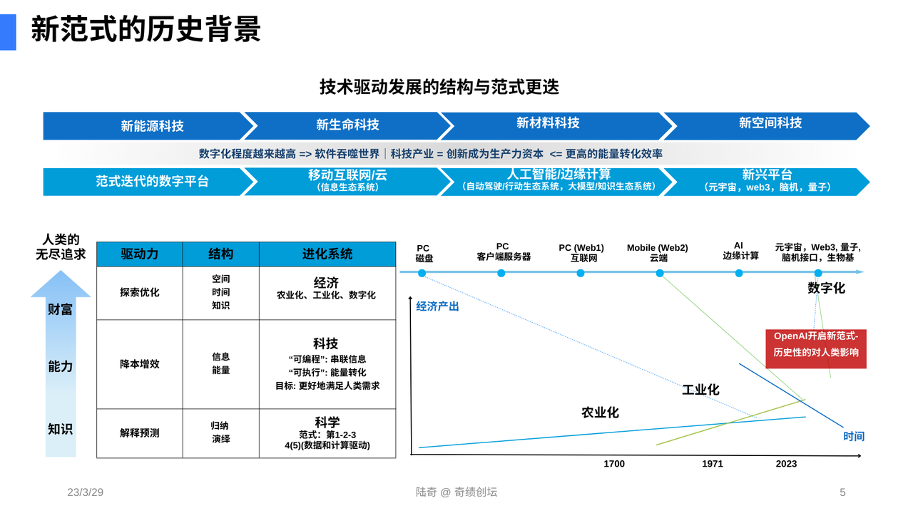

接下来我们来讲，大模型对每个人、每个产业的影响。​

今天这个拐点虽然很伟大，但它也是技术驱动历史进展的一个环节。​

这张图我经常讲——人类社会毫无疑问是技术驱动的。首先，是科学到技术到经济发展体系，有农业体系，工业体系到数字化这条蓝色曲线，然后数字化通过平台来驱动物理世界、能源、材料科学、物理过程转化能源、生命科学转化能源，最后是物理空间。​

核心是当中这条——数字化和新的能源技术为什么会越来越快地驱动世界？一个公司只要是以软件、算法为主要创新点的，那它本质上就把创新变成真正的生产力了。为什么特斯拉是一家 Tech（科技）公司，而福特不是，本质的区别也在这里。​

因为 **科技本质上是用更高的能源密度、更高的信息密度** 去改变世界。所以 OpenAI 所开启的新范式会对人类产生很大的影响。

> note: 首先是体系：农业 - 工业 - 数字化。然后在数字化中，如何融合物理世界呢？能源、材料、生命、最后是物理科技。这些行业的数字化程度越来越高。

## 新范式的社会影响

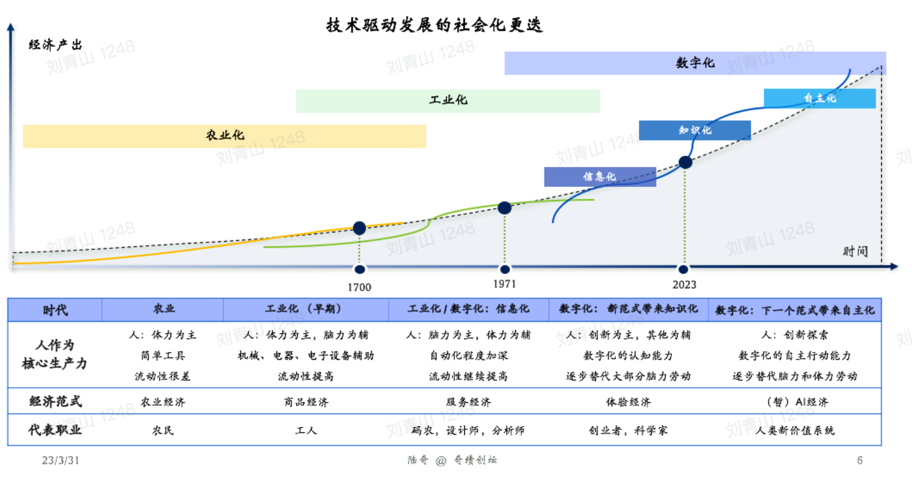

从技术的进步和社会经济发展的格局来看。首先从农业时代开始，人要做简单的劳动。最大的问题是人是缺少流通性，人没有自由，跟土地绑定在一起了。​

工业发展对人最大的改变就是人开始移动了。早期的工业体系以体力劳动为主，脑力劳动为辅。但随着机械化、电气化、电子化，体力劳动的比例越来越下降。信息化时代开始以后，人都是以脑力劳动为主，开始从商品经济转向服务经济——码农、设计师、分析师成为这个时代的典型职业。​

但这一次大模型拐点，会让所有在服务经济中的人、所有的蓝领都受影响。因为他们都是模型，除非一个人有独到的见解，不然大模型里面都有。所以，下一时代的典型的职业，我们认为是创业者和科学家。

> 最后， AI 时代的经济体系。在 YC 中国的时候，我是负责 YC 研究院的，YC 研究院现在改名叫 Open Research。我现在还是 Open Research 的院长，只不过我不在上面花时间。我不方便讲太多，但可以简单讲几句——YC 研究院有很多研究项目在进行，其中有一个就是 [全民基本收入 (豆瓣)](https://book.douban.com/subject/35651849/)，就是如果社会每个人都有钱，都不需要工作了，那么人会怎么做？这也是 Sam 之前 interview（接受采访）的时候也提到的。

## 新范式缔造者大事记

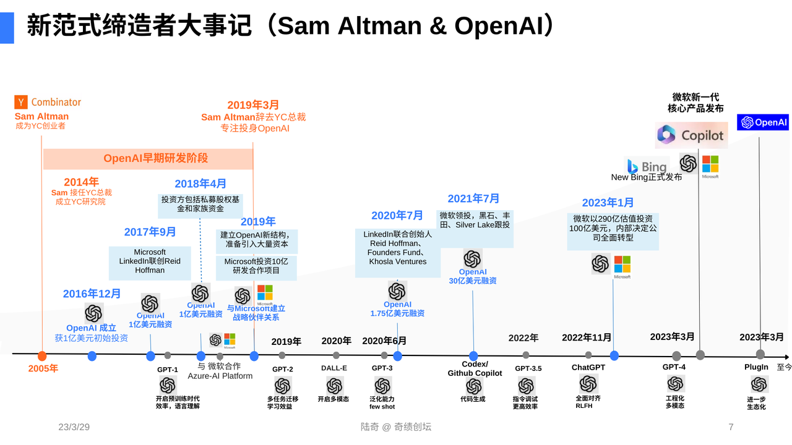

- OpenAI 的股权结构  
	- 他知道要融很多钱，但因为股权设计有一个很大的挑战，就是容易把回报和控制混在一起，所以他要设计一个结构，能够让他不受任何股东的制约。于是，OpenAI 的投资者就是没有控制权的，他们的协议是一种债的结构，OpenAI 每赚一块钱，比方最初的两毛五到你这边去，接下来三毛到你这边去。如果是赚完两万亿，接下来都是 non-profit（不再盈利了），一切都回归社会。
- 这一块儿可以和 [GPT 原理总结](GPT%20原理总结.md) 一起来看

## 新范式背后的动力引擎

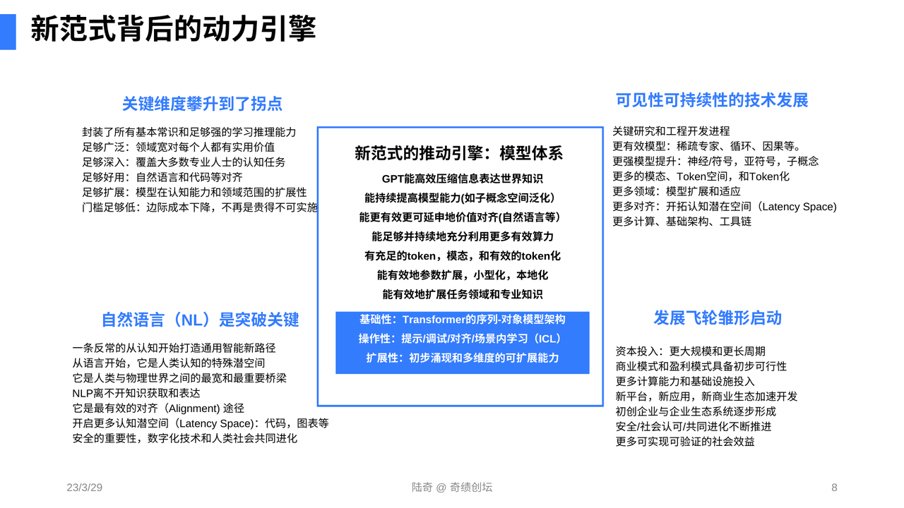

## 新范式发展的关键路径

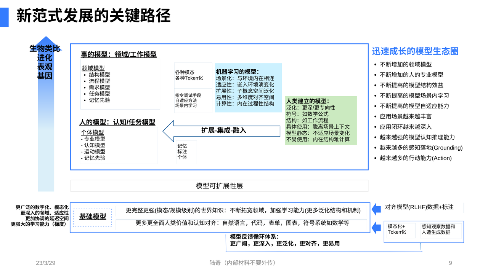  
 **发展路径核心是模型的可延伸性和未来模型的生态，是一个模型无处不在的时代。** 
- 基础模型
	- 一是更多、更完整的模态和更多完整的世界知识都放在这里
	- 另外也一定要做更多的对齐
- 更多的模型
	- 第一，事的模型，人类每一类需求都有领域/工作模型，其中有结构模型、流程模型、需求模型、任务模型、尤其是记忆和先验；​
	- 第二，人的模型，包括认知/任务模型，它是个体模型，其中有专业模型、认知模型、运动模型和记忆先验。
- 人的模型和学的模型之间本质的区别
	- **人表达知识倾向于运用结构，但是真正能解决问题的是过程，人不适合用过程来表达。** 

# 3. 把握新机会

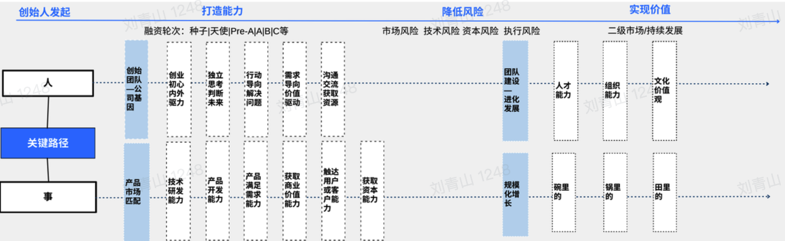

## 新人才组织

首先讲核心创始人，一号位、二号位。今天创始人的技术能力强，好像很牛很重要，未来真的不重要，技术方面 ChatGPT 以后都能帮你做。你作为核心创始人，你越来越重要、越来越值钱的，我们把它叫做愿力和心力。愿力是对于未来的一个独到的判断和信念。  
能力以后越来越是 table stakes，因为大量的技术都可以帮你做。所以， **愿力和心力** 、独到的信念和理念、坚持、强的韧劲，这是未来的创始人越来越重要的核心的素质和素养。我们在奇绩内部讨论，比如我们想请梁宁老师过来，梁宁老师来过一次奇绩，她在愿力、心力、能力三部分有系统的研究，可以帮助咱们的每一个校友更多地开拓自己的特殊素质，在未来的创业生态当中能够有更多的价值。

> 梁宁 产品思维 30 讲

## 事的机会面

- 首先，在事情上要这样，首先把控方向。你要不要换方向，你自己决定。因为它会有全新的赛道，过去没有的赛道会出来。你得看看这是不是跟你足够近，你有没有能力去做。还有一些产业链在变更，有些地方加快了，有些地方的结构改了。国际也有新的环境。如果我们用中文大模型，跟其他国家之间关系会怎么样？韩国也好，日本也好，东南亚等等。方向上，一定要想想是不是对你有影响。​
- 第二，在阶段上把控。今天可能你已经在做了，产品做到一半，本来是想下个产品是这样的，那是不是要调整？甚至是否这个阶段就要调整？“碗里”是什么，“锅里”是什么，尤其是“田里”是什么，一定要系统性地去思考。​
- 第三，在结构上要把控。上游、下游很多情况下会变，中游也有可能要变。如果产业整个链条变，你有机会。我举个简单例子，产业链是一定会变的。过去产业结构某种意义上跟成本结构有关。[信息获取的机会成本变 0 之后，大家想想谷歌做了什么？](#^n4p091) 谷歌做了 Android，free，操作系统变成免费了。产业结构变了没有？它做 Chrome book ，做硬件基本上只收成本，为什么？它在这条链条上，它钱在那里赚了。所以今天如果模型都变成基本，哪些链条会被压扁了，结构会变了，你都要分析，历史上都有案例。大家需要的是勤奋，去思考，去分析，看哪一些结构链条要变了，我该怎么运作，去赞助更有创新机会那一端。​
- 最后是业务的把控。产品是不是要调整，价值点在哪里？产品的形态，比如是不是要加一个副驾驶员？我是不是要改变我的产品的表达形式？商业模式是不是要改？我怎么做增长？是不是都要做调整？这一系列的问题，我建议每位同学都要花时间，没法不花时间，不然对不起自己。

### 整体系统性探索框架

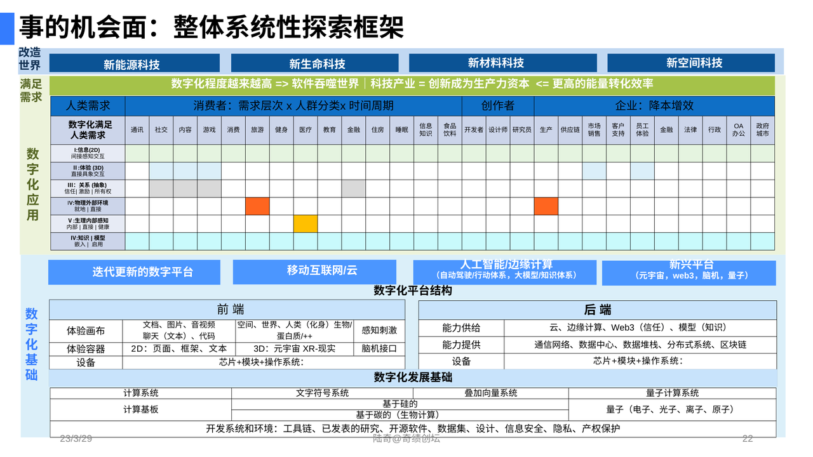

首先，底层是数字化的技术，因为数字化是人的延伸。数字化的基础里面有平台，有发展基础，包括开源的代码，开源的设计，开源的数据；平台有前端、后端等等。这是第一组，这里有大量的机会，我们有很多创业项目都在这里。比方做基础设施的，做芯片的，做算力的，做开源代码的，不管是做什么，有一波创业公司在这里。​

第二波是用数字化的能力去解决人的需求。我们把数字化应用完整放在这张表上。C 端，就是把所有的人分成人群，每种人群 24 个小时他们花时间干什么？基本上是这样：有通讯，有社交，有内容，有游戏消费、旅游、健身等等。这些全是 C 端的。 C 端里面有一类特殊的人， YC 也好，微软也好，我个人强烈建议大家一定要关注。这类人是改变世界的人， **他们是码农，是设计师，是研究人员** ，他们创造未来。这类人的需求往往代表未来。 说实话，微软这么大的公司，就是这样一个简单理念。 **微软相信我们就是要写更多的软件，我们帮助别人写更多的软件，因为写软件是未来。** 相信这么一点，形成这么一家伟大的公司，因为码农是在二维的画布上创造世界。这三类人我们永远关注。​

还有 B 端企业。企业的需求也一样，降本增效。它要生产，它有供应链，它有销售，它有客服等等一系列的东西。有了这些需求之后，我们有数字化的 affordance， 就是数字化的看得见的体验结构，只有 6 种：​

（1）一种是给你信息的，二维就够；​

（2）一种是给你三维交互体验，在游戏里面，在元宇宙；​

（3）一种是人和人之间抽象的关系，信任关系，web 3；​

（4）一种是人在物理世界环境中，自动驾驶、机器人等等；​

（5）一种是人的内在的，用碳基植入到里面，今天是脑机接口，以后是更多东西，可以用硅基，以后是可以用硅基；​

（6）最后，是给你模型。​

数字化的能力只以这 6 种方式来帮助人类、满足人的需求，所以我们有很多企业都在这一波。​

最后，人类是一个挺奇怪的物种。我们不光要满足自己的需求，我们还要改变世界。所以我们在满足需求同时，也要获得更多的能源，所以需要能源科技；需要转化能源，用生命科学的形式， biological process 转化能源，或者是用 mechanical process，材料结构来转化能源，或者是新的空间。​

这是第三波，我们很多创业公司是在这一波。​

所以我们创业公司基本上有三大类别，

- 一类是数字化基础的，
- 一类是用数字化去解决人的需求的，
- 一类是去改变物理世界的

有了大的框架之后，我们可以系统性的来看，对号入座，我是在哪个位置？如果我在这个位置，我需要关注哪些点？

### 数字化基础

- 整体架构
	- 

如果你是做模型的，我现在判断，什么都要重做一遍。大模型为先，同学们。我那天在上海碰到一个原来在做声网的，在美国生活，大家都是串流式视频，stream，未来一定要 **串流大模型** 。我手机上有大模型，我怎么做？串流一个大模型跟串流一个视频的媒体完全不一样，大家都简单想一想。很多设备和容器要重做的，你要支持大模型。这些都有机会。云、中间的基础设施、底层的硬件，包括数字化发展核心的基础，尤其是开源的体系。​

- 新一代基础设施
	- 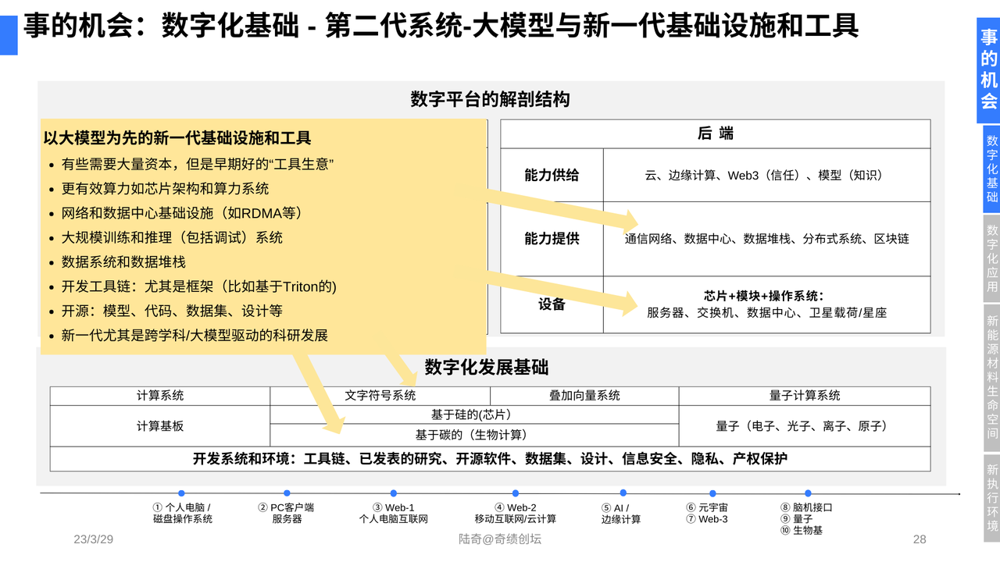
	- 在这个时候，从投资和创业角度看这是最好的生意。为什么？因为这个时代跟淘金时代很像。如果在那个时代你去加州淘金，一大堆人会死掉，但是卖勺子、卖铲子的人永远可以赚钱。这种就是所谓的 shove and pick business。
- 大模型、大平台
	- 平台有所谓的 trible deep economics
		- 以下来自 chatgpt
		- “Triple deep economics”是指平台公司多层次的收入模型。这些公司通过三个层次创造价值：
		- 1. 核心交易层：平台的主要层次，它匹配买家和卖家，并促成交易。例如，Uber 连接乘客和司机。
		- 2. 互补商品和服务层：平台允许第三方提供商向用户提供互补的商品和服务。例如，UberEats 向 Uber 用户提供食品送货服务。
		- 3. 数据层：平台收集用户行为数据，并用它来个性化和改进用户体验。例如，Uber 使用用户数据基于以前的乘车记录来建议目的地。
		- 这些层次的结合创造了一个网络效应，提高了平台的价值，并创造了多个收入流。
	- 
	- 第一，开箱即用。今天 GPT4 和其他 ChatGPT 都做到了，有足够的使用价值。​
	- 第二，一定要有一个足够简单和好的商业模式。真正意义上的平台是开发者可以活在这个上面，他可以赚足够的钱养活自己，不然不叫平台。​
	- 第三，具备自己的杀手级应用程序。ChatGPT 本身是个杀手应用，但是一旦有了 plugin，比如假定 Sam 是一位一般的生意人，他就看哪个 plugin 好，医生这个 plugin 很好，那就把它没收。今天平台公司就是这样，你在苹果生态上做得再好，只要做大，苹果就会把你没收了，因为它要用你底层东西，所以你的平台一般都有它的锚点，它有很强的支撑点。​
- 自主化和自动化大模型及平台机会
	- 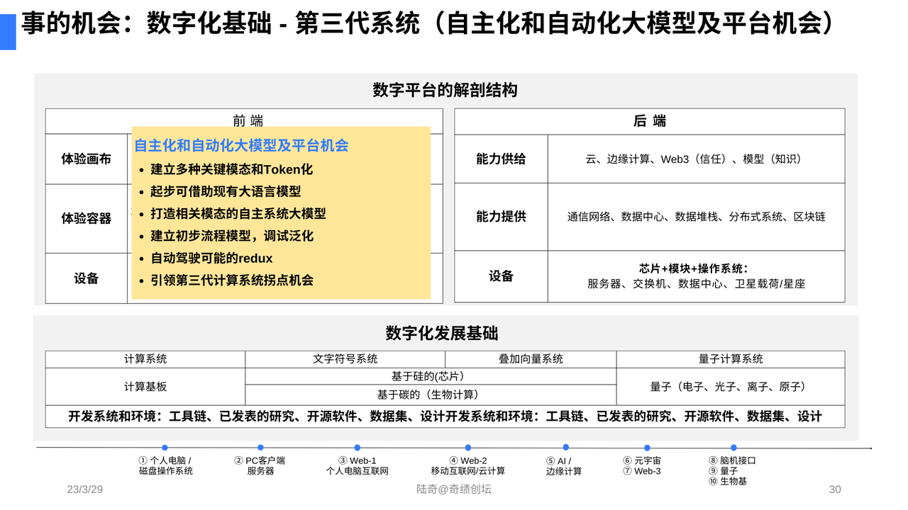
	- OpenAI 和正常世界的演化。在动物世界里面，动物智能先是从视觉智能开始。视觉之前其实是触觉感知，人的认知真正基础其实是触觉，因为盲聋人视觉和听觉两边都关掉，他们还是有智能的，但是没有触觉那就不行了。所以从智能发展角度来讲，OpenAI 是走了倒过来的一条路，是从认知开始，再做另外一个模态，把视觉加进去。
	- 做自动驾驶的公司某种意义上都有重做一遍的新机会。为什么这样讲？因为自动驾驶我也参与过很多。今天的自动驾驶系统，说实话是以视觉为主的，推理也是视觉推理。今天这么强的算力，但我们在路上还是用眼睛看“我在哪里，我没见过这里”这样开车的，对吧？我们人开车轻轻松松，打打电话，听听音乐，这很简单。为什么会简单？本质上我们有泛化能力，泛化能力都在子概念空间里面的。我们看到这东西是一个小狗，它很快跑过去了；这里转弯，还有 5 分钟我才转到那边。它都有推理能力。​
	- 大家关注一下，如果你把语言放进去以后，你对视觉任务的泛化能力一下强很多。不然每天都有大量的视觉训练，每识别一种新的障碍物，都要有大量的数据。但是有了语言之后，它极大地帮你加快泛化

### 数字化应用

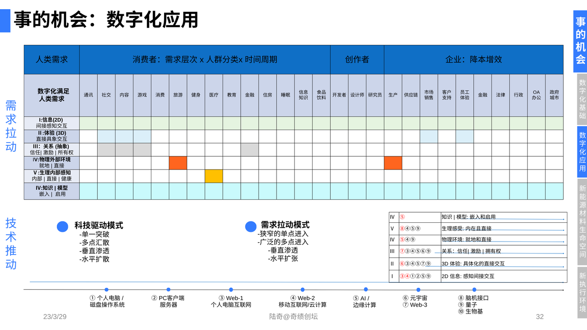

#### 发展趋势

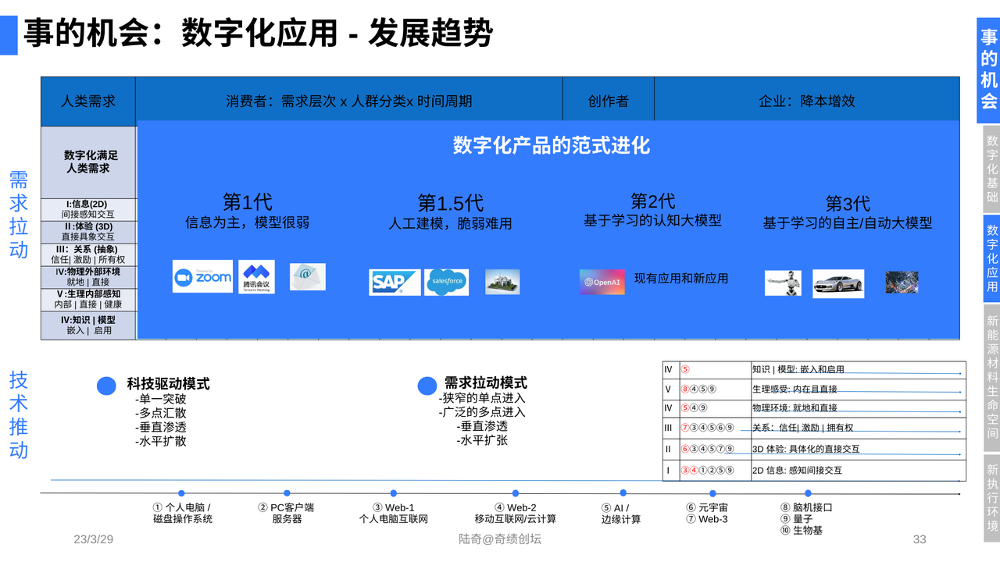

#### 发展过程

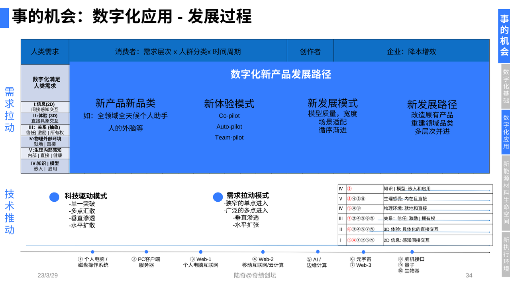

#### 发展机会

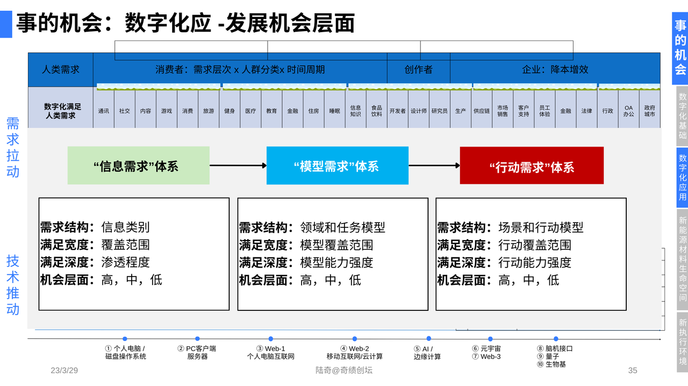

上面画的这张表本质上要拆成 3 个。因为人的需求有些可以用信息来满足，光信息就够了；有些它必须要很强的模型才能满足；有一些模型也不行，它必须要行动才能满足。  
我们可以通过这个思路来进行分析。最后总结出来在我这个赛道里面我有什么样的机会？

> 信息需求/行动需求能进入的方式比较少，模型是目前的大头.正在飞速发展当中

#### 信息知识

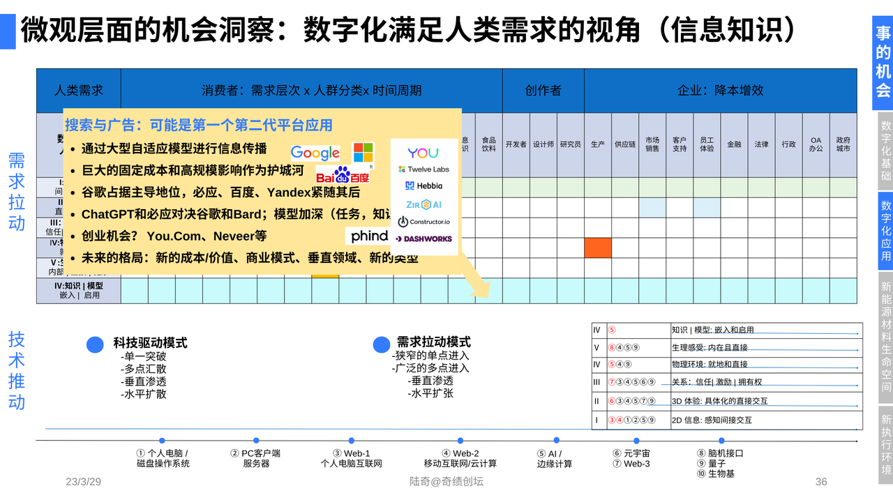

搜索里都分三类搜索，第一类是找信息的，找信息同学们千万不要用 chatGPT，因为我试过好几次，你问这家公司地址在哪里，chatGPT 真的会造一个地址。你要找信息，就这一类东西搜索引擎不会变。但是有第二类搜索，我们都把它叫 transaction 的，或者叫任务搜索，就你其实想要下载个东西，其实想要填个表，其实想要打个电话，这一类 chatGPT 都帮你解决掉了。还有一类搜索大概也是 30% 多，都是研究问题，比方说为什么中东和平这么难？这一堆问题 chatGPT 都可以帮你总结好，你不用看了。 **所以有 60%70% 的搜索的关键词将有大的变革** ，商业模式也会因之而变。​

跟同学们稍微啰嗦一句，就是商场上打仗怎么打？也就是说如果你是第一名，你要做什么？你要把你的固定成本提高。谷歌是第一名，大家记得不记得，谷歌曾经有一段时间把世界上所有的书都扫描进去，2.5 亿美元。为什么？提高固定成本，把第二名干掉。也就是说，竞争，如果你是领先的，就永远提高你的固定成本，因为第二名他赚的钱少，他撑不住，这就死了。但是如果 **你是第二名，你要做什么？你要提高你的边际成本** 。对于第一名来说，我们搜索很好，对话机器人我们早就有，对吧？你到时候找另外一条出路就是。但创业公司也有很多，美国有很多创业公司做出来了，比如 Neveer，[You.com](http://you.com/)，这几位人我个人都认识。某种意义上还是有一定的机会。技术上这两个团队都非常强。

> note  
> 这里说的有两个需要考虑的
> 1. 边际成本和固定成本是什么？
> 	1. 边际成本是指生产或消费一个额外单位产品或服务所需支付的成本，即为每增加一个单位的数量，总成本的增长量。
> 	2. 固定成本是在生产不同数量的产品时，不随着产品数量的变化而改变的成本，无论企业产生多少产品，其固定成本是不变的。
> 	3. 可以简单的理解为：边际成本是处理每个单位产品所需承担的成本增量，而固定成本是不管你增加多少产品，都需要支付的固定费用。
> 	4. 当一家工厂生产汽车零部件时，购买原材料、工人工资以及用于生产所需的设备等是企业的固定成本。而每多生产一件零部件，企业需要支付的材料购买成本、工人加班费等成本增加就是边际成本。如果工厂不生产零部件，工资、设备等成本依然存在，但是边际成本为零，因为没有增加生产原料带来的额外成本。当生产一定数量的产品时，固定成本不变，而边际成本从一开始的较低水平逐渐上升，因为生产较多的产品需要更多的原材料、工人等成本。
> 2. 然后这句话的意思是什么？
> 	1. 增加固定成本，应该是防止第二名超越吧，固定成本越大，第二名要赶上就要花更多钱，但是第二名利润不及第一名，说以他无法赶上。
> 	2. 第二名战线小，第一名战线大。扩展的领域边际成本越高，第一名去补齐第二名的代价就更大。

#### 内容

> AIGC， 暴热的概念

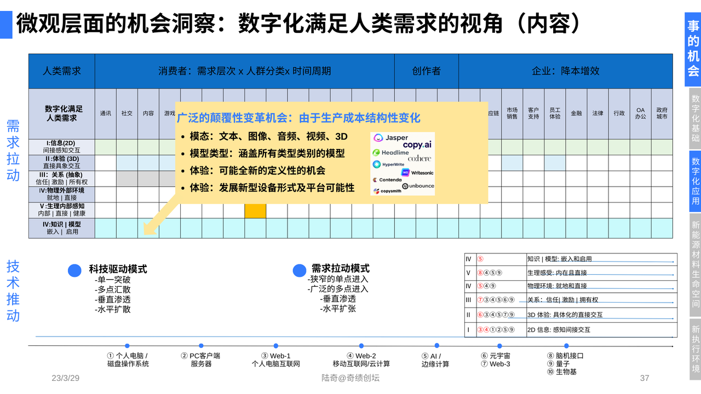

#### 游戏

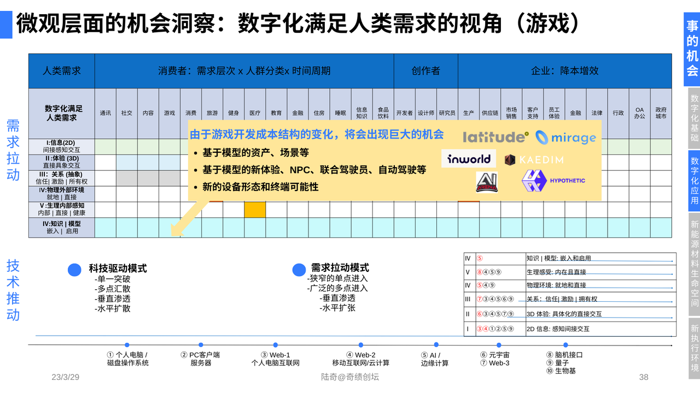

#### 社区

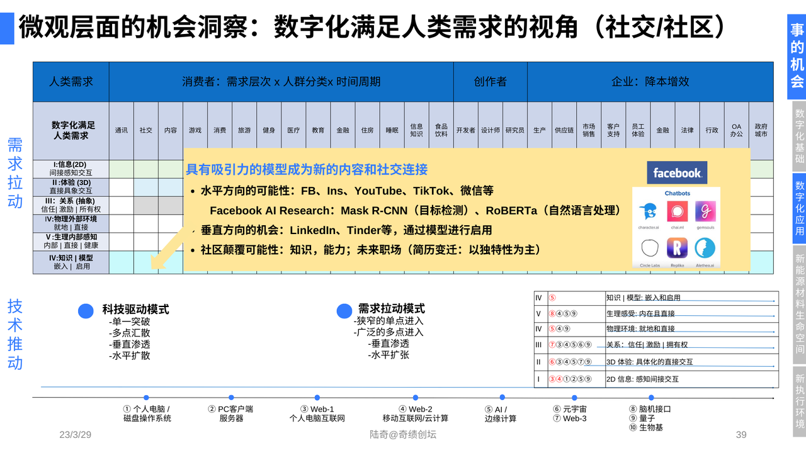

两周之前，我们有个嘉宾——脉脉的 CEO，他讲得非常对。很多社区，比如他只举的例子：知乎，你去社区主要是知识，你说你要知识，他都有、他什么都懂，那这个社区的价值在哪里？大家看看，美国的知乎叫 Quora，创始人叫 Adam D’Angelo，它是 open AI 的董事，它早就变了，现在 Quora 上面都是这种对话的机器人。

#### 通讯

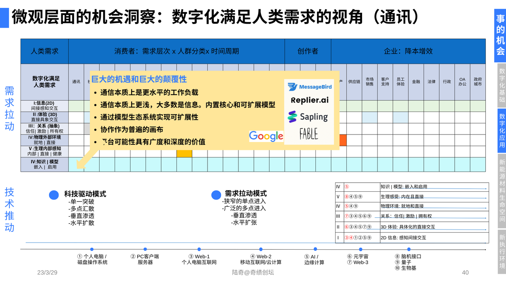

#### 医疗

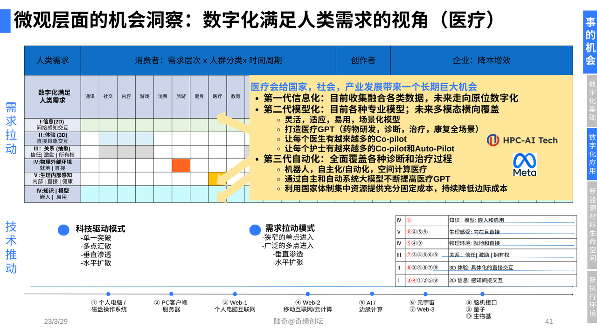

#### 开发者

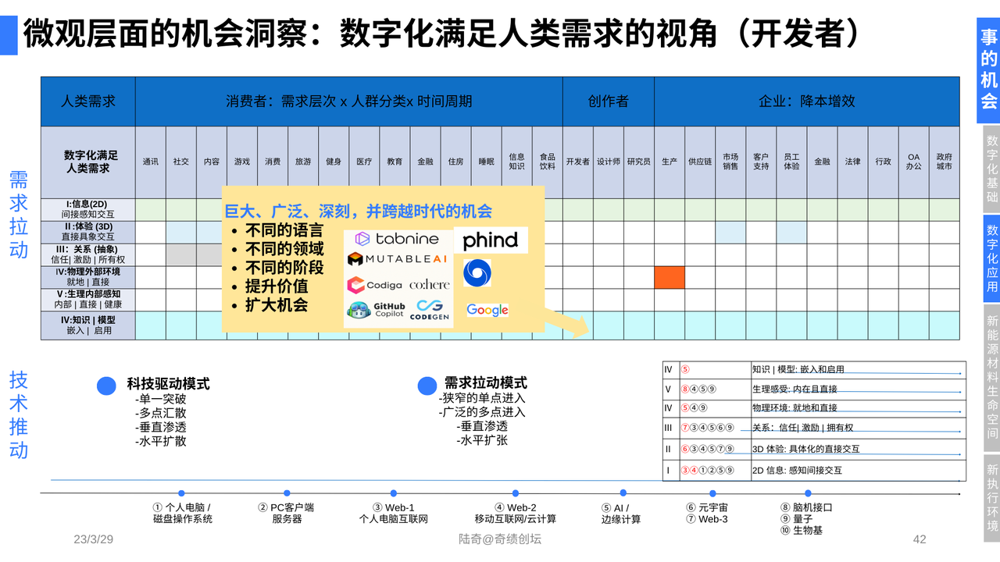

#### OA/办公

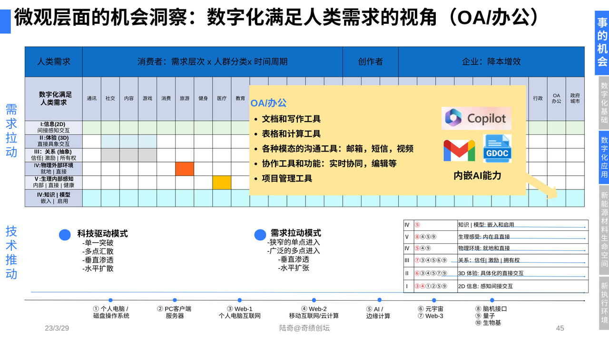

#### 营销与客户

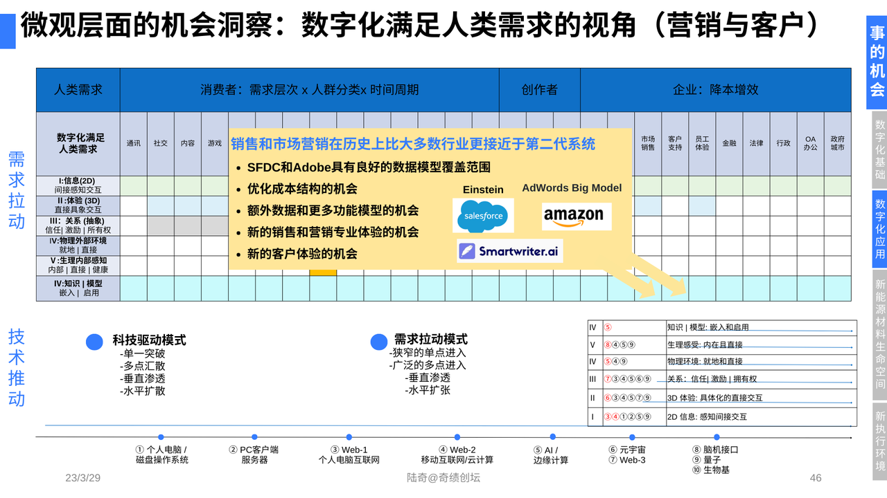  

如果你是做产品的，你认为自己的第一职责是什么？张小龙的回答是：你的角色是上帝。为什么用户不再用你的产品？你的产品是用户进化的一个环境，用户使用你的产品主要是与其他的人做交互，你发挥作用是上帝。这个内容打破了你的认知了吗？​  
第二个问题：你能懂用户吗？回答是不可能，你唯一可能懂的是自己；但你懂你自己吗？绝大部分人根本不懂自己。同学们如果是做产品，一定要看张小龙的 [微信哲学](https://www.kdocs.cn/l/ceVhXXZcsDIx)，这是经典中的经典。

# 总结

这篇文章在前面对范式、人、社会、背景、发展的关系总结是比较有价值的。

- 三位一体的复杂体系
- 人的模型
- 通用智能四要素
