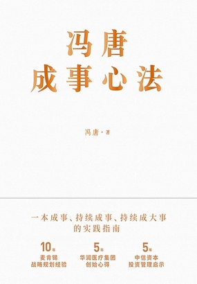

# 冯唐成事心法-冯唐

> [!abstract] 冯唐成事心法
> - 
> - 书名： 冯唐成事心法
> - 作者： 冯唐
> - 简介： 他是热爱文艺的管理专家，是精通麦肯锡与曾国藩成事学的商业领袖，是医学博士出身的投资人。10 年麦肯锡战略规划经验，5 年华润医疗集团创始心得，5 年中信资本投资管理启示——冯唐 20 年持续跨界成事经验，凝结成这本《冯唐成事心法》。冯唐说：“我将自己二十年职业管理生涯中吃过的苦、踩过的雷、翻过的山、见识过的人，总结为‘冯唐成事心法’。”以西方麦肯锡管理方法为经，以中国经典成事智慧为纬，融合冯唐 20 年职场亲身实践的经验，以冯唐独特观点 + 方法语录提炼 + 丰富运用场景 + 经验案例 + 实战方法为内容框架，助你在现实中修行，在工作中求法，在沟通中识人，在思考中升级。写给每一个想干事、能干事、持续成大事的人。
> - 出版时间 2020-12-01 00:00:00
> - ISBN： 9787559646996
> - 分类： 经济理财 - 管理
> - 出版社： 北京联合出版公司

# 高亮划线

## 卷首语 ：管理是一生的日常，成事是一生的修行

- 📌 知己、知人、知世、知智慧。 ^35138325-1-699-712 

## 如何管理自我

- 📌 趋时者博无识之喜，损有道之真 ^35138325-2-163-177 
- 📌 “如何活下去”说到底就是如何在没有外援的情况下，保证自己的运营现金流为正。 ^35138325-2-979-1016 
- 📌 3.相信并放手让团队或你信任的人去干该干的事，不干涉其自然生长的过程。 ^35138325-2-1772-1808 
- 📌 这些猛人往往搞错了一点，失去了平衡之后，就把欲望当成了志向 ^35138325-2-3532-3561 
- 📌 什么是志向？求千古文章，求宇宙太平，求洞察人性，求天地至美，“为天地立心，为生民立命，为往圣继绝学，为万世开太平”。 ^35138325-2-3596-3654 

## 用好你的天赋

- 📌 提供辨识自己有没有天赋的三点建议。 ^35138325-3-2137-2155 
- 📌 1.虽千万人吾往矣。如果大家都反对你做一件事，但你还是偷偷摸摸想去做，长期偷偷摸摸想去做，别人怎么拦你都没有用，这说明什么？你在这件事上有天赋。 ^35138325-3-2158-2230 
- 📌 2.你偷偷摸摸坚持做这些事的时候，有快感和满足感。 ^35138325-3-2329-2354 
- 📌 3.你做出的东西有没有自己的风格，有没有相当多的人愿意自掏腰包去买。 ^35138325-3-2777-2811 

## 成大事无捷径

- 📌 曾国藩说“困时切莫间断，熬过此关，便可少进”，之后“再进再困，再熬再奋，自有亨通精进之日” ^35138325-4-2124-2169 

## 如何平衡工作和生活

- 📌 一有所逼，二有所专，三有所规，四有所贪 ^35138325-5-500-519 
- 📌 不得已，有所逼，有一个前提——管理自己的工作习惯，不要把自己变成一个工作狂魔。 ^35138325-5-1284-1324 
- 📌 小和尚问大师怎么修佛，大师就说，饿的时候吃饭，困的时候睡觉。然后小和尚说：“不是所有人都这么干的吗？”师父说：“不，多数人是吃饭的时候不好好吃饭，睡觉的时候不好好睡觉。” ^35138325-5-1395-1481 
- 📌 我们约定的第一点是：彼此要交流，并且尊重每个人的生活和工作的 preference（偏好、倾向） ^35138325-5-2579-2626 
- 📌 我们约定的第二点是：提前定下一个季度甚至一年不得不做的大事。 ^35138325-5-2907-2937 
- 📌 你可以把生活中的某种爱好，变成可真正获利的途径，然后理所当然地追逐。 ^35138325-5-3078-3112 

## 做一个真猛人

 
- 📌 强毅与“刚愎自用”不一样，能战胜自己的欲望，战胜自己的人性弱点，这叫“强” ^35138325-6-359-396 
- 📌 第一个问题：如果猛人已经过了三十岁，你看他是否还在念书学习。 ^35138325-6-1414-1444  
- 📌 第三个问题：看他是否还有好奇心。 ^35138325-6-1524-1540  

## 做自己熟悉的行业

- 📌 我给大家的建议简单概括就是喜欢，喜欢这个领域以及从事这个领域的人，那很有可能这就是你应该当成根据地、当成主场的地方。 ^35138325-7-1003-1062  
- 📌 了解一百个关键词，和三到五个专家深谈，找三到五本书细看 ^35138325-7-2209-2236 

## 掌控情绪

- 📌 负面舆情管理的精髓是，最好不要有大的负面消息出来。 ^35138325-8-796-822 
- 📌 如果负面消息还是冒出来了，要淡定，不要回应。 ^35138325-8-829-851 
- 📌 第三个，如果闲话还是无法散去，那就正面面对。 ^35138325-8-893-915 
- 📌 有一个自己的爱好，在你不能做正事的时候，抓起你的爱好。这样才能做到得志行天下，不得志独善其身。 ^35138325-8-2751-2799 

## 如何对待妒忌和贪婪

- 📌 这是在处理妒忌和贪婪上的底线——不害人 ^35138325-9-1967-1986 
- 📌 其次要宽容。既然你都会妒忌，会贪婪，那对于别人的妒忌和贪婪之心，特别是针对你的，一笑置之 ^35138325-9-1989-2035 

## 如何战胜自己，战胜逆境

- 📌 不着急，不害怕，不要脸。这是对于顺境而言。 ^35138325-10-117-138 
- 📌 忽然来了百年不遇的逆境——新冠病毒，我送你十字箴言：看脚下，不断行，莫存顺逆。 ^35138325-10-164-204 
- 📌 “看脚下”就是看现金，看自己核心的“上下游”。 ^35138325-10-1733-1757 
- 📌 “不断行”就是工作、工作、工作 ^35138325-10-2761-2776 
- 📌 “不断行”，就是习惯、习惯、习惯。 ^35138325-10-2865-2882 
- 📌 不要两分地看所谓的逆境，不要认为“它是逆境”或“它是顺境”。无论顺逆，都是生活的一部分，都是生命的一部分 ^35138325-10-3389-3441 

## 真正的高手都有破局思维

- 📌 一、多数我们不舒服的时候是逆境而不是绝境。二、过分夸大逆境，太被动，对于成事的修行者是不对的。天会留机会给人 ^35138325-11-729-783 
- 📌 凡善弈者，每于棋危劫急之时，一面自救，一面破敌。”善于下棋的人，棋的局势已经很差了，除了活下来，还要想想如何能进攻，不能只是防守 ^35138325-11-2202-2266 

## 有时候“不努力”是种正确战略

- 📌 第一，战略方面，重要的是要“认命” ^35138325-12-124-142 
- 📌 第二，从战术的角度，有时候需要你收敛 ^35138325-12-668-687 
- 📌 第三，不着急，缓称王，是一种正确的态度 ^35138325-12-2247-2267 

## 选择，不仅只是断舍离

- 📌 成事的人不甘流俗。 ^35138325-13-47-57 
- 📌 第一，选择人才，看其志向 ^35138325-13-60-73 
- 📌 “人才高下，视其志趣。” ^35138325-13-84-96 
- 📌 第二，养成好习惯，战胜流俗 ^35138325-13-878-892 

## 摒弃“身心灵”，在现实中“修行”

- 📌 成事的人更躲不开自己的肉身和灵魂。 ^35138325-14-129-146 
- 📌 接收吐槽，疏导灵魂。进来的人都是带着事来的，找你谈的事都是麻烦事，也都是他解决不了的。谁让你是领导呢？你的灵魂要一直戳在那里。 ^35138325-14-455-519 

## 以笨拙为本分，求仁得仁

- 📌 横轴，左边是笨拙，右边是聪明，这个轴的维度是聪明程度；纵轴就是竖轴，上边是勤奋谨慎，下边是油腻，这个纵轴的维度，你可以说是油腻指数。 ^35138325-15-979-1046 

## 怎么通过拯救睡眠实现人生逆袭

- 📌 第一，睡眠为什么重要 “食色，性也”，吃东西、对异性有兴趣，这些都是“食色，性也”，都是天生的东西。一顿不吃，饿得慌，一阵不见好姑娘，想得慌，对吧？但睡眠，并不是一件非常自然的事，我每次都有一种感觉，入睡就像死亡一样，而睡醒又如同新生，如同重新从妈妈肚子里出来一次；有可能你不哭了，但是多数人会感觉到所谓的起床气，就是起床之后很生气，想闹一下，想撒个娇，这个很像婴儿刚出生时“哇”的一声哭泣。 还有个问题，你入睡，你清醒，你自己能完全控制吗？我自己是不能完全控制的。我每次入睡，就有点像等风来，会做一些准备、一些铺垫，但我无法控制入睡的时间，无法控制睡多长的时间，甚至也无法控制如何醒来——有可能是自然醒（当然，天天自然醒是很幸福的一件事），有可能是被闹钟叫醒，有可能是午夜梦回豁然惊醒（当然，这不是一个很好的经历）。总之，每次入睡如同小死，每次睡醒如同又生，都不由我控制。 睡眠，跟人脑如何工作密切相关。睡眠，人脑关机了，如何做到的？如何产生？如何持续？如何唤醒？我们知道的并不多。对此大家一定要有清醒的认知，如果你听到有人说“我知道人脑如何工作，我对睡眠完全了解”，这个人很有可能是骗子。 ^35138325-16-345 
- 📌 简单来说，是你起床之后是不是有精神干事。 ^35138325-16-1331-1351 

## 分清欲望和志向

- 📌 中庸。就是别太逼自己一定要没有或一定要有什么好胜心，别求太快的速度，也别求完全没有噪声 ^35138325-17-522-565 

## 人人都该懂战略

- 📌 这套完整的行动方案包括：何处竞争、如何竞争、何时竞争。 ^35138325-19-589-616 
- 📌 第一个核心词：行动方案。 ^35138325-19-645-657 
- 📌 第二个核心词：系统性。 ^35138325-19-718-729 
- 📌 第三个核心词：合理性。 ^35138325-19-892-903 
- 📌 就是为什么。 ^35138325-19-934-940 
- 📌 用我的八个字来总结为什么要做战略——“上下同欲，少走弯路” ^35138325-19-1392-1421 
- 📌 1.大处着眼，即高明。 ^35138325-19-2202-2213 
- 📌 第一个 C 是 Company，第二个 C 是 Competitor，第三个 C 是 Customer。 ^35138325-19-2372-2415 
- 📌 2.小处着手，是精明，讲细节。 ^35138325-19-2864-2879 

## 什么是终极领导力

- 📌 引领众人去一个未知地方的能力，是我认为最好的定义。 ^35138325-20-95-120 
- 📌 打硬仗，自己上，这是领导力的最终体现。一个人，扛得住、罩得住，才是成一切大事的根本。 ^35138325-20-1903-1945 
- 📌 孙中山的一句话：“夫天下之事，其不如人意者固十常八九，总在能坚忍耐烦，劳怨不避，乃能期于有成。” ^35138325-20-2426-2474 
- 📌 “不着急，不害怕，不要脸。” ^35138325-20-3293-3307 
- 📌 “不着急”，说的是对时间的态度。“不害怕”，说的是对结果的态度。“不要脸”，说的是对别人评论的态度。 ^35138325-20-3393-3451 

## 你需要知道的职场沟通规范

- 📌 找一个对方最好的交流状态，就是找他最容易听进去话、他最有创造力的时间。 ^35138325-21-2465-2500 

## 带团队的四条铁律

- 📌 “吾辈当共习勤劳，先之以愧厉，继之以痛惩” ^35138325-22-380-401 
- 📌 与人为善”的本义是带领老百姓向好的方向发展 ^35138325-22-1083-1104 
- 📌 第一步就是要总结、提炼、吸收老百姓的好经验和好想法。绝大多数人认为特别好的事、特别向往的事，就应该是执政者最该推动的事。 ^35138325-22-1131-1191 
- 📌 首先，总结、提炼老百姓或者团队成员的好想法和做法，重心落在小处、实处。 ^35138325-22-1515-1550 
- 📌 力，则指将士之精力言之；势，则指大计大局，及粮饷之接续、人才之可继言之 ^35138325-22-2246-2281 
- 📌 其实做管理、做领导是一件很烦的事，就烦在这些东西，你要天天、周周、月月盘点，如果有缺，要想着怎么补上，谁来补，怎么补，等等。 ^35138325-22-2432-2495 

## 如何制定团队激励政策

- 📌 从管理的层面来看，有两组杠杆体现了不同企业的风格，一组叫协调控制，另一组叫激励。 ^35138325-23-1414-1454 
- 📌 第一种是控制人。 ^35138325-23-1505-1513 
- 📌 第二种是控制财务 ^35138325-23-1548-1556  
- 📌 财务激励、机会激励、理想激励 ^35138325-23-2321-2335 
- 📌 相信通才教育，相信一个合格的官吏是既可以治水，又可以管两三个县，又可以挖运河的。 ^35138325-23-3157-3197 
- 📌 直到周围的人，你提第一句，他们能说出第十句的程度，才能做到 ^35138325-23-3643-3672 
- 📌 依然要发自肺腑地认可自己这个理想 ^35138325-23-3742-3758 

## 麦肯锡的信任公式

- 📌 信任＝（可信度×可靠度×可亲度）÷自私度。 ^35138325-24-2267-2288 
- 📌 这样，你和你的贵人除了工作之外，还能有点别的聊的，能建立一些非工作相关的友谊。 ^35138325-24-3083-3122 

## 如何成为中层干部

- 📌 在把基层信息数据收集清楚的基础上，能够归纳总结你的管理建议，把结论给领导，这就是有条理。 ^35138325-25-456-500 
- 📌 不要老想，你有什么想法说出来，跟大家表达出来，提合理化建议。 ^35138325-25-1923-1953 
- 📌 注意细节，通过做事说话，把一个一个的难点克服掉，这就是不惜力。 ^35138325-25-2044-2075 

## 保持团队锐气的五条秘籍

- 📌 2.选择本性乐观、好胜的人加入团队。 ^35138325-29-1682-1700 
- 📌 3.如果想一直保有锐气，需要制定长期制胜的战略。 ^35138325-29-1992-2016 
- 📌 4.必须有一个有挑战的、有胜算的、有诱惑力的近期目标。 ^35138325-29-2067-2094 
- 📌 5.永远让团队有事情做。 ^35138325-29-2440-2452 

## 怎样看待公司的规章制度

- 📌 4.“二八原则”，定制度不要求全，尽量浅显，否则很难做执行。 ^35138325-30-2893-2923 
- 📌 3.再好的规章制度，也会限制某些天才。如果你认为这件事对于这个小天才、这个天才小团队需要网开一面，那你就在规章制度中明确指出来 ^35138325-30-3651-3714 

## 百分之九十九的人不会开会

- 📌 第一，会前：不召开无准备的会 ^35138325-31-740-754 
- 📌 主持人是控局的人，这个人要把整个流程管理好，什么时间讨论什么事情，还有就是解决问题。 ^35138325-31-1579-1621 
- 📌 会议主持人 ^35138325-31-1690-1695 
- 📌 第一个 P 是 Purpose，也就是告诉大家会议的目的是什么。第二个 P 是 Preview，告诉大家这个会有几项内容，做一个预览。第三个 P 是 Procedure，也就是这个会怎么进行。你可以说，我们这是一个头脑风暴会，大家有任何意见，可以随时举手说。也可以说咱们是一个汇报会，先由主讲人讲多少分钟，讲完之后，有多少分钟是大家的讨论时间，还有最后的总结时间是多少。先把流程跟大家说好。最后一个 P 是 Pay off，就是这个会希望最后达成什么共识，或者完成什么决策、安排什么事情。 ^35138325-31-1727-1959 

## 如何倾听不同的意见

 

## 如何在团队中用民主集中制达成共识

- 📌 1.先民主。 ^35138325-35-979-985 
- 📌 2.民主之后再集中。 ^35138325-35-1853-1863 
- 📌 而是为了团队的共同利益、领导的利益、自身的利益 ^35138325-35-2555-2578 
- 📌 另外，作为副手，不要开小会，不要立山头。 ^35138325-35-2670-2690 
- 📌 给出论点、论据、论证 ^35138325-35-2973-2983 
- 📌 比较有两层意思：一层是你是怎么说的，其他人是怎么说的，CEO 最后是怎么总结的，最后的决策是怎么做的；另一层是你的判断跟最后实际发生的情况是否相符，哪些不相符，哪些比你判断的要好，哪些比你判断的要差，这些好和差，底层的原因是什么。 ^35138325-35-3023-3137 

## 如何正确看待别人的评价

- 📌 4.推功揽过。对于真的是帮你的人、团队，把功给人家。但前提是所有的大过你必须自己担 ^35138325-38-2925-2966 

## 交友的标准

- 📌 争取有几个挑你毛病的朋友，也争取有几个一直不挑你毛病的朋友 ^35138325-40-2299-2328 

## 找合拍的人一起做事

  

## 示弱的杀伤力

- 📌 选择何时示弱其实非常直接、简单，就是有件事，你特别想做，但是没时间和精力做的时候 ^35138325-44-443-483 

## 职场中最重要的品质

- 📌 职场中最重要的不是能力、人脉、所受的教育，而是态度。 ^35138325-45-41-67 
- 📌 若将天地常揣摩，妙理终有一日开 ^35138325-45-880-895 
- 📌 但是，别人犯错的时候，请你找一找他犯错的理由，然后宽恕他。 ^35138325-45-1937-1966 
- 📌 甚至把主要的功劳和荣誉跟别人分享，嘴要甜一点。 ^35138325-45-2044-2067 
- 📌 如果出现了问题，揽在自己身上 ^35138325-45-2190-2204 

## 跳槽的秘籍

- 📌 1.为了修行，为了成长。 ^35138325-51-273-285 
- 📌 2.为了成事，为了能够再成更多的事，再成更多的大事。 ^35138325-51-605-631 
- 📌 “Double your pay, you go.（付你两倍的薪水，你就走。）” ^35138325-51-1053-1093  

## 怎样在体制内成事

- 📌 了解这些，是“明理”的另外一个基础，就是懂事情，以及懂与事情相关的人。 ^35138325-52-1600-1635 
- 📌 从严、从难、从实战出发、大运动量训练。 ^35138325-52-2022-2041 

## 为什么人是第一位的

- 📌 一个好公司，CEO 身边的几个人，都是 CEO 自己找的； ^35138325-55-1719-1745 

## 多谈问题，少谈道理

 

## 用金字塔原则思考和表达

 
- 📌 当你把这个金字塔建完后，复盘哪块儿没有完成“不重不漏”这个原则，你就加固哪一块儿，这样你最后解决出来的问题就非常坚固。 ^35138325-57-1566-1625 
- 📌 一个中心点需要三到七个（最多不超过九个）的支持论据，你可以分别把三到七（到九）个不同的模块交给不同的手下 ^35138325-57-1704-1756 
- 📌 你只有三十秒、只有三分钟，只能在电梯里、在过道里抓住领导，你讲完了中心论点和一级支持证据 ^35138325-57-1943-1987 

## 成事之人的七大特质

- 📌 我给出的保存精力的建议就是五千米之内不坐车，走路。 ^35138325-58-2491-2516 
- 📌 在不能做事的环境下，在可以偷懒的情况下，他都偷偷摸摸要做事。 ^35138325-58-2552-2582 
- 📌 真正成事的、有修炼的人，是有独立于世界的志向，不能轻易让别人看到 ^35138325-58-3277-3309 

## 建立长期互相滋养的关系

- 📌 第一，上下级关系类型 ^35138325-60-416-426 
- 📌 每次他基本是骂着说的，但是我也能体会到这种管理、这种交流带给我的成长，这种上下级关系给我的压力以及动力。 ^35138325-60-1011-1063 
- 📌 与人为善，取人为善之道，如大河水盛，足以浸灌小河，小河水盛，亦足以浸灌大河 ^35138325-60-1518-1555 
- 📌 “Mentor-Mentee”，翻译成中文是“导师和徒弟”的关系 ^35138325-60-1739-1771 
- 📌 1.要有化学反应。 ^35138325-60-1956-1965 
- 📌 首先从人的长相气质来讲，彼此要喜欢。 ^35138325-60-1997-2015 
- 📌 其次是智慧。 ^35138325-60-2133-2139 
- 📌 见面的时候，几乎有说不完的话，每次见面都有收获。 ^35138325-60-2222-2246 
- 📌 2.要有仪式感。 ^35138325-60-2308-2316 
- 📌 约定用什么样的频率一块儿去做都喜欢的事。 ^35138325-60-2465-2485 
- 📌 3.重交流质量，而不是数量。 ^35138325-60-2524-2538 
- 📌 4.要有行动。 ^35138325-60-2835-2842 
- 📌 7.不怕求人。 ^35138325-60-3505-3512 
- 📌 你给他敞口问题（open question），他帮你做分析，不要只给决策和答案。 ^35138325-60-3777-3817 
- 📌 8.坦诚。 ^35138325-60-3964-3969 
- 📌 9.正面反馈。 ^35138325-60-4535-4542 
- 📌 （1）我观察到你说了什么话，做了什么事：一、二、三、四……（2）因为你这么做了，说了一、二、三、四……对我的影响是一、二、三、四……我哪里不舒服了、不爽了。（3）我观察到你做的事情对我产生的影响，我给你的建议是一、二、三、四……正面地给出负面的反馈。 ^35138325-60-4762-4895 
- 📌 一定不能超过五个。 ^35138325-60-4953-4962 

## 怎样看待运气

- 📌 一命二运三风水，四积阴德五读书，六名七相八敬神，九交贵人十养生。 ^35138325-61-1191-1223 

## 时时刻刻保持焦虑

- 📌 在职场，如何时时刻刻保持着焦虑，又不让自己的身心过分受摧残？ ^35138325-62-2-32 
- 📌 只有你担心客户的问题比客户担心自己的问题还多的时候，你才能成功 ^35138325-62-1340-1371 
- 📌 “扯脱”，就是把自己从自己焦虑的事情上拉开，像把一张皮和一块肉撕开。怎么做？跑步。 ^35138325-62-1626-1667 
- 📌 读读杂书，和好朋友聊聊天，和家人喝喝酒。 ^35138325-62-1867-1887 

## 在模糊中接近精确

 
- 📌 未来五年、十年市场会有什么巨大变化？你的竞争对手可能有什么最重要的变化？在你从事的领域，科技会有什么样的重大变化？你的行业的商业模式可能有哪些最重要的变化？ ^35138325-63-3693-3771 

## 如何成功转型

- 📌 1.明确何处竞争 ^35138325-64-311-319 
- 📌 （1）细分市场。 ^35138325-64-388-396 
- 📌 一个维度是市场吸引力，一个维度是企业竞争力。 ^35138325-64-641-663 
- 📌 哪些自己做？哪些外包？用户如何知道你的产品和服务？怎么打广告？怎么挖掘用户？用户在哪里？他们是谁？用户为什么会觉得你的产品或服务值得？如何吸引新用户？如何留住这些用户？如何让他们的购买频率加大？如何让他们购买一些除了核心产品之外的衍生品？四个核心词：拉新、留存、提频、裂变。 ^35138325-64-1636-1773 
- 📌 制订好行动计划，谁什么时候做什么事，需要什么样的资源，需要什么样的配合，最后他有什么样的递交物，列出行动计划。尤其是知道谁负责什么事，负责在什么时间递交什么最终结果。 ^35138325-64-2264-2347 
- 📌 要突出战略重点。 ^35138325-64-2732-2740 
- 📌 1.战略笃定性，战略不能总变。 ^35138325-64-2947-2962 
- 📌 2.先求稳当，次求变化。 ^35138325-64-3535-3547 
- 📌 3.战略执行的时候，要做结果管理，奖勤罚懒，奖优罚劣。 ^35138325-64-3781-3808 

## 知可为，知不可为

- 📌 进世界最好的大学，见你感兴趣的领域最强的导师，读你感兴趣的领域最好的文章，看到自己和最高智慧之间的差距 ^35138325-65-1814-1865 

## 如何累身不累心

- 📌 第一个空间，书房 ^35138325-67-848-856 
- 📌 第二个空间，山房 ^35138325-67-923-931 
- 📌 第三个空间，重症病房。 ^35138325-67-967-978 

## 结束语：成事到底为了什么

- 📌 格物、致知、诚意、正心、修身、齐家、治国、平天下 ^35138325-69-570-594 
- 📌 可能就是有那么一小撮、几个人，大家跟着他们 ^35138325-69-1942-1963 
- 📌 如果不能有最强的人占据最合适的位置，风气会变乱。 ^35138325-69-2470-2494 
- 📌 儒家精英有引导的作用和能力 ^35138325-69-2504-2517 
- 📌 实话讲，我们自宋以后就是平民社会，没有贵族，只有精英。 ^35138325-69-2990-3017 
- 📌 世间数百年旧家无非积德；天下第一件好事还是读书 ^35138325-69-3292-3315 

# 读书笔记

## 做一个真猛人

- 📌 虽然你会有强迫症，但是如果你没有强迫症，你就很难成为特别好的医生 ^207809116-7xJxeGC7z
    - 💭 这个也是很有趣的一个点，我之前认为，可以在一些地方有强迫症，一些地方没有。然后我就尝试去戒掉强迫症，因为觉察它对我的影响很大。然而戒掉的过程，我逐渐失去了自律，自我。逐渐成为了一个“废人”。也许在第三层，能够达成我想要的效果，但在那之前，如果要选择，还是全部强迫症会让你的人生不易但有朝气。
- 📌 第二个问题：看他的体重是否保持得相对好 ^207809116-7xJx02tus
    - 💭 这个其实是看他还有没有追求完美，一种身体上的完美状态。因为猛人是要全方面的追求自胜的。
- 📌 我其实是一个挺平和的人，甚至有人说，周到得有点假，像个塑料花。但是跟我接触的人会发现，我在一些关键时候是决绝的。 ^207809116-7xJvRbi1h
    - 💭 这个好难哇，做战略决定的人，承担的压力会更大，我往往就会犹犹豫豫的。

## 做自己熟悉的行业

- 📌 先知道一百个关键词 ^207809116-7xJxxmY1f
    - 💭 这个可能不止适用于了解行业，也适合去拆解所有的维度上。

## 如何战胜自己，战胜逆境

- 📌 实话讲，这些信息跟你有关系又没关系。 ^207809116-7xJyRIkxn
    - 💭 其实我之前是挺不喜欢在生活的时候去讨论工作的。（划掉）并不是没影响，会让我在生活的时候保持和其他人的交流。难道我要在生活中也去交流工作吗？nonono 掌握度吧。这个部分还是。

## 选择，不仅只是断舍离

- 📌 高者慕往哲盛隆之轨，而日即高明 ^207809116-7xKuI04dh
    - 💭 实际上，这句话的核心词在“规”和“轨”，字音相近，意思相差很远。“卑者”是守规矩的人，日渐下流；高者是开辟道路的人（慕往哲盛隆之轨。慕，向往，和前一句的“安”不同；往哲，过去的高人，开门立派，不走寻常路），日渐上流。。

## 怎么通过拯救睡眠实现人生逆袭

- 📌 6.不要看手机入睡。 ^207809116-7xVbX1yQy
    - 💭 一直没坚持下来这个习惯。喜欢用 微信读书， 方便便宜。有没有可以用微信读书的 kindle?需要确认一下。还是说直接用 ipad， 能不能抵抗住诱惑？是不是直接用种树软件是 OK 的？还可以记录一下。

## 人人都该懂战略

- 📌 我没见过，干不了小事，但是能干成大事的人。一室不扫，天下也扫不了。但扫了天下，不扫一室，有时候不是不能，而是懒得干了。 ^207809116-7xVdmvvNX
    - 💭 聊聊这一段。这章最有用的是讲的小处着眼。比如你约一个新朋友来你们家，你说了你们家的地址，就够了么？你要考虑他怎么来，开车？还是打车。要不要去接他？来了之后聊些啥，晚上如果要吃饭，吃什么。可能讲这些，你会觉得有必要么？但好像这就是小事。如果这些小事都安排的好，那至少能够成为一个中流砥柱。

## 如何制定团队激励政策

- 📌 第三种是控制运营 ^207809116-7ysHeImb6
    - 💭 这种就是互联网企业的烧钱占市场吧。

## 麦肯锡的信任公式

- 📌 你有可能是某领域的顶级专家，说的话可信，但是我不知道下星期还能不能找到你这个人，你是不是把具体信息收集完了，能不能把具体意见给到我。 ^207809116-7ysHZJnBu
    - 💭 可信度：在这领域是不是钻研的足够深。可靠度：是你能不能按时完成任务。

## 如何避免团队油腻的结构化

- 📌 企业如何做到不油腻 ^207809116-7ysKZcX4x
    - 💭 其实不油腻，还是带团队， 让团队更加的有朝气。下面的观点：1- 一把手要有脑子 2- 分配好利益 3- 明确底线 4- 真诚沟通都是让团队能够有一个更好的氛围

## 保持团队锐气的五条秘籍

- 📌 1.带队的人最好是个狂热的阿尔法人。 ^207809116-7ysLfC2Rx
    - 💭 http://www.giraffenglish.net/2019/08/19/are-you-an-alpha-beta-or-omega-male-or-female/阿尔法人: 领导型人格
- 📌 能不能干，让不让干，想不想干 ^207809116-7ysL43pQ8
    - 💭 这三个总结的很好，能不能？让不让？想不想？统一这个思想，在一个项目里往往无往不利。

## 百分之九十九的人不会开会

- 📌 这里只谈三步——会前、会中、会后，如何管理会议。 ^207809116-7ysMbDqQj
    - 💭 这一章是绝对的干货会议每个人都会开，怎么开，很少有人知道。相信很多人深受其害。但是当真正自己去组织的时候，往往效果也不一定有之前的好，或者受之前的影响，有那种会议的坏味道。按照一个范式去做，不说一定会成功，但效果会好很多。

## 如何倾听不同的意见

- 📌 麦肯锡还有一套“三步走”话术。1.必须感谢，要谢谢人家。说“谢谢 Jenny 提意见”“谢谢 Henry 提意见”。2.需要停顿一下，重复一下别人说的意见，让对方感觉到，你尊重他的意见。3.如果同意对方的反对意见，就表示同意，非常真诚地表示同意。如果不同意，不必争论，不必反对，说一句，“我会认真考虑，感谢你的意见，我会再想一下”。 ^207809116-7ysMGORFT
    - 💭 干货

## 怎样做一个讨人喜欢的人

- 📌 诀窍是，找准别人真的很赞的地方，往死里夸。 ^207809116-7ysO8uLbk
    - 💭 夸人也是拉近关系的最好方案之一。
- 📌 第二，虚心 ^207809116-7ysO61HAD
    - 💭 虚心就是知道自己在什么地方行，什么地方不行
- 📌 第一，诚心 ^207809116-7ysO3fZe8
    - 💭 诚心就是坚持✊

## 如何面对人际交往中的心机

- 📌 交流，是试图改变别人的想法，试图大家心在一条线上；明责，是知道改变不了别人想法的时候，大家同意什么时候交什么样的东西就行。但是千万不要忘了，还有一种更高阶的处理心机的方式，忘掉它，忘掉机心。 ^207809116-7ysOOuPjK
    - 💭 忘机不是遗忘，而是装糊涂。但是什么时候装糊涂呢？是和别人观点碰撞后，要求同存异。改变不了别人，就不改变啦。不要想这个人怎么样，而是去把事情做成。但是还是强行的解释。这一段感觉没必要。

## 找合拍的人一起做事

- 📌 你可以跟周围最美的身边人说“We had good time together” ^207809116-7ysPeyH57
    - 💭 确实挺浪漫的。上一次有人离职的时候，我挺伤心的，伤心的原因就是，他走了， good time with him 也就到此为止了。
- 📌 第一是人，就是和自己喜欢同时也喜欢自己的人，在一起工作；第二是事，做自己擅长又喜欢的事。 ^207809116-7ysP3iGNS
    - 💭 人类幸福的根源。听了这两个，有一种醍醐灌顶的感觉。

## 示弱的杀伤力

- 📌 “能立、能达、不怨、不尤” ^207809116-7ysSaBfZh
    - 💭 1- 责任我承担，好处大家分 2- 要分析好问题的点，减少别人介入的难度 3- 坦诚 4- 不抱怨，别人做的如何是你们两一同选择的结果

## 跳槽的秘籍

- 📌 1.你要清楚自己要什么。 ^207809116-7yufMnI10
    - 💭 至少 30 岁之前想清楚自己要什么，不然 35 岁就失业了 (狗头

## 多谈问题，少谈道理

- 📌 核心的核心，是“勿我”，把 ego（自我）放到一个相对合适的位置，不要让它高于一切。 ^207809116-7yujcuztj
    - 💭 这个逻辑突然有点激发我，做计划的拆分的时候，不要想着自己能做成，而是要拆分到别人能做成这个点上。
- 📌 怎么成事，最重要的是实事求是，到底发生了什么，什么情况，该怎么办，都要落到实处。 ^207809116-7yuj6RKg7
    - 💭 这个其实是告诉你，要多用一些思考体系，比如 5why5so 这种分解问题，制定计划

## 用金字塔原则思考和表达

- 📌 金字塔原则就是：讲一个事情，会有一个中心论点，这个中心论点会被一些论据所支持，这些论据要完成“不重不漏”，即互相没有重复，合在一起又不漏掉基本点 ^207809116-7yukZRWp8
    - 💭 MECE，即 Mutually Exclusive Collectively Exhaustive（相互独立，完全穷尽），是麦肯锡的第一个女咨询顾问巴巴拉·明托（Barbara Minto）在《金字塔原理》（The Minto Pyramid Principle）这本书中提出的一个原则。

## 成事之人的七大特质

- 📌 成事的人往往需要中庸平衡的混合个性。 ^207809116-7yuvjI4Q3
    - 💭 这个不管是识人，还是识几。都过于的难。而且没有一条清晰的路可以走下去。
- 📌 什么样的人能成事？ ^207809116-7yuuJoiNc
    - 💭 这个其实可以帮助你招聘，寻找人才

## 时时刻刻保持焦虑

- 📌 要把事情放在个人之前，放低自己，放大事情本身。 ^207809116-7yuwqiZXA
    - 💭 无我的三观

## 在模糊中接近精确

- 📌 3.判断。 ^207809116-7yuwHiRUd
    - 💭 我决定下本书，就去看看如何分析，做判断的相关技巧，或者培养的方式。
- 📌 3.判断。 ^207809116-7yuwFoiLW
    - 💭 判断太难了， 是一辈子都在学习的事情。
- 📌 1.选一个好的 CEO，好的一把手； ^207809116-7yuwBY3f0
    - 💭 其实这里是有些割裂的，上文讲成事的难度在模糊感，这里讲选 CEO。其实这里也可以抽象为 关键项是什么，解决就不会再有问题。

## 如何成功转型

- 📌 企业如何平稳度过转型期 ^207809116-7yuwYVGkn
    - 💭 这一章不光是在讲转型，也在说创业啊

## 如何累身不累心

- 📌 第三，简字诀 ^207809116-7yuxukYDO
    - 💭 奥卡姆剃刀原理特斯拉卖的这么好是有原因的
- 📌 第二，活字诀 ^207809116-7yuxsa8Ru
    - 💭 活到老，学到老

# 本书评论
