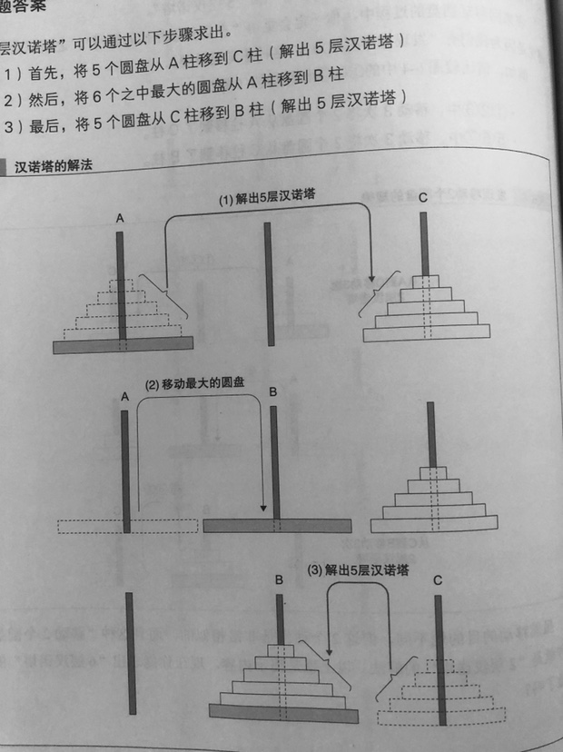
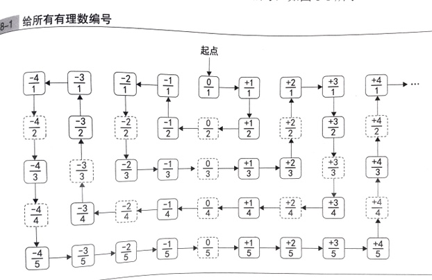
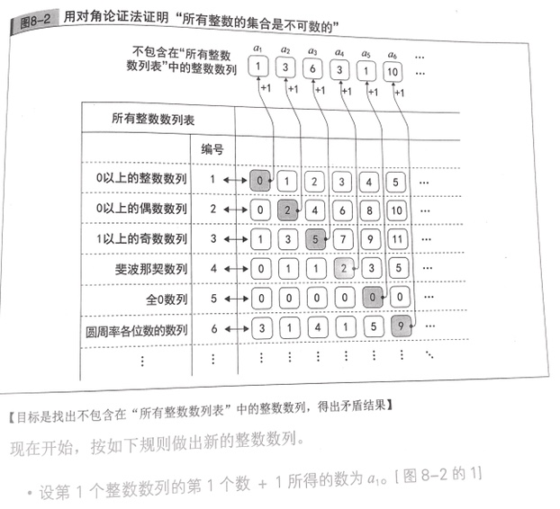

## 第一章 0 的故事

为什么 $10^{0}$ 是 1 ？  
这里的逻辑是。  
10^3 = 1000  
10^2 = 100  
10^1 = 10  
10^0 = 1  
依次除以 10 。  
而不是传统意义上的 n 个相乘的概念。

0 起到什么作用？

1. 按位计数法中的占位
2. 统一标准，简化规则
    1. $a_n*10^n$ 可以在 n == 0 时， 表示 $a_0*10^0$ , 而不用对 $10^0$ 特殊操作。
3. 表示没有。
    1. 比如没有计划的计划
    2. 没有药效的药。

## 第二章 逻辑 - 真与假的二元世界

1. 文式图
2. 卡诺图

undefined  
无论什么遇到 undefined 都返回 undefined

## 第三章 余数 -- 周期性分组

奇偶校验位 ( parity bit )  
8 位棋子，令黑棋一定为偶数个。  
之后观众的动作

1. 翻转白棋 - 黑棋增加， 变成奇数个
2. 翻转黑棋 - 黑棋减少， 变成奇数个
3. 不翻转棋子。黑棋仍然是偶数个。

寻找恋人  
铺设草席  
哥尼斯堡七桥

> 把陆地当作点，桥当作边。然后简化问题。发现问题被归为图论。  
> 将点分为奇点和偶点。  
> 如果可以一笔走完，分为两者情况
>   1. 起点和终点相同 - 所有的点都是偶数点
>   2. 起点和终点不同 - 起点和奇点为奇数，剩余所有都为偶数。  
> 然后统计图中的点的类型，就知道所有的点。

## 第四章 数学归纳法 - 循环

断言对于 0 以上的所有整数 n 都成立的方法。

高斯求和法 - 1 次加法 + 1 次乘法 + 1 次除法

## 第五章 排列组合

加法法则：  
在集合中没有重复元素时成立。将两个无重复集合的 Ａ、B、想加。

乘法法则：  
分别有。

置换：  
将 n 个事物按照顺序进行排列 ( 这里 n 个事物都是一样的，所以又代表 **重复度** )  
排列：  
从 n 个事物中抽取出 m 个进行排列  
组合：  
从 n 个事物中取出 m 个， 并不考虑顺序。

组合 = 排列/置换

 **注** ： 我认为这里这个重复度的概念非常重要。

## 第六章 递归

汉诺塔问题

H(n) = H(n-1) + 1 + H(n-1);  
解出 n 层汉诺塔的移动次数 = 解出 n-1 层 + 移动最大圆盘 + 解出 n-1 层

相关例子：

1. 阶乘
2. 帕斯卡三角形

帕斯卡三角形 - 组合数  
$C^k_n = C^{k-1}_{n-1} + C^k_{n-1}$

1. 代表两数相加之和。
2. 代表到达某分叉点的情况数。
3. 从 n 张中选出 k 张的组合 = 选择特定牌的组合 + 不选定特定牌的组合

分型图 - 含有递归结构的图  
比如 谢尔平斯基三角形

## 第七章 指数爆炸

1. 二分查找
    1. 通过每次取 1/2 来简化计算
2. 对数简化
    1. 指数级问题在对数层面只是线性的

## 第八章 不可解问题

反证法  
 **可数**  
集合的元素时有限的，活着集合中的所有元素都与正整数一一对应。  
无限集合中，可数的意思： 可按一定规律既无 “遗漏” 也无 “重复” 的数出来。

 **有理数** ：  
$\frac{整数}{整数}$  
无限不循环小数不是有理数  
有理数通过排序可以证明可数。

  

对角论证法 

1. 所有整数数列的集合是不可数的
2. 所有实数的集合也是不可数的

  

不可解问题：  
写一个程序判断如果随机给定一个程序以及输入，这个程序是否会宕机。
