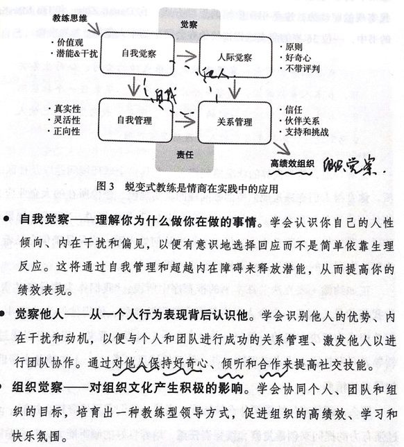
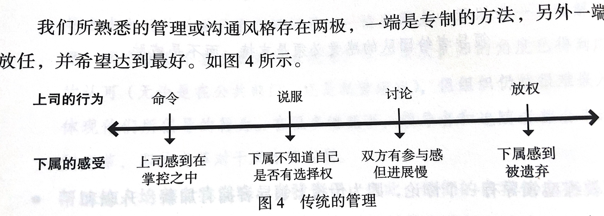
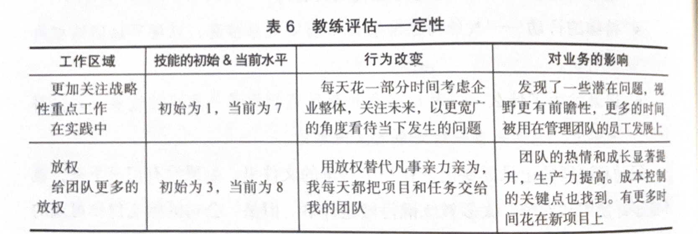
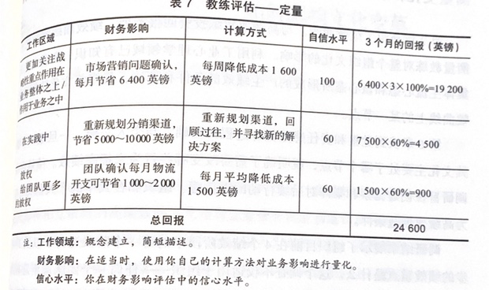
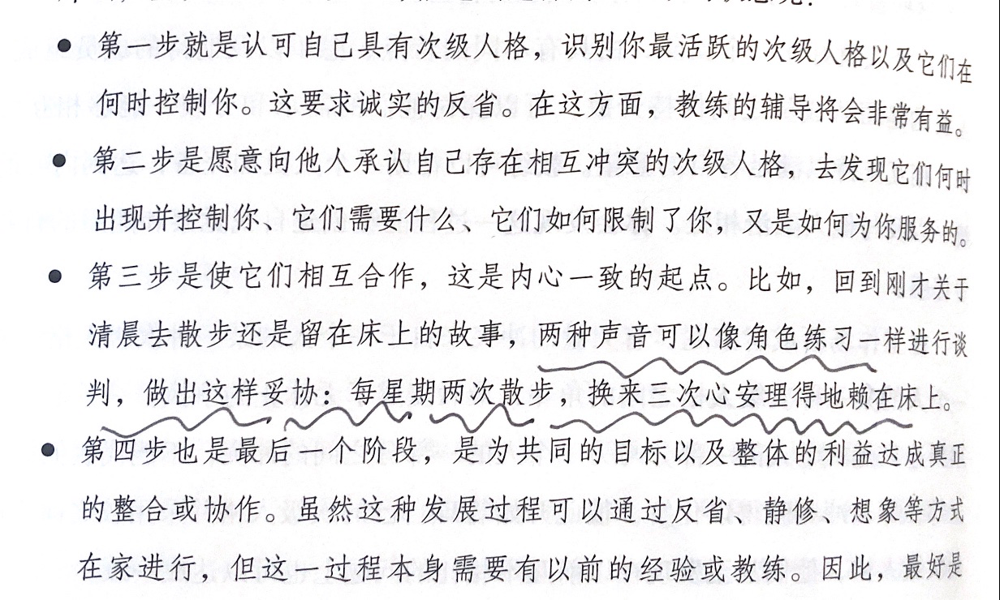
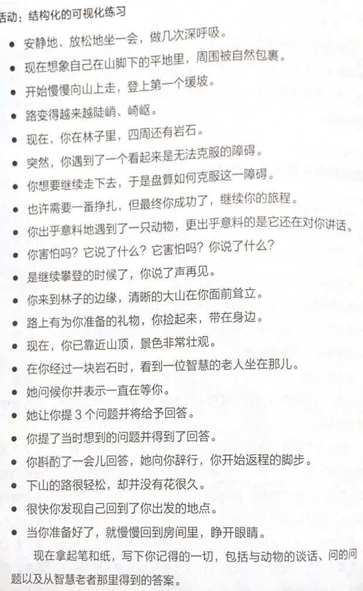

PCI - performance consultant iternational  
绩效咨询国际

## 第二部分 教练的原则

### 第三章 教练是情商的实践

>《 情商》 - 丹尼格尔曼  
>  自信、同理心、适应能力、变革催化剂  
>  自我觉察、自我管理、人际觉察、关系管理

你想成为一个什么样的人？  
你成长的经历中，让你愿意和他呆在一起的人，是什么样子。  
你想象中的成熟的自己是什么样子？



### 第四章 作为教练的领导者

>  领导者给团队的感受必须是支持，而不是威胁

如果想让教练方式发挥最大效用，你和教练对象之间的关系就必须是 **基于信任、安全和压力最小** 的伙伴关系
 **传统管理方式：** 

 **教练方式**  
1、领导者提问  
2、下属意识到工作的各个方面以及需要采取的必要行动。  
3、领导者倾听下属所给的回答，注意下属的行动计划，还有背后的思考。

领导者的任务：完成任务，发展人才

什么时候运用教练方式？什么时候告知？  
告知：时间  
教练：  
工作成果的品质、  
学习效果、  
需要对方接受和作出承诺、

```
@answer
这里我是有问题的,
怎么去界定这种压力，如果对方去接受和作出承诺，必然会需要思考后给出 deadline 的， 那么就会带去压力
```

员工敬业度和人才挽留率

### 第五章 教练风格：伙伴关系与相互合作

>  教练风格的主要特征是伙伴关系与相互合作  
>  ICF 定义为：伙伴间通过发人深省和创造性的对话过程，最大限度地激发个人潜能和职业潜能的过程

一个信念：每个人都是有能力的。  
只有相信一个人还有潜能，才能帮助他突破自己的舒适圈。

提升情商和信任他人的能力是你如何看待自己和他人的潜能。  
以及你如何应对阻碍，充分发挥这些潜能的 **内部和外部障碍** 。

成功的教练需要摆脱 **假装乐观** ，需要放下自己比他们优秀的想法， **帮助他们不再依赖你** 

>  微表情  
> 一个信息的 7% 是包含在口述文字中  
> 38% 是体现在说话的方式中  
> 55% 是体现在面部表情中

要选择这样的思维模式：  
我认为这个人在学习成长的过程中，有能力、足智多谋、富有潜能。

 **设定明确的意图** ，这非常重要。  
可以将这种意图定义为，没有任何障碍时，你的梦想。  
比如会议开始之前， 你可以花两分钟想一下

- 如果会议进程顺利的超出你的预期，在其中会发生些什么呢？

澄清角色、责任、共同目标、最优的 **工作关系** 。
 **许可**  
优点：建立信任和信心，尊重个人敏感性，聚焦注意力，防止误解的产生。

>  请求对方许可你分享：  
>  我有一些自己的建议，不知道会有帮助吗，我可以说吗？  
>  我可以补充一些吗？  
>  1、将主动权传递给对方  
>  2、通过补充，确认对方的说话。

如果你想去开展教练方式，你可以这么获得许可：  
我将尝试用一种新的教练方式来开展我们的工作，你会注意到其中一个变化，就是我会提出更多的问题来激发你的想法。 **你觉得可以和我一起尝试一下吗？** 

### 第六章 觉察与责任感 — 激发学习

>  我只能掌控我觉察到的一切。我觉察不到的东西在掌控我

 **觉察** 包括工作中的见闻而不止于此。  
这是 **收集并感知相关事实和信息的** 行为，也是一种对 **事件相关联程度** 进行判断的能力培养  
1、觉察：周围正在发生的  
2、自我觉察：自己正在经历的  
觉察是高品质的自我产生的输入
 **责任感**  
1、我可能会因为我的建议，而交换了你的责任

> 你没有给我选择；你伤害了我的自尊；这个行动我无法做主，到头来无法收拾，所以，我只好自作主张，采取另一个令你收到伤害的行动。当然，那个行动可能也会伤害我，但至少我出了一口气。

2、真正的责任来自选择。  
「 你去做一下这个事情 」永远不如 「 谁想去做一下这个事情 」
 **结论**  
一个教练需要具备他所教练领域的经验或专业知识吗？   **不！！！** 
## 第三部分 教练的实践

### 第七章 强有力的问题

比较一下：  
1、你在看球吗？  
2、你为什么不看球？  
3、那个球朝你飞过来的时候，是朝哪一边旋转的？

开放式问题：要求描述性答案  
封闭式问题：回答 是与否

觉察：应该以寻求量化或收集事实的词开始，比如 “什么”“何时”“谁”“多少”  
分析：“为什么”“如何”

专注于细节

总体原则：  
跟随教练对象的兴趣，从而保证教练对象的责任感

### 第八章 积极倾听

原则：  
先让对象把问题陈述完成，这个过程不要想下一个问题  
自我觉察监控自己的反应  
觉察教练对象的反应  
做总结回顾

积极倾听的技巧  
重述/复述  
总结  
澄清

### 第九章 GROW 模型

目标设定 - Goal  
现状分析 - Reality  
方案选择 - Options  
该做什么 - What - when - who - will

### 第十章 G：目标设定

1、和教练对象确定这次的目标  
2、引导出以下四种：

1. 梦想目标
2. 终极目标
3. 绩效目标
4. 过程目标

> 如何让受训者接受不容置疑的、硬性的安全规则  
> 受训者在讨论中创造他们自己同意的一套安全规则。然后让受训者自己找出和既定的安全规则中不同的地方， 用以分析

SMART 原则  
PURE 原则  
CLEAR 原则

### 第十一章 R：现状是什么

让教练对象描述自己的觉察。包括自我觉察。  
要使用描述性语言。  
一点点剖析现象背后的原因。

### 第十二章 O：你有什么选择

创造出和罗列出尽可能多的可供选择的方案

> 不要考虑是否可行。  
> 如果没有这些障碍，你会怎么做？

### 第十三章 W：你将会做什么

1、责任担当的设定

1. **你将要做什么？** 2. **什么时候做？** 3. 这个行动将会怎样服务于你的目标？
4. 在实施过程中会遇到什么问题？
5. **我怎么知道你做了？** 6. 你需要什么支持？
7. 你打算何时、如何获得这些支持？
8. 你还有什么其他的考虑
9. 从 110 分，你对执行我们达成的行动方案的坚定程度打几分？
10. 什么阻碍了你打 10 分。 —> 我们怎么样才能高于 8 分？

2、跟进与反馈

1. 教练对象成功了
2. 没有成功
3. 没有去做

从下面的几个语句中，选择一个合适的

1. 你真没用
2. 这份报告没用
3. 你的报告内容清晰而简洁，但版面设计和演示的内容对目标读者来说太低端了
4. 你觉得这份报告怎么样。
5. 你最喜欢什么？如果再做一次，你会做些什么不同的事？你学到了什么？

反馈框架  
1、设定意图

- 我们想要从中得到什么？  
2、认可
- 哪些方面进展良好？  
3、改进
- 可以做些什么不一样的呢？  
4、学习
- 你学习到什么？未来怎么运用它？

## 第四部分 教练的特定应用

### 一对一教练：

1、启动会议  
2、阶段教练  
3、评估会议

360 度反馈

### 团队绩效教练：

团队发展四阶段：遵循威廉舒茨关于人际行为的 Fido-B 理论  
1、包容：融入团队  
2、主张：建立个人角色  
3、合作：  
4、共创

### 增益绩效教练

PDCA

## 第五部分 释放教练的潜能

### 第十九章 衡量教练的收益和投资回报

收益

- 提升绩效和生产力
- 改善职业发展
- 改善关系和敬业度
- 提高工作满意度和员工保留率
- 领导者拥有更多的时间
- 更多的创新
- 更好的利用员工和知识
- 人们愿意付出额外的努力
- 更好的敏捷性和适应性
- 高绩效的文化
- 生活的技能

记录三件事情  
1、目的和目标  
2、持续的行动  
3、记录发生了什么：记录所取得的进展
 **定性**  
行为和态度的改变以及这些改变带来的影响。  
探索主观行为对领导、团队成员和评级同事的影响。

  
 **定量**  
财务盈亏表现  
  

### 第二十一章 领导的品质

1、价值观：当前的公司奉行的价值观、当前的工作所践行的价值观  
2、愿景  
3、真实：  
做真实的自己，  
把我们从以下的恐惧中释放出来：  
害怕失败、害怕与众不同、害怕看上去很傻、害怕他人会有什么看法。   **怎么做呢？**  
次级人格模型  
4、敏捷：不断的跟紧变化  
5、一致性：坚持前后的一致性。这是一种通用的一致性。更像是原则。

### 第二十二章 精通之道

1、无意识的无能力  
2、有意识的无能力  
3、有意识的有能力  
4、无意识的有能力

### 第二十三章 高阶教练

以上讲的大多为：事务型教练  
而 **高阶教练** 则是基于心理综合法，帮助人在人生这个领域上去发展的一种教练模型。
 **次级人格** 
> 有时当我困惑着看着自己性格的各个方面，我觉察到我是由多个自我组成的，而且现在处于优势地位的自我将不可避免地会让位于其他的自我 — 毛姆  
我们在不同的情形下，往往内心会有多个想法， 这些想法都是自我， 不同的自我。  
如何去统御这些自我呢？  
最好的方式，就是做一个观察者。



最后提供一个 **结构化的白日梦或可视化技巧**  
帮助接触到理性、逻辑、受局限的心智层面一下的潜意识层。

  
