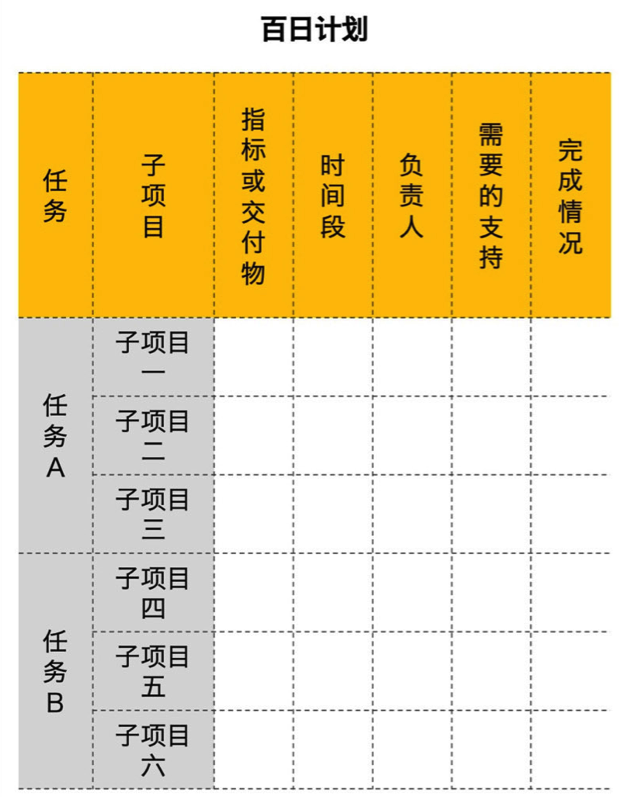

## 0-发刊词

很多中层都是从业务骨干提拔上来的，但是，走上管理岗位之后，以前做业务的那种成就感就没了。取而代之的是开不完的会，加不完的班和完不成的业绩。  
note: 成就感的来源分为多种，之前有在技术管理里讲过，把一个大的项目做成可能会很有成就感。具体需要看你在过程中能否不断的调节视角和心情，以及对最后的结果的执着程度。

中层仿佛是夹心层，上级只给个大方向，自己就得带队造出一膄火箭。不仅中层痛，老板们也痛，他们总觉得是中层堵住了公司的战略循环，这种不信任，又会加剧中层的职业危机；下属们也痛，缺少工具和方法的中层，会限制下属的成长，反过来，下属的不信任，又会让中层指挥不动团队。

 - 00 发刊词 _ 从业务骨干到管理高手
 - 抢滩期
	 - 01 角色转变：怎么走上管理的快车道  
	 - 02 团队交接：怎么安稳着陆，避免爆雷？  
	 - 03 鼓舞士气：抢滩期团队士气不好，怎么办？  
	 - 04 业务探索：怎么快速找到业务突破口？  
	 - 05 向上管理：怎么把上级拉到你的战线里？  
	 - 06 立威立规：怎么快速“征服”不服管的下属？  
	 - 07 人岗匹配：怎么从业务出发调架构、管编制？  
	 - 08 招聘面试：怎么避免在面试中看走眼？  
 - 发力期
	 - 09 战略落地：怎么把战略方向落地成行动计划？  
	 - 10 争取资源：怎么科学地从公司获得发展支持？  
	 - 11 任务分配：怎么用“一二三法则”给下属定目标？  
	 - **12,13,14 呢？中间怎么少了几课？后面补一下** 	 - 14 引领新人：怎么帮新员工尽快融入团队？  
	 - 15 激励老人：怎么唤醒“不在状态”的老员工？  
	 - 16 带队冲锋：怎么带领团队打“好”一场胜仗？  
 - 17 培训调研：怎么找到员工不出业绩的原因？  
 - 18 培训发展：培训效果总是不理想，怎么办？  
 - 19 经验萃取：个体优秀、团队不强，怎么办？  
 - 20 持续优化：现有流程效率不高，怎么办？ 
 - 21 考核下属：为什么总感觉KPI设计的不合理？  
 - 22 考察下属：为什么干部选拔不能只看业绩？  
 - 23 价值规范：怎么避免团队价值观沦为口号？  
 - 24 文化打造：怎么在制度之外提升团队战斗力？  
 - 25 人才梯队：怎么评估“间接汇报”下属的表现？  
 - 26 人才盘活：怎么避免团队青黄不接？  
 - 27 团队学习：怎么让团队“自动”成长？  
 - 28 商业意识：怎么用价值链打破“部门墙”？  
 - 29 战略思维：怎么避免成为短视的管理者？  
 - 30 自我突破：怎么收放自如地找到管理的节奏？

## 1-角色转变：走上管理快车道

### 1. 中层管理要转换工作界面

两个方面  
 **从人的方面看，业绩达成不能靠自己了，要靠团队。**  
这也有一个比喻，你不再是“居委会大妈”了，你变成了“法官”。法官的工作不是劝架，而是找到证据，根据法条进行判断。 **所以你需要看到每个管理事件背后的流程建设，而不是停留在事情层面。**  
 **从事的方面看，要完成不是具体的任务了，而是高自由度的任务。**  
猎豹创始人傅盛举过这么一个例子：一位创业者问他，怎么把体重秤生意做成一个生态？这就是高自由度的问题，有无数种可能性可以达成这个目标。当时，傅盛是用问问题的方式来回答他的：你的体重秤一年出货多少？你能不能拿下一半的市场？现在你在京东一天卖六千台，什么时候能够做到+万台？没有做到前，全力以赴，用价格、用设计、用所有东西，12个月内看能不能做到？如果能够做到，6个月能不能做？6个月能做到，需要哪些资源，能不能像一道数学题那样列在那里？

### 2. 从三个层面转换工作界面

  
->  

第一份日程是我刚晋升的时候第一天的工作日程，老板对这份日程做了很多调整。比如说，他删掉了我大部分的客户拜访时间，反而让我要花功夫设计我的部门简介。  
他的理由是，我负责的业务盘子在公司内部比较陌生。我作为团队负责人，要尽快让各个兄弟部门清楚我的生意发展计划，从而更好地支持我。所以，我要尽快准备一次在公司管理层面前的述职和部门简介，从上到下搞定跨部门资源协调的问题，而不是和各个部门的其他中层挨个去开会。  
而外部客户，如果我天天去见他们，只会把我的下属架空。我应该做的是，保持一定的联系频率，在关键的谈判中出现即可。

总结一下，是三点  
第一，把精力从自己身上放到了培养下属身上；  
第二，从靠关系管理放到了靠制度和流程管理上；  
第三，从被动地等任务下来，变成了主动拆解公司战略、驱动结果实现上。

note: 这里面有一个吃饭的时候了解他的近况，之前有感受过，不过怎么约饭呢？突然找一个人约饭，会不会还挺怪的。但这个确实是一个更容易也更深层次的了解一个同学的方式。

### 3. 把握 **管理节奏** 

小 E 被空降到新的运营团队，不到一个月他就争取到一个新生意模式孵化的机会，涉及到公司的战略转型。你认为他该不该争取一个公司级的大项目呢？  
为什么？因为时机不好。小 E 刚来新部门，业绩还没拿出手，就去探索业务转型，风险太大。相比于改进商业模式，也许把一个新品卖好可能更适合他。因为不用再去招兵买马、不触及原有的利益分配，见效快、压力小。  

所以说，你不只要知道怎么管理，还要把握好管理的节奏。有个比喻特别贴切，是一位华为出身的朋友告诉我的，他说，管理者要做的工作其实就两块，一块是“打粮草”，另一块是“增肥力”。

note: 对比一下我们做的事情，发现我们全年基本上也是在做这些事情，只不过很多时候没有明确的将这些事情列举出来。

 对照一下报表的事务 。

### 4. 总结

首先是人、事层面上组成工作界面，然后通过三个层面来看一下要做的事情。最后，通过清单，将三个层面的事情细化。

后面的文章都是以这些任务作为关键点，进行逐个的解析。

## 02-团队交接：安稳着陆避免暴雷

note: 对于技术团队来讲，比较重要的还是模块的交接文档。当同学离职的时候，什么才算是一份合格的交接文档呢？  
上面的比较重要的问题是，被交接人没时间去了解交接的部分，所以对实际的风险、代码中的坑点并不清楚。  
见 Harrison 交接文档的设计。  
所以我会留 n 天去让被交接人熟悉。  
但是如果是离职的话，同学往往准备的不充分，被交接人也没有充足的时间。所以日常的模块文档梳理就比较的重要的。

## 03-鼓舞士气

### 1. 什么是团队的溃点 

首先，你要搞清楚为什么在抢滩期，团队会出现士气低落的问题。  
按照我的职场经验，其实他们的问题就这么三种

1. 我适应得了上司的工作风格吗？
2. 我以前的业绩还算数吗？
3. 跟着这个领导，我的职业发展有前途吗？

我管这些问题叫作团队士气的“溃点”，溃是崩溃的“溃”。

### 2. 补溃点的三个方法：卖自己，卸包袱，补体感

#### 下属对你的不确定。  

建议是“卖自己”：  
从个人和工作两个纬度，将自己当做一个品牌，向下属好好的推销一下自己  
	如何提炼卖点？ **个人要有趣，专业要有用。** 

个人方面，你可以从自己的家乡、教育背景、家庭情况、兴趣爱好等等，挑出一些最能代表你个人特质的经历。  
这个环节千万别摆出一副高高在上的样子。  
比如，我现在咨询公司的合伙人，在给新团队介绍自己的时候，就喜欢突出自己的骑行经历。他曾经一个人从杭州骑行到哈尔滨，一路上遇到过爆胎、钱包被偷、荒野迷路等等挑战。这些有趣的经历，说出来不仅给人一种亲和力，而且还向团队展示了他不畏艰难的人设。  
note: 之前 vito 的分享里面有一点是讲故事。这就是故事库的一个应用。

专业方面，你要把自己在职业上最成功的亮点，展示给你的团队。这个部分，千万不要谦虚。这是在给团队一个暗示：公司选我来做你们的领导是有他的道理的。展示强者姿态，给他们一个追随你的理由，这一点对提振团队士气非常重要。  

> 我曾经在宝洁这样的世界500强公司，做到销售总监，负责近十个亿的销售业务。体系完善、压力巨大下怎么做突破，我有心得。  
> 我也曾经从0到1，搭建过数百人的生鲜电商团队。体系混乱、野蛮成长下怎么带团队，我也有体会。  
> 我现在是茂诺管理咨询的董事长。作为外脑，从咱们得到这样的快速增长企业，到稳健的纳斯达克上市公司，我都服务过。

note: 这个之前我有一篇分享，是做导师的，和这个异曲同工。都是要展示自己的专业程度。让对方信赖自己，从而愿意跟自己的逻辑一起走。  
这里其实应该有一个小互动，谁对这种推销自己比较有自信的，可以来表演一哈。

#### 过去：对你怎么看他不确定

我给你一个工具叫 **“卸包袱”** ，用来卸下员工对自己过往表现的包袱，让他们轻装上阵。  
怎么卸包袱呢？你可以做三件事：记心愿、晒业绩和做切割。  
note: 这一块儿跟我们的绩效沟通很像，都是做类似的事情。听发展，找不足。

“晒业绩”是指，你要第一时间认可团队里的明星成员，多给他们曝光的机会。比如让他们参加一些内部的经验分享，带他们参加你跟公司高层做的汇报，请他们给新人做培训等等，这样就是在给他们传递一个信号：你的表现我看见了，所以给你更多的机会。  
note: 这里可能有两个传达的方向，一个是给这个同学传达，另一个是给其他同学传达。这又引申出一个问题，就是其他同学是认可的么？简单想想，可以在沟通的时候，带上这种宣传？因为做了 xxx ，所以后面他又可以做 xxx，希望后面你也可以。夸奖，并收集不同的意见。这样既贯彻团队氛围，也可以掌握真实的情况。

“做切割”是说，你要在团队内部，开一次业绩回顾会议，检讨前一段的工作得失，把影响团队出业绩的问题找出来，并且告诉你的下属，  

- 哪些问题不是他们的责任，你会带他们去解决，  
- 但哪些方面是他们做得不够，接下来要继续去努力。  

note: 这个可能做的不够好？我们复盘之类的都是帮你找问题，但是有没有一些可能，这些问题确实是同学解决不了的？要多考虑下。

#### 未来：跟着你有没有前途

> 一些有野心的下属，会关心新领导到底懂不懂行？团队之前遗留的问题，他到底搞不搞得定？跟着你这个领导，到底有没有奔头，对他的前途发展有没有好处？

方案：“找体感”  
要自己上手做一遍，让自己在前线被看见。

> 还是回到我做生鲜电商的经历。我当时刚刚接手了团队，对一个生鲜仓到底要配多少个管理员，心里一直没底。从财务的纸面数字上算，每打包300单加一个人，做一天休一天这种排班，好像是合理的。  
> 但是，总部层面讨论了很久也决定不下来，因为基层员工说做不到。所以我决定，自己到现场去蹲一天。我发现虽然从字面上看，一个人每天处理300张订单可以实现，  
> 但实际上，人的精力、体力都是有限的，这种工作强度会让很多最简单的操作严重走样。这是坐在办公室里纸上谈兵，完全感觉不到的。  
> 发现了这个问题之后，我把排班一改，工作效率立刻提升了，整个团队的士气焕然一新。因为他们看见了，他们的老板愿意俯下身段，跟他们一起解决问题，看到了我想真正做出点事的心。那么，他们自然愿意全情投入跟我干。

当然，“找体感”不是一次性工作。在你就任初期，上手实操可以频繁点，哪怕你已经熟悉了，我也建议你保持一个月一次的机会，去体验一下下属的工作。所以，在我的管理日历里，我就会直接在每个月，提前预订出一天的时间，和下属们一起去做他们的工作，并且让自己“被看见〞。

note: 这里我理解是两个方面，一个是要参与，要一起去做一件事情。之前听 able 老师的故事里有说到，“当在一个团队里为一个目标奋斗的时候，不可能我每天 5:30 下班，他每天 8:30 下班。就算我没什么事儿，也一定要陪着他加班“。第二个是解决问题，这个往往是更难的，比如说一个 BUG 提供思路帮助解决掉问题。又比如说产品设计的不好，然后你去做了一个更好的产品设计。专业的人做专业的事情，你怎么保证一定能在别人的专业领域，解决他的难题呢？  
note: 这里我认为还少了很重要的一部分，是解惑，就是你准备怎么规划团队业务的发展。大家往往会被光明的未来而备受鼓舞，不知道为啥这里并不讲。

### 3. 稳定度清单

根据《哈佛商业评论》一个类似的调查，获得平均分4.2的员工，他们的离职率，是3分员工的2倍。你可以对你的下属打一次，看看他们平均分是多少。  

note: 这个不止是稳定度，也是团队的健康度，健康指标。如果有 n 条都出现了，那么就可以开始预警。

### 4. 总结

1. 初次见面，打磨故事宣传自己
2. 立足过去，表达赞赏与担忧
3. 着眼未来，Do Something Together

## 04-业务探索

- 业务盘点矩阵
	- 
	- 
- 业务优先级矩阵
	- 

note: 讲的比较浅，简单聊了怎么挖掘，和怎么排序。  
结合我们的现状来看，

- 业绩价值高的小任务：各个项目推进中的阻塞点
- 业绩价值高的大任务：大任务拆小任务，比如某一个大型任务的架构设计？或者是某些任务的预研？比如设计器样式翻新
- 业绩价值低的任务。

其实讲的就是【重要】【紧急】四象限。只不过带入了【大小】【业绩】的纬度。  
这里看完有一个问题，组织上的业绩发展怎么看呢？

## 05-向上管理

### 1. 要和上级拉平认知

讲个故事：  
比如说，我以前的创业合伙人，现在是一家上市公司 CEO。他和我说，他刚刚毙掉一个总监转正的申请。我就问他了，为什么啊？  
他说，我让这位总监汇报他的试用期业务发展述职。结果这位开口就向我要更多的费用和更多的业务员。  
 **销量目标加一倍** ，他的策略就是促销费和业务员加一倍。  
至于现有业务如何优化？怎么提高人均产出？新业务增长点在哪里？怎么开拓新的推广渠道？都没有自己的思考。团队的培养、人才梯队的搭建，也是完全没看到他的行动计划。  
更要命的是，这位总监还特别能自己感动自己，他为了增加一倍的业务员，这几个月每天都忙着招聘忙到半夜。他觉得自己没有功劳也有苦劳，问题是，招聘是工作的重点吗？

第一，他从来没有和自己的上级确认过工作重点。他认为重要的，比如招业务员，在他上级看来，完全没有价值。  
第二，由于没有一个项目全局的拉齐认知，等到老板来过问的时候，原本以为可以给上级“惊喜”，结果是给了对方一个“惊吓”

### 2. 拉平认知之百日计划

#### 2.1-确认要做的方向

我说，假设我是你的那位总监，我听下来，提高人均产出是一个重要的事情。 **人均单产提高了** ，再扩张，就是有质量的业绩提升了。  
所以，为了达成提高人均单产这个任务，我会做这三件事：第一，尝试找到不靠堆人力进行业绩提升的渠道，例如新媒体；第二，提升现有员工的推广能力；第三，汰换尾部低产员工，等三个月后，人均单产增加达到一定标准后，再判断是不是增加人手。

note: 这个和我们的 OKR 或者项目计划是一样的。和上面的故事联系起来，就是先做一版内容，可能做的是 **促销费和业务员加一倍** ，然后和上级聊完之后，发现其实需求是不加人，业绩也要提升。所以重点是 **提高人均产出** ，然后子任务是 A、B、C。

> 你看，CEO 非常清楚，三个月的时间，不可能指望中层带来翻天覆地的业绩提升，但是，三个月是完全足够一个中层至少找对方向的。

#### 2.2-精简要做的任务

结合上面的业绩优先级矩阵。精简至 3-5 个任务。

#### 2.3-按周粒度进行分解

note: 这里肯定是有很多坑点的。比如一开始拆解的任务有的大，有的小，和一周的时间不匹配，或者预期的时间完不成，整个时间节点要往后拖。或者任务本身不确定性比较大。  
但有比较细的粒度，才能更早的发现问题吧。就类似之前的一些重要项目，是按日报的形式汇报的。  
虽然比较繁琐，大部分时间是发现不了问题的。不过问题能及时的暴露出来，无论如何对项目都是好的。

### 3. 把上级拉到你的战线里

我总结了“统一战线的四大议题”，去把上级拉到你的战线里，让他更好地帮助你。这四个问题是：  

- 第一，老板你要什么
	- 看量化目标的制定方向  
- 第二，老板你能给什么？
	- 看资源，调整目标
		- 资源 50%，目标 60 分
		- 资源 75%，目标 80 分  
- 第三，老板我怎么配合你？  
	- 沟通方式、汇报节奏  
- 第四，老板你怎么支持我？
	- 不要害怕把自己的个人需求告诉你的上级，很多中层会以为自己的想法说多了，上级会觉得我狮子大开口。其实，职场是一个价值共创、价值交换的舞台，你不说自己的需求，上级反而会以为你没想法，不知道怎么去激动你。 
	- 当然，你的需求远不止加工资这一项。学习成长、职业发展，甚至是家庭规划都是可以拿出来，跟你的上级做充分交流的话题。
	- note: 这一个很真实，有些时候，不明确说清楚自己的感受，会让多方都难受。一方想拉你一把，一方想着干着痛苦不如跑路。

## 06-立威立规：快速征服“不服管”的下属

>   这里可以和之前 vito 聊的领导力一起看

首先，我不建议你上来就以简单粗暴的批评或者惩罚的管理方式来立威。  
心理学上有个 “承诺和一致”现象，简单来说，就是人们普遍希望自己在外人看来，是言行一致的。  
如果你直接劈头盖脸地骂下属：“你这个人怎么这样马马虎虎。”好了，这样你等于加深了他在“马马虎虎”这件事情上的认知，说不定他还觉得自己 “马马虎虎”是做事有灵活度的表现。 **为了证明他做事灵活，他未来会更加“马马虎虎”。**  

其次，我也不建议你一来就改这改那，定一大堆条条框框，搞得鸡飞狗跳。万一有些复杂的政策不落地，或者政策太多你跟踪不过来，你到时候就骑虎难下了。改回去吧，下属觉得你朝令夕改，政策没有延续性，不改吧，放着一堆没有人遵守的规章制度，只会不断地侵蚀你的权威。

那应该怎么办呢？  
四步走管理法：

1. 定好“保险丝”
2. 对齐标准
3. 公开承诺
	1. note: 什么才叫公开嘞
4. 做出调整
	1. note: 应该是 PDCA 里面的 A ？

### 1. 定好保险丝

保险丝的特点是什么？成本低，效果明显。  
你要先给团队立一个容易落地、犯规了容易被发现的小规矩，以点带面，调整队伍状态，建立上级的威信。

- 下属接任务时爱推脱，你可以从语言上要求下属们，不许说：“我搞不定这个任务，是因为1、2、3。”而只能说：“如果要搞定这个任务，我需要的支持是1、2、 3。
- 下属不主动汇报，那么可以定一个规矩，每周写工作周记，并抄送整个部门。
- 下属复盘时总爱推卸责任，定一个规矩，叫作 “Nono”，就是规定下属汇报时说到其它部门，不能出现 “No、不行、不对”，总之任何带“不”的负面词，都不能说。

这也是管理层针对部门的问题，有针对性地规范团队的一个小动作。这里提醒你注意一下，规矩最终是为出业绩服务的。有的团队要有很高的纪律性才能出业绩，那么，上下班不迟到就应该是一个规矩。但是，对于创意型工作的团队，死板僵化的工作状态反而会让士气下降。

### 2. 对齐标准

讲清楚三件事儿：

- “你的规矩为什么定？”
	- 有部根据真实事件改编的电影，叫《卡特教练》，里面讲了这么一个故事，我特别有感触。篮球教练卡特上任之后，给队员定的一条规矩是，不管是每次正式练习之前，还是队员迟到，甚至有队员质疑教练，训练和惩罚的方式都是一个：做俯卧撑。卡特教练一句话就点明白为什么：“你们过去26次比赛输了22次，我看了你们的比赛，你们投篮没问题，最大的问题出在你们的体能。所以，做俯卧撑就是为了尽快把你们的体能短板补上。”
- “标准动作是什么？”
	- 有标准，自然有标准以外的事情。要讲清楚。
- “违反了有什么后果？”
	- 表演节目，请喝奶茶。和之前 `PR-Review` 一样，倒数第一跳个舞。

讲的时候，时刻记住一件事儿，即标准是为团队的目标服务的。

### 3. 公开承诺

你可以让大家轮流对新规矩发表意见，甚至可以让大家在文件上“签军令状”，然后在办公室显眼的地方挂上去。

note: 我们经常做的是大家还有没有什么意见 ？后面可以尝试一下，让每个人发表同意意见。做到 **承诺和一致**  

### 4. 做出调整

之前我以为是调整规矩，原来是调整队伍。（尴尬.jpg)

## 07-人岗匹配：如何从业务出发调架构，管编制

note: 摘录其中的一部分：编制数量

如何计算编制数量？

1、工作量法：简单来说，就是把年总工作量，扣除假期、周末之后，根据工作时长分解到每个人头上，去判断需要多少人。  
适用范围：比较容易量化工作量的人群，比如仓储物流，快递，外卖。  
note: 我第一反应是迭代管理的量化。但发现迭代有大有小，被业务需求所裹挟，所以比较难以量化。（当然，从人的角度，可以量化迭代的数量，但这里是计算人数，所以不考虑）。  
但是，如果是维护量，是不是相对比较容易量化的呢？比如  
人数 = 某一个模块的全年 BUG 数 * 处理时间 / 工作时间  
因为某一个模块的质量平摊到全年来说大抵是比较稳定的。这样计算出来的值，也许是比较合理的？

2、比例对标法：比如说，在有的技术开发领域，三个开发人员对应一个测试人员就是标配。再比如说，一般而言，一个 HR 可以服务100个员工；或者一个管理者直接向他汇报的人，不应该少于10个等等。

3、人效法：也就是，把总产出除以人数，得到的那个比值，要控制在一定范围内。当然这个比值是跟着你的生意发展而变化的。  
比如：我预计在一年后，团队的人均产出能够从每人50万，提升到60万。我们团队现在是10人，我向公司申请全年给我15个编制。我知道公司担心人多了产出是不是会下降，公司可以先给我12个，如果半年后，人效并没有提高，那么，你们冻结我的招 OCR 工具快捷键

## 11-任务分配：怎么用“一、二、三”法则

“一“是说一个原则。

目标制定有一个总原则，叫“好地种好粮”，平均主义反而是不公平的。  
这时候，首先就要把人员做一次调配。把好粮种到好地上，让优秀的员工或者团队，承担更高的责任，出更多的业绩。

note: 比如说，往往是更有能力的人去做攻坚克难的事情，从而增加解决问题的可能性。比如每年的一些项目制？或者技术支持的客户成功小组？

“二”，好目标有两个标准，分别是：“跑赢大盘”和 “跑赢自己过往”，两者取高值。  

举个例子，不应该只看客户大还是小，而应该看两类型客户的自身增长。  
比如，“新客户组”这个细分市场，每年有30%的增速。就算我们去年只增加了20%，今年我还是必须要定一个30%的目标，这叫“跑赢大盘”。不然我低于30%干了一年，就等于份额占比小了，岂不是白干了？  
而大客户组，市场在萎缩，竞争对手也就是5%的增长。不过，我们去年做到了6%，那么我应该定7%，“跑赢自己过往”

“三”，是说把指标分下去的三个工作，分别是：  
第一，分目标是个把“抓手”找出来的过程。  
第二，分目标是一个持续迭代的过程。  
第三，分目标更重要的是把责任感分下去。

### 1. 找抓手

> note: 经典语录：抓手，赋能…

“抓手”：具体采取的行动。

例子：单店利润 = 毛利润 - 成本  
但是这些都太大了，不能说要求你的毛利润提高，成本降低。而是需要提供更多的分解动作，从而落实到抓手上。  
所以细分后  
毛利润 = 客流 * 成交率 * 客单价 * 毛利率

note: 这里就比如我们需要让一个同学去优化一个模块，那么就要提供一些方向出来，至少是挖掘的方向，比如客户问题数，客户需求数，技术支持反馈，技术支持知识库，代码架构梳理。

### 2. 持续迭代

例子：  
比如说，我下面有两个小组。年初的时候，给小红组和小明组定的都是10%的增长目标，两个团队各占我业绩的50%。但一个季度过去了，小红组完成了12%，而小明组只完成了5%。

那么应该怎么做呢？

- 复盘问题
- 调整目标值

我怎么做呢？ **我会在每个月调整一次两个团队的目标，把达不成目标的小明团队的差额，拿出一半加到做得好的小红团队上，给他们定更高的目标。**  
比如说，原本两个团队都是10%的增长目标，小明只能做5%。  
那么，下个月的目标，小明团队要变成7.5％，小红团队做12.5%。这也符合我一开始说的“好地种好粮”的总原则。

note: 提供了一个目标的调整原则。

### 3. 赋予责任感

第一，为什么这个目标对公司很重要？  
第二，为什么这个目标对团队很重要？  
第三，为什么这个目标对你下属很重要？

例子：  
当时，我这个小组要做到10%的增长。要知道，我那个小组已经连续多年8%以上的增长了，我当时嘴上没说出来，内心肯定是抗拒的。做了更多，明年目标就更高，这不成了希腊神话里推石头上山的西西弗斯了嘛。我在接下来的工作里，明显地心不在焉。我不断暗示自己，目标太高完不成，老板故意给我穿小鞋。开会的时候也不像以前那样积极发言，偶尔还发发牢骚  
第一，为什么要增长10%，对公司来说很重要。他和我说了“跑赢大盘”的目标制定标准。在那一年，市场的平均增幅是9％。如果我们订了一个8%的增幅，也就意味着这个目标本身就是失败的。  
第二，为什么对我这个小团队来说，这样的增长很重要。因为我的小组对比去年增加了20%的编制，只有保证10%这样的增幅，才能保证团队的编制不会菱缩，公司才继续愿意在组织发展上投人、投钱、投资源。  
第三，为什么对我而言这个目标很重要。10%看似挑战，一旦达成了，对我的晋升加分是非常大的。 “好地种好粮”，把我放在这个位子上，就是要重点栽培我，我要 “跑赢自己”。你看，是不是把简单的一个目标，从宏观到微观的意义都帮我梳理了。

## 14-引领新人：尽快融入团队

note: 即适合团队 leader 也适合我们团队的导师制度。

### 1. 入职发 Offer 的时候

分配一个新人做入职引导，生活交流。  
这个小师傅，最好和这个新员工年纪差不多，工作经历也差不多。当然，一定要是业绩好的、比较正能量的员工。  
新员工遇到的，所有关于入职的问题，都可以直接和这位小师傅沟通、请教。  
而且，因为他们年纪和经历很相似，容易就会有许多生活化的交流。比如，新公司附近哪里有好吃的？团队里面其他同事都是什么风格的？和老板沟通时要注意什么？等等。

### 2. 入职第一天

换工作是一件大事，是一个也许很多年以后，仍然会记得的重要时刻。就这么草草结束，实在是太可惜了。

我的做法是：提前让新员工做一页自我介绍的 PPT，等新员工入职的那一天，让他在整个团队面前，做一次自我介绍。  
当然，我也会向团队隆重地介绍他。告诉其他人，为什么我招聘他来？我是看中了他身上的哪些优点？  
同时，也要让团队里的每个人，给新员工做一次自我介绍，让他尽快和周围的同事熟悉起来。

我个人还有个小技巧，我喜欢给新员工送个见面礼。在新员工入职的第一天，我会把我喜欢的职场书籍作为礼物，送给新员工。你还可以在扉页写上对他的寄语，甚至可以邀请团队里的所有成员，一起来签个名。

总之，一定要把第一天的 **仪式感** 弄得满满的。记住，这是他人生里很重要的高光时刻，必须要充满了仪式感

### 3. 入职第一周

- 工作汇报
- 梳理优先级
- 观察成长情况
- 布置后面的工作

### 4. 入职第一月

- 集体团建
	- 让大家把工作和生活打通，成为真正的集体。
	- 公司是你家（狗头）

### 5. 第一次遭受挫折的时候

第一步是稳住情绪。一般而言，新员工还是很积极的，想尽快出业绩的。但是，挫折容易让他情绪低落，对自己的能力产生怀疑。在那个当下，如果你发现他情绪低落，你可以约他第二天进行复盘。

在复盘原因的时候，很重要的一点是：一定要让他从做得好的地方说起。不要以为下属遇到挫折，整个项目就一无是处。先从做得好的地方讲起，可以帮助他恢复自信。这样做，会在很大程度上安抚他的情绪，让接下来的复盘更加顺利。  
之后，就要开始梳理项目中出现的问题。这个步骤也要非常小心，切记规避跟 “责任”相关的话术，  
要把重点放在“提升空间”因为这次复盘的目的，不是让他为这次错误付责，而是教导他以后如何提升。  
方式：

- 你可以这样说：“在项目过程中，你看到了什么我们没有做好的地方吗？以后再出现类似的情况，你认为我们应该如何提升呢？”不管下属说什么，不要打断。等他说完之后，再帮助他从失败中总结教训。
- 这里需要注意一个话术，千万不要用“我认为下次你应该注意怎样怎样”，而是要用“如果遇到类似的情况，我会怎样怎样”。
	- 这样不仅可以分享你的工作经验，更能让下属感受到，你对项目的反思和自我复盘。

note: 一般而言，新人可能会在不同的问题下受挫，所以原则应该是同样的问题，不要犯第二遍。

### 6. 第一次取得胜利的时候

这是一个非常重要的时刻。它意味着，新员工来到公司之后，终于能够证明自己的价值了。  
这时候，你作为管理者，一定要看到这个新员工的业绩，然后帮助他在团队内做宣传。

我的经验是：把团队召集到一个办公室里，让新员工隆重地分享他的成功案例。他做了什么？过程中得到大家的哪些帮助？最后取得了怎样的成绩？  
不只是他的分享，你也可以请团队一起吃个蛋糕，甚至开一瓶香槟，为他的成果庆祝。  
必要的时候，要第一时间抄送给你的上级，让更高层知道，并且肯定这位新员工取得的成果。

note: 说白了，还是仪式感。让同学感受到做出东西后，是会被认可的。这一块儿类比我们现在的季度之星？好像我们的季度评比里面，新人的占比不够高？是不是可以适当的提升新人在这一块儿的评比比重呢？  
另外有必要抄送上级么？

## 15-激励老人

- 达成行动共识
- 定位并且搬走业绩阻碍
- 建立激励-业绩增强回路

### 1. 达成行动共识

- 软的部分：肯定过往对公司的贡献
	- 比如你可以这么说：“小牛，今天我来和你聊一下你目前工作的事情。你在公司这么多年，对公司的贡献大家都有目共睹。而且你现在是团队里最资深的员工了，很多方面你都起到了榜样和表率的作用。
- 硬的部分：对业绩的评估
	- 我会这么说：“但是小牛啊，最近在这几个项目上，无论是销售额，还是转化率，我认为你没有达到我对你的期望。所以，今天我想要和你谈一谈，看我有什么可以 **帮助** 到你的地方。”
- 在这个部分，我要提醒你： **千万不要直接拿着数据来批评你的下属。** 一旦你摆出盛气凌人的姿态，而不是愿意帮助他的姿态，下属很容易进入反击模式。这个阶段只是帮助他认识到自己的状态是有些问题的，达成共识就可以了。

### 2. 定位业绩阻碍

- 发展类
	- 职位晋升
		- note: 规划一下职场的发展，拿我们公司来讲就是职级要求，想要往哪个方向使劲。管理？技术？
	- 能力问题
- 收入类
	- 怎么能在收入上有一个牵引？
- 情感类
	- “被看见”，主打就是一个仪式感。感受到团队的氛围，形成增强回路。用看见作为夸奖的一种方式。
	- “职场倦怠”
		- 放长假。史蒂夫乔布斯
		- 老事情新做法：比如模块重构
		- 新事情老做法：团队的新项目
		- note: 有没有可能有些同学一直做老事情做不出来效果，提不起精神，所以尝试给一些新事情会有不一样的表现。

note: 对比报表而言，让我联想到团队的吸引力。对于其他老员工的吸引力不足，那么下手的点也就只有这几个方向。参见《吸引力沟通》

### 3. 建立激励-业绩增强回路

第一，冷启动，帮下属走出第一步。  
第二，建立业绩和状态之间的正相关性。  
第三，通过表彰增强循环。

案例：  
他发现我比较擅长传授经验，对人才培养也特别感兴趣。于是，上级给了我一次冷启动的机会，让我承担了更多“销售新人培训” 的工作。  
他不断给我强化，“最好的人教更好的人”这个观点。让我意识到，我要好好准备，把最好的一面展示给新员工。  
同时，我在辅导新员工的过程中，销售技巧也得到了进一步的提升，帮助我在销售的本职工作上，业绩得到了很好的提高。  
随着我培养的新人越来越多，我的工作获得了上级更大的表扬，甚至被领导通报表彰了。

note: 需要找一些新鲜事儿做，这些新鲜事儿和他的发展相关联，并且可以持续的输出的事情。比如我们做的【代码 Review】，负责的同学如果只是收集是不是很快就倦怠了，但如果是主导挖掘代码中的问题，可能对他自己来讲就会有一些收获。
