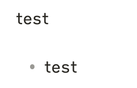

## Editor

### Behavior

| 属性                      | 说明                                                                                     |
| ------------------------- | ---------------------------------------------------------------------------------------- |
| Auto pair Markdown syntax | 自动补全语法，比如 `inline-code` *italic* **strong**                                     |
| Auto converter HTML       | 自动转化 `html` 为 `markdown` , 遇到粘贴源码的时候，可能会出现丢失格式。可以使用 alt+shift+v | 

## Plugins

| 插件                         | 说明           |
| ---------------------------- | -------------- |
| Custom File Explorer Sorting | 文件夹排序     |
| Customizable Menu            | 自定义右键菜单 | 

### Linter

- Paragraph blank lines
	- 最好不要开。容易导致行和 list 之间自动添加行
		- 

## Action

- 使用 `-` 作为无序的 list 的时候，从中间不容易断开。可以使用 `shift` + `-` 退出 list 的编辑模式。
- `Shift+Alt` 激活多行编辑模式

### search

- 搜索 `tag:parent`, not `tag:child` 
	- `tag:parent -/(parent\/.+)/` 获取标签为 parent， 且不为 parent/* 的文件
