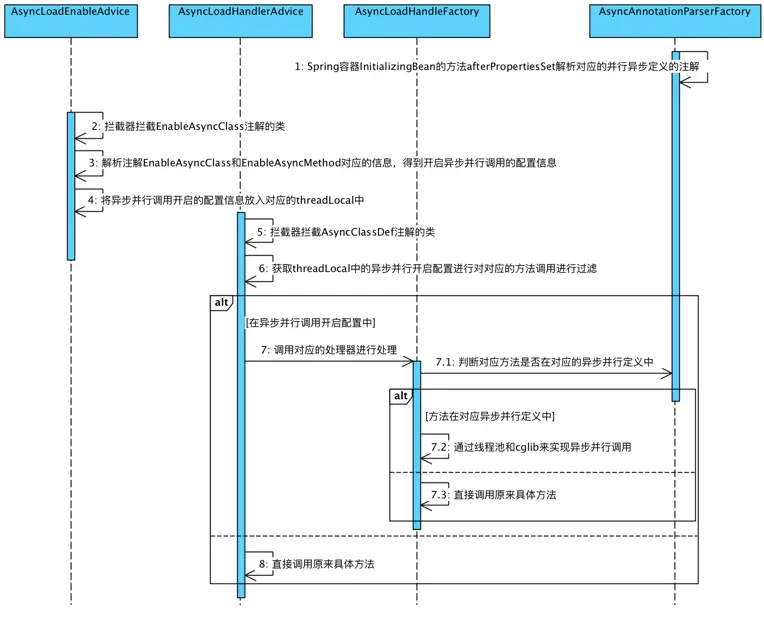

> [GitHub - alibaba/asyncload: 阿里巴巴异步并行加载工具(依赖字节码技术)](https://github.com/alibaba/asyncload)  
> [扩展异步并行调度框架asyncLoad支持注解配置](扩展异步并行调度框架asyncLoad支持注解配置.md)

## 实现原理

- 原理：线程池 + Future + Cglib 结合的方式来实现
- 优点：正好是异步并行基本实现方式对应的缺点，不需要基础开发人员了解更多异步并行实现方式，可以让基础开发人员还是按照原来开发串行执行代码一样进行开发，唯一的不同就是在需要异步并行执行的方法上增加对应的配置（xml，注解等方式）;
- 缺点：cglib 本身的方式带来的缺点（通过实现对应目标类的子类来实现动态代理，并且可以在生成子类的时候在对应方法上进行拦截，增强子类方法的功能），但是这种方式的代理本身不支持 final 类（因为 final 类不支持生成对应的子类），因此对应的像基元类型就不支持；灵活性不如基础的好；

> 这里正好设计到多个知识点, [Spring AOP 和 AspectJ 注解集成下的源码解读](Spring%20AOP%20和%20AspectJ%20注解集成下的源码解读.md)

### 流程图



## 使用方式

- 入口，开启异步调用

```java
@Component
@AsyncClassDef
public class AsyncLoadAnnotationTestServiceImpl extends AsyncLoadTestServiceImpl {

	@Override
	@AsyncMethodDef(timeout = 10)
	public AsyncLoadTestModel getRemoteModel(String name, long sleep) {
		return super.getRemoteModel(name, sleep);
	}
}
```

- 实际业务代码

```java
@Component  
@EnableAsyncClass  
public class AsyncLoadAnnotationMultiMethodTest {

    @Autowired
    private AsyncLoadAnnotationTestServiceImpl asyncLoadAnnotationTestServiceImpl;

    @EnableAsyncMethod
    public List<AsyncLoadTestModel> multiHandler(String name, long sleep) {

        List<AsyncLoadTestModel> results = Lists.newArrayList();
        for (int i = 0; i < 5; i++) {
            AsyncLoadTestModel model = asyncLoadAnnotationTestServiceImpl.getRemoteModel(name,
                    sleep);

            results.add(model);
        }
        return results;
    }

}

```

- 验证

```java
public static void main(String[] args) {  
   AnnotationConfigApplicationContext annotationConfigApplicationContext = new AnnotationConfigApplicationContext(  
         "com.alibaba.asyncload.impl.annotation", "com.alibaba.asyncload.annotation",  
         "com.alibaba.asyncload.domain");  
   System.out.println(annotationConfigApplicationContext.getBeanDefinitionNames());  
  
   /*AsyncLoadHandlerAop aop = annotationConfigApplicationContext  
         .getBean(AsyncLoadHandlerAop.class);*/  
   // 执行测试  
   AsyncLoadAnnotationTestServiceImpl service = annotationConfigApplicationContext  
         .getBean(AsyncLoadAnnotationTestServiceImpl.class);  
   AsyncLoadTestModel model1 = service.getRemoteModel("first", 1000); // 每个请求sleep  
                                                      // 1000ms   AsyncLoadTestModel model2 = service.getRemoteModel("two", 1000); // 每个请求sleep  
                                                      // 1000ms   AsyncLoadTestModel model3 = service.getRemoteModel("three", 1000); // 每个请求sleep  
                                                      // 1000ms  
   long start = 0, end = 0;  
   start = System.currentTimeMillis();  
   System.out.println(model1.getDetail());  
   end = System.currentTimeMillis();  
   System.out.println("costTime:" + (end - start));  
   Assert.assertTrue((end - start) > 500l); // 第一次会阻塞, 响应时间会在1000ms左右  
  
   start = System.currentTimeMillis();  
   System.out.println(model2.getDetail());  
   end = System.currentTimeMillis();  
   System.out.println("costTime:" + (end - start));  
   Assert.assertTrue((end - start) < 500l); // 第二次不会阻塞，因为第一个已经阻塞了1000ms  
  
   start = System.currentTimeMillis();  
   System.out.println(model3.getDetail());  
   end = System.currentTimeMillis();  
   System.out.println("costTime:" + (end - start));  
   Assert.assertTrue((end - start) < 500l); // 第三次不会阻塞，因为第一个已经阻塞了1000ms  
  
}
```

## 借鉴方案

说白了，以上方案就是借用了 `AspectJ` 的 `Aspect` 实现的异步逻辑，如果不希望使用 Spring 来启动，可以直接借用 [Spring 的 AspectJProxyFactory](../Reference/Spring%20的%20AspectJProxyFactory.md)  
从而创建一个代理类，从而实现异步的调用。  
ps: 当然还要魔改一下上面 [Alibaba-AsyncLoad](#流程图) 的逻辑

```java
public class AsyncLoadAnnotationDirectTest {  
      
    public static void main(String[] args) {  
      
        AsyncLoadAnnotationTestServiceImpl service = new AsyncLoadAnnotationTestServiceImpl();  
        AspectJProxyFactory factory = new AspectJProxyFactory(service);  
        factory.addAspect(AsyncLoadHandlerAdvice.class);  
        AsyncLoadTestService proxy = factory.getProxy();  
        AsyncLoadTestModel remoteModel = proxy.getRemoteModel("2", 33L);  
        System.out.println();  
    }  
}
```
