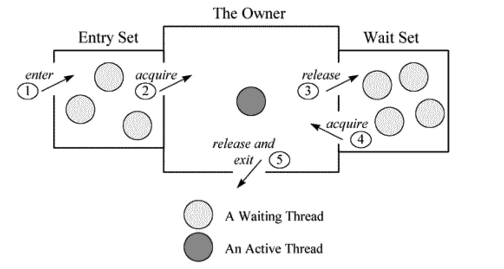

## 名词解释

1. tid - Java-Level Thread Id
2. nid - Native Thread Id

## 状态

https://blog.csdn.net/b644ROfP20z37485O35M/article/details/107240878

dump 文件里，值得关注的线程状态有：

1. 死锁，Deadlock（**重点关注**） 
2. 执行中，Runnable   
3. 等待资源，Waiting on condition（**重点关注**） 
4. 等待获取监视器，Waiting on monitor entry（**重点关注**）
5. 暂停，Suspended
6. 对象等待中，Object.wait() 或 TIMED_WAITING
7. 阻塞，Blocked（**重点关注**）  
8. 停止，Parked

## 案例

综合示范一：Waiting to lock 和 Blocked  
实例如下：

```
"RMI TCP Connection(267865)-172.16.5.25" daemon prio=10 tid=0x00007fd508371000 nid=0x55ae waiting for monitor entry [0x00007fd4f8684000]
   java.lang.Thread.State: BLOCKED (on object monitor)
at org.apache.log4j.Category.callAppenders(Category.java:201)
- waiting to lock <0x00000000acf4d0c0> (a org.apache.log4j.Logger)
at org.apache.log4j.Category.forcedLog(Category.java:388)
at org.apache.log4j.Category.log(Category.java:853)
at org.apache.commons.logging.impl.Log4JLogger.warn(Log4JLogger.java:234)
at com.tuan.core.common.lang.cache.remote.SpyMemcachedClient.get(SpyMemcachedClient.java:110)
```

1）线程状态是 Blocked，阻塞状态。说明线程等待资源超时！  
2）“ waiting to lock <0x00000000acf4d0c0>”指，线程在等待给这个 0x00000000acf4d0c0 地址上锁（英文可描述为：trying to obtain 0x00000000acf4d0c0 lock）。  
3）在 dump 日志里查找字符串 0x00000000acf4d0c0，发现有大量线程都在等待给这个地址上锁。如果能在日志里找到谁获得了这个锁（如 locked < 0x00000000acf4d0c0 >），就可以顺藤摸瓜了。  
4）“waiting for monitor entry”说明此线程通过 synchronized(obj) {……} 申请进入了临界区，从而进入了下图 1 中的“Entry Set”队列，但该 obj 对应的 monitor 被其他线程拥有，所以本线程在 Entry Set 队列中等待。  
5）第一行里，"RMI TCP Connection(267865)-172.16.5.25" 是 Thread Name 。tid 指 Java Thread id。nid 指 native 线程的 id。prio 是线程优先级。[0x00007fd4f8684000] 是线程栈起始地址。

## 详解

1. Deadlock：死锁线程，一般指多个线程调用间，进入相互资源占用，导致一直等待无法释放的情况。
2. Runnable：一般指该线程正在执行状态中，该线程占用了资源，正在处理某个请求，有可能正在传递 SQL 到数据库执行，有可能在对某个文件操作，有可能进行数据类型等转换。
3. Waiting on condition：等待资源，或等待某个条件的发生。具体原因需结合 stacktrace 来分析。
    1. 如果堆栈信息明确是应用代码，则证明该线程正在等待资源。一般是大量读取某资源，且该资源采用了资源锁的情况下，线程进入等待状态，等待资源的读取。
    2. 又或者，正在等待其他线程的执行等。
    3. 如果发现有大量的线程都在处在 Wait on condition，从线程 stack 看，正等待网络读写，这可能是一个网络瓶颈的征兆。因为网络阻塞导致线程无法执行。
        1. 一种情况是网络非常忙，几乎消耗了所有的带宽，仍然有大量数据等待网络读写；
        2. 另一种情况也可能是网络空闲，但由于路由等问题，导致包无法正常的到达。
    4. 另外一种出现 Wait on condition 的常见情况是该线程在 sleep，等待 sleep 的时间到了时候，将被唤醒。
4. Blocked：线程阻塞，是指当前线程执行过程中，所需要的资源长时间等待却一直未能获取到，被容器的线程管理器标识为阻塞状态，可以理解为等待资源超时的线程。
5. Waiting for monitor entry 和 in Object.wait()：
    1. Monitor 是 Java 中用以实现线程之间的互斥与协作的主要手段，它可以看成是对象或者 Class 的锁。每一个对象都有，也仅有一个 monitor。从下图 1 中可以看出，每个 Monitor 在某个时刻，只能被一个线程拥有，该线程就是 “Active Thread”，而其它线程都是 “Waiting Thread”，分别在两个队列 “ Entry Set”和 “Wait Set”里面等候。在 “Entry Set”中等待的线程状态是 “Waiting for monitor entry”，而在 “Wait Set”中等待的线程状态是 “in Object.wait()”。

