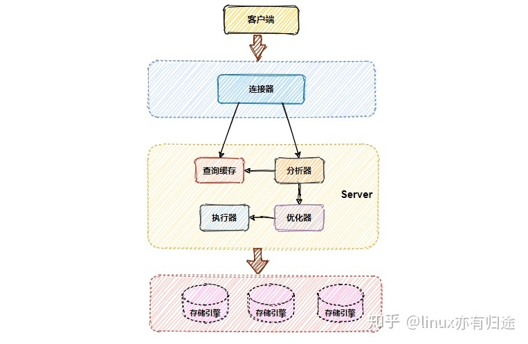
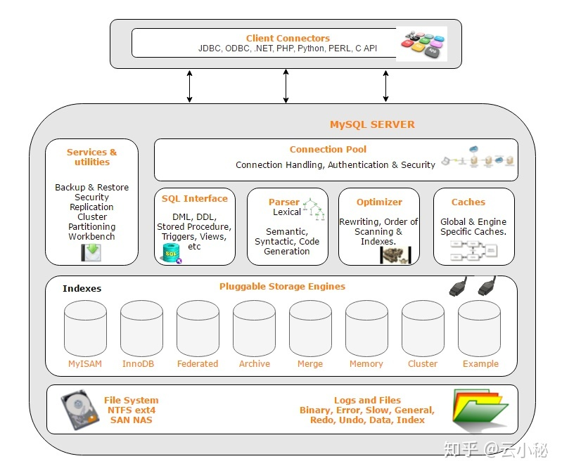

#dev/mysql

# MySQL 的架构

[玩转MySQL之MySQL体系架构介绍](https://zhuanlan.zhihu.com/p/43736857#:~:text=MySQL%E6%98%AF%E4%B8%80%E4%B8%AA%E5%85%B8%E5%9E%8B%E7%9A%84,Client%E8%B4%9F%E8%B4%A3%E8%BF%9E%E6%8E%A5%E5%88%B0Server%E3%80%82)

  

MySQL 逻辑系统架构分为 3 层:

- 应用层
- 服务层
- 存储引擎层

## **1. 应用层**

应用层是 MySQL 体系架构的最上层，它可其他 client-server 架构一样，主要包含如下内容:

- 连接处理
- 用户鉴权
- 安全管理

**1. 连接处理** 当一个客户端向服务端发送连接请求后，MySQL server 会从线程池中分配一个线程来和客户端进行连接，以后该客户端的请求都会被分配到该线程上。MySQL Server 为了提高性能，提供了线程池，减少了创建线程和释放线程所花费的时间。

**2. 用户鉴权** 当客户端向 MySQL 服务端发起连接请求后，MySQL server 会对发起连接的用户进行鉴权处理，MySQL 鉴权依据是: 用户名，客户端主机地址和用户密码

**3. 安全管理** 当客户连接到 MySQL server 后，MySQL server 会根据用户的权限来判断用户具体可执行哪些操作。

## **2. MySQL 服务层**

该层是 MySQL Server 的核心层，提供了 MySQL Server 数据库系统的所有逻辑功能，该层可以分为如下不同的组件:

- MySQL Management Server & utilities(系统管理)
- SQL Interface(SQL 接口)
- SQL Parser(SQL 解析器)
- Optimizer (查询优化器)
- Caches & buffers(缓存)

**1. MySQL Management Server & utilities(系统管理)** 提供了丰富的数据库管理功能，具体如下:

- 数据库备份和恢复
- 数据库安全管理，如用户及权限管理
- 数据库复制管理
- 数据库集群管理
- 数据库分区，分库，分表管理
- 数据库元数据管理

**2. SQL Interface(SQL 接口)** SQL 接口，接收用户的 SQL 命令并进行处理，得到用户所需要的结果，具体处理功能如下:

- Data Manipulation Language (DML).
- Data Definition Language (DDL).
- 存储过程
- 视图
- 触发器

**3. SQL Parser(SQL 解析器)** 解析器的作用主要是解析查询语句，最终生成语法树。首先解析器会对查询语句进行语法分析，如果语句语法有错误，则返回相应的错误信息。语法检查通过后，解析器会查询缓存，如果缓存中有对应的语句，就直接返回结果不进行接下来的优化执行操作。

> 注：读者会疑问，从缓存中查出来的数据会不会被修改，与真实的数据不一致，这里读者大可放心，因为缓存中数据被修改，会被清出缓存。

**4. Optimizer(查询优化器)** 优化器的作用主要是对查询语句进行优化，包括选择合适的索引，数据的读取方式。

**5. Caches & buffers(缓存)** 包括全局和引擎特定的缓存，提高查询的效率。如果查询缓存中有命中的查询结果，则查询语句就可以从缓存中取数据，无须再通过解析和执行。这个缓存机制是由一系列小缓存组成，如表缓存、记录缓存、key 缓存、权限缓存等。

## **3. 存储引擎层**

**1. 存储引擎** 存储引擎是 MySQL 中具体与文件打交道的子系统，也是 MySQL 最有特色的地方。MySQL 区别于其他数据库的最重要特点是其插件式的表存储引擎。他根据 MySQL AB 公司提供的文件访问层抽象接口来定制一种文件访问的机制（该机制叫存储引擎）。

**2. 物理文件** 物理文件包括：redolog、undolog、binlog、errorlog、querylog、slowlog、data、index 等

[MySQL之所以不会丢失，是因为它有这七种日志](https://zhuanlan.zhihu.com/p/343043260)