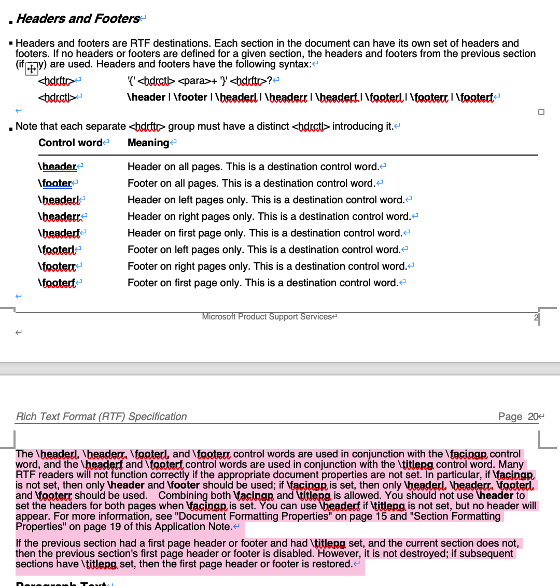

>  [Rich Text Format - Wikipedia](https://en.wikipedia.org/wiki/Rich_Text_Format#cite_note-28)  
>  [RTF 1.9.1 specification](https://interoperability.blob.core.windows.net/files/Archive_References/%5bMSFT-RTF%5d.pdf)

Oc 和 docx 是 office word 的文档文件，富文本（字体具有格式的），其中 doc 是二进制文档，数据结构复杂且保密（微软私有格式，破解的多只能读，写容易出问题，官方 word 读不回去），docx 是一种基于 xml 的 zip 包，开放格式，基本保证支持 docx 的都能通用读写。

Rtf 是微软开发的富文本格式，同样富文本，根据

[https://zh.wikipedia.org/wiki/RTF](https://zh.wikipedia.org/wiki/RTF)

的推测，是基于控制标记来实现富文本格式的，可以跨系统平台，不过不是微软主推格式。（office 赚钱，自然推附属的 doc 为标准）

Txt 为纯文本文件，无格式，只保存内容字符，基本跨平台，不过受字符的编码影响（因为只保存字符编码，一般没特定的编码识别标志），需要选择对应字符解码方式才能正确读取（如 GBK 编码的字符用 UTF-8 解码会乱码）

Xml 是一种标记语言，用于承载数据的，本身无格式但要符合标记语言的结构，可以通过 CSS 实现格式化显示，主要用于不依赖格式的数据承载媒介。

Pdf 是 Adobe 推出的文档交换格式，富文本，主要用于实现文档交换（如传阅和打印），对文字格式控制（可保证格式原样不变）和文档保护比 doc 好，同跨平台，属于开放标准。

Doc，docx，rtf，pdf 都是富文本的，微软的强大令 office 成为了办公软件标准，如果是制作富文档文档的话，用 doc 或 docx 都可以，rtf 只是 doc 无法支持的情况下的最后备用，如果传阅打印要保证格式不变的话，pdf 是最后生成物。

Txt 是纯文本，无格式数据可以用其。

Xml 是一种数据存储格式，主要是机器间的数据存储与传输用的，一般不是给人看的。

> [文档格式doc, docx, rtf, xml, txt, pdf等等这些，有什么区别，这些格式有何优劣，主要用在哪些情况下？ - 知乎](https://www.zhihu.com/question/21484759)

## 页眉页脚

从上文中可以看到

- `\titlepg` - `\headerf` 对应
	- 设置后 `\header` 失效
- `\facingp` - `\headerl` `\headerr` 对应