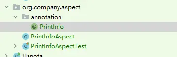

`Spring AOP` 是大家都非常熟悉的一个概念，在 Spring 家族体系中扮演着举足轻重的作用。

Spring 作为一个优秀的框架，提供了多种应用层面上代理的方式：`ProxyFactoryBean`、`ProxyFactory`、`AspectJProxyFactory`。

> 注意：此处这里指的是 Spring 提供的应用层得方式，并不是指的底层实现方式。  
> 底层实现方式现在只有业界都熟悉的两种：`JDK 动态代理` 和 `CGLIB 代理`

* `ProxyFactoryBean` 是将我们的 `AOP` 和 `IOC` 融合起来
* `ProxyFactory` 则只能通过代码硬编码进行编写，一般都是给 Spring 自己使用
* `AspectJProxyFactory` 是目前大家最常用的，起到集成 `AspectJ` 和 `Spring`


继承结构

涉及的关键类说明：

* `ProxyConfig`：为上面三个类提供配置属性。
* `Advised`：可以获取拦截器和其他 `advice, Advisors` 和代理接口
* `AdvisedSupport`：继承 `ProxyConfig`，实现了 `Advised`。封装了对通知（`Advise`）和通知器（`Advisor`）的操作
* `ProxyCreatorSupport`：继承 `AdvisedSupport`，其帮助子类（上面三个类）创建 `JDK` 或者 `CGLIB` 的代理对象

Spring 的 AspectJProxyFactory
========================



目录结构

PrintInfo 注解
------------

```
package org.company.aspect.annotation;

import java.lang.annotation.ElementType;
import java.lang.annotation.Retention;
import java.lang.annotation.RetentionPolicy;
import java.lang.annotation.Target;

@Target({ElementType.METHOD})
@Retention(RetentionPolicy.RUNTIME)
public @interface PrintInfo {
    String value() default "hello, world!";
} 
```

PrintInfoAspect 切面
------------------

```
package org.company.aspect;

import lombok.extern.slf4j.Slf4j;
import org.aspectj.lang.ProceedingJoinPoint;
import org.aspectj.lang.annotation.Around;
import org.aspectj.lang.annotation.Aspect;
import org.aspectj.lang.reflect.MethodSignature;
import org.company.aspect.annotation.PrintInfo;
import org.springframework.stereotype.Component;

@Slf4j
@Aspect
@Component
public class PrintInfoAspect {

    @Around("@annotation(org.company.aspect.annotation.PrintInfo)")
    public Object printInfo(ProceedingJoinPoint pjp) throws Throwable {
        // PrintInfo @Target=ElementType.METHOD
        // 该注解作用在方法上，强转为 MethodSignature
        MethodSignature methodSignature = (MethodSignature) pjp.getSignature();

        // 获取需要打印的信息
        PrintInfo printInfo = methodSignature.getMethod().getAnnotation(PrintInfo.class);
        String info = printInfo.value();

        log.info("@PrintInfo: {}", info);

        return pjp.proceed();
    }
} 
```

测试类
---

```
package org.company.aspect;

import org.company.aspect.annotation.PrintInfo;
import org.junit.Before;
import org.junit.Test;
import org.springframework.aop.aspectj.annotation.AspectJProxyFactory;

public class PrintInfoAspectTest {
    private PrintInfoDemo example;

    @Before
    public void setUp() {
        AspectJProxyFactory factory = new AspectJProxyFactory(new PrintInfoDemo());
        PrintInfoAspect aspect = new PrintInfoAspect();
        factory.addAspect(aspect);
        example = (PrintInfoDemo)factory.getProxy();
    }

    @Test
    public void testDefault() {
        example.testDefault();
    }

    @Test
    public void test() {
        example.test();
    }

    public static class PrintInfoDemo {
        @PrintInfo
        public void testDefault() {
            System.out.println("default");
        }

        @PrintInfo("这是切面打印的信息")
        public void test() {
            System.out.println("test 方法测试");
        }
    }
} 
```

输出结果：

```
17:02:32.791 [main] DEBUG org.springframework.aop.aspectj.annotation.ReflectiveAspectJAdvisorFactory - Found AspectJ method: public java.lang.Object org.company.aspect.PrintInfoAspect.printInfo(org.aspectj.lang.ProceedingJoinPoint) throws java.lang.Throwable
17:02:33.028 [main] INFO org.company.aspect.PrintInfoAspect - @PrintInfo: 这是切面打印的信息
test 方法测试
17:02:33.049 [main] DEBUG org.springframework.aop.aspectj.annotation.ReflectiveAspectJAdvisorFactory - Found AspectJ method: public java.lang.Object org.company.aspect.PrintInfoAspect.printInfo(org.aspectj.lang.ProceedingJoinPoint) throws java.lang.Throwable
17:02:33.050 [main] INFO org.company.aspect.PrintInfoAspect - @PrintInfo: hello, world!
default 
```

参考地址
====

* [Spring AOP 创建代理的方式](https://links.jianshu.com/go?to=https%3A%2F%2Fcloud.tencent.com%2Fdeveloper%2Farticle%2F1497781)
* [编程式的创建Aop代理之AspectjProxyFactory](https://links.jianshu.com/go?to=https%3A%2F%2Fblog.csdn.net%2Felim168%2Farticle%2Fdetails%2F78377926)
* [AOP 的 JoinPoint 参数方法详解](https://links.jianshu.com/go?to=https%3A%2F%2Fjueee.github.io%2F2021%2F01%2F2021-01-05-AOP%25E7%259A%2584JoinPoint%25E5%258F%2582%25E6%2595%25B0%25E6%2596%25B9%25E6%25B3%2595%25E8%25AF%25A6%25E8%25A7%25A3%2F)