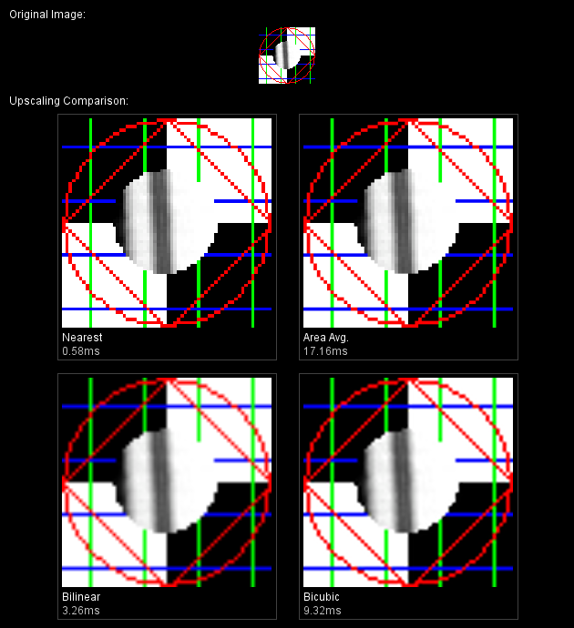

> [java.net: The Perils of Image.getScaledInstance()](https://web.archive.org/web/20080516181120/http://today.java.net/pub/a/today/2007/04/03/perils-of-image-getscaledinstance.html)  
> keyword: Image 的 scale / 缩放 风险

### Best Frienemies

For years, the Java 2D team has been encouraging developers to move away from JDK-1.0-isms like `Image.getScaledInstance()` and onto more modern APIs. We often make blanket statements like, "oh you don't want to do it that way, here's a better approach" and hope that developers take our word for it. It's a great strategy, that is until we receive the inevitable follow-up question: "But why?"

The purpose of this article is to demonstrate once and for all why `Image.getScaledInstance()` isn't the pleasant fellow you've been acquainted with (at arm's length) for the last decade or so. As with many other parts of the Java 2D API, there's more than one way to skin a cat, and most often the best approach depends on your goal: performance or quality. In this case however, I'll show that `Image.getScaledInstance()` isn't the fastest route; nor does it necessarily offer the best quality. (Hint: `Graphics.drawImage()` is your friend.)

### History Lesson

The [`java.awt.Image`](https://web.archive.org/web/20080516181120/http://java.sun.com/javase/6/docs/api/java/awt/Image.html) class has been around since the beginning of time, which in the Java world means the JDK 1.0 release. Since JDK 1.1, that class has offered a convenience method called [`getScaledInstance()`]( https://web.archive.org/web/20080516181120/http://java.sun.com/javase/6/docs/api/java/awt/Image.html#getScaledInstance (int,%20int,%20int)), which will (unsurprisingly) return a scaled version of the image that is sized according to the provided dimensions. The method also accepts one of five "hint" constants that are defined on the `Image` class:

- `SCALE_REPLICATE`: Specific hint that provides higher performance, but lower-quality, "blocky" results.
- `SCALE_FAST`: General hint meaning "I prefer speed over quality, but I'm not picky about the exact algorithm;" in Sun's current implementation (JDK 6 at the time of this writing) this is synonymous with `SCALE_REPLICATE`.
- `SCALE_AREA_AVERAGING`: Specific hint that is slower, but provides higher-quality, "filtered" results.
- `SCALE_SMOOTH`: General hint meaning "I prefer quality over speed, but I'm not picky about the exact algorithm;" in Sun's current implementation, this is generally synonymous with `SCALE_AREA_AVERAGING`. (As with the other hints, this mapping is implementation-dependent and subject to change; read the [Performance Notes](#perfnotes) section below for more on how this mapping could change in an upcoming release of Sun's JDK implementation.)
- `SCALE_DEFAULT`: General hint meaning "I don't care, just pick something for me;" in Sun's current implementation, this is synonymous with `SCALE_FAST`.

Lots of developers have grown accustomed to the nice quality offered by `SCALE_AREA_AVERAGING` (or `SCALE_SMOOTH`) over the years, but the general complaint is about poor performance. Due to the overly complicated (in my opinion) design of the image handling APIs in JDK 1.0 and 1.1 (e.g., having to deal with asynchronous loading, animated GIFs, and the whole consumer/producer model), it is very difficult to optimize this code path, so performance of this case has improved little over the years.

Fast forward to JDK 1.2 and the introduction of the Java 2D API. The redesigned API offered shiny new classes like `BufferedImage` and `Graphics2D`, as well as more flexibility in the form of `RenderingHints`. Much like the old scaling "hints" in the `Image` class, the `RenderingHints` class provides a number of similar switches to help developers control the quality of image scaling in a number of situations, like when calling the [scaling variant of `Graphics.drawImage()`]( https://web.archive.org/web/20080516181120/http://java.sun.com/javase/6/docs/api/java/awt/Graphics.html#drawImage (java.awt.Image,%20int,%20int,%20int,%20int,%20java.awt.image.ImageObserver)).

For `RenderingHints.KEY_INTERPOLATION`:

- `VALUE_INTERPOLATION_NEAREST_NEIGHBOR`: Specific hint that provides higher performance, but lower-quality, "blocky" results.
- `VALUE_INTERPOLATION_BILINEAR`: Specific hint that is typically a bit slower, but provides higher-quality, "filtered" results.
- `VALUE_INTERPOLATION_BICUBIC`: Specific hint that is similar to `BILINEAR` except that it uses more samples when filtering and therefore has generally higher quality than `BILINEAR`. (Note: this hint constant has been available since JDK 1.2, but was not implemented by Sun until the JDK 5 release; prior to that release, this hint was synonymous with `BILINEAR`.)

For `RenderingHints.KEY_RENDER_QUALITY`:

- `VALUE_RENDER_SPEED`: General hint meaning "I prefer speed over quality, but I'm not picky about the exact algorithm;" in Sun's current implementation this is synonymous with `VALUE_INTERPOLATION_NEAREST_NEIGHBOR`.
- `VALUE_RENDER_QUALITY`: General hint meaning "I prefer quality over speed, but I'm not picky about the exact algorithm;" in Sun's current implementation, this is generally synonymous with `VALUE_INTERPOLATION_BILINEAR`.
- `VALUE_RENDER_DEFAULT`: General hint meaning "I don't care, just pick something for me;" in Sun's current implementation, this is synonymous with `VALUE_RENDER_SPEED`.

As was the case with a number of improvements in JDK 1.2, we were unfortunately left with two different systems: the new way and the old way (think Swing versus AWT, `ArrayList` versus `Vector`, and so on). The same holds true when it comes to image scaling. The new `RenderingHints` provide much more flexibility than the older "hints" in the `Image` class, but as the saying goes, with great power comes great responsibility. There isn't necessarily a one-to-one mapping between the new hints and the old ones, especially in the case of the "quality" hints. In the post-JDK 1.2 world, there are multiple approaches to choose from, and the right technique often depends on the situation. The next two sections will discuss these approaches in more detail.

### On-The-Fly Scaling

As previously stated, the right scaling approach often depends on the context. For the purposes of this discussion, I will highlight the two most common strategies. I call the first approach "on-the-fly" scaling because it is generally used in dynamic situations. For example, you may want to scale a bunch of images as part of an animation sequence. Or you may have a custom component that lets the user zoom in on and out of an image. In these cases, the scale factor is constantly changing, so it does not make much sense to cache a scaled instance of the image at each size. Instead, we can simply use the scaling variant of `Graphics.drawImage()` to scale an image into the destination (e.g. a custom Swing component, or perhaps an offscreen image that will later be saved to disk):

```

    private float xScaleFactor, yScaleFactor = ...;
    private BufferedImage originalImage = ...;

    public void paintComponent(Graphics g) {
        Graphics2D g2 = (Graphics2D)g;
        int newW = (int)(originalImage.getWidth() * xScaleFactor);
        int newH = (int)(originalImage.getHeight() * yScaleFactor);
        g2.setRenderingHint(RenderingHints.KEY_INTERPOLATION,
                            RenderingHints.VALUE_INTERPOLATION_BILINEAR);
        g2.drawImage(originalImage, 0, 0, newW, newH, null);
    }

```

### Creating Scaled Instances

The second approach is useful in those scenarios where the developer has a source image at one size, but is planning to render that image over and over again at a different size. Probably the most common case where scaled instances are useful is in applications that display lots of small "thumbnail" images that are generated from larger originals. In these kinds of applications, it would be wasteful to downscale each original image "on the fly" every time the component is repainted. If instead the original images are downscaled once into smaller scaled instances, performance is improved because only a much smaller number of pixels needs to be copied to the screen each time around. Footprint is also greatly reduced because fewer pixels need to be stored in system memory at runtime.

Another common scenario where scaled instances are useful is when a image is used scaled to fill the background of a custom Swing component. Even if the frame is resizable, most of the time the background image is rendered with the same dimensions each time. So rather than incur the overhead of scaling the image upon each repaint to fill the component bounds, wouldn't it be better to scale the image once, and then copy the scaled instance to the screen each time? (This technique is often applied in modern user interfaces that use a gradient as the background of a custom component. For more information, refer to the blog entry " [Java2D Gradients Performance](https://web.archive.org/web/20080516181120/http://weblogs.java.net/blog/gfx/archive/2006/09/java2d_gradient.html)" by Swing guru [Romain Guy](https://web.archive.org/web/20080516181120/http://www.jroller.com/page/gfx).)

When creating scaled instances, choosing between the various `RenderingHints` is an important part of the process; the best hint for the job often depends on the desired quality, and whether the image is being scaled larger or smaller. When upscaling an image (that is, when the dimensions of the scaled image are larger than those of the original) the choice is fairly simple: for speed, use `RenderingHints.VALUE_INTERPOLATION_NEAREST_NEIGHBOR`; for good quality, use `RenderingHints.VALUE_INTERPOLATION_BILINEAR`; or for even better quality, use `RenderingHints.VALUE_INTERPOLATION_BICUBIC`. The basic idea is to create a new image with the desired dimensions, and then use the scaling variant of `Graphics.drawImage()` to scale the original image into the new one.

When downscaling an image, the choice is slightly more complex. The same advice regarding `RenderingHints` given for upscaling is generally applicable to downscaling as well. However, be aware that if you try to downscale an image by a factor of more than two (i.e., the scaled instance is less than half the size of the original), and you are using the `BILINEAR` or `BICUBIC` hint, the quality of the scaled instance may not be as smooth as you might like. If you are familiar with the quality of the old `Image.SCALE_AREA_AVERAGING` (or `Image.SCALE_SMOOTH`) hint, then you may be especially dismayed. The reason for this disparity in quality is due to the different filtering algorithms in use. If downscaling by more than two times, the `BILINEAR` and `BICUBIC` algorithms tend to lose information due to the way pixels are sampled from the source image; the older `AreaAveragingFilter` algorithm used by `Image.getScaledInstance()` is quite different and does not suffer from this problem as much, but it requires much more processing time in general.

To combat this issue, you can use a multi-step approach when downscaling by more than two times; this helps prevent the information loss issue and produces a much higher quality result that is visually quite close to that produced by `Image.SCALE_AREA_AVERAGING`. Despite the fact that there may be multiple temporary images created, and multiple calls made to `Graphics.drawImage()` in the process, this approach can be significantly faster than using the older, slower `Image.getScaledInstance()` method. The basic idea here is to repeatedly scale the image by half (using `BILINEAR` filtering), and then, once the target size is near, perform one final scaling step to reach the target dimensions. The following convenience method can be used to achieve higher quality downscaling in your application (there are similar helper methods available in the [`GraphicsUtilities`](https://web.archive.org/web/20080516181120/https://swingx.dev.java.net/source/browse/swingx/src/java/org/jdesktop/swingx/graphics/GraphicsUtilities.java) class, which is part of the SwingLabs project).

```

    /**
     * Convenience method that returns a scaled instance of the
     * provided {@code BufferedImage}.
     *
     * @param img the original image to be scaled
     * @param targetWidth the desired width of the scaled instance,
     *    in pixels
     * @param targetHeight the desired height of the scaled instance,
     *    in pixels
     * @param hint one of the rendering hints that corresponds to
     *    {@code RenderingHints.KEY_INTERPOLATION} (e.g.
     *    {@code RenderingHints.VALUE_INTERPOLATION_NEAREST_NEIGHBOR},
     *    {@code RenderingHints.VALUE_INTERPOLATION_BILINEAR},
     *    {@code RenderingHints.VALUE_INTERPOLATION_BICUBIC})
     * @param higherQuality if true, this method will use a multi-step
     *    scaling technique that provides higher quality than the usual
     *    one-step technique (only useful in downscaling cases, where
     *    {@code targetWidth} or {@code targetHeight} is
     *    smaller than the original dimensions, and generally only when
     *    the {@code BILINEAR} hint is specified)
     * @return a scaled version of the original {@code BufferedImage}
     */
    public BufferedImage getScaledInstance(BufferedImage img,
                                           int targetWidth,
                                           int targetHeight,
                                           Object hint,
                                           boolean higherQuality)
    {
        int type = (img.getTransparency() == Transparency.OPAQUE) ?
            BufferedImage.TYPE_INT_RGB : BufferedImage.TYPE_INT_ARGB;
        BufferedImage ret = (BufferedImage)img;
        int w, h;
        if (higherQuality) {
            // Use multi-step technique: start with original size, then
            // scale down in multiple passes with drawImage()
            // until the target size is reached
            w = img.getWidth();
            h = img.getHeight();
        } else {
            // Use one-step technique: scale directly from original
            // size to target size with a single drawImage() call
            w = targetWidth;
            h = targetHeight;
        }
        
        do {
            if (higherQuality && w > targetWidth) {
                w /= 2;
                if (w < targetWidth) {
                    w = targetWidth;
                }
            }

            if (higherQuality && h > targetHeight) {
                h /= 2;
                if (h < targetHeight) {
                    h = targetHeight;
                }
            }

            BufferedImage tmp = new BufferedImage(w, h, type);
            Graphics2D g2 = tmp.createGraphics();
            g2.setRenderingHint(RenderingHints.KEY_INTERPOLATION, hint);
            g2.drawImage(ret, 0, 0, w, h, null);
            g2.dispose();

            ret = tmp;
        } while (w != targetWidth || h != targetHeight);

        return ret;
    }

```

**An Aside**

I frequently see developers using `AffineTransform.scale()` and similar methods when performing simple image scaling. While there isn't anything wrong with this approach per se, it's often unnecessarily complicated and also requires the creation of an `AffineTransform`. I'll admit, it is sometimes useful if you're feeling lazy and want to scale a bunch of images/geometry by a certain pre-calculated factor; for example:

```

    public void paintComponent(Graphics g) {
        Graphics2D g2 = (Graphics2D)g;
        AffineTransform oldXform = g2.getTransform();
        g2.scale(2.0, 2.0);
        g2.drawImage(img, 0, 0, null);
        // Or I sometimes see this even more complicated approach...
        // AffineTransform xform = AffineTransform.getScaleInstance(2, 2);
        // g2.drawImage(img, xform, null);
        g2.setTransform(oldXform); // restore transform
    }

```

But in a majority of cases, there is a better approach: use the scaling variant of `Graphics.drawImage()`. I can only guess that developers aren't aware of this much more straightforward method. Compare the previous example to the following (equivalent) code:

```

    public void paintComponent(Graphics g) {
        g.drawImage(img, 0, 0, img.getWidth()*2, img.getHeight()*2, null);
    }

```

Not only is this cleaner and more readable code, but it doesn't require restoring the transform state of the `Graphics2D` (a requirement when writing custom painting code in Swing). It may also perform slightly better because it doesn't require the creation of an `AffineTransform` object and it avoids some more complicated logic in Java 2D's image drawing code.

As an aside to the aside, in some rare cases I've even seen the following technique used in developers' code (this is an example of what _not_ to do):

```

    public void paintComponent(Graphics g) {
        int newW = img.getWidth() * 2;
        int newH = img.getHeight() * 2;
        Image scaledImage = img.getScaledInstance(newW, newH, SCALE_FAST);
        g.drawImage(scaledImage, 0, 0, null);
    }

```

This is really bad practice because every time the custom Swing component is repainted, a new scaled image needs to be created (resulting in unnecessary garbage generation). More simply, it represents wasted effort, especially with the knowledge that `Image.getScaledInstance()` is generally much slower than the more straightforward `Graphics.drawImage()` approaches described above.

The bottom line: the scaling variant of `Graphics.drawImage()` is your friend! Use it whenever possible.

### Results

I've generated both sample images (for comparing quality) and average compute times (for comparing performance) using a simple test case/micro-benchmark. (Here's the [source code](/web/20080516181120/http://today.java.net/today/2007/04/03/ScaleImage-src.zip).) Note that I could've written these performance tests using our [J2DBench](https://web.archive.org/web/20080516181120/http://weblogs.java.net/blog/campbell/archive/2005/03/strcrazy_improv_1.html) framework, but I'll save that for another day. (I've been meaning to write a blog entry about the wonders of J2DBench for, oh, about 18 months now. Let's hope it doesn't take another 18 months to finish that one.)

The following data was generated using JDK 6 (`-d32 -client`), Solaris 10, 2.0GHz Opteron, 2GB RAM. The numbers reflect the average time (in milliseconds; lower is better) to perform a single scaling operation. Your mileage may vary.

Figure 1 shows a downscaling comparison (472 by 472 `BufferedImage` of `TYPE_INT_RGB` scaled down to 100 by 100):


  
_Figure 1. Downscaling comparison_

From this screenshot, it is clear that performing a simple one-step downscale using any of the three `RenderingHints` will not produce quality results that most developers will find acceptable (although performance is great in these cases). Using `Image.getScaledInstance(SCALE_AREA_AVERAGING)` does produce the nice "filtered" results that many developers have grown to expect, but it incurs a severe performance penalty, up to 50 times slower than a one-step `BILINEAR` operation. Finally, the last box shows the multi-step `BILINEAR` technique advocated earlier in this article. Notice that the visual results are on par with those produced by `SCALE_AREA_AVERAGING`, but at a fraction of the performance cost.

_Bonus: As an incentive to check out the [source code](/web/20080516181120/http://today.java.net/today/2007/04/03/ScaleImage-src.zip) for this article, I've included code for a "trilinear mipmapping" technique written by Jim Graham (Java 2D architect). Just uncomment the two lines marked `"BONUS"` and give it a try. This technique is not discussed in this article, but some developers may find the somewhat "fuzzy" results appealing in certain downscaling situations._

Figure 2 shows an upscaling comparison (62 by 62 `BufferedImage` of `TYPE_INT_RGB` scaled up to 230 by 230):


  
_Figure 2. Upscaling comparison_

For the upscaling case, it is again clear that `Image.getScaledInstance(SCALE_AREA_AVERAGING)` has the poorest performance, and in addition, its visual quality is only marginally better than `NEAREST_NEIGHBOR`. Both `BILINEAR` and `BICUBIC` produce higher quality, "filtered" results that most developers find attractive, especially when scaling photographic content. If you squint, you can see that `BICUBIC` retains more detail from the original image than does `BILINEAR`, and it is also less blurry than `BILINEAR`, but this increased quality comes with some performance cost.

Which hint or method you choose in your application largely depends on the image content being scaled, the desired visual results, and the performance constraints of the situation. The above screenshots demonstrate that there are trade-offs with each approach, and therefore the decision of which one to choose ultimately lies in the hands of the developer.

### Performance Notes

When using either of the one-step or multi-step approaches described above, the performance of the scaling operation (and that of all Java 2D operations) is dependent on the pixel format of the source and destination images. For example, in Sun's Java 2D implementation, it is always much faster to scale a `TYPE_INT_RGB` or `TYPE_INT_ARGB` `BufferedImage` than, say, one that is `TYPE_CUSTOM` (because the loops for the former can be much more optimized than those for custom surfaces). In practice, some Image I/O readers will produce `BufferedImages` with a pixel layout that is best for that particular image format, but it may be a pixel layout for which our Java 2D implementation is not well-optimized. For these reasons, we recommend first copying the source image into one of the more common formats for which we have optimized loops, such as `TYPE_INT_RGB`, before performing the scaling operation. This technique can be much faster than directly scaling a `TYPE_CUSTOM` or other suboptimal image format. For more information on this "intermediate image" technique, refer to the article "[Intermediate Images](https://web.archive.org/web/20080516181120/http://java.sun.com/developer/technicalArticles/Media/intimages/)" written by Java 2D expert [Chet Haase](https://web.archive.org/web/20080516181120/http://weblogs.java.net/blog/chet/). To determine whether your application is using less-optimized image scaling loops, refer to [this item](https://web.archive.org/web/20080516181120/http://java.sun.com/products/java-media/2D/reference/faqs/index.html#Q_Are_there_any_tracing_faciliti) about tracing tips in the [Java 2D FAQ](https://web.archive.org/web/20080516181120/http://java.sun.com/products/java-media/2D/reference/faqs/index.html).

Some readers may have noticed that there has been no mention thus far of hardware acceleration of scaled images. It is worth noting that another reason to avoid `Image.getScaledInstance()` is that there is no potential for accelerating the scale operation in hardware; in contrast, using the `Graphics.drawImage()` method does open the possibility for hardware acceleration, depending on the pipeline in use. For example, when Sun's OpenGL-based Java 2D pipeline is enabled and an image is frequently scaled on the fly to an accelerated destination (such as the Swing backbuffer), the source "managed" image may be automatically cached in OpenGL texture memory so that subsequent scale or copy operations are extremely fast. For more information, consult Chet's fine blog entry " [BufferedImage as Good as Butter, Part II](https://web.archive.org/web/20080516181120/http://weblogs.java.net/blog/chet/archive/2003/08/bufferedimage_a_1.html)" on managed images, as well as "[Behind the Graphics2D: The OpenGL-based Pipeline](https://web.archive.org/web/20080516181120/http://today.java.net/cs/user/print/a/147)" (although that article refers to J2SE 5.0, the information is generally applicable to Java SE 6 as well).

Finally, a number of developers have wondered over the years: if there are faster alternatives to `Image.getScaledInstance()`, then couldn't that method be reimplemented using the more modern techniques? Well, the answer is: yes and no. Yes, for certain image types like `BufferedImage` it should be relatively straightforward to use the scaling variant of `Graphics.drawImage()` as demonstrated above in an updated implementation of `Image.getScaledInstance()`. But as previously touched upon, it can be quite difficult to do something similar for other image types, such as `Images` loaded via the old `Toolkit` image loaders and hardware-accelerated `VolatileImages`.

In [JDK 7](https://web.archive.org/web/20080516181120/https://jdk7.dev.java.net/) we do plan to provide a more optimized implementation of `BufferedImage.getScaledInstance()`, which will at least reduce the performance impact for older applications and for developers who may have not been aware of the better alternatives. In addition, we plan to better document these performance issues and direct developers to the preferred modern APIs. To follow the progress of these improvements, check out the relevant bug report [Bug 6196792](https://web.archive.org/web/20080516181120/http://bugs.sun.com/bugdatabase/view_bug.do?bug_id=6196792). Also consider voting for [RFE 6500894](https://web.archive.org/web/20080516181120/http://bugs.sun.com/bugdatabase/view_bug.do?bug_id=6500894), which requests alternative filtering algorithms such as `sinc`, `lanczos`, and `mitchell`.

### Conclusions

From the above results, it should be clear that the `Graphics.drawImage()`-based approaches are faster than, and at least as nice as (if not nicer than), `Image.getScaledInstance()`. By now I'm sure you're all scouring your code and looking to kick `Image.getScaledInstance()` to the curb once and for all. But remember, there is no one-size-fits-all approach to image scaling, and sometimes even a hybrid approach is best. Take, for example, an application that allows the user to drag the mouse to scale an image preview up and down. In this scenario, the user is unlikely to notice the scaling quality while the image is animating, so a one-step on the fly technique is probably best to keep things nimble. Once the user has stopped dragging, you might decide to use a multi-step "scaled instance" technique to update the area, to provide the highest-quality rendering.

Always take the time to understand the context in which image scaling is used in your application, and then use the most appropriate of the techniques described above. Above all, try to avoid `Image.getScaledInstance()` whenever possible; the other alternatives are both faster and more flexible, and in the end, your users will thank you for it.

### Resources

- [Source code](/web/20080516181120/http://today.java.net/today/2007/04/03/ScaleImage-src.zip) for this article
- "[Java2D Gradients Performance](https://web.archive.org/web/20080516181120/http://weblogs.java.net/blog/gfx/archive/2006/09/java2d_gradient.html)," by Romain Guy
- "[Intermediate Images](https://web.archive.org/web/20080516181120/http://java.sun.com/developer/technicalArticles/Media/intimages/)," by Chet Haase
- "[BufferedImage as Good as Butter, Part II](https://web.archive.org/web/20080516181120/http://weblogs.java.net/blog/chet/archive/2003/08/bufferedimage_a_1.html)," by Chet Haase
- "[Behind the Graphics2D: The OpenGL-based Pipeline](https://web.archive.org/web/20080516181120/http://today.java.net/cs/user/print/a/147)"