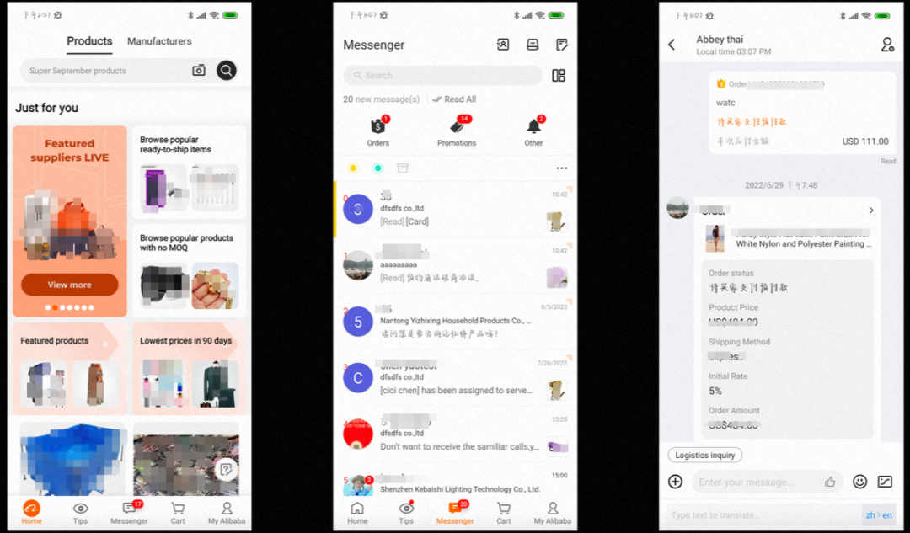
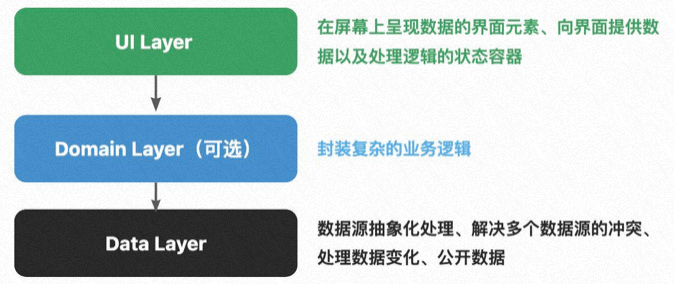

针对上图，思考两个问题：

1. 从无到有实现一下需求，需要做什么
2. 只修改制定区域的元素，又需要做什么

无论是上文哪一个问题，需要关注的都是

- 需要多少 UI（UI 组件、功能页面）（UI=User Interface）
- 数据从哪里来？
- 数据与 UI 如何关联？（数据到哪里去、怎么去）
- 用户行为响应
- 用户行为采集
- 发布后，如何运维与监控（出现问题的时候，可以有哪些方法帮助问题的排查）

将上文提及的关注点进行抽象与分层后，会得到如下一张图：  

> 这里比较像 [https://github.com/alibaba/COLA](https://github.com/alibaba/COLA) ，也就是领域驱动模型

# 二、通过关注点看实现需求需要做些什么

## 需要多少 UI

首先取决于“需求文档（PRD）”、“视觉交互设计稿”。对于开发来说，请重视需求评审、视觉交互评审。

对于质量良好的需求文档或者视觉设计稿，文档中给出的 UI 组件/页面范围一般就是开发要实现的 UI 范围；

对于质量差的需求甚至是一句话的需求，UI 范围则需要研发“梳理确定”。

⚠️ 着重关注异常逻辑，比如查询类需求，“查询结果为空”“查询时无网络”

需求拆解时，需要关注 UI 的展示对象

- 图片（CDN、OSS、base64)
- 文案（文案的长度、多语言的翻译）
- RTL（Right to Left) 适配

实操方法

- UI 范围：功能页面范围、页面状态及状态的变化逻辑、界面的异常逻辑
- 页面元素的拆解：列表元素、卡片元素、动画元素、UI 特效
- UI 展示的对象：文案的范围、多语言翻译的来源、RTL 适配的范围、图片、短视频

## 数据来源

> 网络数据、本地数据、内存数据

- 网络数据：需求拆解时候重点关注接口文档、接口名称、接口返回的数据字段（包括字段类型、范围、字段名称等等）、接口对应的团队或具体的开发、接口的上下游链路（示例：搜索的接口会涉及广告、算法等）、接口测试与联调方式等。对于新手，需求拆解的时候还需要确认：数据网关类型（MTOP 网关、Node 编排后的数据、Web 网站对应的数据网关等），明确网络数据调度所用的域名（比如，部分 APP 交易功能的域名与非交易功能的域名是分开的，调度方式也会有差异）。
- 本地存储数据：需求拆解阶段，要明确本地存储数据还是自己负责还是使用他人的能力。如果是自己负责则需要进一步判断数据是写本地数据库，还是写本地文件；如果是他人负责，数据的读写方式与接口是什么。
- 内存数据：需求拆解重点关注内存数据的读写方式，数据使用后的释放方式。
- 富媒体内容流：图片、短视频、直播等多媒体流。需求拆解时关注这些内容存储的形式（以图片为示例：图片是 CDN 的 URL，还是 OSS 的文件地址或者 ID，甚至是 base64 处理后的编码结果）；同时还需要判断这些展示能力是已有的还是需要新引入等。

实操方法

- 数据逻辑的分层结构图（根据实际需要）
- 功能与数据接口的对照关系、接口文档、接口的承接平台、接口的 Mock 方式等
- 功能的数据流转与逻辑流程图

> 数据架构图的一种，见 [DEMO](https://kms.fineres.com/pages/viewpage.action?pageId=526031927)，和 [数据流转图定义](https://zhuanlan.zhihu.com/p/115821818)

## 数据与 UI 关联

数据绑定

- 单向数据绑定：数据变化自动驱动 UI 刷新，代码实现会体现为各种 Observer 或者 Observable 等。
- 双向数据绑定：数据改变的同时使视图刷新，而视图改变也可以同时改变数据。
- 无所谓数据绑定，数据关联到 UI 是过程式的编程，体现为：加载数据、加载成功手工代码上屏等。

**实操方法：**拆解时，数据与 UI 关联，可拆解出的内容（数据与 UI 的关联，建议将“克制”作为自己的原则）：

- 功能的数据流转与逻辑流程图
- 代码设计、数据关系流转设计等等
- 数据状态变化、UI 刷新时机等
- 关联所用的绑定能力、数据变化后的通知机制等

## 用户行为响应

- 归纳需求文档或设计文档中的用户行动点，包括：点击、上下滑动、左右滑动、长按、开锁屏、虚实键盘响应、缩放手势等等。
- 行动点的常见处理：页面跳转、tips/toast/弹窗等展示、动画处理、界面缩放、界面关闭等
- 需约定的接口或规范：页面跳转的 schema/传参、二三方能力唤起的方式等

## 用户行为采集

???