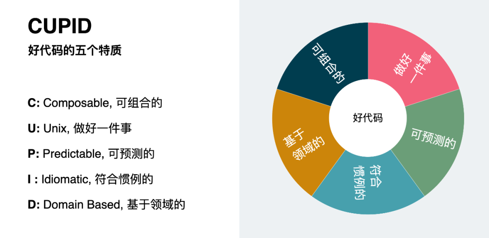
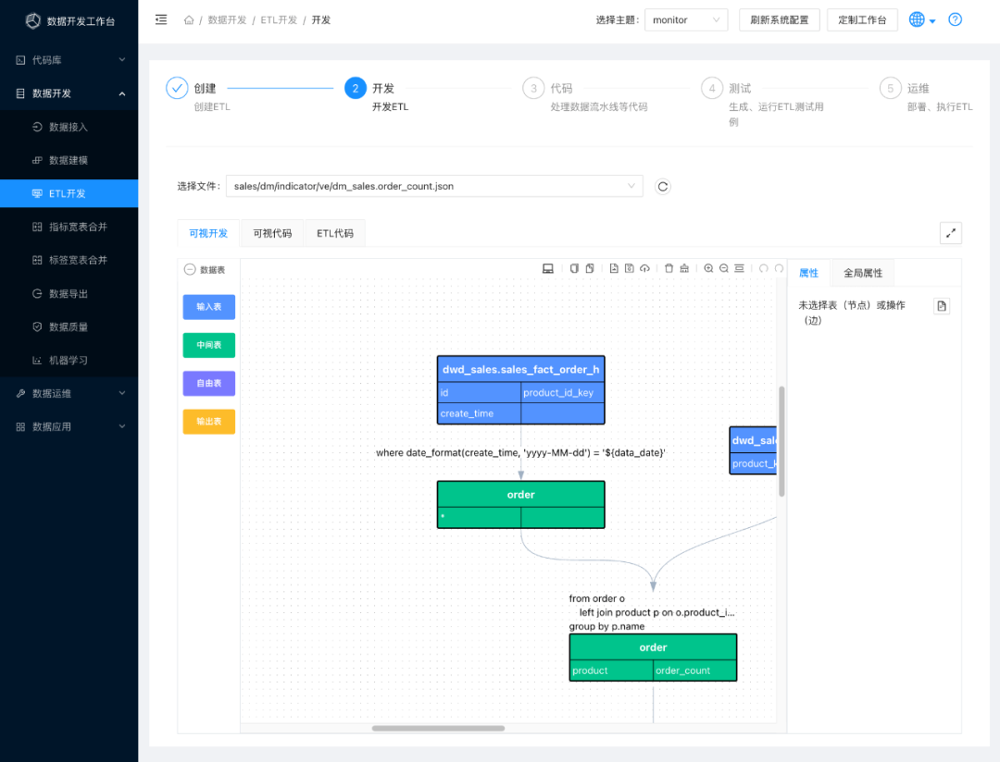

> [好代码的五个特质-微信](https://mp.weixin.qq.com/s?__biz=MzAwMjE4OTc5NA==&mid=2247484186&idx=1&sn=24b1046ea3c072503ab984c43553b10b&chksm=9acf7397adb8fa819d12acbad76ceff1881a1cee72cdc7c5e3e1febe1cd63898c93e991a9ba0&mpshare=1&scene=1&srcid=0404ruBBaaiz0TL4APNS2TfA&sharer_sharetime=1680582226191&sharer_shareid=cb0a0cd1ec47dcbe43c5c305ada84cc8&version=4.0.20.90669&platform=mac#rd)

新的一期技术雷达如期发布，仔细阅读了这一期的所有条目，CUPID 这一条尤其让我产生共鸣。

CUPID 出自 Daniel 的一篇名为《CUPID—for joyful coding》 ( https://dannorth.net/2022/02/10/cupid-for-joyful-coding/ ) 的博文，即《CUPID- 为了快乐编程》。CUPID 是 Composable/Unix philosophy/Predictable/Idiomatic/Domain based 几个单词的缩写，有经验的同学一看就知道这是好代码的一些属性。知道 **Cupid** 这个单词的同学还能感受到这一组属性所蕴含的对于软件工程的热情。Cupid 的中文是丘比特，是指古罗马的爱神，其意象是一个长有翅膀的小孩，拿着弓箭射向人们，以便人们可以相互爱上对方。



# 2 特质

Daniel 老爷子回忆了自己三十多年的编程经历，他发现在修改代码时，好的代码会给人一种非常愉悦的感觉。你可以轻松找到需要修改的地方，而且，那个地方的代码是如此的易于理解，以至于一眼就能看出来代码在干什么。你可以很自信的完成修改，并且确信不会引入额外的副作用。代码是那么的鲜活，它会主动的指引你去你想去的地方，并且热情的欢迎你四处游览，就像在你熟悉的家里一样！

为什么好的代码能有这样的魅力？什么样的代码才是好代码？提到这个问题，我们常常会想到 SOLID（Single Responsibility/Open-close/Liskov Substitution/Interface Segregation/Dependency Injection）原则，Daniel 老爷子认为应该存在比 SOLID 更好用的东西。

如何衡量代码好坏？SOLID 采用了一组原则来定义好的代码，但是原则更像是规则，要么符合，要么不符合。而软件开发过程非常复杂，其间充满了平衡和妥协，事实上并没有一种非黑即白的规则可以适用。有没有比原则更好的选择？它可能是特质（Properties/Characteristics）。

特质是事物本身所具备的，而不是靠一组规则去定义的；特质吸引我们去深度挖掘，而不是信任已有的总结；特质通常不是简单的 0 或 1 的判断，而是一种从低到高的程度；特质是从观察者的角度给出的，更关注观察者的体验，而更少关注与体验无关的其他方面。

之所以我们会觉得某样东西是好的，常常是因为某样东西具备了一些好的特质。比如蓝天白云图，它具备了干净、纯粹的特质。比如勾股定理和质能方程，它们具备简洁、优雅的特质。

如果说好的代码是一个中心点，特质就像是定义了一些方向，通过这些方向的指引，就可以不断向这个中心点靠拢。

CUPID 就是从特质的角度来定义的，它尝试用一组助记词来指示好代码所具备的一组特质，并希望这组特质是最重要的特质。

CUPID 所指出的方向与 SOLID 定义的原则并不冲突，只是角度不同，CUPID 更多站在代码的用户 -- 将来修改代码的人 -- 的视角来看待代码，并指出了好的代码应该具备的特质。从这个角度来讲，CUPID 比 SOLID 的适用性更广（SOLID 事实上只是针对面向对象设计提出的）。比如，给出一段代码，用 SOLID 可能并不能判断好坏，因为这段代码可能根本不涉及 SOLID 中提到的几个原则（比如函数式风格的代码）。但是很大可能可以从 CUPID 指明的几个方向来得到一些结论。

CUPID 是完备的吗，很遗憾，也不是。但 CUPID 所指出的五种特质可能是按照重要程度排序之后取前五的特质。

# 3

## 理解 CUPID

下面我们一起看看 CUPID 到底是什么，以及，如何用 CUPID 来帮助我们写出好的代码。

下面的内容，部分来自 Daniel 老爷子的原文 ( https://dannorth.net/2022/02/10/cupid-for-joyful-coding/ )，部分结合了个人的心得体会，分享给大家。

## 3.1

### 可组合特质（C）

CUPID 的第一个字母 C 是指 Composable，即可组合特质。

近两年，我们在讨论面向对象程序设计的时候，越来越关注到“组合优于继承”这样的原则。作为面向对象程序设计的三大特征之一的“继承”，似乎正越来越受到挑战，这一部分原因是很多继承的设计是不合理的，比如不符合 SOLID 所指出的里氏代换原则。另一部分原因在于，过深的继承树带来了代码的可理解性问题，因为我们总是需要理解了基类才能理解子类。其实继承也是很有用的，但其前提是设计合理的继承。“组合优于继承”就是告诉我们优先考虑用组合模式来进行设计。

可组合还体现在以下三个方面：

### 精巧的接口

接口太多时，读者需要知道如何组合这些接口去完成某个功能，而接口较少时，读者可以更容易学习并更少犯错。只对外公开一个模块来提供接口，比对外公开多个模块提供接口更好。只对外公开一个类来提供接口，比对外公开多个类提供接口更好。

正确的接口粒度设计比较困难，最佳的粒度是接口既不显得臃肿也不碎片化。

设计模式中有一种常见的模式 Facade，即门面模式，其意图正是将对外公开的接口放到一个类中去提供，以便减少接口面，从而让接口更容易使用。

### 可体现意图的代码

可体现意图的代码是用业务语言编写且能反映业务过程的代码。可体现意图的代码可以使读者更容易弄清为什么代码要这么写，因此更容易组合使用。代码中的各类命名（比如变量、函数等）都可以用于将意图体现得更为明显。

比如以下意图不明的代码：

```javascript
def getTodos(todos, users):
    todos = [todo for todo in todo if not todo.completed and todo.type == ‘HOME’]
    todos = [{‘title’: todo.title, ‘user_name’: users[todo.userId].name} for todo in todo]
    todos.sort(key=lambda todo: todo[’user_name’])
return todos
```

可以重构为以下意图明确的代码：

```javascript
def get_todos(todos, users):
    top_priority_todos = [todo for todo in todo if not todo.completed and todo.type == ‘HOME’]
    todo_view_models = [{‘title’: todo.title, ‘user_name’: users[todo.userId].name} for todo in top_priority_todos]
    todo_view_models.sort(key=lambda todo: todo[’user_name’])
return todo_view_models
```

或者：

```javascript
def get_todos(todos, users):
    is_top_priority = lambda todo: not todo.completed and todo.type == ‘HOME’
    todos = [todo for todo in todo if is_top_priority(todo)]
    to_view_model = lambda todo: {‘title’: todo.title, ‘user_name’: users[todo.userId].name}
    todos = [to_view_model(todo) for todo in todo]
    user_name = lambda todo: todo[’user_name’]
    todos.sort(key=user_name)
return todos
```

### 最小依赖

拥有最小依赖的代码是容易组合使用的。

当一个库有大量的依赖时，一旦使用了这个库就会间接引入这些依赖。这不仅使我们发布的二进制制品变得臃肿，也很容易引起一些依赖库的版本冲突问题。大家如果做过 Hadoop 的 MapReduce 任务开发，应该对这个问题深有体会，因为 Hadoop 本身有大量的 Java 依赖，如果我们在 MapReduce 任务中不小心引入了一个和 Hadoop 本身的依赖不兼容的版本，在任务运行时就会出错。

一个拥有最小依赖的库是很容易使用的，上述包冲突问题会更少发生。

我常常在项目中见到有人为了实现一些很简单的功能而引入没必要的依赖。比如，当我们面对的问题只是简单的查询 ElasticSearch 服务中的数据时，就要评估一下是否有必要引入 ElasticSearch 的客户端库依赖，因为我们可以很容易的使用通用的 HTTP 工具库来发送一个请求来实现数据查询。

面向对象程序设计有一个重要的原则，即迪米特法则（Law of Demeter），又被称为最小知识原则、不要和陌生人说话原则。其指导意义在于一个类不应该和与其不相关的类产生（依赖）关系。

## 3.2

### Unix 哲学（U）

CUPID 的第二个特质 U 即是指 Unix 哲学。

Unix 可以说是当今应用最广泛的操作系统，不管是云服务器还是个人电脑抑或智能手机、IoT 设备，都有 Unix 的影子。Unix 广泛的以 Linux、MacOS、iOS、Android 等等操作系统的形式存在着。为什么 Unix 可以如此成功？这得益于 Unix 的简单而一致的设计哲学。

CUPID 中的 Unix 哲学主要指其最重要的一个观点：一个程序应该做一件事，并将其做好。Unix 中的大量程序都很好的提现了这一特质，比如 ls 程序只做列举文件的事，而要查看文件详情，则需要使用 lstat，查看文件内容使用 cat，搜索文件内容使用 grep 等等。如果我们查看这些程序的使用手册（Manual Page），将发现每一个程序都提供了很多的参数供选择，事实上每个程序的功能都很强大，并处理了大量的异常情况。这就是把一件事做好的体现。

Unix 操作系统中定义了一个强大的管道（Pipe）概念，一个程序的输出可以通过管道传输给另一个程序，从而简单而一致的实现了多个程序的组合使用。比如 ls 命令可以列举出文件列表，然后将结果传输给 wc 程序统计数量，就可以简单的计算出目录中的文件数量。

只做好一件事与 SOLID 中的单一职责原则很像。但是 Unix 哲学的出发点是读者，从读者角度来看程序，得出程序应该只做好一件事的结论。单一职责原则则是从代码的角度出发进行描述的。Unix 哲学更多描述的是程序的目的，并指明一个程序应该只有一个目的。

与 Unix 原则描述很相似的还有关注点分离的原则。关注点分离是指不同的模块应该关注不同的事情。比如分层设计，每一层的关注点应该不一样：MVC 中的 M 关注业务模型和业务逻辑，V 关注展示，C 关注交互逻辑；TCP/IP 四层网络模型中物理层关注物理链路，网络层关心节点链路如何建立，传输层关注数据发送的可靠性，应用层关注在具体的应用协议。

## 3.3

### 可预测性（P）

CUPID 的第三个特质 P 是指 Predictable，可预测性。

程序的可预测性是指它应该做它看起来要做的事情，一致且可靠，不隐藏任何出乎意料的行为。

可预测性包括三个方面：1\. 与期望一致的行为；2. 输出确定的结果；3. 内部行为可观测。

### 与期望一致的行为

我们可以通过测试来定义所期望的程序的行为，但是并不是一定需要用测试来让程序与期望的行为一致。精心的挑选名字，克制的编写逻辑，正确的处理异常这些都能使得程序与期望的行为一致。

读操作和写操作常常被分开对待。读操作不会对程序状态产生影响，我们可以安全的调用，不用顾忌太多后果。写操作用于修改程序状态，因此，在使用时需要特别小心，比如如果有多线程访问就需要考虑线程安全，同时操作多个状态就需要考虑事务一致性。

如何在读操作和写操作中保持与期望一致的行为？那就是读操作中不应该隐藏某些让人意外的写操作。

### 输出确定性的结果

具备确定性的程序很容易让人理解和使用，因为它在任何一次调用都会返回同样的结果，我们可以明确的知道它将返回什么。

我们常说易于推理的代码是好代码，具备确定性的就具备易于推理的特性。

大概是由于 Web 前端技术的飞速发展，近些年函数式编程范式得到广大开发者的亲睐。函数式编程范式中最重要的一个概念就是纯函数。纯函数是指没有任何副作用且可以输出确定的结果的函数。

纯函数是更容易测试的，我们对使用它的信心也更强。但是，在函数式编程范式中，对纯函数的规范定义 ( https://en.wikipedia.org/wiki/Pure_function ) 显得学院化，并加入了场景限定。事实上，我们主要需要的是程序的确定性。用面向对象范式编程，可以考虑把一个对象设计成值对象 ( https://en.wikipedia.org/wiki/Value_object )，这样也可以增强程序的确定性。由于不确定性常常来自复杂且不确定的依赖（比如，某个依赖自己管理了复杂的状态，就也会间接的使你的代码充满不确定性），在设计类时，严格控制其依赖的外部模块，尽量做到无依赖，也可以增强程序的确定性。

具备确定性的代码通常是健壮、可靠而具备弹性的。

### 内部行为可观测

如何预测程序的行为？观察它的运行时输出是一个很好的方法。如果程序可以在运行时打印关键的内部状态或行为就可以让我们推测其当前状态。

观察程序内部状态可以分为以下几个级别：

> * **信息仪表（Instrumentation）**: 程序告诉我们它正在干什么
>     
> * **遥测（Telemetry）**: 将程序告诉我们的信息以一种接口暴露出来，使其可以被远程访问
>     
> * **监控（Monitoring）**: 将程序告诉我们的信息可视化出来
>     
> * **告警（Alerting）**: 从监控信息中识别异常，发出通知
>     
> * **预测（Predicting）**: 利用监控信息来预测即将发生的事件
>     
> * **自适应（Adapting）**: 通过告警的或者预测的信息动态调整系统以适应变化
>     

有一些工具可以自动提取程序运行时信息供分析，但是最佳的提升程序的可观测性的方式还是通过有意识的设计来在关键处输出程序的状态或行为。

## 3.4

### 符合惯例的（I）

CUPID 的第四个特质 I 是指 Idiomatic，符合惯例的。

大家都有自己的编码习惯，这些习惯包括空格和制表符的使用，变量命名规则，括号放置位置，代码结构，提交的粒度和注释等等。这些不一样的习惯将显著的增加不熟悉代码库的读者的认知负载。读者不仅需要理解问题空间和解空间，还需要不断进行翻译，以便识别当前的代码是有意编写的，还是无意的，或者只是作者的习惯而已。

编写代码时的最伟大的特质是同情心：对你的代码的用户的同情；对提供支持服务的同事的同情；对将来修改代码的开发者的同情。事实上，他们中任意一个可能就是将来的你。编写“人类可读的代码”意味着为别人编写代码。这正是“符合惯例”的意义。

编写代码时，可以假定你的用户具备以下背景：

> * 熟悉所使用的编程语言，及该语言对应的库、工具链和生态
>     
> * 懂软件开发的有经验的开发者
>     

还有一条，他们正努力的完成某件事情。

### 语言惯例

代码应该遵循编程语言的惯例。有些编程语言在代码风格上态度鲜明，我们会更容易判断代码是否符合语言惯例。另一些编程语言则可以兼容多种不同风格，此时我们应该选择一种风格，并始终坚持它。

Python 是一门在代码风格上态度鲜明的语言。当我们在 Python 的交互式命令行中输入 import this，或者运行命令 python -m this 时，就会发现输出了 Python 所推荐的编程风格。这些编程风格组合成了”Python 之禅”（The Zen of Python）。比如“应该有一种显然的实现方式，而且最好只有一种”（There should be one-- and preferably only one --obvious way to do it）。

Go 语言内置了一个代码格式化工具 gofmt，它会处理缩进、括号位置等问题，可以使所有代码变得风格一致。除此之外，还有一篇专门说明 Go 语言风格的文档 Effective Go ( https://go.dev/doc/effective_go ) 来指导大家写出风格一致的代码。

语言惯例出现在各个级别的代码中，函数名、类型、参数、模块、代码组织结构、模块组织结构、工具链选择、依赖选择、管理依赖的方式等。如果你的代码符合这些语言惯例，将会读起来更让人愉悦。

如何让代码遵循这些语言惯例？可能没有什么更好的办法，只有让自己多去学习这些惯例。

### 团队惯例

当编程语言本身没有风格倾向，或者有多种风格可选的时候，用什么风格来写代码就由我们自己或者我们的团队来决定了。通常团队会自己定义一些惯例，比如用什么工具，如何缩进等。借助各种语言的代码检查 ( https://en.wikipedia.org/wiki/Lint_(software) ) 工具，可以自动化的让代码保持一致的风格。

对于某些无法用工具覆盖的惯例，利用 ( https://www.thoughtworks.com/zh-cn/radar/techniques/lightweight-architecture-decision-records ) 来文档化这些惯例是一种好的实践。这些惯例的重要性并不比其他的架构设计决策更低。

## 3.5

### 基于领域的（D）

CUPID 的最后一个特质 D 是指 Domain based，基于领域的。

近几年，微服务的兴起使得 **领域驱动设计**（Domain Driven Design, 简称 DDD）以新的面貌受到大家的广泛关注。相对于其对于微服务设计的指导意义，DDD 提出的以领域为中心的软件开发思想或许具有更重大的意义。

### 基于领域的语言

由于代码的读者通常对问题是清楚的，所以，代码应该用问题空间的语言来写，这样就能让代码的读者更容易的理解。问题空间语言即领域语言。

编程语言和库里面充满了计算机技术术语。比如常用的数据结构，如数组、链表、哈希表、树结构等。还比如数据库表、网络连接等。甚至基础数据类型，如整型数值、浮点型数值、字符串等也都是技术术语。直接在代码中使用这些术语不会告诉你的读者你要解决什么问题，他们需要根据对问题的理解进行翻译。

TDD 可以用于帮助我们更多的用领域语言编写代码。TDD 要求在还没有实现代码的时候写出测试代码。如何做到呢？其实，TDD 是希望我们可以在看到问题后，先用自然语言描述测试过程，然后再将自然语言的测试过程翻译为编程语言。由于描述测试过程时，会站在用户的角度进行描述，所以将更多的使用领域语言。并且测试过程的描述将反映出程序应该有的公开接口，所以接口也会变成用领域语言描述的接口，这就很大程度上促进了用领域语言编写代码。

举个例子，在电商场景中，如果要实现购物车的功能，则分析购物车的业务需求之后，可以将测试过程描述如下：

－ 准备一个空的购物车－ 向购物车添加商品 1，数量 1－ 向购物车添加商品 2，数量 2－ 购物车中应该有两种商品，其中有 1 个商品 1 及 2 个商品 2－ 向购物车添加商品 1，数量 1－ 购物车中应该有两种商品，其中有 2 个商品 1 及 2 个商品 2－ 从购物车取出商品 1，数量 2－ 购物车中应该有一种商品，即 2 个商品 2

翻译为 Java 语言的测试代码示例如下（部分）：

```javascript
...
void testCart() {
    var cart = new Cart();
    var product1 = new Product();
    var product2 = new Product();
    cart.add(product1, 1);
    cart.add(product2, 2);
    assertTrue(cart.contains(product1));
    assertEquals(1, cart.productCount(product1));
    assertTrue(cart.contains(product2));
    assertEquals(2, cart.productCount(product2));
    cart.add(product1, 1);
    ......
}
...
```

可以看到，通过编写测试，我们用领域语言设计了 Cart 类，Product 类，并且对 Cart 类设计了 add contains productCount 三个方法。除了促进使用领域语言编写代码，TDD 还可以让我们提供的接口刚刚够用，不多不少，从而实现可组合性特质中的“精巧的接口”。

使用领域语言编写代码的最佳状态是，我们的代码可以让没有技术背景的业务人员也能轻松看懂，整个代码读起来就像业务分析师在讲解业务逻辑一样。

### 基于领域的结构

除了使用领域语言编写代码，在模块的设计、代码目录结构（或包结构）也应该优先使用领域语言命名。

很多使用 Spring 框架的 Java 程序员有个偏好，他们按照框架提供的概念来组织代码，并且将不同的文件按照框架概念进行分类存放。一个可能的结构可能是：

```javascript
app
|----controllers
|----assets
|----models
|----events
|----repositories
|----requests
|----responses
|----dtos
|----configurations
......
```

这带来的问题是，当要修改一个 API 时，不得不在多个目录中去查找和修改代码。这不仅增加了认知负载，使代码耦合在一起，还增加了修改代码的负担。

使用基于领域的结构，建议尽量将目录按照领域进行划分，而不是框架概念。比如，如果是一个电商的场景，目录结构应该是 user product order payment shipment 等。

当前一个流行的架构模式是分层架构，如果按照分层架构进行设计，则顶层目录可以是不同的分层名称，分层以下，就应该是由领域概念组成的目录。并且分层之间应该有严格的依赖顺序，不应产生两个分层循环依赖的情况。虽然看起来这是一个例外，但是这种拆分是有缺陷的。近两年微服务架构非常流行，而微服务的拆分是按照业务领域进行拆分的，这可以理解为微服务是整体产品这个根目录下的基于领域的子目录。这个现象可以理解为大家对于分层架构的目录划分并不满意，还是希望在更上层基于领域来划分目录。

**基于领域的边界**

无论我们如何组织代码结构，目录（或模块）的边界变成了事实上的领域边界。一打开代码库就能看到目录结构，目录的层级和名字逐渐变成了大家最熟系的信息。所以，在设计上，一个重要的原则就是将领域划分和目录划分保持一致。这将有效降低团队的认知负载，开发者将因此而更不容易犯错，团队效率最终将得到提高。

这并不意味着需要组织成一个平坦（flat）的目录结构。领域以下可以有子领域，目录以下可以有子目录，模块以下可以有子模块。重要的是这一个一个层级需要能对应上。

**_4_**

**总结**

到这里，我们应该了解了 CUPID 所指出的五种特质的内涵。可以明显的看到，相比不符合 CUPID 特性的代码，符合 CUPID 的代码可以让人更加愉悦地进行阅读和修改。事实上，CUPID 中的五个特质并不是相互独立的，它们常常可以互相促进。

可组合并符合 Unix 风格的代码（做一件事，并把它做好）让人感觉就像是一个可靠的老朋友。符合惯例的代码让从未看过此代码的人也觉得非常熟悉。可预测的代码将我们从一系列“惊喜”中解脱出来。基于领域的代码减少了从需求到方案之间的认知距离。

在每次修改代码时，如果每个人都能将代码向这几个方向所指向的中心点靠近一点，那就可以让代码越来越好。

参考：

> * 关于 Facade 模式，可以参考这里 ( https://design-patterns.readthedocs.io/zh\_CN/latest/structural\_patterns/facade.html )
>     
> * 关于迪米特法则，可以参考这里 ( https://baike.baidu.com/item/%E8%BF%AA%E7%B1%B3%E7%89%B9%E6%B3%95%E5%88%99/2107000 )
>     
> * 关于 Unix 哲学，可以参考 Wiki ( https://en.wikipedia.org/wiki/Unix_philosophy )

* * *

基于在多家企业多个项目的经验总结，我们沉淀出一套企业数据开发工作台，可以帮助团队高效交付数据需求，帮助企业快速构建数据能力，工作台地址：https://data-workbench.com/ ( https://data-workbench.com/ )

我们开源了其中的核心模块 --ETL 开发语言，开源项目地址：https://github.com/easysql/easy_sql ( https://github.com/easysql/easy_sql )

