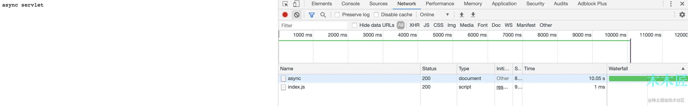
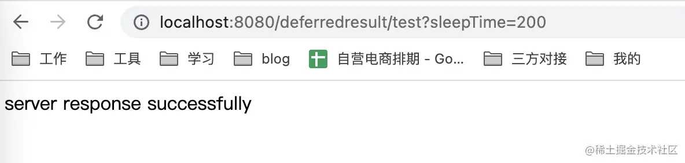
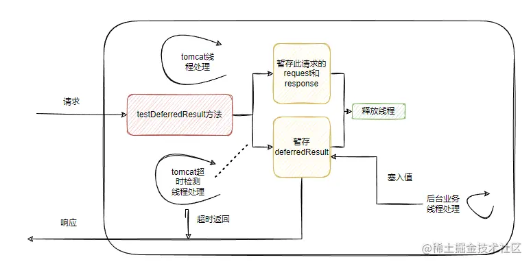
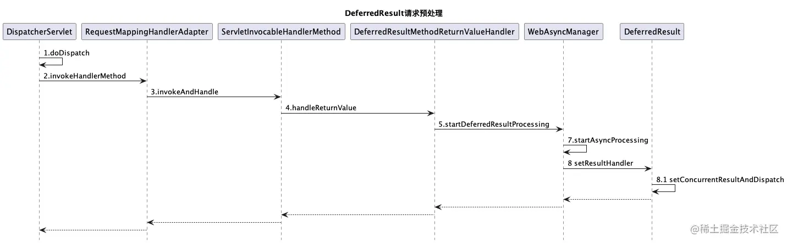
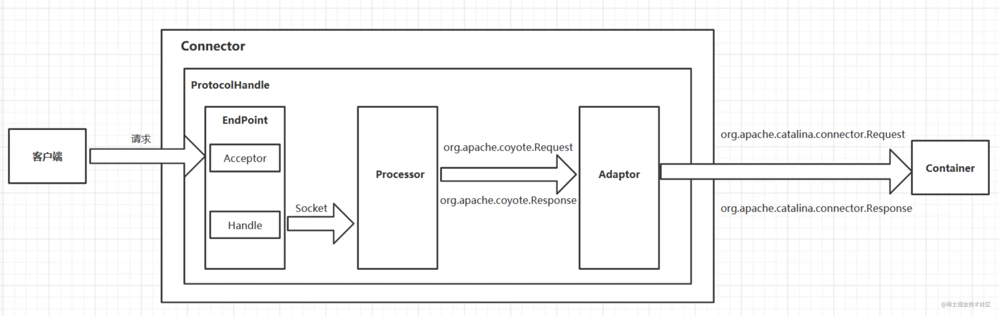
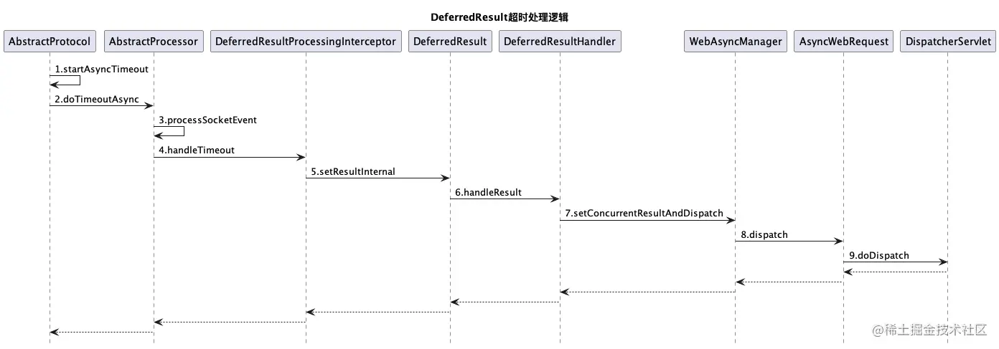
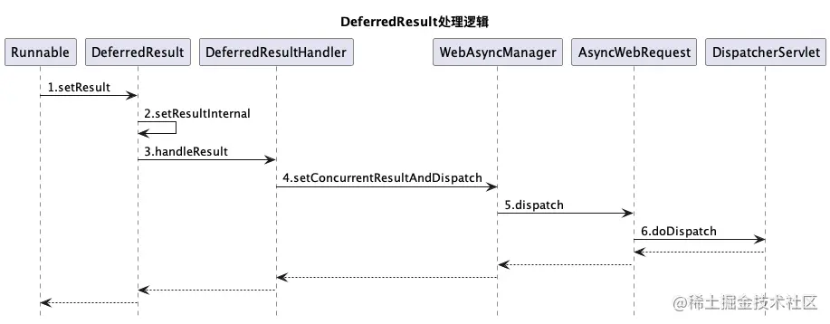

> [Tomcat是如何实现异步Servlet的 - 掘金](https://juejin.cn/post/6844903965801316359)  
> [DeferredResult解决了什么问题 - 掘金](https://juejin.cn/post/7140101501266952222)  
> [SpringMVC 异步处理模式分析](SpringMVC%20异步处理模式分析.md)

内容概要

- Tomcat 内部的异步请求实现
- `SpringMVC` 的 `DeferredResult` 如何对接异步请求的
- Tomcat 过滤器在异步下的表现

## Tomcat 内部的异步请求实现

我们直接借助 SpringBoot 框架来实现一个 Servlet,这里只展示 Servlet 代码：

```java
  @WebServlet(urlPatterns = "/async", asyncSupported = true)
  @Slf4j
  public class AsyncServlet extends HttpServlet {
      ExecutorService executorService = Executors.newSingleThreadExecutor();

      @Override
      protected void doGet(HttpServletRequest req, HttpServletResponse resp) throws ServletException, IOException {
          //开启异步,获取异步上下文    
          final AsyncContext ctx = req.startAsync();
          // 提交线程池异步执行    
          executorService.execute(new Runnable() {
              @Override
              public void run() {
                  try {
                      log.info("async Service 准备执行了");
                      //模拟耗时任务    
                      Thread.sleep(10000 L);
                      ctx.getResponse().getWriter().print("async servlet");
                      log.info("async Service 执行了");
                  } catch (IOException e) {
                      e.printStackTrace();
                  } catch (InterruptedException e) {
                      e.printStackTrace();
                  }
                  //最后执行完成后完成回调。    
                  ctx.complete();
              }
          });
      }
  }
```

上面的代码实现了一个异步的 Servlet,实现了 `doGet` 方法注意在 SpringBoot 中使用需要再启动类加上 `@ServletComponentScan` 注解来扫描 Servlet。既然代码写好了，我们来看看实际运行效果。



我们发送一个请求后，看到页面有响应，同时，看到请求时间花费了 10.05s,那么我们这个 Servlet 算是能正常运行啦。有同学肯定会问，这不是异步 servlet 吗？你的响应时间并没有加快，有什么用呢？对，我们的响应时间并不能加快，还是会取决于我们的业务逻辑，但是我们的异步 servlet 请求后，依赖于业务的异步执行，我们可以立即返回，也就是说，Tomcat 的线程可以立即回收，默认情况下，Tomcat 的核心线程是**10**，最大线程数是**200**,我们能及时回收线程，也就意味着我们能处理更多的请求，能够增加我们的吞吐量，这也是异步 Servlet 的主要作用。

### 异步 Servlet 的内部原理

了解完异步 Servlet 的作用后，我们来看看，Tomcat 是如何是先异步 Servlet 的。其实上面的代码，主要核心逻辑就两部分，`final AsyncContext ctx = req.startAsync()` 和 `ctx.complete()` 那我们来看看他们究竟做了什么？

```java
   public AsyncContext startAsync(ServletRequest request,
       ServletResponse response) {
       if (!isAsyncSupported()) {
           IllegalStateException ise =
               new IllegalStateException(sm.getString("request.asyncNotSupported"));
           log.warn(sm.getString("coyoteRequest.noAsync",
               StringUtils.join(getNonAsyncClassNames())), ise);
           throw ise;
       }

       if (asyncContext == null) {
           asyncContext = new AsyncContextImpl(this);
       }

       asyncContext.setStarted(getContext(), request, response,
           request == getRequest() && response == getResponse().getResponse());
       asyncContext.setTimeout(getConnector().getAsyncTimeout());

       return asyncContext;
   }
```

我们发现 `req.startAsync()` 只是保存了一个异步上下文，同时设置一些基础信息，比如 `Timeout`,顺便提一下，这里设置的默认超时时间是**30S**，如果你的异步处理逻辑超过**30S**,此时执行 `ctx.complete()` 就会抛出 IllegalStateException 异常。

我们来看看 `ctx.complete()` 的逻辑

```java
  public void complete() {
      if (log.isDebugEnabled()) {
          logDebug("complete   ");
      }
      check();
      request.getCoyoteRequest().action(ActionCode.ASYNC_COMPLETE, null);
  }
  //类：AbstractProcessor 
  public final void action(ActionCode actionCode, Object param) {
      case ASYNC_COMPLETE: {
          clearDispatches();
          if (asyncStateMachine.asyncComplete()) {
              processSocketEvent(SocketEvent.OPEN_READ, true);
          }
          break;
      }
  }
  //类：AbstractProcessor 
  protected void processSocketEvent(SocketEvent event, boolean dispatch) {
      SocketWrapperBase < ? > socketWrapper = getSocketWrapper();
      if (socketWrapper != null) {
          socketWrapper.processSocket(event, dispatch);
      }
  }
  //类：AbstractEndpoint
  public boolean processSocket(SocketWrapperBase < S > socketWrapper,
      SocketEvent event, boolean dispatch) {
      //省略部分代码
      SocketProcessorBase < S > sc = null;
      if (processorCache != null) {
          sc = processorCache.pop();
      }
      if (sc == null) {
          sc = createSocketProcessor(socketWrapper, event);
      } else {
          sc.reset(socketWrapper, event);
      }
      Executor executor = getExecutor();
      if (dispatch && executor != null) {
          executor.execute(sc);
      } else {
          sc.run();
      }

      return true;
  }
```

所以，这里最终会调用 `AbstractEndpoint` 的 `processSocket` 方法，之前看过我前面博客的同学应该有印象，`EndPoint` 是用来接受和处理请求的，接下来就会交给 `Processor` 去进行协议处理。

```java
类： AbstractProcessorLight
public SocketState process(SocketWrapperBase < ? > socketWrapper, SocketEvent status)
throws IOException {
    //省略部分diam
    SocketState state = SocketState.CLOSED;
    Iterator < DispatchType > dispatches = null;
    do {
        if (dispatches != null) {
            DispatchType nextDispatch = dispatches.next();
            state = dispatch(nextDispatch.getSocketStatus());
        } else if (status == SocketEvent.DISCONNECT) {

        } else if (isAsync() || isUpgrade() || state == SocketState.ASYNC_END) {
            state = dispatch(status);
            if (state == SocketState.OPEN) {
                state = service(socketWrapper);
            }
        } else if (status == SocketEvent.OPEN_WRITE) {
            state = SocketState.LONG;
        } else if (status == SocketEvent.OPEN_READ) {
            state = service(socketWrapper);
        } else {
            state = SocketState.CLOSED;
        }

    } while (state == SocketState.ASYNC_END ||
        dispatches != null && state != SocketState.CLOSED);

    return state;
}
```

这部分是重点，`AbstractProcessorLight` 会根据 `SocketEvent` 的状态来判断是不是要去调用 `service(socketWrapper)`,该方法最终会去调用到容器，从而完成业务逻辑的调用，我们这个请求是执行完成后调用的，肯定不能进容器了，不然就是死循环了，这里通过 `isAsync()` 判断，就会进入 `dispatch(status)`,最终会调用 `CoyoteAdapter` 的 `asyncDispatch` 方法

```java
public boolean asyncDispatch(org.apache.coyote.Request req, org.apache.coyote.Response res,
    SocketEvent status) throws Exception {
    //省略部分代码  
    Request request = (Request) req.getNote(ADAPTER_NOTES);
    Response response = (Response) res.getNote(ADAPTER_NOTES);
    boolean success = true;
    AsyncContextImpl asyncConImpl = request.getAsyncContextInternal();
    try {
        if (!request.isAsync()) {
            response.setSuspended(false);
        }

        if (status == SocketEvent.TIMEOUT) {
            if (!asyncConImpl.timeout()) {
                asyncConImpl.setErrorState(null, false);
            }
        } else if (status == SocketEvent.ERROR) {

        }

        if (!request.isAsyncDispatching() && request.isAsync()) {
            WriteListener writeListener = res.getWriteListener();
            ReadListener readListener = req.getReadListener();
            if (writeListener != null && status == SocketEvent.OPEN_WRITE) {
                ClassLoader oldCL = null;
                try {
                    oldCL = request.getContext().bind(false, null);
                    res.onWritePossible(); //这里执行浏览器响应，写入数据
                    if (request.isFinished() && req.sendAllDataReadEvent() &&
                        readListener != null) {
                        readListener.onAllDataRead();
                    }
                } catch (Throwable t) {

                } finally {
                    request.getContext().unbind(false, oldCL);
                }
            }
        }
    }
    //这里判断异步正在进行，说明这不是一个完成方法的回调，是一个正常异步请求，继续调用容器。
    if (request.isAsyncDispatching()) {
        connector.getService().getContainer().getPipeline().getFirst().invoke(
            request, response);
        Throwable t = (Throwable) request.getAttribute(RequestDispatcher.ERROR_EXCEPTION);
        if (t != null) {
            asyncConImpl.setErrorState(t, true);
        }
    }
    //注意，这里，如果超时或者出错，request.isAsync()会返回false，这里是为了尽快的输出错误给客户端。
    if (!request.isAsync()) {
        //这里也是输出逻辑
        request.finishRequest();
        response.finishResponse();
    }
    //销毁request和response
    if (!success || !request.isAsync()) {
        updateWrapperErrorCount(request, response);
        request.recycle();
        response.recycle();
    }
}
return success;
}
```

上面的代码就是 `ctx.complete()` 执行最终的方法了（当然省略了很多细节），完成了数据的输出，最终输出到浏览器。

这里有同学可能会说，我知道异步执行完后，调用 `ctx.complete()` 会输出到浏览器，但是，第一次 doGet 请求执行完成后，Tomcat 是怎么知道不用返回到客户端的呢？关键代码在 `CoyoteAdapter` 中的 `service` 方法，部分代码如下：

```java
  postParseSuccess = postParseRequest(req, request, res, response);
  //省略部分代码
  if (postParseSuccess) {
      request.setAsyncSupported(
          connector.getService().getContainer().getPipeline().isAsyncSupported());
      connector.getService().getContainer().getPipeline().getFirst().invoke(
          request, response);
  }
  if (request.isAsync()) {
      async = true;
  } else {
      //输出数据到客户端
      request.finishRequest();
      response.finishResponse();
      if (!async) {
          updateWrapperErrorCount(request, response);
          //销毁request和response
          request.recycle();
          response.recycle();
      }
```

这部分代码在调用完 `Servlet` 后，会通过 `request.isAsync()` 来判断是否是异步请求，如果是异步请求，就设置 `async = true`。如果是非异步请求就执行输出数据到客户端逻辑，同时销毁 `request` 和 `response`。这里就完成了请求结束后不响应客户端的操作。  

## `SpringMVC` 的 `DeferredResult` 如何对接异步请求的

### 1.编写 DeferredResult 返回类型 api

```java
@GetMapping("/deferredresult/test")
public DeferredResult < String > testDeferredResult(long sleepTime) {
    DeferredResult < String > deferredResult = new DeferredResult < > (5000 L, "server side timeout");
    executorService.submit(() - > {
        try {
            Thread.sleep(sleepTime);
            deferredResult.setResult("server response successfully");
        } catch (InterruptedException e) {
            log.error("occur error", e);
        }
    });
    return deferredResult;
}
```

### 2.接口调用



这样就完成了 DeferredResult 异步调用,当然我们也可以在 DeferredResult 设置超时相关逻辑。

### 3.原理与源码分析

为了方便理解,找了一张图来看一下 DeferredResult 做了什么事情。  


* 接收到请求后,将请求暂存并且释放容器线程,用来接收新的请求
* 容器超时逻辑和业务正常处理逻辑将结果塞到 DeferredResult 返回调用

#### spring 对于 DeferredResult 请求处理

##### 1.请求预处理

当然 DeferredResult 处理逻辑也脱离不了 spring mvc 的支持,也是要走到 DispatcherServlet 来处理请求:

```java
protected void doDispatch(HttpServletRequest request, HttpServletResponse response) throws Exception {
    HttpServletRequest processedRequest = request;
    HandlerExecutionChain mappedHandler = null;
    boolean multipartRequestParsed = false;
    //1.生成异步管理器  
    WebAsyncManager asyncManager = WebAsyncUtils.getAsyncManager(request);
    try {
        try {
            ModelAndView mv = null;
            Object dispatchException = null;
            try {
                //省略…  
                //2.异步处理逻辑  
                mv = ha.handle(processedRequest, response, mappedHandler.getHandler());
                //3.如果异步处理一开始,返回调用  
                if (asyncManager.isConcurrentHandlingStarted()) {
                    return;
                }
                this.applyDefaultViewName(processedRequest, mv);
                mappedHandler.applyPostHandle(processedRequest, response, mv);
            } catch (Exception var20) {
                dispatchException = var20;
            } catch (Throwable var21) {
                dispatchException = new NestedServletException("Handler dispatch failed", var21);
            }
            this.processDispatchResult(processedRequest, response, mappedHandler, mv, (Exception) dispatchException);
        } catch (Exception var22) {
            this.triggerAfterCompletion(processedRequest, response, mappedHandler, var22);
        } catch (Throwable var23) {
            this.triggerAfterCompletion(processedRequest, response, mappedHandler, new NestedServletException("Handler processing failed", var23));
        }
    } finally {
        //省略…  
    }
}
```

对于支持 DeferredResult 异步处理逻辑有三个关键点:

* 生成异步管理器
* 执行异步处理逻辑
* 如果异步处理已经开始,返回调用

HandleAdapter#handle 会调用到 DeferredResultMethodReturnValueHandler 的 handleReturnValue 方法:

```java
public void handleReturnValue(@Nullable Object returnValue, MethodParameter returnType, ModelAndViewContainer mavContainer, NativeWebRequest webRequest) throws Exception {
    if (returnValue == null) {
        mavContainer.setRequestHandled(true);
    } else {
        DeferredResult result;
        if (returnValue instanceof DeferredResult) {
            result = (DeferredResult) returnValue;
        } else if (returnValue instanceof ListenableFuture) {
            result = this.adaptListenableFuture((ListenableFuture) returnValue);
        } else {
            if (!(returnValue instanceof CompletionStage)) {
                throw new IllegalStateException("Unexpected return value type: " + returnValue);
            }
            result = this.adaptCompletionStage((CompletionStage) returnValue);
        }
        WebAsyncUtils.getAsyncManager(webRequest).startDeferredResultProcessing(result, new Object[] {
            mavContainer
        });
    }
}
```

进入 `WebAsyncManager` 的 `startDeferredResultProcessing` 方法:

```java
public void startDeferredResultProcessing(final DeferredResult < ? > deferredResult, Object… processingContext) throws Exception {
    //省略…  
    this.startAsyncProcessing(processingContext);
    try {
        interceptorChain.applyPreProcess(this.asyncWebRequest, deferredResult);
        deferredResult.setResultHandler((result) - > {
            result = interceptorChain.applyPostProcess(this.asyncWebRequest, deferredResult, result);
            this.setConcurrentResultAndDispatch(result);
        });
    } catch (Throwable var7) {
        this.setConcurrentResultAndDispatch(var7);
    }
}
```

startAsyncProcessing 方法开启异步处理 (asyncManager.isConcurrentHandlingStarted 会用到),然后进入 DeferredResult 的 setResultHandler 设置结果处理器:

```java
public final void setResultHandler(DeferredResult.DeferredResultHandler resultHandler) {
    Assert.notNull(resultHandler, "DeferredResultHandler is required");
    if (!this.expired) {
        Object resultToHandle;
        synchronized(this) {
            if (this.expired) {
                return;
            }
            resultToHandle = this.result;
            if (resultToHandle == RESULT_NONE) {
                this.resultHandler = resultHandler;
                return;
            }
        }
        try {
            resultHandler.handleResult(resultToHandle);
        } catch (Throwable var5) {
            logger.debug("Failed to process async result", var5);
        }
    }
}
```

由于逻辑未处理,结果未设置,所以逻辑会走到设置结果处理器代码块,然后返回,此时返回值解析过程结束了，同时由于异步 servlet 的特性，tomcat 的连接也得到了释放。  
预处理流程如下:  


##### 2.返回值处理

这个时候容器连接得到了释放,然而问题并没有解决,请求处理只完成了一半,业务处理返回值并没有真正返回。  
我们在业务线程池处理调用了 DeferredResult 的 setResult 方法,最终会调用内部 setResultInternal：

```java
private boolean setResultInternal(Object result) {
    if (this.isSetOrExpired()) {
        return false;
    } else {
        DeferredResult.DeferredResultHandler resultHandlerToUse;
        synchronized(this) {
            if (this.isSetOrExpired()) {
                return false;
            }
            this.result = result;
            resultHandlerToUse = this.resultHandler;
            if (resultHandlerToUse == null) {
                return true;
            }
            this.resultHandler = null;
        }
        resultHandlerToUse.handleResult(result);
        return true;
    }
}
```

这里会调用之前传入的函数式接口来处理:

```java
deferredResult.setResultHandler((result) - > {
    result = interceptorChain.applyPostProcess(this.asyncWebRequest, deferredResult, result);
    this.setConcurrentResultAndDispatch(result);
});
```

然后调用 setConcurrentResultAndDispatch:

```java
private void setConcurrentResultAndDispatch(Object result) {
    synchronized(this) {
        if (this.concurrentResult != RESULT_NONE) {
            return;
        }
        this.concurrentResult = result;
        this.errorHandlingInProgress = result instanceof Throwable;
    }
    if (this.asyncWebRequest.isAsyncComplete()) {
        //…  
    } else {
        this.asyncWebRequest.dispatch();
    }
}
```

如果异步处理完成则返回调用,否则执行异步请求分发,该段代码执行完成会发起一次新的请求到后台，又被 DispatcherServlet 类接收到（但是不会再进入 controller 了），最终将结果响应给调用方。

#### tomcat 容器维度对异步支持

我们再从容器维度对 DeferredResult 异步请求的处理做一下分析,分别是请求超时和主动 setResult 返回。

##### 1.请求超时



Connector 是 tomcat 的最核心的组件之一,主要的职责就是负责接收客户端连接和客户端请求的处理加工,初始化和启动会执行 Protocal 相关初始化和启动操作,看一下 AbstractProtocol 的启动:

```
public void start() throws Exception {  
 if (this.getLog().isInfoEnabled()) {  
 this.getLog().info(sm.getString("abstractProtocolHandler.start", new Object[]{this.getName()}));  
 this.logPortOffset();  
 }  
 this.endpoint.start();  
 this.monitorFuture = this.getUtilityExecutor().scheduleWithFixedDelay(() -> {  
 this.startAsyncTimeout();  
 }, 0L, 60L, TimeUnit.SECONDS);  
}

```

延时 60 秒执行启动异步超时支持逻辑,调用 startAsyncTimeout:

```java
protected void startAsyncTimeout() {
    if (this.timeoutFuture == null || this.timeoutFuture.isDone()) {
        //省略…  
        this.timeoutFuture = this.getUtilityExecutor().scheduleAtFixedRate(() - > {
            long now = System.currentTimeMillis();
            Iterator var3 = this.waitingProcessors.iterator();
            while (var3.hasNext()) {
                Processor processor = (Processor) var3.next();
                processor.timeoutAsync(now);
            }
        }, 1 L, 1 L, TimeUnit.SECONDS);
    }
}
```

异步请求会被放入 waitingProcessors 中,并且设置了超时时间，tomcat 会有一个线程每隔 1 秒遍历 waitingProcessors 里面的 processor,检查是否过期,如果过期会往 tomcat 线程池投掷超时事件:

```java
private void doTimeoutAsync() {
    this.setAsyncTimeout(-1 L);
    this.asyncTimeoutGeneration = this.asyncStateMachine.getCurrentGeneration();
    this.processSocketEvent(SocketEvent.TIMEOUT, true);
}
```

线程池跑到这个任务的时候就知道这个已经超时请求任务,此时就会将超时值塞入到请求中,具体是通过之前设置的 DeferredResult 相关的拦截器中的 handleTimeout,比如 spring 自己提供的拦截器:

```java
public class TimeoutDeferredResultProcessingInterceptor implements DeferredResultProcessingInterceptor {
    public TimeoutDeferredResultProcessingInterceptor() {}
    public < T > boolean handleTimeout(NativeWebRequest request, DeferredResult < T > result) throws Exception {
        result.setErrorResult(new AsyncRequestTimeoutException());
        return false;
    }
}
```

最终会把值放到管理异步请求 AsyncManager 中并重新下发请求交给 DispatcherServlet#doDispatch 处理,第二次进来的时候发现 AsyncManager 已经有值了,把结果进行包装然后直接返回调用了。  
超时逻辑处理流程如下:  


##### 2.setResult 主动返回

业务线程在执行完逻辑,将结果塞回到 `DeferredResult` 时也会调用 setResultInternal,赋值完成后调用 `AsyncWebRequest#dispatch` 方法重新下发请求,DispatcherServlet 处理时发现 AsyncManager 已经有值了,封装后直接返回,后边逻辑和超时逻辑一样。  
处理流程如下:  


## Tomcat 异步过滤器

Tomcat 创建过滤器的逻辑如下。

```java
public static ApplicationFilterChain createFilterChain(ServletRequest request,
    Wrapper wrapper, Servlet servlet) {

    // If there is no servlet to execute, return null  
    if (servlet == null) {
        return null;
    }

    // Create and initialize a filter chain object  
    ApplicationFilterChain filterChain = null;
    if (request instanceof Request) {
        Request req = (Request) request;
        if (Globals.IS_SECURITY_ENABLED) {
            // Security: Do not recycle  
            filterChain = new ApplicationFilterChain();
        } else {
            filterChain = (ApplicationFilterChain) req.getFilterChain();
            if (filterChain == null) {
                filterChain = new ApplicationFilterChain();
                req.setFilterChain(filterChain);
            }
        }
    } else {
        // Request dispatcher in use  
        filterChain = new ApplicationFilterChain();
    }

    filterChain.setServlet(servlet);
    filterChain.setServletSupportsAsync(wrapper.isAsyncSupported());

    // Acquire the filter mappings for this Context  
    StandardContext context = (StandardContext) wrapper.getParent();
    FilterMap filterMaps[] = context.findFilterMaps();

    // If there are no filter mappings, we are done  
    if ((filterMaps == null) || (filterMaps.length == 0)) {
        return filterChain;
    }

    // Acquire the information we will need to match filter mappings  
    DispatcherType dispatcher =
        (DispatcherType) request.getAttribute(Globals.DISPATCHER_TYPE_ATTR);

    String requestPath = null;
    Object attribute = request.getAttribute(Globals.DISPATCHER_REQUEST_PATH_ATTR);
    if (attribute != null) {
        requestPath = attribute.toString();
    }

    String servletName = wrapper.getName();

    // Add the relevant path-mapped filters to this filter chain  
    for (FilterMap filterMap: filterMaps) {
        if (!matchDispatcher(filterMap, dispatcher)) {
            continue;
        }
        if (!matchFiltersURL(filterMap, requestPath)) {
            continue;
        }
        ApplicationFilterConfig filterConfig = (ApplicationFilterConfig)
        context.findFilterConfig(filterMap.getFilterName());
        if (filterConfig == null) {
            // FIXME - log configuration problem  
            continue;
        }
        filterChain.addFilter(filterConfig);
    }

    // Add filters that match on servlet name second  
    for (FilterMap filterMap: filterMaps) {
        if (!matchDispatcher(filterMap, dispatcher)) {
            continue;
        }
        if (!matchFiltersServlet(filterMap, servletName)) {
            continue;
        }
        ApplicationFilterConfig filterConfig = (ApplicationFilterConfig)
        context.findFilterConfig(filterMap.getFilterName());
        if (filterConfig == null) {
            // FIXME - log configuration problem  
            continue;
        }
        filterChain.addFilter(filterConfig);
    }

    // Return the completed filter chain  
    return filterChain;
}
```

简单讲就是

- 匹配分发类型
- 匹配拦截的 URL
- 匹配过滤的 servlet

这里 `matchDispatcher` 在异步中会变成 `javax.servlet.DispatcherType#ASYNC` ，从而判断过滤器是否能够正常过滤。如果过滤器创建时，没有设置该类型，则无法匹配。  
设置方案如下

```java
FilterRegistration.Dynamic servletFilter = servletContext.addFilter("gzip", new GzipFilter());
// 分发器类型
EnumSet < DispatcherType > dispatcherTypes = EnumSet.of(DispatcherType.REQUEST, DispatcherType.FORWARD, DispatcherType.ERROR);
servletFilter.addMappingForUrlPatterns(dispatcherTypes, false, ServerConfig.getInstance().getServletMapping());
```