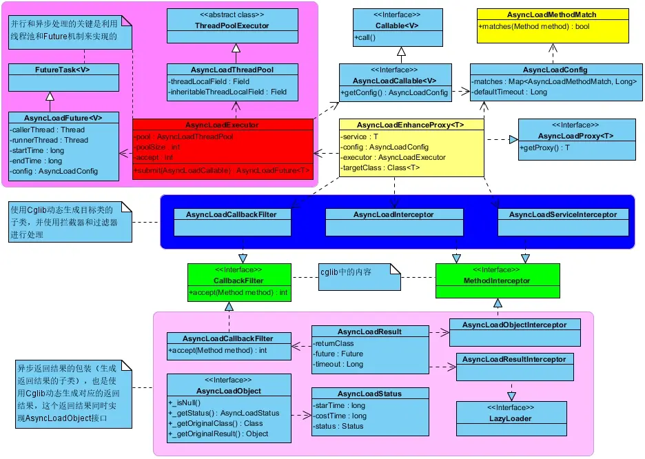
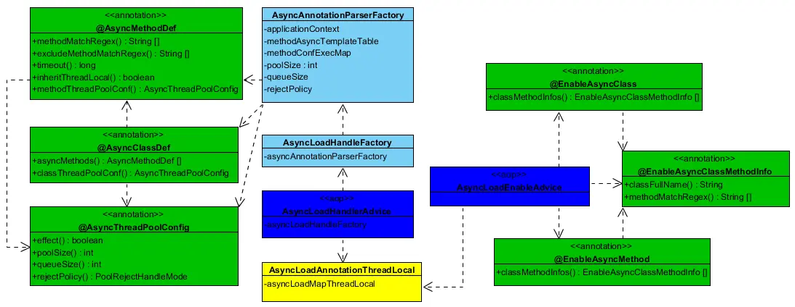
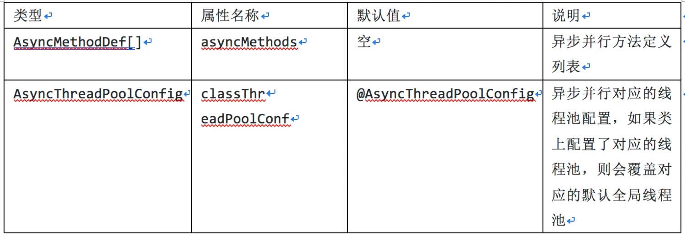
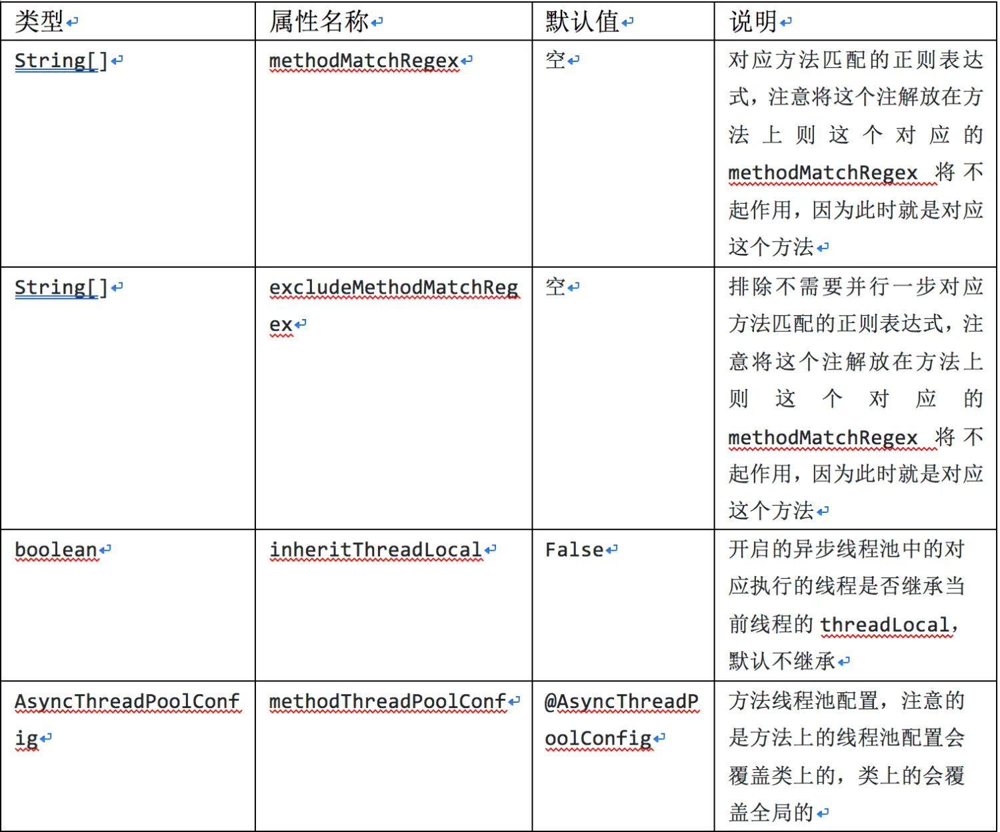
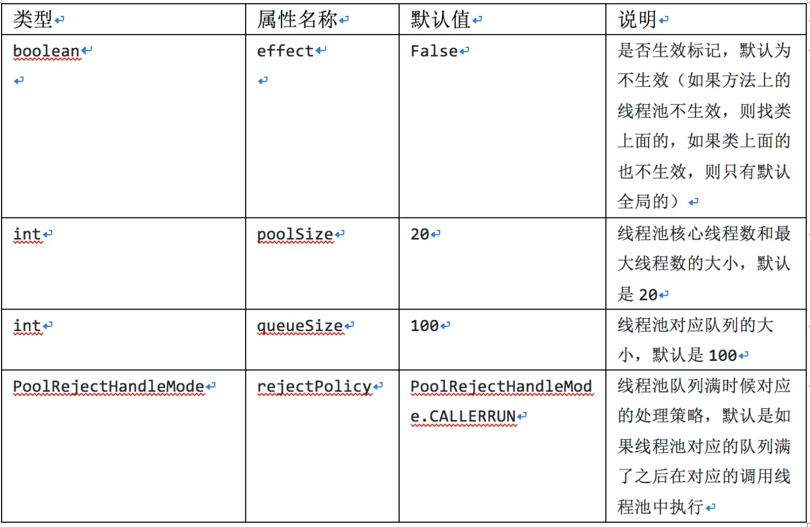
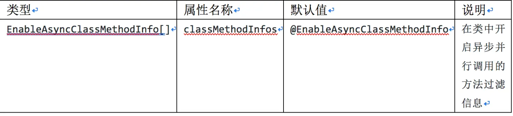
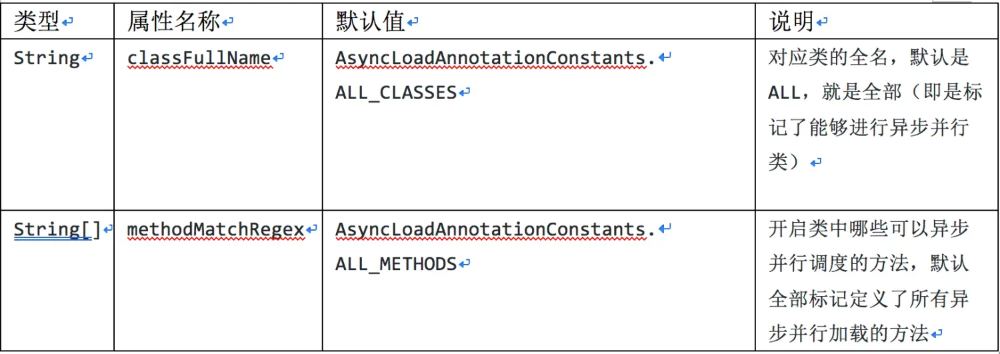
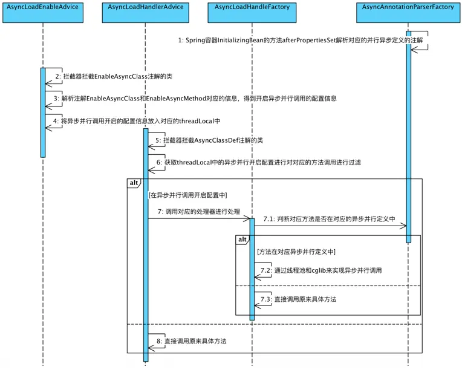

> [扩展异步并行调度框架asyncLoad支持注解配置 - 简书](https://www.jianshu.com/p/92c6f402b543)

# 扩展异步并行调度框架asyncLoad支持注解配置

随着业务越来越复杂，对应的代码也越来越复杂，耗时也越来越多，因此急需一套并行框架，通过搜索发现阿里提供了一个并行框架 asyncLoad（[https://github.com/alibaba/asyncload.git](https://link.jianshu.com?t=https%3A%2F%2Fgithub.com%2Falibaba%2Fasyncload.git)），但是此框架不支持注解的方式，使的对应的代码侵入性很大，所以对 asyncLoad 框架进行扩展，使其能够支持对应的注解配置的方式来进行异步并行。</pre>

# 二、 实现原理

###### 1\. 异步并行基本实现方式：

- 原理：基本就是线程池 \+ Future 的结合来实现；
- 优点：开发灵活
- 缺点：需要开发人员了解整个并行框架，且对代码有侵入，而且对应的返回结果是 Future<对象> 和本身原来的返回结果<对象> 不一样，那么在写代码的时候就要考虑这些差异；

为了解决异步并行基本实现方式的缺点，就是不需要开发人员为了实现异步并行使原来代码实现的方式要进行改变，因此需要另外一种异步并行更通用的实现方式，如 asyncLoad 这种;

###### 2\. 异步并行通用实现方式：

- 原理：线程池 \+ Future + Cglib 结合的方式来实现
- 优点：正好是异步并行基本实现方式对应的缺点，不需要基础开发人员了解更多异步并行实现方式，可以让基础开发人员还是按照原来开发串行执行代码一样进行开发，唯一的不同就是在需要异步并行执行的方法上增加对应的配置（xml，注解等方式）;
- 缺点：cglib 本身的方式带来的缺点（通过实现对应目标类的子类来实现动态代理，并且可以在生成子类的时候在对应方法上进行拦截，增强子类方法的功能），但是这种方式的代理本身不支持 final 类（因为 final 类不支持生成对应的子类），因此对应的像基元类型就不支持；灵活性不如基础的好；

# 三、 增加注解配置

## 1\. 设计

Asyncload 原先整体设计对应的类图如下:



asyncload 类图.jpg

AsyncLoad 注解对应的类图如下：



扩展 asyncLoad 支持注解对应的类图

## 2\. 实现

### 2.1 类功能简介

- 注解@AsyncClassDef

```
@Documented
@Retention(RUNTIME)
@Target({ TYPE })
@Inherited
/**
 * @author yujiakui
 *
 *         下午3:06:31
 *
 */
public @interface AsyncClassDef {

    /**
     * 异步方法列表
     *
     * @return
     */
    AsyncMethodDef[] asyncMethods() default {};

    /**
     * 类级别线程池配置
     *
     * @return
     */
    AsyncThreadPoolConfig classThreadPoolConf() default @AsyncThreadPoolConfig;

} 
```

注解@AsyncClassDef 表示的是对应这个类需要对应的异步，但是其中的属性可以过滤指定的方法能够进行异步并行处理，如下是其对应的属性：



注解 AsyncClassDef 对应的属性

- 注解@AsyncMethodDef

```
@Documented
@Retention(RUNTIME)
@Target({ METHOD, ElementType.ANNOTATION_TYPE })
/**
 * @author yujiakui
 *
 *         下午3:02:52
 *
 *         异步并行方法对应的注解
 *
 */
public @interface AsyncMethodDef {

    /**
     * 方法匹配对应的正则PatternMatchUtils
     *
     * 注意：将这个注解放在方法上则这个对应的methodMatchRegex将不起作用，因为此时就是对应这个方法
     *
     * @return
     */
    String[] methodMatchRegex() default {};

    /**
     * 排除方法匹配模式
     *
     * 注意：将这个注解放在方法上则这个对应的methodMatchRegex将不起作用，因为此时就是对应这个方法
     *
     * @return
     */
    String[] excludeMethodMatchRegex() default {};

    /**
     * 默认超时时间
     *
     * @return
     */
    long timeout() default 1000;

    /**
     * 开启的异步线程池中的对应执行的线程是否继承当前线程的threadLocal，默认不继承
     *
     * @return
     */
    boolean inheritThreadLocal() default false;

    /**
     * 方法线程池配置
     *
     * @return
     */
    AsyncThreadPoolConfig methodThreadPoolConf() default @AsyncThreadPoolConfig;

} 
```

注解@AsyncMethodDef 表示的是对应的方法是可以进行异步并行处理，并且可以指定对应方法的线程池信息（注意：这个线程池信息可以覆盖类上对应的线程池信息，类上又可以覆盖全局线程池信息，对应的优先级如下 方法上 > 类上 > 全局的），下表是对应注解的属性：



注解 AsyncMethodDef 对应的属性

- 注解@AsyncThreadPoolConfig

```
@Documented
@Retention(RUNTIME)
@Target({ ElementType.ANNOTATION_TYPE })
/**
 * @author yujiakui
 *
 *         下午3:43:29
 *
 *         异步线程池配置
 */
public @interface AsyncThreadPoolConfig {

    /**
     * 是否生效，默认为不生效（如果方法上的线程池不生效，则找类上面的，如果类上面的也不生效，则只有默认全局的）
     *
     * @return
     */
    boolean effect() default false;

    /**
     * 线程池核心线程数和最大线程数的大小，默认是20
     *
     * @return
     */
    int poolSize() default 20;

    /**
     * 队列大小，默认是100
     *
     * @return
     */
    int queueSize() default 100;

    /**
     * 线程池拒绝处理策略
     *
     * @return
     */
    PoolRejectHandleMode rejectPolicy() default PoolRejectHandleMode.CALLERRUN;
} 
```

注解@AsyncThreadPoolConfig 表示的线程池对应的配置属性信息，具体属性信息如下表所示：



注解 AsyncThreadPoolConfig 对应的属性

其中对应的 PoolRejectHandleMode 对象是一个枚举类型，目前主要提供了两种类型：REJECT（线程池队列满了之后再来请求直接拒绝）和 CALLERRUN（用于被拒绝任务的处理程序，它直接在 execute 方法的调用线程中运行被拒绝的任务；如果执行程序已关闭，则会丢弃该任务）

- 注解@EnableAsyncClass

```
@Documented
@Retention(RUNTIME)
@Target({ TYPE })
@Inherited
/**
 * @author yujiakui
 *
 *         上午11:35:46
 *
 */
public @interface EnableAsyncClass {

    /**
     * 异步并行类方法信息列表
     *
     * @return
     */
    EnableAsyncClassMethodInfo[] classMethodInfos() default { @EnableAsyncClassMethodInfo };
} 
```

注解@EnableAsyncClass 表示的是对应的类开启对应的异步并行，也就是只要被这个类调用的方法，只要被调用方法支持对应的异步并行调用，在这个类中就可以被异步并行调用了，对应的属性如下表所示：



注解@EnableAsyncClass 对应的属性信息

- 注解@EnableAsyncClassMethodInfo

```
@Documented
@Retention(RUNTIME)
@Target(TYPE_USE)
/**
 * @author yujiakui
 *
 *         上午11:44:26
 *
 *         开启异步并行类方法信息
 */
public @interface EnableAsyncClassMethodInfo {

    /**
     * 对应类的全名，默认是ALL，就是全部（即是标记了异步并行定义的类）
     *
     * @return
     */
    String classFullName() default AsyncLoadAnnotationConstants.ALL_CLASSES;

    /**
     * 默认全部标记定义了所有异步并行加载的方法
     *
     * @return
     */
    String[] methodMatchRegex() default { AsyncLoadAnnotationConstants.ALL_METHODS };
} 
```

注解@EnableAsyncClassMethodInfo 表示的是开启异步并行调用对应的类和方法信息，就是开启哪些能够被异步并行的方法信息（注意：一个是调用方 A 是开启异步并行调用，另一个是 B 和 C 定义了能够被并行异步调用，对于定义了能够进行异步并行调用的方法，只有在调用方开启了异步调用才起作用），对应的注解属性信息如下：



注解@EnableAsyncClassMethodInfo 对应的属性

- 注解@EnableAsyncMethod

```
@Documented
@Retention(RUNTIME)
@Target(METHOD)
/**
 * @author yujiakui
 *
 *         下午3:54:02
 *
 */
public @interface EnableAsyncMethod {

    /**
     * 异步并行类方法信息列表
     *
     * @return
     */
    EnableAsyncClassMethodInfo[] classMethodInfos() default { @EnableAsyncClassMethodInfo };

} 
```

注解@ EnableAsyncMethod 开启异步并行调用的方法，即是被这个开启异步并行方法调用的方法开启对应的异步并行调用，比如如果方法 A 开启了异步并行调用，并行方法 A 调用了方法 B 和 C，且 B 和 C 都是定义了能够进行异步并行调用的，则可以在方法 A 中实现 B 和 C 对应的异步并行方法调用（前提是 A 开启的方法对应的属性配置中包括 B 和 C），注解 EnableAsyncMethod 对应的属性如下表所示：


注解@ EnableAsyncMethod 对应的属性信息

- 类 AsyncAnnotationParserFactory  
    类 AsyncAnnotationParserFactory 主要的功能则是解析注解 AsyncClassDef，AsyncMethodDef 和 AsyncThreadPoolConfig，通过解析他们获得那些定义了能够进行异步并行调用的配置信息；并且此类还可以从全局的配置信息中获取对应的异步并行全局的线程池配置。

- 类 AsyncLoadHandleFactory  
    类 AsyncLoadHandleFactory 主要的功能是根据类 AsyncAnnotationParserFactory 解析注解得到的异步并行调用的配置信息，来对具体方法调用进行拦截并开启对应的异步并行调度（开启线程池和 cglib 包装对应的返回结果）。

- 类 AsyncLoadHandlerAdvice  
    类 AsyncLoadHandlerAdvice 主要的功能是拦截标记了注解@AsyncClassDef 的类，并对应其中标记了@AsyncMethodDef 的方法进行异步并行调用，在进行异步并行调用之前，还要经过是否开启异步并行调用的判断，如果没有开启，则不会进行异步并行调用。

- 类 AsyncLoadEnableAdvice  
    类 AsyncLoadEnableAdvice 主要的功能是拦截标记了注解@ EnableAsyncClass 的类，并对注解@EnableAsyncClassMethodInfo 和@EnableAsyncMethod 进行解析获得对应的开启异步并行调用的配置信息，这个配置信息通过 ThreadLocal 传给类 AsyncLoadHandlerAdvice 进行异步并行调用之前的开启功能判断。

### 2.2 对应的处理流程

对应整体调用的序列图如下：



整体流程图

## 3\. 使用

- 定义可以进行异步并行调用的方法，如下所示：

```
@Component
@AsyncClassDef
public class AsyncLoadAnnotationTestServiceImpl extends AsyncLoadTestServiceImpl {

    @Override
    @AsyncMethodDef(timeout = 10)
    public AsyncLoadTestModel getRemoteModel(String name, long sleep) {
        return super.getRemoteModel(name, sleep);
    }
} 
```

- 开启对应的异步并行调用，如下所示：

```
@Component
@EnableAsyncClass
public class AsyncLoadAnnotationMultiMethodTest {

    @Autowired
    private AsyncLoadAnnotationTestServiceImpl asyncLoadAnnotationTestServiceImpl;

    @EnableAsyncMethod
    public List<AsyncLoadTestModel> multiHandler(String name, long sleep) {

        List<AsyncLoadTestModel> results = Lists.newArrayList();
        for (int i = 0; i < 5; i++) {
            AsyncLoadTestModel model = asyncLoadAnnotationTestServiceImpl.getRemoteModel(name,
                    sleep);

            results.add(model);
        }
        return results;
    }
} 
```

- 测试

```
public class AsyncLoadAnnotationMultiTest {

    public static void main(String[] args) {
        AnnotationConfigApplicationContext annotationConfigApplicationContext = new AnnotationConfigApplicationContext(
                "com.alibaba.asyncload.impl.annotation",
                "com.alibaba.asyncload.annotation",
                "com.alibaba.asyncload.domain");
        // 执行测试
        AsyncLoadAnnotationMultiMethodTest service = annotationConfigApplicationContext
                .getBean(AsyncLoadAnnotationMultiMethodTest.class);
        List<AsyncLoadTestModel> models = service.multiHandler("xxx", 10000);
        long start = 0, end = 0;
        for (AsyncLoadTestModel model : models) {
            start = System.currentTimeMillis();
            System.out.println(model.getDetail());
            end = System.currentTimeMillis();
            System.out.println("costTime:" + (end - start));
        }
    }
} 
```

# 四、源码地址

[https://github.com/lwjaiyjk/asyncload.git](https://link.jianshu.com?t=https%3A%2F%2Fgithub.com%2Flwjaiyjk%2Fasyncload.git)

参考：  
\[1\] [https://github.com/alibaba/asyncload.git](https://link.jianshu.com?t=https%3A%2F%2Fgithub.com%2Falibaba%2Fasyncload.git)