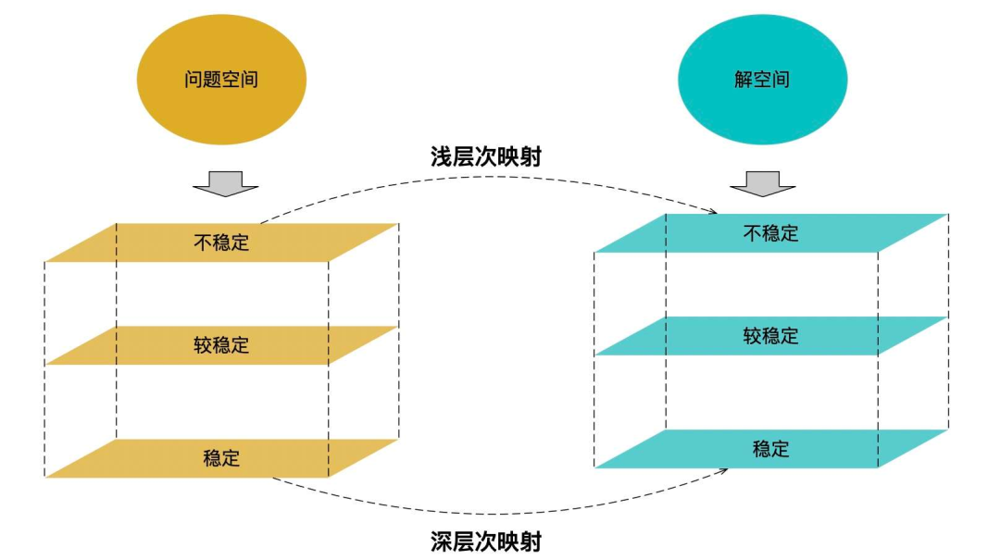
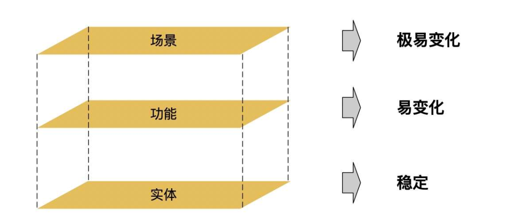
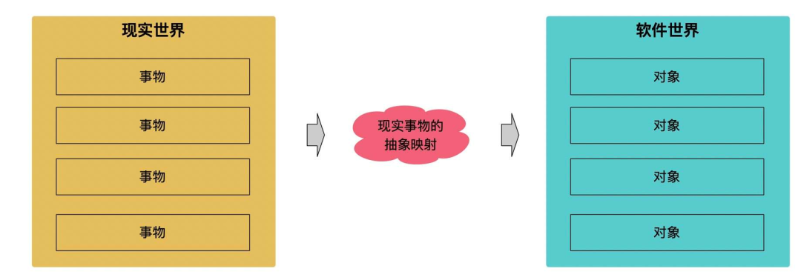
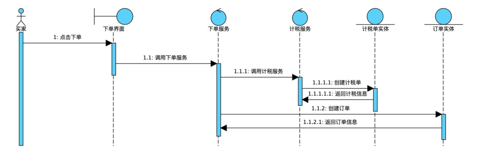
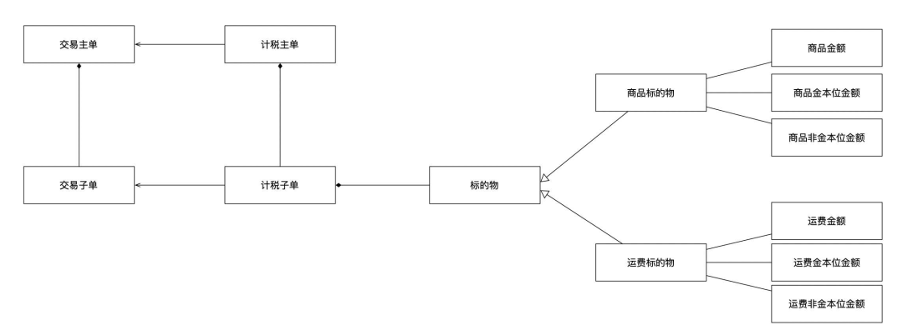
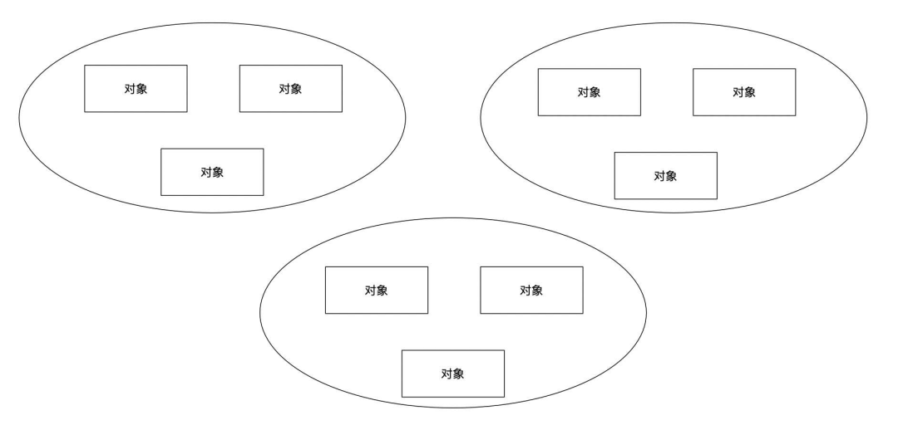
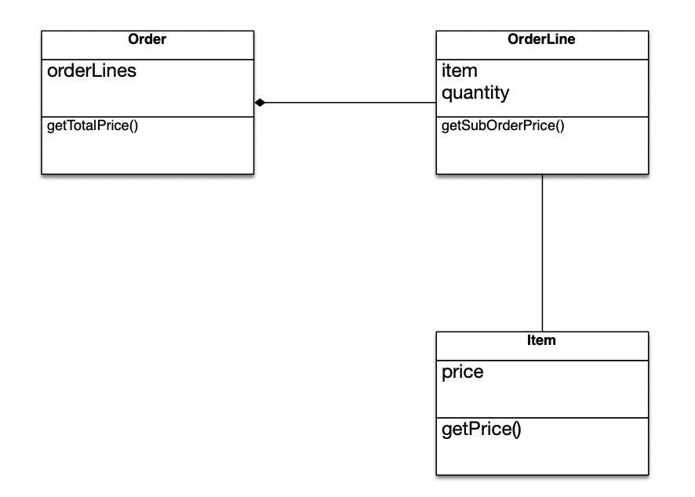
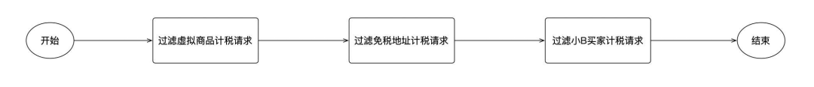
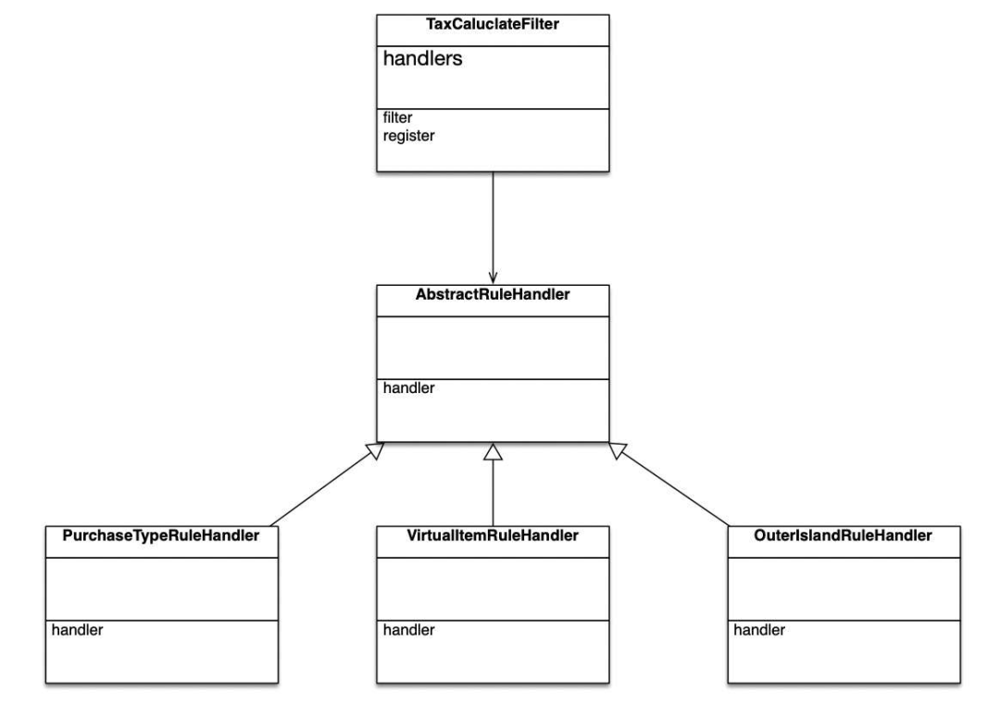

我们把需要解决的问题称之为问题域，或者问题空间，把解决方案称之为解空间。

  
我们可以把一个软件划分成三层：场景、功能和实体

场景=功能的集合=实体的集合

  
**面向过程是一种归纳的分析方法，由外到内的过程；面向对象是一种演绎的分析方法，由内到外的过程。**

**面向对象的底层逻辑是基于现实事物做的抽象映射**



# 二、分析到设计的过程

> **健壮性图：**里面有三个关键的对象：  
一个是边界对象，这个比较好理解，比如 UI 界面就是边界对象；  
一个是控制对象，即是控制业务流程的对象，如下单服务就可以看作是控制对象；  
一个是实体对象，即是问题空间中的业务对象，比如订单。  
画健壮性图是有规则的，  
**一般是边界对象调用控制对象，控制对象产生实体对象，**  
比如用户下单界面是边界对象，下单服务是控制对象，订单就是实体对象。

## 发现对象的方法

1. 通过健壮性图找到关键的实体对象；
2. 通过结构分析方法找出更多的实体对象；
3. 将对象组成有机的对象模型；
4. 最后通过用例走查对象模型是否完备。

1- 首先画出 **健壮性图**，这里的边界对象是下单界面，控制对象有两个，一个是下单服务，另一个是计税服务，实体对象也有两个，一个是计税单，一个是订单。有了计税单和订单这两个实体对象后，接下来通过结构分析方法，分析出更多的对象。



2-**结构分析方法**，实质上是从两个维度出发：一是从自身的角度出发，看自己内部还包含了哪些对象，如主订单包含了子订单；另一个是从外部的角度出发，看自己还与哪些对象相关联，如计税单与订单是有关联的。

**下定义** 可以从不同的维度，比如功能性维度、价值性维度、目的性维度、结构性维度等，这里可以从结构性的维度去给对象下定义。

ex.

**以计税单为例**，可以给它下一个定义：计税单是将订单金额信息转成若干个 **标的物** 计税的单据模型，从这个定义中，我们可以看到计税单是与订单有关联关系的，另一个是计税单是包含了若干个标的物，我们可以画出计税单的对象模型。



3-**组织对象结构**

可以将对象分成一个个小的域，比如商品域、订单域、税务域等，这样当聚集一个问题时，可以只看某个子域里的对象模型即可。



## 如何分配职责

### 职责怎么来

> UML 把职责定义为 " 类元的契约或义务 "，因此职责的划分从本质来讲还是类元本身决定的，比如订单，它要提供订单渲染、订单创建、订单修改、订单查询的义务。

职责分为两类：一类是认知职责；另一类是行为职责。

- **认知职责包含：**
  - 对私有数据封装的认知。
  - 对相关对象的认知。
  - 对其能够导出或计算的事物的认识。
- **行为职责包含：**
  - 自己执行的行为，包括创建对象或计算。
  - 初始化其它对象的动作。
  - 控制或协调其它对象的活动。

### 分配职责的逻辑

`**认知职责**` 是基于对象属性的，正所谓 " 不在其位、不谋其政 "，认知职责一定不会超过它的认识范围的。

举一个例子，假如一主多子的订单，要计算总的订单金额，怎么分配职责呢？首先商品只能查到自身价格的信息，它的认识是基于商品 price 属性，一个子订单可以有多个商品，那么它也只能计算出子订单的金额信息，它的认知是基于 item 和 quantity 两个属性，主订单包含所有子订单的信息，那么就可以计算出总的订单金额。



`**行为职责**` 是偏领域服务的，有的时候一个职责不属于某一个对象，比如转账，就是一个行为，让其它的职责承担并不合适，这类行为职责往往是一个显著的业务活动，比如订单渲染、订单创建就是行为职责而非认知职责。

# 三、案例

计税需要判断是否满足计税规则，比如虚拟商品不计税（手机充值之类）、有些免税地址不计税、小 B 买家也不计税等，因此需要提供一个计税过滤判断逻辑。

面向过程



面向对象

> 面向对象是从对象的视角分析问题，过滤计税请求是计税过滤器判断计税请求是否满足计税规则，这里就包含了两个对象：计税过滤器和计税规则，判断是否满足计税要求这个职责应该是在具体的计税规则处理器中



```Java
public void filter(List<TaxCalculateRequest> request){
     
     // 过滤虚拟商品计税请求
     filterVirtualItem(request);

     // 过滤免税地址计税请求(即外岛)
     filterOuterIsland(request);

     // 过滤小B买家计税请求
     filterPurchaseType(reqeust);

}
```

```Java
public abstract class AbstractRuleHandler 

    /**
     * 抽象的业务规则处理
     *
     * @param request
     */
    public abstract void handler(TaxCalculateRequest request);

    /**
     * 构造函数里完成注册
     */
    public AbstractRuleHandler() {
        TaxCaluclateFilter.register(this);
    }
}
```