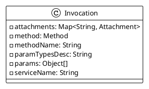

- `com.fr.design.mainframe.socketio.DesignerSocketIO`
	- websocket 逻辑

```plantuml

@startuml

!theme plain
top to bottom direction
skinparam linetype ortho

class Invocation {
  - attachments: Map<String, Attachment>
  - method: Method
  - methodName: String
  - paramTypesDesc: String
  - params: Object[]
  - serviceName: String
}

@enduml

```
